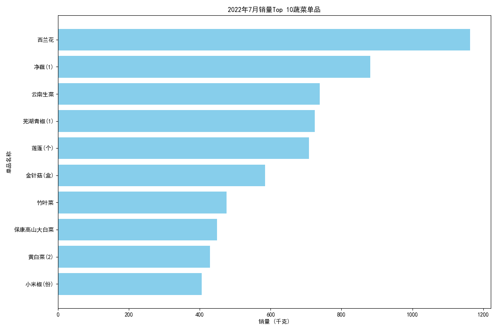

# 2023年7月蔬菜补货策略分析与组合推荐报告

## 1. 分析背景与目标

为了优化补货决策，提升销售额并满足顾客需求，本次分析旨在通过挖掘历史销售数据，找出蔬菜品类的销售规律和商品间的关联性。**核心目标是：根据各蔬菜品类及单品的销售关系和季节性特征，为2023年7月推荐三个科学的蔬菜补货组合。**

---

## 2. 分析过程与发现

### 2.1. 季节性热销分析：7月什么蔬菜卖得最好？

我们首先对2022年7月的销售数据进行了深入分析，以预测今年7月的消费趋势。通过对各单品的销量进行汇总排名，我们识别出了当月最受消费者欢迎的蔬菜。

**分析发现：**
*   **西兰花** 以超过1100千克的销量一马当先，成为7月当之无愧的“销量王”。
*   **净藕**、**云南生菜**、**芜湖青椒** 和 **莲蓬** 紧随其后，均表现出强劲的销售势头。
*   **花叶类蔬菜**（如生菜、大白菜、竹叶菜）和**水生根茎类**（如藕、莲蓬）在夏季蔬菜市场中占据重要地位。

下图直观展示了2022年7月销量排名前10的蔬菜单品及其销量：

这些热销单品是7月份补货的基础，必须保证充足的货量。

### 2.2. 关联规则分析：顾客还喜欢一起买什么？

为了发现商品之间的隐藏关联，促进连带销售，我们采用Apriori算法对2022年7月的交易记录进行了购物篮分析。我们将同一天、同一分钟内的购买行为视为一个“购物篮”，并找出了那些经常被一同购买的商品组合。

**分析发现：**
*   **（西兰花，净藕，香菇）** 是一个非常强的关联组合。购买了西兰花和香菇的顾客，同时购买净藕的可能性是普通顾客的 **1.78倍**。
*   **（云南生菜，芜湖青椒，净藕）** 是另一个显著的组合。这表明喜欢购买生菜和青椒的顾客，也很可能同时需要藕。

这些高“提升度”（Lift > 1.5）的规则揭示了顾客在烹饪场景下的潜在需求，例如，他们可能计划用这些食材一起煲汤或制作菜肴。

---

## 3. 2023年7月补货组合推荐

结合以上**季节性热销分析**和**商品关联分析**，我们提出以下三个蔬菜组合，旨在通过“热销品+关联品”的策略，最大化销售潜力和顾客满意度。

### **组合一：“夏日菌菇靓汤”组合**
*   **组合成员**: **西兰花 + 净藕 + 西峡香菇**
*   **推荐理由**:
    *   **强强联合**: `西兰花`和`净藕`是7月销量冠亚军，是引流的绝对主力。
    *   **关联驱动**: 该组合直接源于数据挖掘出的最强关联规则，购买其中两样的顾客极有可能购买第三样。
    *   **场景定位**: 适合煲汤、清炒等，符合夏季追求营养与清淡的饮食趋势。

### **组合二：“清爽开胃”组合**
*   **组合成员**: **云南生菜 + 芜湖青椒 + 净藕**
*   **推荐理由**:
    *   **市场验证**: 组合内所有成员均位列7月销量前五，是深受市场欢迎的热门单品。
    *   **需求互补**: `云南生菜`可凉拌，`芜湖青椒`可小炒，`净藕`则凉拌、清炒皆宜，为消费者提供了多样化的夏日开胃菜选择。
    *   **关联印证**: 数据显示这三者一同购买的频率显著高于平均水平。

### **组合三：“家常热销”组合**
*   **组合成员**: **金针菇 + 竹叶菜 + 小米椒**
*   **推荐理由**:
    *   **覆盖广泛**: `金针菇`和`竹叶菜`（空心菜）是夏季餐桌的常客，销量稳定且靠前。
    *   **基础搭配**: `小米椒`作为百搭的调味品，能有效带动基础蔬菜的销售，满足制作蒜蓉、清炒、凉拌等多种家常菜式的需求。
    *   **低风险高回报**: 组合内均为接受度极高的热销品，补货风险低，能有效保证基础销量。

## 4. 结论与建议

数据分析表明，7月的蔬菜消费明显倾向于清爽、时令的品类。我们的补货策略应围绕**季节性热销品**和**强关联组合**来构建。

**核心建议：**
1.  **保证核心单品供应**：重点确保 **西兰花、净藕、云南生菜、芜湖青椒** 这四大热销单品的库存。
2.  **实施组合营销**：在货架陈列、线上商城或促销活动中，将推荐的三个组合进行捆绑展示或推广，引导顾客进行关联购买，从而提升客单价。
3.  **动态调整**：持续监控销售数据，验证这些组合的有效性，并为未来月份的补货决策积累经验。
