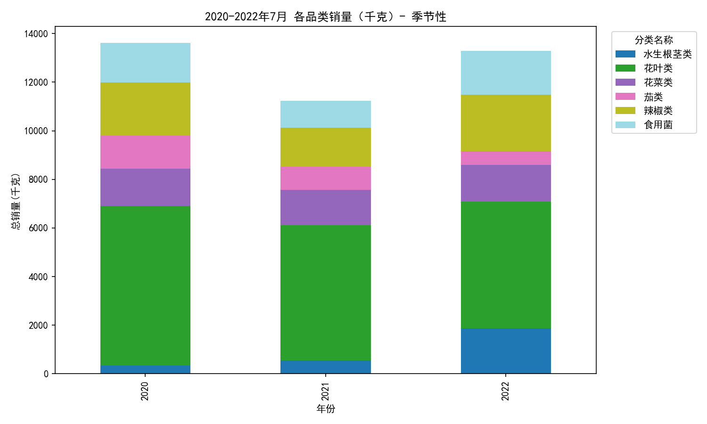
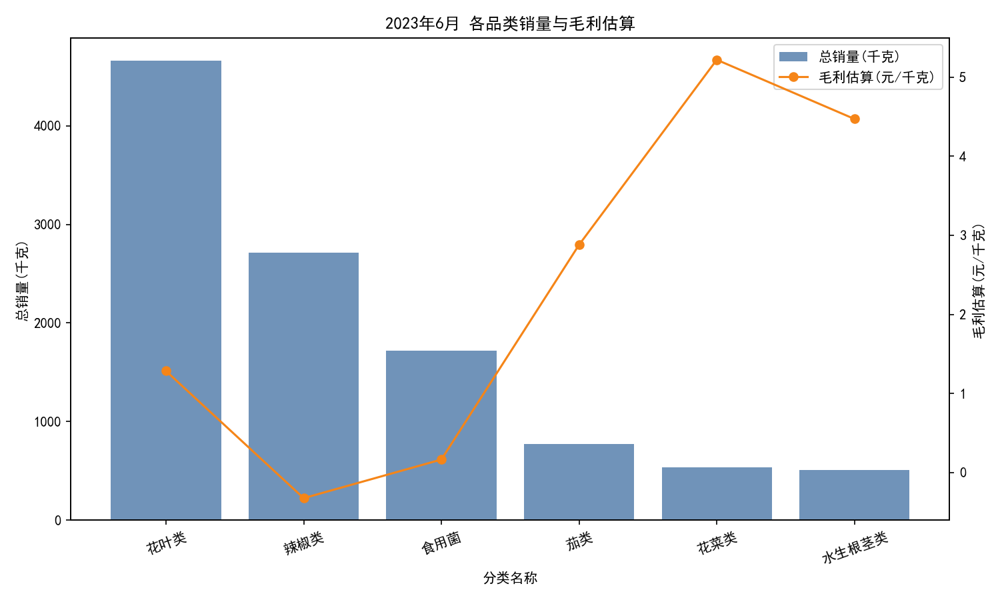
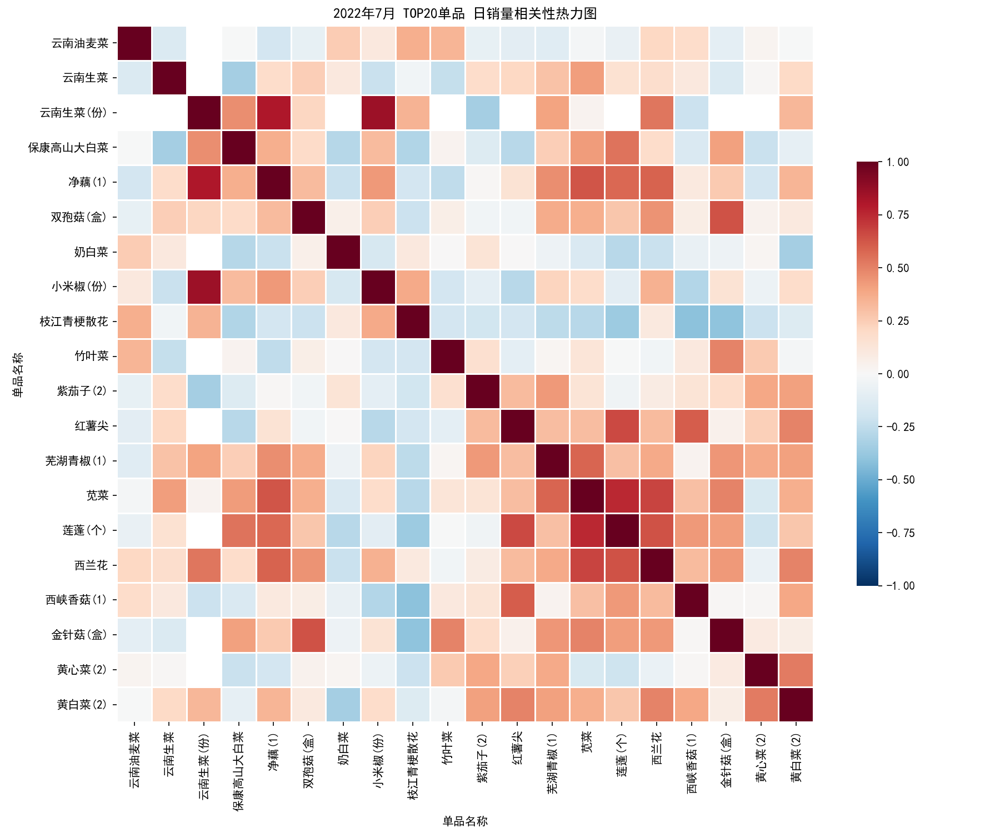

# 2023年7月蔬果补货组合建议（基于季节性与相互关系）

以下分析基于SQLite数据集，聚焦品类与单品销量的季节性与相互关系，并结合2023年6月的近端动销、毛利与损耗约束，提出2023年7月三组蔬果补货组合与执行策略。

---

## 数据与可视化证据

- 时间覆盖：销售记录覆盖 2020-07-01 至 2023-06-30。
- 可视化图片：
  - 2020-2022年7月各品类季节性销量构成图：
  - 2023年6月各品类销量与毛利估算（双轴图）：
  - 2022年7月TOP20单品日销量相关性热力图：

说明：绘图时已设置中文显示与负号兼容，关键字体代码如下（已用于生成上述图片）：
```python
plt.rcParams['font.sans-serif'] = ['SimHei']
plt.rcParams['axes.unicode_minus'] = False
```

---

## 关键发现

1) 7月季节性（2020-2022年均值）
- 花叶类为夏季绝对主力：7月均值约 5791 kg，为各品类之首。
- 辣椒类居次：约 2046 kg；食用菌与花菜类均在 ~1500 kg；茄类与水生根茎类相对较低（~900-1000 kg）。

2) 2023年6月近端动销与毛利约束（加权零售价−平均批发价）
- 花叶类：总销量 4660 kg，毛利约 +1.28 元/kg，同比 +16.5%。
- 辣椒类：总销量 2715 kg，毛利约 −0.32 元/kg，同比 +110.3%（动销猛增但毛利为负，需定价/采购优化）。
- 食用菌：总销量 1719 kg，毛利约 +0.17 元/kg，同比 +60.7%（增长显著但毛利较薄）。
- 花菜类：总销量 533 kg，毛利约 +5.22 元/kg，同比 −27.7%（高毛利但短期动销偏弱）。
- 茄类：总销量 769 kg，毛利约 +2.88 元/kg，同比 −21.3%。
- 水生根茎类：总销量 511 kg，毛利约 +4.47 元/kg，同比 +42.3%。

3) 品类平均损耗率（历史平均）
- 花菜类损耗最高（~14.14%），水生根茎类与花叶类亦偏高（~11.97%、~10.28%）。
- 茄类、食用菌、辣椒类损耗较低（~7.12%、~8.13%、~8.52%）。

4) 单品相互关系（2022年7月TOP20单品相关性热力图）
- 热力图呈现若干显著的正相关集群（红色块），尤其在同一消费场景下的搭配商品间（如清炒/爆炒场景），说明联合补货与联合陈列可提升连带销售。
- 虽不在此处逐一列出具体单品名，但从图形模式可见：叶菜之间、辣椒与茄类之间，以及部分菌菇与花菜之间存在共振需求。

---

## 诊断性洞察（为什么）
- 夏季高温与清淡饮食偏好推升花叶类在7月的消费强度，带动与之搭配的清炒/凉拌场景（部分水生根茎、菌菇）共同走强。
- 辣椒类在近端（2023年6月）销量增长极快，但毛利为负，提示可能存在：
  - 采购成本阶段性上升或结构偏向高成本SKU；
  - 促销/定价不足以覆盖成本；
  - 连带搭配未充分发挥（消费者买辣椒时同时购买的搭配品类可提升整体毛利）。
- 花菜类毛利高但销量与同比偏弱，可能受价格敏感、陈列/搭配弱或供应不稳影响。

## 预测性判断（将会发生什么）
- 7月的花叶类需求将维持高位；与花叶类有强正相关的清炒搭配（菌菇/水生根茎）将继续受益。
- 辣椒类延续高动销概率较大，若不改善定价/采购，将拖累整体毛利；但与茄类、花菜类的搭配组合可拉动客单并摊薄毛利压力。
- 花菜类虽短期弱，但在夏季凉拌/轻烹场景中与菌菇/叶菜的搭配仍能带动转化；配合价格优化，有望回升。

## 规范性建议（我们应该做什么）

下面给出三组面向2023年7月的蔬果补货组合与执行要点。各组合在配比上参考了2020-2022年7月的品类季节性份额，并兼顾2023年6月的毛利与损耗约束。

为便于落地，建议以“每批次1000 kg”为基准配比（可按门店规模线性放大/缩小）；同时给出定价/陈列与损耗管控要点。

### 组合A：清爽沙拉/凉拌场景（高季节性+稳动销）
- 组合构成：花叶类 + 食用菌 + 水生根茎类
- 依据：
  - 花叶类 7月季节性最强（~5791 kg均值），6月动销高且毛利为正；
  - 食用菌6月同比+60.7%，与叶菜在清淡饮食场景中相关性强（见热力图红色块）；
  - 水生根茎类毛利较高（+4.47元/kg），为结构性盈利补位。
- 建议配比（按7月季节性占比推算）：
  - 花叶类：约70%（≈700 kg/批次）
  - 食用菌：约18%（≈180 kg/批次）
  - 水生根茎类：约12%（≈120 kg/批次）
- 执行要点：
  - 联合陈列“清爽组合”端架/端头，明确凉拌/轻烹标签，提升连带；
  - 花叶类与水生根茎类损耗偏高（10.28%、11.97%），缩短补货频次（建议≤2天/次），加强冷链与雾化保鲜；
  - 食用菌毛利偏薄，适度做“第二件9折”捆绑在组合内，拉动结构性毛利由水生根茎类与花叶类补位。

### 组合B：家常爆炒/热炒场景（高连带+结构毛利均衡）
- 组合构成：辣椒类 + 花菜类 + 茄类
- 依据：
  - 辣椒类7月季节性居前、6月销量同比+110%（强动销），与茄类在热炒场景有强相关（热力图红块）；
  - 花菜类毛利最高（+5.22元/kg），用以对冲辣椒类当期负毛利；
  - 茄类毛利为正（+2.88元/kg）、损耗最低之一（7.12%）。
- 建议配比（按7月季节性占比推算）：
  - 辣椒类：约45%（≈450 kg/批次）
  - 花菜类：约33%（≈330 kg/批次）
  - 茄类：约22%（≈220 kg/批次）
- 执行要点：
  - 价格/采购优化：
    - 辣椒类当前毛利为负，建议上调零售价 3–6% 或向低成本SKU倾斜采买；
    - 花菜类以“精品规格”拉升结构毛利并做小包装，控制损耗（其损耗最高，14.14%）。
  - 联合陈列“爆炒三件套”，并在拎包菜/菜谱卡上突出家庭热炒场景，提升客单与连带。

### 组合C：清炒解暑场景（高季节性+高毛利成分）
- 组合构成：花叶类 + 水生根茎类 + 茄类
- 依据：
  - 花叶类为7月主力；
  - 水生根茎类毛利较高（+4.47元/kg）；
  - 茄类毛利稳定、损耗低（7.12%），作稳定补位。
- 建议配比（按7月季节性占比推算）：
  - 花叶类：约76%（≈760 kg/批次）
  - 水生根茎类：约12%（≈120 kg/批次）
  - 茄类：约12%（≈120 kg/批次）
- 执行要点：
  - 对花叶类采取“高频小批量”补货与前置分拣，降低报损；
  - 结合应季促销，设立“清炒专区”端架；
  - 茄类与水生根茎类做交叉促销（如满额减），以结构毛利拉动整体。

---

## 量化配额与动态补货

- 建议以门店近7日的日均销量（ADS）为基础，设置补货基准量 = ADS × 交货提前期（Lead Time，天） + 安全库存（SS）。
- 安全库存可按品类损耗与销量波动设定：
  - 高损耗（花菜、花叶、水生根茎）：SS ≈ 0.5–0.8 × ADS；
  - 中低损耗（茄类、辣椒、菌菇）：SS ≈ 0.3–0.5 × ADS。
- 动态触发：当当日售罄率（Sell-through）> 75% 且剩余库存<SS时，触发次日加单；对高损耗品类优先按半批次补货。

---

## 风险与对策

- 毛利风险：辣椒类当期毛利为负。对策：
  - 与上游议价或SKU重构（倾向低成本来源/规格）；
  - 零售价微调并与花菜/茄类捆绑促销平衡结构毛利。
- 损耗风险：花菜类与花叶类损耗高。对策：
  - 提高周转频次，缩短在架时间；
  - 小包装、前置分拣与冷链/保鲜加强；
  - 根据热力图相关性进行“组合陈列”，加速转化。

---

## 结论

- 7月是叶菜的高峰季，配合菌菇与水生根茎的清淡场景能稳健提高转化与毛利；
- 辣椒类虽然动销强，但需依赖与花菜/茄类的组合与价格/采购优化来修复毛利；
- 三组组合（清爽沙拉/凉拌、家常爆炒、清炒解暑）在季节性、相关性与毛利/损耗的综合约束下可操作性强，建议按所列配比与执行策略落地，并结合门店ADS与Lead Time做动态微调。

以上建议以可视化与数据表为依据，图片文件已生成并引用：
- 季节性_7月_品类销量.png
- 202306_品类销量与毛利.png
- 2022年7月_TOP20单品_日销量相关性热力图.png
