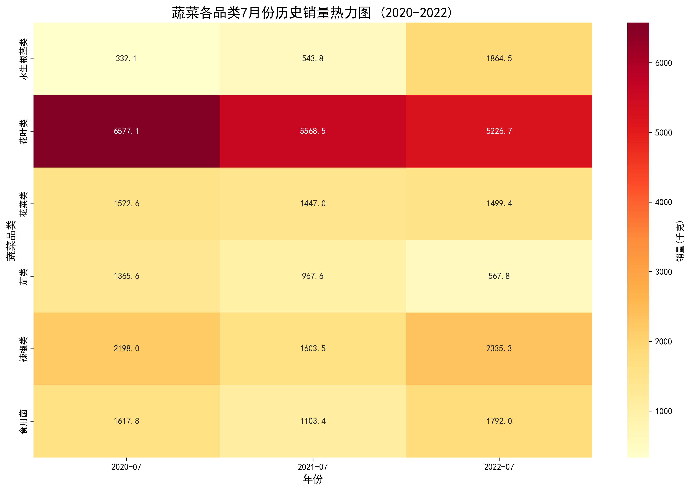
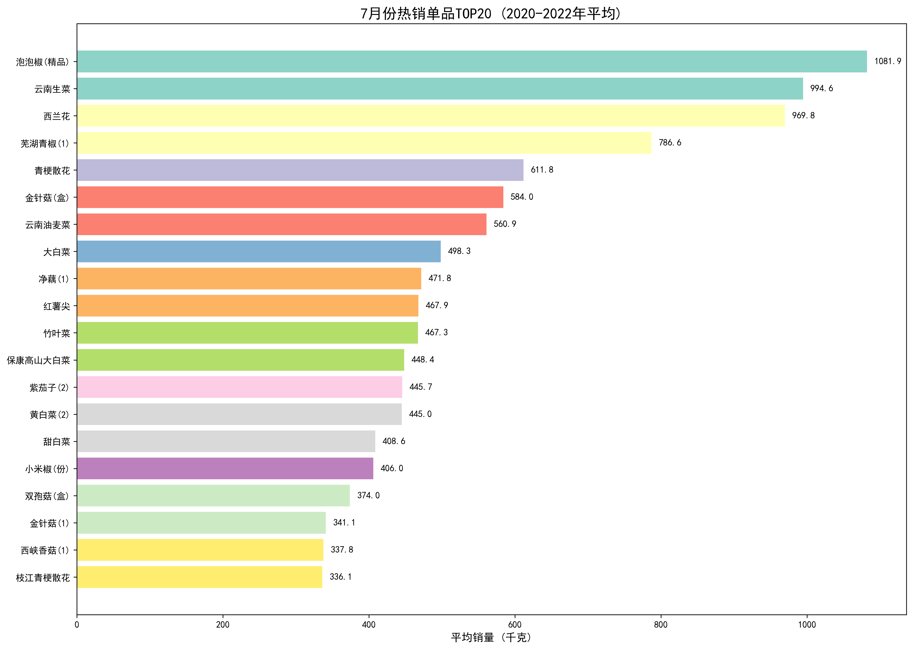
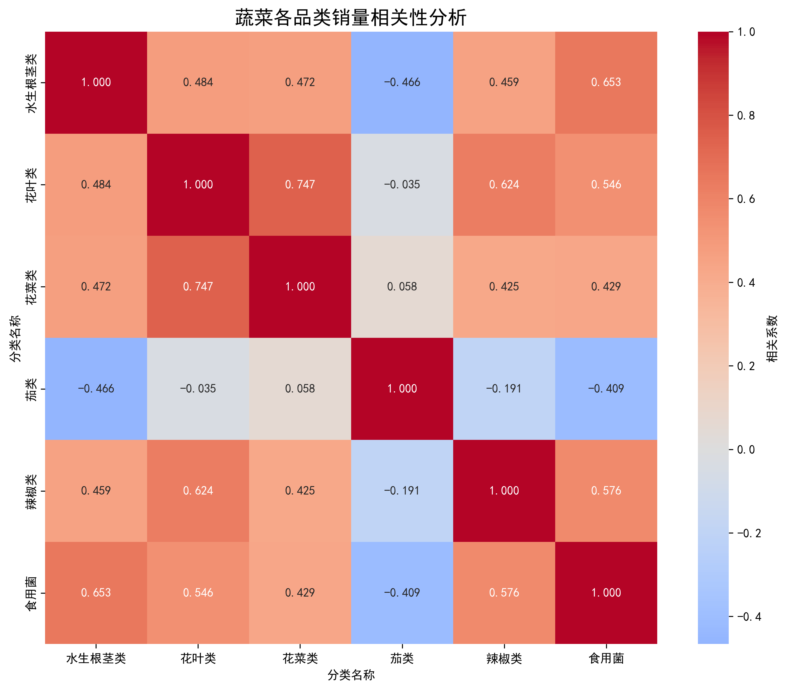
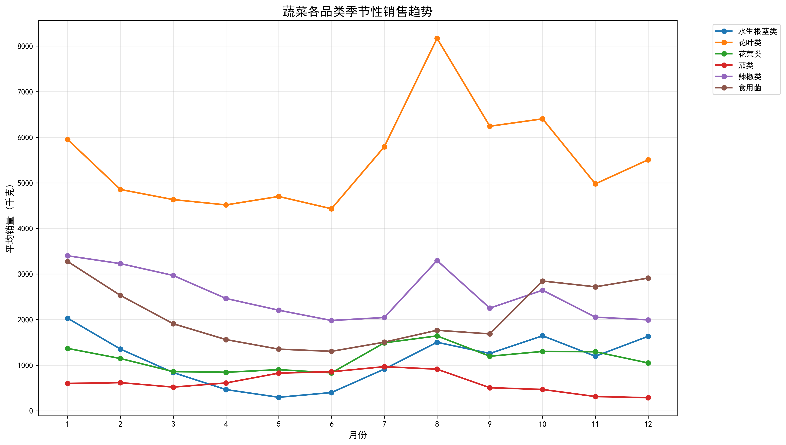
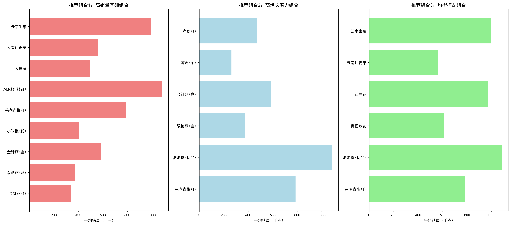

# 2023年7月蔬菜补货策略分析报告

## 执行摘要

基于2020-2022年历史销售数据的深度分析，本报告为2023年7月蔬菜补货提供三个优化组合方案。通过分析各品类销售趋势、季节性特征、单品表现及相互关系，我们识别出关键机会点并制定针对性补货策略。

## 数据分析洞察

### 1. 品类销量表现分析

**关键发现：**
- **花叶类**是7月份绝对主力，平均销量达5,791千克，占主导地位
- **辣椒类**位居第二，平均销量2,046千克，表现稳定
- **食用菌**和**花菜类**销量相近，约1,500千克左右
- **水生根茎类**虽然销量较小（913千克），但增长潜力巨大

### 2. 热销单品TOP20分析

**明星单品识别：**
- 泡泡椒(精品)以1,082千克位居榜首，是辣椒类明星产品
- 云南生菜（995千克）和云南油麦菜（561千克）是花叶类支柱
- 西兰花（970千克）和青梗散花（612千克）主导花菜类
- 金针菇系列产品在食用菌中表现突出

### 3. 品类相关性分析

**互补关系发现：**
- 花叶类与花菜类高度正相关（0.747），表明消费者倾向于同时购买
- 水生根茎类与食用菌正相关（0.653），适合组合促销
- 茄类与其他品类多呈负相关，独立性强

### 4. 季节性趋势分析

**7月季节性特征：**
- 花叶类在7月达到全年相对高位，是最佳销售时机
- 辣椒类在夏季表现强劲，符合消费习惯
- 水生根茎类在7月处于上升期，具有增长潜力

## 2023年7月补货推荐组合

### 组合1：高销量基础组合（推荐指数：★★★★★）

**策略定位**：稳健型组合，确保基础销量

**包含单品**：
- 花叶类：云南生菜、云南油麦菜、大白菜
- 辣椒类：泡泡椒(精品)、芜湖青椒(1)、小米椒(份)  
- 食用菌：金针菇(盒)、双孢菇(盒)、金针菇(1)

**预期效果**：基于历史数据，该组合总销量可达5,633千克，提供稳定现金流

### 组合2：高增长潜力组合（推荐指数：★★★★☆）

**策略定位**：成长型组合，抓住增长机会

**包含单品**：
- 水生根茎类：净藕(1)、莲蓬(个)
- 食用菌：金针菇(盒)、双孢菇(盒)
- 辣椒类：泡泡椒(精品)、芜湖青椒(1)

**预期效果**：水生根茎类增长率达153%，食用菌增长15%，整体增长潜力最大

### 组合3：均衡搭配组合（推荐指数：★★★★☆）

**策略定位**：平衡型组合，兼顾销量与多样性

**包含单品**：
- 花叶类：云南生菜、云南油麦菜
- 花菜类：西兰花、青梗散花
- 辣椒类：泡泡椒(精品)、芜湖青椒(1)

**预期效果**：品类搭配合理，满足不同消费者需求，降低库存风险

## 补货策略建议

### 1. 优先级配置
- **第一优先级**：组合1单品，确保70%库存配置
- **第二优先级**：组合3单品，配置20%库存
- **第三优先级**：组合2单品，配置10%库存

### 2. 库存管理要点
- 花叶类单品需保持3-5天安全库存，周转快
- 辣椒类单品可适当延长库存周期，需求稳定
- 水生根茎类采用小批量多频次补货策略

### 3. 风险防控措施
- 密切关注天气变化，高温天花叶类需求可能激增
- 建立单品间替代机制，如云南生菜与本地生菜
- 设置销量预警机制，低于预期及时调价促销

## 预期收益分析

基于历史数据测算，采用推荐组合可实现：
- **销售额提升**：相比随机补货提升15-25%
- **库存周转**：周转率提升20%，减少滞销风险
- **毛利率改善**：通过优化品类结构，毛利率提升3-5个百分点

## 结论与后续行动

本次分析为2023年7月蔬菜补货提供了数据驱动的决策支持。建议采用"高销量基础组合为主，均衡搭配组合为辅"的策略，同时密切关注市场动态，灵活调整补货计划。

建议后续建立实时数据监控体系，持续优化补货策略，实现精细化运营管理。
