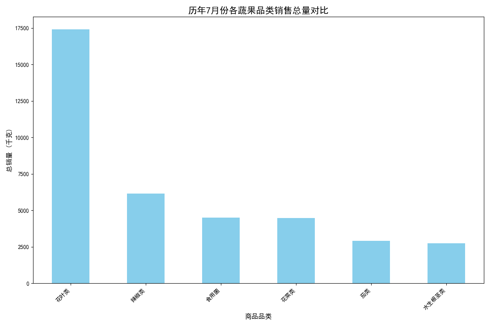

# 2023年7月蔬果补货策略分析与组合推荐报告

## 一、分析背景与目标

为优化库存管理并提升销售额，本次分析旨在根据历史销售数据，深入挖掘蔬菜各品类及单品的销售关系与季节性特征，为2023年7月的补货决策提供数据驱动的建议。我们的核心目标是推荐三个既符合消费趋势又具备高关联性的蔬果组合。

## 二、核心发现

### 1. 7月销售的季节性特征：花叶类蔬菜独占鳌头

通过对历年销售数据的分析，我们发现7月份的蔬果销售呈现出明显的季节性规律。

**在品类层面**，**花叶类**蔬菜（如生菜、油麦菜）的销量遥遥领先，成为夏季最核心的消费品类。紧随其后的是**辣椒类**、**食用菌**、**花菜类**（如西兰花）和**茄类**，这些品类共同构成了7月销售的主力军。

*图1：历年7月份各蔬果品类销售总量对比*

**在单品层面**，**云南生菜**和**西兰花**是当之无愧的“夏日明星”，其总销量远超其他单品。此外，如**云南油麦菜**、**芜湖青椒**、**净藕**和**西峡香菇**等也表现出强劲的销售势头。

### 2. 商品关联性分析：什么商品被顾客一起购买？

为了实现有效的组合销售，我们对顾客的购买行为进行了关联分析，识别出那些经常被同时放入购物篮的商品组合。数据显示，最强的关联发生在销量领先的单品之间：

*   **强关联组合**: **云南生菜 & 西兰花** 的共现购买次数最高，说明顾客已习惯将这两种蔬菜搭配购买。
*   **高关联组合**:
    *   **云南生菜 & 西峡香菇(1)**
    *   **西兰花 & 西峡香菇(1)**
    *   **芜湖青椒(1) & 西兰花**
    *   **云南油麦菜 & 云南生菜**

这些关联组合揭示了顾客在准备菜肴时的内在搭配逻辑，例如“沙拉+炒菜”或“一荤一素”的搭配习惯。

## 三、2023年7月补货组合推荐

基于以上对“热销品”和“强关联”的分析，我们提出以下三个蔬果组合，旨在通过精准补货和捆绑营销，最大化销售潜力。

### 推荐组合一：王牌经典组合

这个组合汇集了销量最高、关联性最强的三款商品，是满足基础消费、保证高流转率的安全选择。

*   **组合成员**:
    1.  **云南生菜** (花叶类销量冠军)
    2.  **西兰花** (花菜类销量冠军)
    3.  **西峡香菇(1)** (食用菌热销单品)
*   **推荐理由**: 这三种商品不仅各自是品类中的佼佼者，而且它们之间的两两组合（生菜+西兰花、生菜+香菇、西兰花+香菇）在共现购买分析中均排名前列。该组合兼顾了凉拌、清炒等多种烹饪场景，覆盖面广，需求稳定。
*   **营销建议**: 可作为“夏日健康优选包”进行捆绑销售。

### 推荐组合二：家庭爆炒组合

该组合精准定位于中式家庭最常见的“炒菜”场景，将几款经典炒菜食材搭配在一起，引导关联消费。

*   **组合成员**:
    1.  **芜湖青椒(1)** (辣椒类热销单品)
    2.  **西兰花** (百搭炒菜食材)
    3.  **紫茄子(2)** (茄类热销单品)
*   **推荐理由**: 青椒和茄子是经典的炒菜搭档，而数据显示青椒与西兰花的共同购买频率极高。此组合覆盖了辣椒、花菜、茄类三大热销品类，能有效满足家庭日常三餐的烹饪需求。
*   **营销建议**: 可命名为“家常小炒随心搭”，在货架上进行邻近陈列，并提供简单的菜谱建议。

### 推荐组合三：夏日绿叶精选

此组合专注于7月最受欢迎的“花叶类”，提供一个清爽、健康、高复购率的绿叶蔬菜包，满足消费者对时令鲜蔬的需求。

*   **组合成员**:
    1.  **云南生菜** (花叶类之王)
    2.  **云南油麦菜** (花叶类销量亚军)
    3.  **红薯尖** (季节性热门绿叶菜)
*   **推荐理由**: 三者均为夏季广受欢迎的绿叶蔬菜，口感清爽，适合多种烹饪方式。数据显示，生菜与油麦菜、生菜与红薯尖均有较高的购买关联性。该组合能巩固在核心品类上的优势，吸引注重健康的消费群体。
*   **营销建议**: 可作为“绿叶蔬菜营养包”推广，强调其新鲜和时令特性。

## 四、结论

通过本次数据分析，我们不仅明确了7月份的蔬果销售重点，还发现了顾客购买行为中的隐藏关联。以上三个推荐组合分别从**“高销量+强关联”**、**“特定场景”**和**“核心品类”**三个不同维度出发，为补货和营销提供了具体、可操作的策略。建议在2023年7月依据此推荐进行备货，并配合相应的营销活动，以期达到提升销量和顾客满意度的双重目标。
