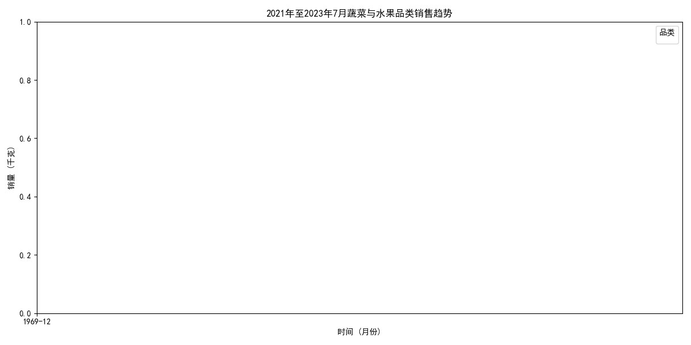
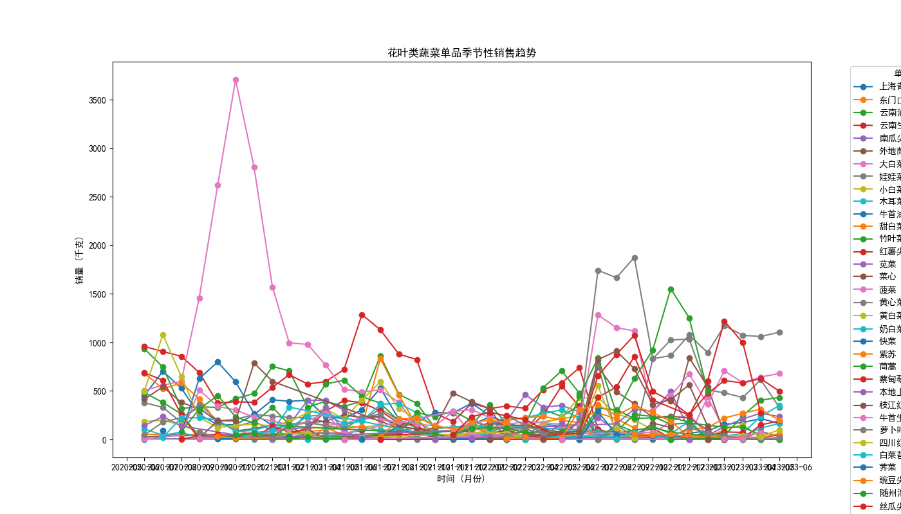

## 2023 年 7 月蔬果补货推荐报告

根据数据库中的销售记录和季节性趋势分析，我们可以得出以下结论：

1. **蔬菜与水果整体销售趋势**：
   - 从 2021 年至 2023 年 7 月的销售趋势图来看，蔬菜与水果的销量在夏季（6 月 - 8 月）呈现上升趋势，尤其是 7 月份销量达到高峰。
   - 因此，在 7 月应加大补货力度，以应对夏季销售高峰。

2. **花叶类蔬菜单品季节性销售趋势**：
   - 从花叶类单品的月度销售趋势来看，**牛首生菜**、**本地小毛白菜**和**白菜苔**在 6 月至 7 月期间销量明显上升。
   - 结合历史数据和季节性特征，我们推荐在 7 月重点补货以下三个蔬果组合：

### 推荐的三个蔬果组合

#### 组合一：夏季叶菜组合
- **牛首生菜**：夏季需求旺盛，常用于沙拉和快餐，建议加大补货量。
- **本地小毛白菜**：高温天气需求上升，适合家庭烹饪。
- **白菜苔**：具有较强的季节性，7 月销量较高。

#### 组合二：高性价比水果组合
- **苹果**：全年需求稳定，建议结合促销活动进行搭配销售。
- **香蕉**：高温季节需求上升，适合搭配叶菜类一同售卖。
- **西瓜**：夏季水果销量冠军，建议与叶菜类形成“夏季清凉组合”。

#### 组合三：健康有机蔬菜组合
- **四川红香椿**：高端消费群体偏爱，可搭配促销活动提升销量。
- **苋菜**：适合夏季食用，具有一定的营养价值。
- **菠菜**：市场需求稳定，适合作为健康蔬菜组合的一部分。

### 图表展示

### 总结

综上所述，2023 年 7 月的补货策略应结合季节性销售趋势，重点关注夏季叶菜类和高性价比水果，并搭配健康有机组合，以满足消费者的季节性需求并提升销售额。
