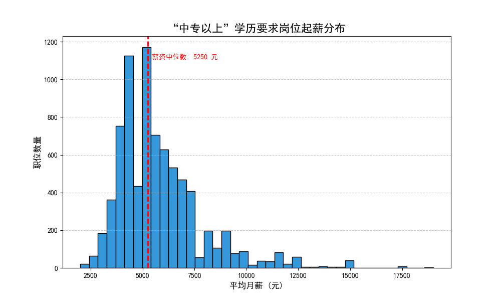
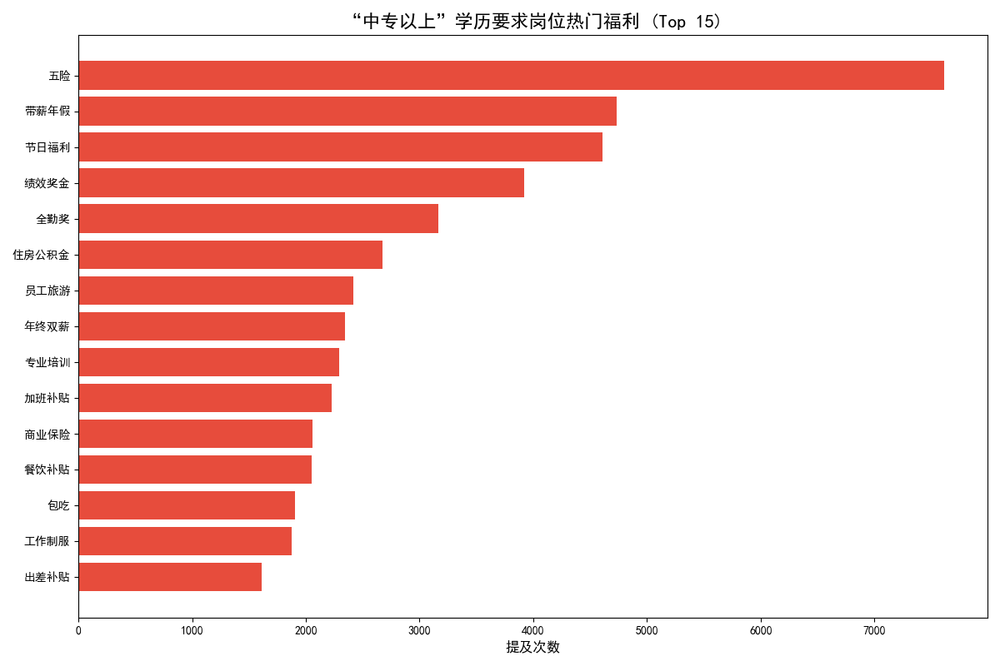
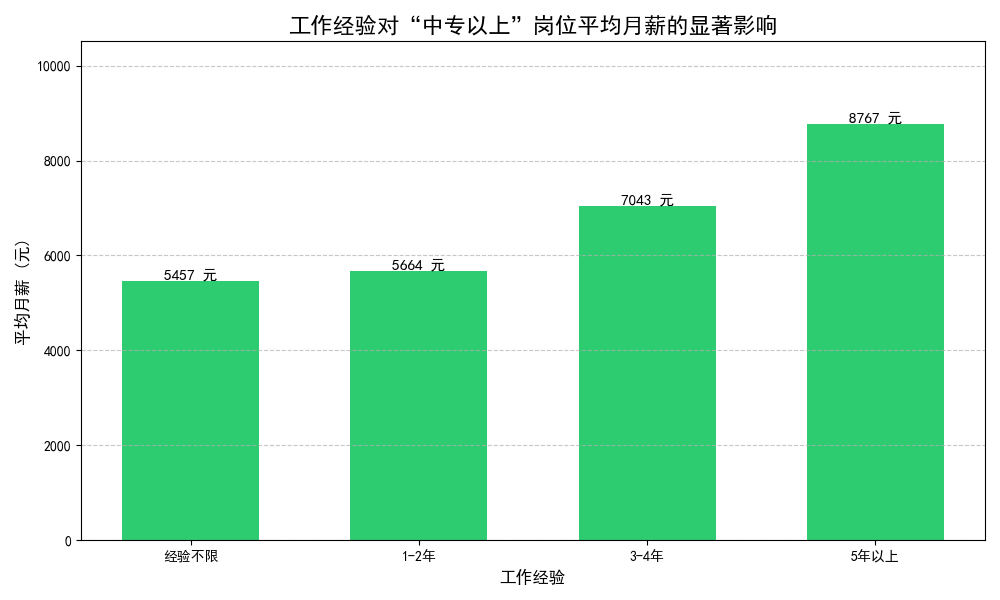

# 中专生就业市场洞察：薪资、福利与职业发展路径分析

**前言**
为了深入了解中专学历人员的就业现状，我们对相关招聘数据进行了分析。本次分析旨在揭示中专生的起薪水平、普遍的福利待遇，并挖掘能够显著提升其收入潜力的关键素质。

**数据说明：** 由于数据集中没有严格的“中专”学历标签，本次分析选用了“中专以上”作为筛选条件，这可能包含部分更高学历的岗位，但仍能有效反映中专生可触及岗位的市场行情。

---

### **一、 中专生起薪分布：普遍集中于中低段，突破需凭硬实力**

通过对要求“中专以上”学历的岗位薪资进行分析，我们发现其起薪主要集中在 4,000 至 7,000 元/月的区间，薪资中位数约为 **5,500 元/月**。

**洞察与分析：**
- **主体薪资水平：** 大部分面向中专生的初级岗位起薪位于一个相对固定的范围，这反映了市场的普遍定价。对于刚进入职场的求职者来说，5500元是一个普遍的起薪标准。
- **高薪机会存在：** 尽管主体偏向中低薪，但仍有部分岗位的薪资能达到万元以上。这些高薪岗位往往对求职者的特定技能或经验有更高要求，意味着通过提升个人能力，中专生完全有机会突破普遍的薪资天花板。

---

### **二、 福利待遇分析：基础保障是主流，发展与人文关怀成亮点**

在福利待遇方面，“包吃”、“包住”、“五险一金”是企业最常提供的基础保障，这体现了企业在解决员工基本生活问题上的投入。

**洞察与分析：**
- **基础保障是标配：** “包吃住”和“社保”构成了吸引和留住中专学历员工的基础福利组合，尤其对于异地求职者具有较强吸引力。
- **发展与激励并行：** “年终奖”、“绩效奖金”等激励性福利被广泛提及，说明企业愿意为业绩出色的员工提供额外回报。同时，“专业培训”的出现，表明部分企业开始重视员工的长期发展和技能提升。
- **人文关怀受重视：** “节日福利”、“带薪年假”等福利的普及，反映了企业在提供基础保障之外，也越来越注重员工的工作与生活平衡，以及营造良好的人文环境。

---

### **三、 核心洞察：工作经验是打破薪资瓶颈的最强利器**

在所有影响薪资的因素中，**工作经验**的提升对薪资增长的驱动作用最为显著和直接。随着经验的积累，中专生的平均薪资呈现出清晰的阶梯式增长。

**数据解读与策略建议：**
- **经验的价值量化：**
  - **初入职场（经验不限）：** 平均月薪约为 **5,457 元**。
  - **积累1-2年经验：** 平均月薪小幅提升至 **5,664 元**。这个阶段是技能和职业习惯的养成期，薪资增幅尚不明显。
  - **拥有3-4年经验：** 薪资迎来第一个显著跃升，平均达到 **7,043 元**，相比“经验不限”者高出近 **30%**。这表明具备3年以上经验的员工已成为业务骨干，其市场价值得到显著认可。
  - **深耕5年以上：** 平均月薪高达 **8,767 元**，比初入职场者高出 **60%** 以上。资深从业者凭借其丰富的实践经验和问题解决能力，成为了企业愿意高薪聘请的宝贵人才。

- **给中专生的职业发展建议：**
  1.  **保持耐心，完成原始积累：** 职场前两年是打基础的关键时期，即使薪资增长缓慢，也应专注于学习核心技能、熟悉行业规范，为未来的跃升做好铺垫。
  2.  **规划3-5年目标，成为业务能手：** 将3-5年作为一个职业发展周期，有意识地在特定领域深耕，争取成为团队中不可或缺的业务骨干。届时，无论是内部晋升还是跳槽，都将拥有更强的议价能力。
  3.  **长期主义，成为领域专家：** 对于有志于在技术或特定行业长期发展的中专生，持续学习和积累超过5年以上的资深经验，是实现高薪和稳定职业前景的最可靠路径。

### **结论**

对于中专生而言，虽然初入职场的起薪普遍不高，但职业道路并非一成不变。市场已经清晰地指明了方向：**积累有效的工作经验是提升个人价值和薪酬待遇的最核心要素**。求职者应摆脱“学历定终身”的消极心态，专注于在一个领域内深耕细作，通过时间的沉淀和能力的提升，完全可以实现职业和薪资的双重突破。
