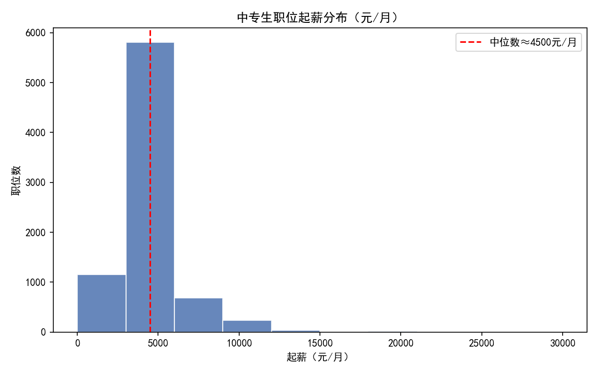
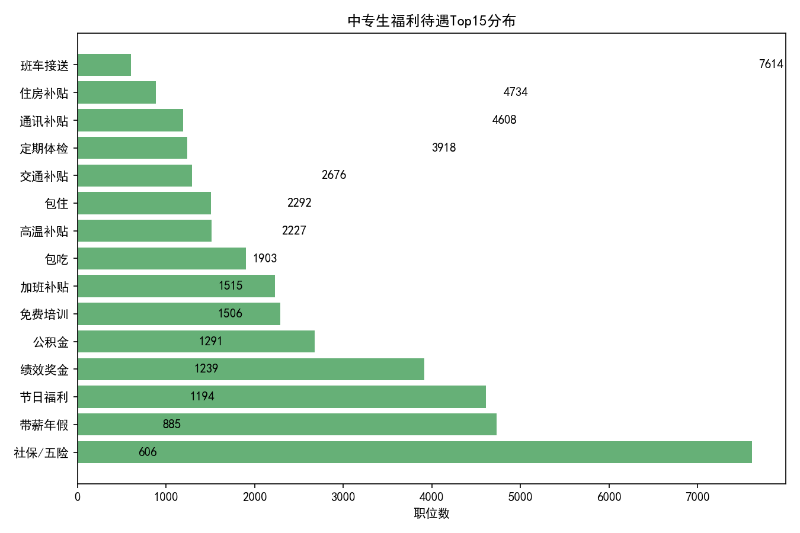
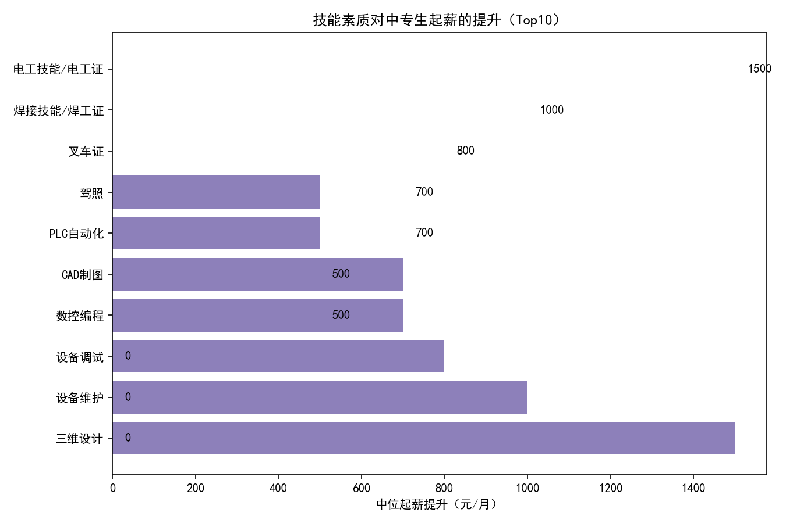

# 中专生就业的起薪与福利待遇分布，以及显著提升起薪的素质洞察

以下分析基于SQLite库表 sheet1 中“学历要求包含‘中专’”的招聘数据（共9073条，其中可解析起薪7936条），并通过Python解析“薪资范围”、统计“福利待遇”与抽取“技能/素质”关键词来进行对比分析。

为保证图表可以正确显示中文，绘图代码中包含如下字体设置：
```python
plt.rcParams['font.sans-serif'] = ['SimHei']
plt.rcParams['axes.unicode_minus'] = False
```

## 关键发现概览
- 数据规模：中专相关职位 9073 条；可解析起薪的职位 7936 条。
- 起薪水平：中位数约 4500 元/月，四分位数 Q1≈3500，Q3≈5500，均值≈4816 元/月。
- 福利结构：基础保障（社保/五险）覆盖率非常高（7614），但公积金相对较少（2676）；带薪年假、节日福利、绩效奖金较普遍；生活类福利（包吃/包住、交通/通讯补贴、住房补贴等）存在明显差异化。
- 显著提升起薪的素质（按对“中位起薪”的提升额排序）：
  - 三维设计（SolidWorks/UG/ProE等）：+1500 元/月
  - 设备维护（维修/保养/机修）：+1000 元/月
  - 设备调试（调试/测试/试车）：+800 元/月
  - 数控编程（CNC/编程）：+700 元/月
  - CAD制图：+700 元/月
  - PLC自动化（PLC/自动化/西门子）：+500 元/月
  - 驾照（C1/C2等）：+500 元/月
  - 焊接技能/焊工证、叉车证、电工证在整体样本上未体现显著中位提升（0 元/月）

## 起薪分布
- 起薪中位数约 4500 元/月，集中分布在 3500–5500 区间。
- 右侧有一定尾部（更高薪资），通常来自技术要求更高、涉及自动化/设计/设备维保等岗位。

配图：中专生职位起薪分布（元/月）


解读与诊断：
- 制造业/工厂相关岗位占比较高，标准化作业岗位集中在4–5.5k区间。
- 技术含量较高的岗位（设备维护/调试、自动化、设计类）形成更高薪资的“右尾”，反映出技能溢价。

## 福利待遇分布
取Top15福利标签统计（职位数）：
- 社保/五险：7614
- 带薪年假：4734
- 节日福利：4608
- 绩效奖金：3918
- 公积金：2676
- 免费培训：2292
- 加班补贴：2227
- 包吃：1903
- 高温补贴：1515
- 包住：1506
- 交通补贴：1291
- 定期体检：1239
- 通讯补贴：1194
- 住房补贴：885
- 班车接送：606

配图：中专生福利待遇Top15分布


解读与诊断：
- 基础保障类覆盖率高（社保/五险），但“公积金”显著低于“社保/五险”，提示不同企业类型与规范化程度差异。
- 假期与节日类（带薪年假、节日福利）较为普遍，反映出非货币性激励的重要性。
- 生活支持类（包吃/住、交通/通讯补贴、住房补贴）差异较大，往往与区域、行业属性、生产组织方式相关。

## 哪些素质可显著提升起薪？
我们从“职位描述+职位名称”中抽取技能关键词，并比较“包含该技能”与“不包含该技能”两个群体的起薪中位数差异（样本各≥30）：

配图：技能素质对中专生起薪的提升Top10


- 三维设计（SolidWorks/UG/ProE/三维）：
  - 含技能中位数≈6000，不含技能≈4500，提升≈+1500
  - 解释：上游设计/工艺职位对三维建模能力有明确需求，供给不足导致薪资溢价显著。
- 设备维护（维修/保养/机修）：
  - 含技能中位数≈5000，不含技能≈4000，提升≈+1000
  - 解释：设备维保对产线稳定性至关重要，技术经验可直接降低停机损失，体现出高价值。
- 设备调试（调试/测试/试车）：
  - 含技能中位数≈5000 vs 不含≈4200，提升≈+800
  - 解释：调试与交付环节技术门槛较高，且涉及客户现场/多工种协同，溢价明显。
- 数控编程（CNC/编程）与 CAD制图：
  - 含技能中位数≈5000 vs 不含≈4300，提升≈+700
  - 解释：加工编程与制图是制造企业核心能力，直接影响加工效率与良品率。
- PLC自动化（PLC/西门子/自动化）：
  - 含技能中位数≈5000 vs 不含≈4500，提升≈+500
  - 解释：工业自动化的增长带来的需求增量，技能稀缺度仍有溢价。
- 驾照（C1/C2）：
  - 提升≈+500，主要体现在需要通勤灵活性或驾驶职责的岗位（如物流、设备外出服务）。

未体现显著提升（中位提升≈0）的技能：
- 焊接技能/焊工证、叉车证、电工证
  - 解释：这些证照岗位供给较充分、技能门槛相对标准化与同质化，导致薪资中位数与整体持平。若结合高端工种（如高难焊接资质、特种电工资质或跨技能复合）可能形成溢价，但在整体样本中未显现。

## 可行策略（规范性建议）
- 面向中专生的个人发展路径：
  1) 基础打底（1–3个月）：CAD制图、质量检验（QA/QC）与办公软件（Excel/Word），确保进入门槛与数据化表达能力。
  2) 技能进阶（3–6个月）：数控编程（CNC）、设备维护与调试，优先获取操作/维保实操经验；结合企业设备品牌进行针对性学习。
  3) 高价值方向（6–12个月）：三维设计（SolidWorks/UG/ProE）与PLC自动化，力争参与工艺优化或自动化改造项目，形成“设计+自动化+维保”的复合型能力。
- 求职策略：
  - 查阅岗位描述中的关键词（设备维护/调试、三维设计、PLC自动化、CAD等），优先投递具备技能溢价的岗位。
  - 关注具备完善福利的企业（社保/五险、带薪年假、公积金），尤其是规范的大中型制造企业与工厂。
  - 若岗位提供“免费培训”，可作为快速技能升级的渠道，提升长期薪资天花板。
- 企业用工策略：
  - 提供技能培训（CAD/PLC/设备维保/三维设计），通过员工技能结构升级，提升产线效率与员工留存。
  - 优化福利结构（社保/五险、带薪年假、节日福利、公积金、交通/通讯/住房补贴），提升雇主品牌与吸引力。

## 预测性判断
- 在当前薪资结构下，完成“设备维护”系统化训练，可将起薪中位数从≈4500提升到≈5000（+1000）。
- 若进一步掌握“三维设计”，中位数可达到≈6000（相对于整体+1500）。
- PLC自动化与数控编程/CAD组合，对部分岗位有叠加效应的潜力（本次未做交互效应建模），对高端产线与自动化改造项目尤为有效。

## 方法说明与局限
- 数据来源：sheet1表，筛选“学历要求包含‘中专’”的记录，共9073条；“面议/无法解析”的薪资未纳入起薪分布（可解析7936条）。
- 起薪解析：从“薪资范围”中取区间下限并统一到“元/月”（识别K/千/万、年薪与日薪做约定转换）；极端异常值（>200000元/月）剔除。
- 技能识别：基于职位描述与职位名称的关键词匹配，统计各技能出现与否后比较起薪中位数；未进行文本清洗和复杂NLP（可能有漏检/误检）。
- 福利统计：以关键词合并到规范标签计数，未对福利强度或细则进行加权。
- 结论适用于整体样本，行业/地区/经验层级的细分差异未在本次报告中展开。

## 附：生成图片与代码说明
- 生成的图片文件：
  - 中专生起薪分布.png
  - 中专生福利待遇Top15.png
  - 中专生技能对起薪提升Top10.png
- 主要绘图代码位于当前目录的 analysis_zhongzhuan.py；为保证中文显示，使用了如下代码：
```python
plt.rcParams['font.sans-serif'] = ['SimHei']
plt.rcParams['axes.unicode_minus'] = False
```

以上分析为中专生就业市场的起薪与福利画像，并提供了明确的技能路径与策略建议，以支持个人与企业的决策优化。
