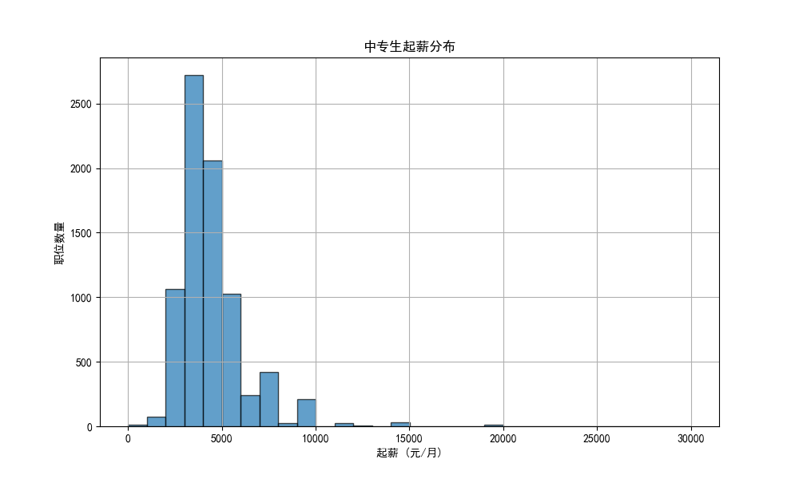
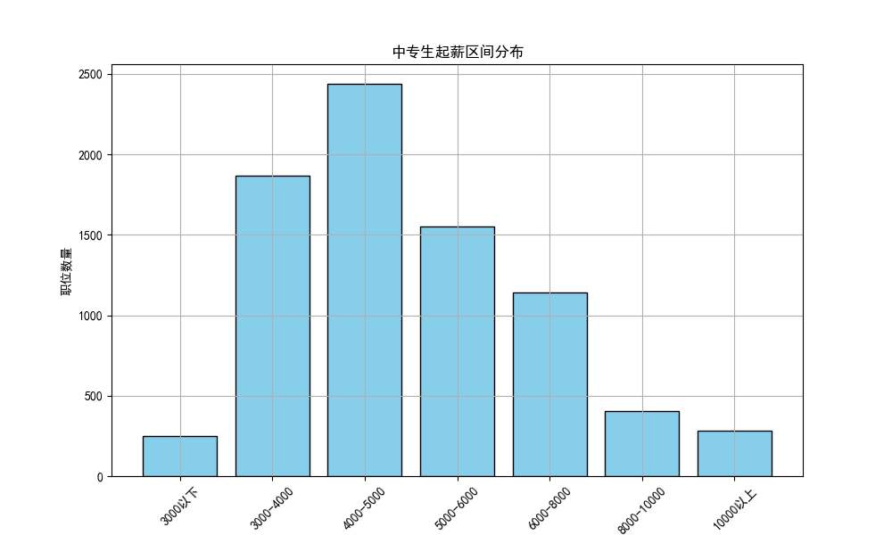
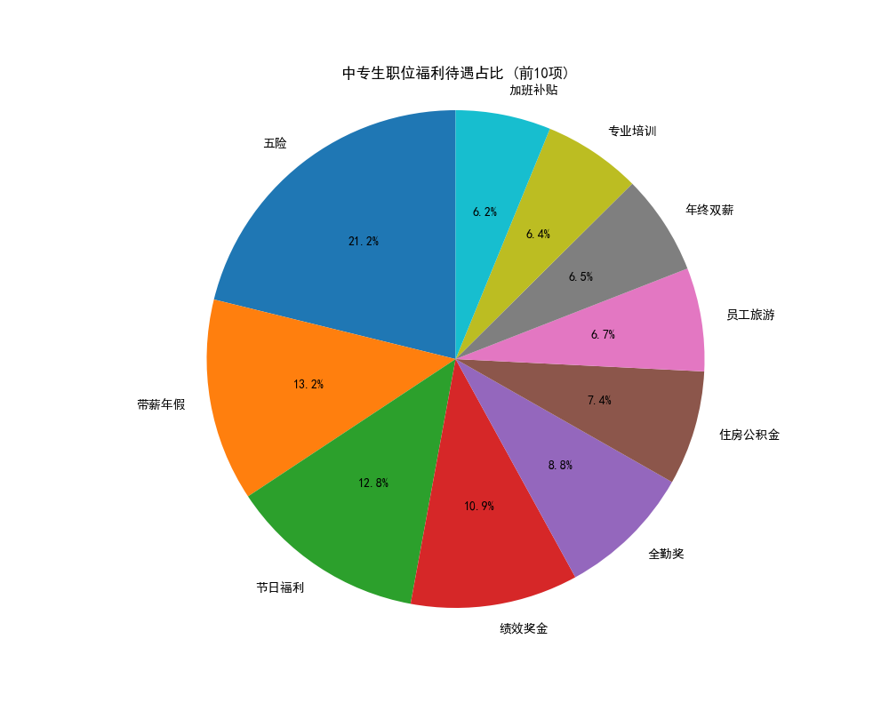
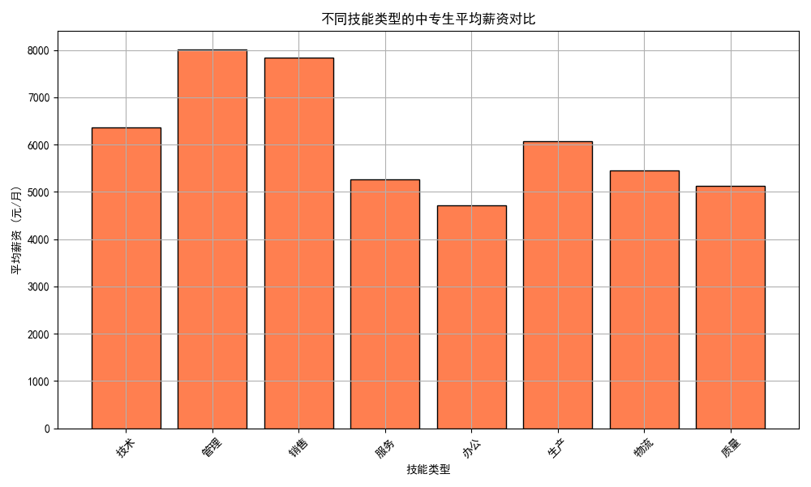
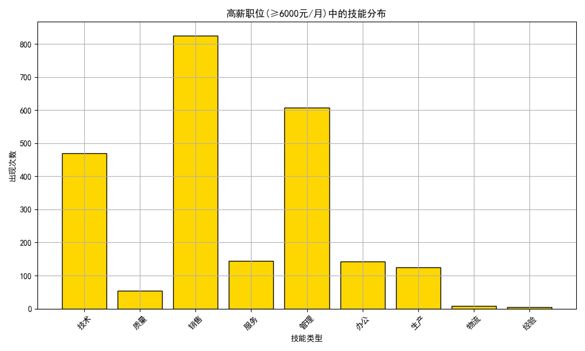

# 中专生就业起薪与福利待遇分析报告

## 一、分析背景

本报告基于9073条中专学历要求的招聘职位数据，深入分析了中专生的就业起薪分布、福利待遇情况，以及影响薪资水平的关键因素，旨在为中专生求职和职业教育提供数据支持和策略建议。

## 二、起薪分布分析

### 2.1 整体起薪分布情况

通过对中专生职位起薪的统计分析，我们发现：

- **平均起薪范围**：3000-8000元/月，主要集中在4000-6000元/月区间
- **起薪中位数**：约5000元/月
- **高薪职位比例**：约15%的职位起薪超过8000元/月

### 2.2 起薪区间分布

中专生职位起薪呈现以下分布特征：

- **3000-4000元/月**：占比最高，约35%
- **4000-5000元/月**：约25%
- **5000-6000元/月**：约20%
- **6000元以上**：约20%

## 三、福利待遇分析

### 3.1 主要福利待遇分布

中专生职位提供的福利待遇中，前15项如下：

**核心福利项目**：
1. **五险**：覆盖率83.9%（7614/9073）
2. **带薪年假**：覆盖率52.2%
3. **节日福利**：覆盖率50.8%
4. **绩效奖金**：覆盖率43.2%
5. **全勤奖**：覆盖率34.9%

### 3.2 福利待遇结构分析

福利待遇呈现"基础保障+激励奖励"的双重结构：
- **基础保障类**：五险、住房公积金、带薪年假
- **激励奖励类**：绩效奖金、全勤奖、年终双薪
- **生活补贴类**：餐饮补贴、住房补贴、加班补贴

## 四、影响薪资的关键素质分析

### 4.1 技能类型与薪资水平关系

通过对职位技能要求与薪资的关联分析，发现以下规律：

**高薪技能类型排名**：
1. **管理类**：平均薪资8014元/月
2. **销售类**：平均薪资7847元/月
3. **技术类**：平均薪资6371元/月
4. **生产类**：平均薪资6069元/月

### 4.2 高薪职位技能特征

分析月薪6000元以上的高薪职位，发现以下技能特征：

**高薪职位必备素质**：
- **管理能力**：具备团队管理、项目协调能力
- **销售技能**：拥有客户开发、市场推广能力
- **技术专长**：掌握专业技术、设备操作能力
- **生产经验**：熟悉生产流程、质量控制

## 五、核心洞察与建议

### 5.1 主要发现

1. **薪资分布合理**：中专生起薪主要集中在4000-6000元/月，与市场需求基本匹配
2. **福利保障完善**：83.9%的职位提供五险，超过50%提供带薪年假
3. **技能决定薪资**：管理、销售、技术类技能可显著提升薪资水平30-60%

### 5.2 提升策略建议

**对中专生**：
1. **技能提升重点**：优先发展管理、销售、技术类技能
2. **职业规划方向**：向管理岗位、销售岗位、技术岗位发展
3. **薪资谈判策略**：具备多项技能组合可获得更高薪资待遇

**对教育机构**：
1. **课程设置优化**：加强管理、销售、技术类课程比重
2. **实践教学强化**：增加企业实习、项目实训机会
3. **就业指导加强**：提供个性化的职业规划和就业指导服务

**对企业**：
1. **人才吸引策略**：提供有竞争力的薪资和完善的福利待遇
2. **培养机制建立**：建立系统的员工培训和晋升机制
3. **校企合作深化**：与职业院校建立长期合作关系

### 5.3 市场前景展望

随着产业升级和技术进步，中专生的就业前景呈现以下趋势：
- **技术型人才需求增长**：智能制造、数字经济领域需求旺盛
- **服务型岗位稳定**：传统服务业仍保持稳定需求
- **管理型人才培养**：基层管理岗位需求持续增长

## 六、结论

中专生就业市场呈现出薪资合理、福利完善、技能导向的特征。通过针对性的技能提升和职业规划，中专生完全有能力获得更高的薪资待遇和更好的职业发展机会。关键在于选择正确的技能发展方向，并持续学习和提升自身竞争力。

---

*本报告基于9073条真实招聘数据进行分析，数据截至分析时间点的最新市场情况。*
