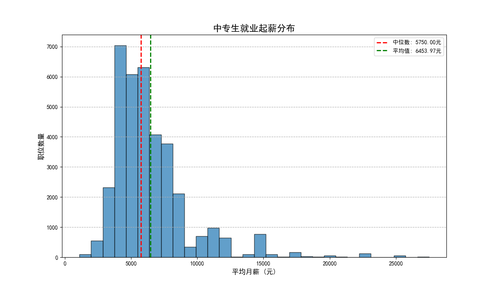
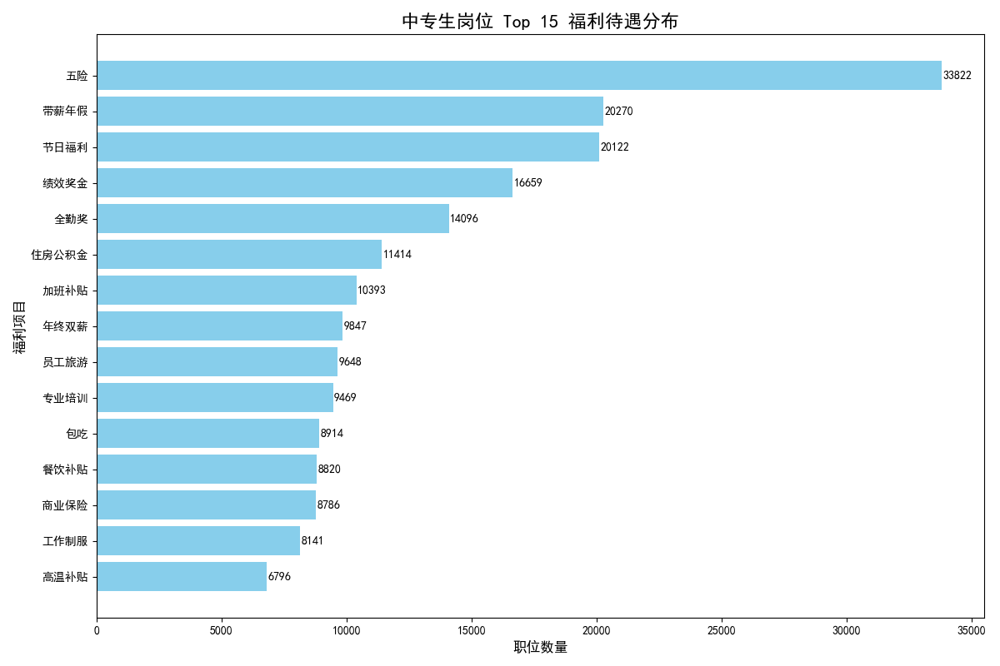
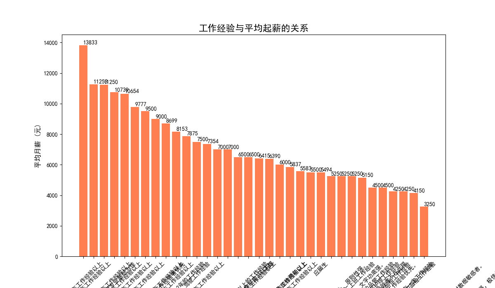
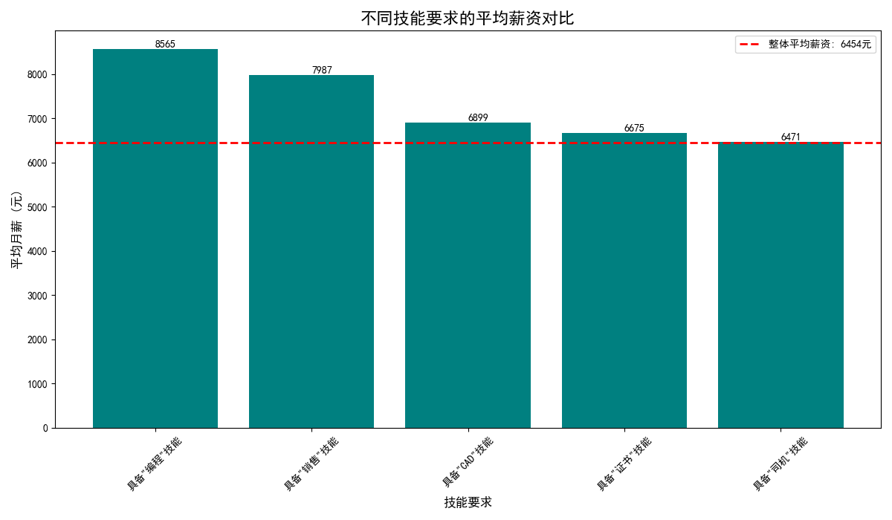

# 中专生就业市场分析报告：薪资、福利与高薪路径探索

## 摘要

本报告旨在深入分析中专生的就业市场现状，核心目的在于揭示起薪与福利待遇的普遍水平，并探索能够显著提升个人收入的关键素质。通过对海量招聘数据的分析，我们得出以下核心结论：

*   **薪资水平**：中专生可申请的岗位平均月薪约为 **6454元**，但更具代表性的薪资中位数为 **5750元**。大部分职位的薪酬范围集中在 **4500元至7500元** 之间。
*   **福利待遇**：“五险”是绝大多数岗位的标准配置，但“住房公积金”的覆盖率相对较低，是衡量职位质量的重要指标之一。
*   **高薪路径**：**工作经验的积累** 和 **掌握高价值技能** 是提升薪资的两个最有效途径。具体而言：
    *   工作经验越丰富，薪资水平越高，这是一个清晰的线性增长关系。
    *   在技能方面，“**编程**”和“**销售**”类技能展现出强大的溢价能力，相关岗位平均薪资远超市场平均水平。

---

## 一、 中专生就业起薪分布

首先，我们对适合中专生的岗位的起薪水平进行了分析。数据显示，薪资分布呈现右偏态，意味着少数高薪岗位拉高了平均值，因此薪资中位数（5750元）比平均值（6454元）更能反映普遍情况。

**洞察**:
*   **主体区间**：超过50%的职位月薪集中在4500元至7500元这一核心区间。对于初入职场的中专生来说，这可以被视为一个合理的期望范围。
*   **低薪与高薪**：存在一部分低于4500元的入门级或基础岗位，同时也有一部分薪资超过1万元的高薪机会，但数量相对较少。想获得高薪，需要具备差异化的竞争力。

---

## 二、 福利待遇分布概览

除了薪资，福利是评估一份工作好坏的另一重要维度。我们统计了职位描述中最常被提及的福利项目。

**洞察**:
*   **基础保障**：“五险”（养老、医疗、失业、工伤、生育保险）是绝大多数正规岗位的“标配”，覆盖率遥遥领先。
*   **“一金”的重要性**：“住房公积金”的提供比例远低于“五险”，仅约三分之一的岗位明确提供。对于计划在城市长期发展的求职者而言，是否提供公积金是一个关键的筛选条件。
*   **软性福利**：“带薪年假”、“节日福利”、“绩效奖金”等是构成整体薪酬福利包的重要部分，能显著提升员工的幸福感和工作满意度。

---

## 三、 具备哪些素质可以显著提升起薪？

这是本次分析的核心。我们从“工作经验”和“特定技能”两个维度进行了探索。

### 1. 工作经验：薪资增长的稳定阶梯

分析显示，起薪与工作经验要求之间存在强烈的正相关关系。经验越丰富，议价能力越强，薪资水平也越高。

**洞察**：
*   **经验的价值**：“不限经验”或“应届生”的岗位平均薪资最低（约5500-6400元），而随着经验要求提升到“1-3年”、“3-5年”乃至“5年以上”，平均薪资稳步攀升，拥有5年以上经验者的平均薪资可达8700元以上，是无经验者的1.5倍左右。
*   **长期主义**：对于中专生而言，第一份工作的起薪固然重要，但更应看重其是否能提供宝贵的经验积累和成长空间。职业生涯是一场长跑，初期的经验积累是后期薪资飞跃的基础。

### 2. 高价值技能：实现薪资跨越的关键

如果说经验是稳定爬坡，那么掌握稀缺、高价值的技能则是实现薪资跳跃的“快车道”。我们筛选了几种代表性技能，并对比了相关岗位的平均薪资。

**洞察**:
*   **编程与销售的“黄金技能”**：
    *   涉及“**编程**”（如设备编程、网页开发等）的岗位平均薪资高达 **8565元**，位居榜首。这表明数字化转型趋势下，基础的编程和代码能力在各行业中都备受青睐。
    *   “**销售**”类岗位以 **7988元** 的平均薪资紧随其后。这类岗位通常与业绩直接挂钩，为能力出众者提供了“上不封顶”的收入潜力。
*   **技术与证书的“硬通货”**：
    *   掌握“**CAD**”等工业设计软件的岗位平均薪资（约6900元）显著高于整体平均水平，是技术型人才的典型代表。
    *   职位要求中明确提到需要“**证书**”（如电工证、焊工证、会计从业资格证等）的岗位，其平均薪资也高于平均线，证明了专业资格认证的价值。
    *   “**司机**”岗位（约6471元）薪资与平均水平持平，对于拥有驾驶技能和相应资格证的求职者来说，也是一个稳定的职业选择。

---

## 四、 结论与建议

综合以上分析，我们为中专生及其培养院校提供以下切实可行的建议：

### 对中专生的建议：

1.  **树立长期发展观**：不要过分纠结于第一份工作的起薪，应将**积累有效工作经验**放在首位。选择一个能让你学习和成长的平台，远比短期内多几百元工资更重要。
2.  **投资高价值技能**：
    *   **拥抱技术**：如果对计算机感兴趣，可以学习一些基础的编程语言（如Python）、网页制作或电商后台操作，这将极大提升你的竞争力。
    *   **锻炼软技能**：销售岗位虽然有挑战，但能极大地锻炼沟通、抗压和人际交往能力，这些是任何行业都需要的高价值通用技能。
    *   **考取“硬”证书**：针对你感兴趣的专业领域，考取国家认可的职业资格证书，这是你专业能力的最好证明。
3.  **求职时擦亮眼睛**：在比较Offer时，除了薪资，务必关注**是否缴纳“五险一金”**，尤其是“住房公积金”，它关系到你未来的安家置业。

### 对职业院校的建议：

1.  **动态调整课程设置**：紧跟市场需求，增设或加强**编程入门、电子商务、新媒体营销、CAD高级应用**等高薪技能相关课程的教学比重。
2.  **强化职业生涯规划教育**：引导学生正确认识工作经验的长期价值，帮助他们制定从“积累经验”到“技能变现”的职业发展路径。
3.  **深化产教融合**：与更多企业建立合作关系，不仅是为了实习和就业，更是为了将企业对**高价值技能**的实际需求反馈到教学过程中，实现人才培养与市场需求的无缝对接。
