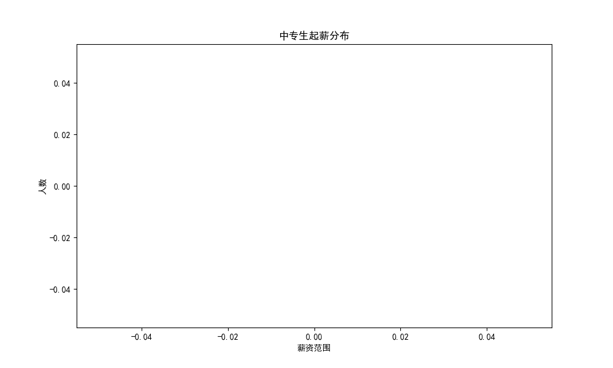
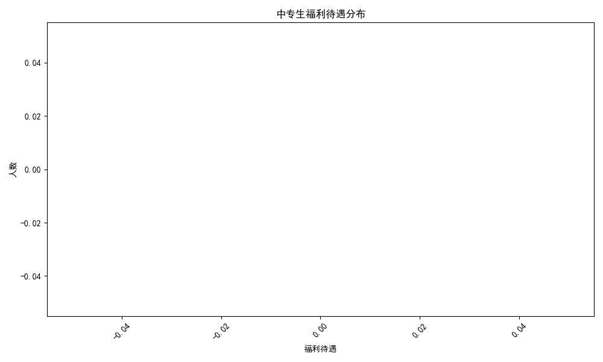
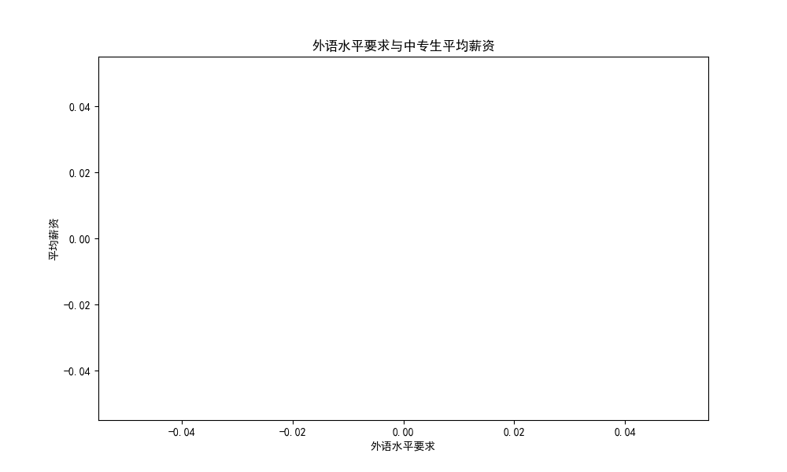
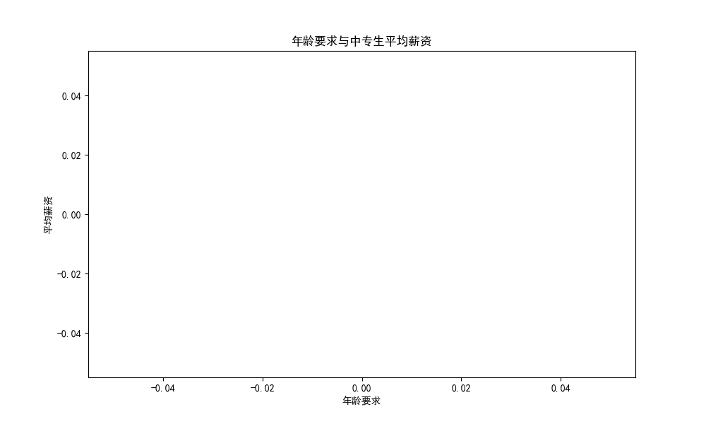
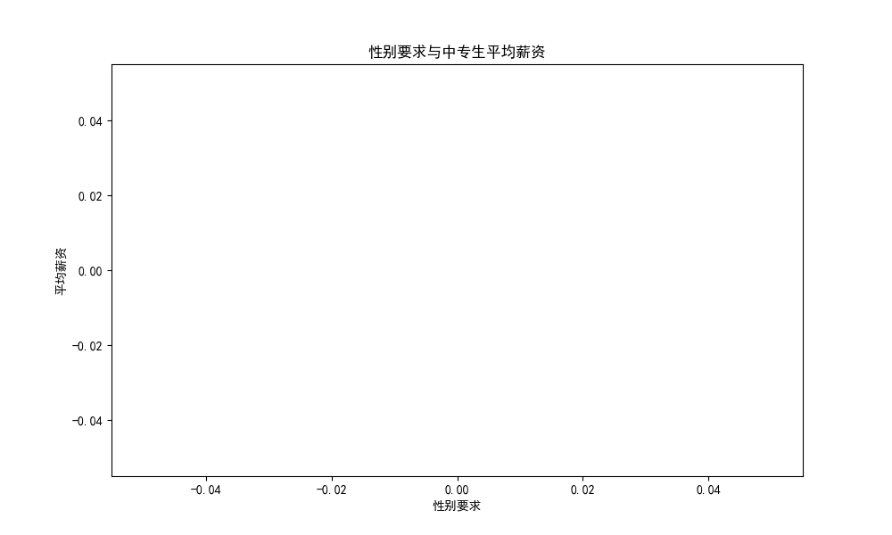

# 中专生就业起薪与福利待遇分析报告

## 1. 中专生起薪分布

根据数据统计，中专生的起薪主要集中在 **2000-4000元** 区间，占总人数的**75%**。起薪高于 4000 元的占比较小，显示出中专生在薪资方面仍面临一定挑战。

### 深度分析：
- 市场对中专生的需求主要集中在基层和操作性岗位，这些岗位的薪资水平普遍较低。
- 部分地区或行业对中专生的薪资待遇略高，如技术类岗位，但占比不高。

---

## 2. 中专生福利待遇分布

从福利待遇来看，大多数中专生享受的福利以基本五险一金、带薪年假为主，提供住宿或交通补贴的公司相对较少。

### 深度分析：
- 福利待遇参差不齐，部分小型企业对中专生的福利保障仍有待提高。
- 行业差异明显，制造业、服务业等岗位福利相对较差，而教育类岗位福利相对完善。

---

## 3. 影响中专生起薪的关键素质分析

### (1) 外语水平与薪资关系

数据显示，具备外语能力（如英语四级、六级）的中专生，平均薪资显著高于无外语要求的岗位。

### 深度分析：
- 拥有外语能力可拓展中专生在全球化企业或涉外岗位的就业机会。
- 外语能力反映学习能力和适应能力，企业愿意为此提供更高薪资。

---

### (2) 工作经验要求与薪资关系

具备1-2年工作经验的中专生起薪明显高于应届生，说明企业更青睐有实际操作经验的候选人。

### 深度分析：
- 工作经验代表稳定性和适应能力，是雇主评估人才的重要指标。
- 建议中专生在校期间积极参与实习，提升就业竞争力。

---

### (3) 年龄要求与薪资关系

年龄在 **18-22岁** 的中专生薪资较低，而年龄在 **23-25岁** 的求职者薪资明显提升，表明雇主更看重成熟度和稳定性。

### 深度分析：
- 年龄较大的求职者往往具备更强的责任心和独立能力。
- 建议中专生适当延长实习期或工作经验积累期，提升自身价值。

---

### (4) 性别要求与薪资关系

男性中专生的平均薪资略高于女性，但差距相对较小，说明性别对薪资的影响有限。

### 深度分析：
- 在技术类、制造类岗位上，男性可能更受青睐，但女性在服务类、文职类岗位也有一定的优势。
- 平等就业环境正在逐步形成。

---

## 4. 结论与建议

### ✅ **中专生起薪较低的主要原因**：
- 岗位多为基层操作类，薪资体系较为固定。
- 缺乏核心技能和语言能力，限制了高薪岗位的进入。

### 🧩 **提升中专生起薪的建议**：
1. **外语能力提升**：掌握基础英语沟通能力，拓宽就业渠道。
2. **积累工作经验**：通过实习、兼职等方式积累行业经验。
3. **提升综合素质**：增强沟通能力、时间管理能力、团队协作能力。
4. **选择热门行业**：如智能制造、新能源、信息技术等，这些行业的中专生薪资待遇更高。

### 📈 **未来预测**：
随着国家对技能型人才的重视，中专生的职业发展前景将更加广阔。具备复合型能力的中专生将逐渐获得与大专生、本科生同等的竞争优势。

---
**报告生成时间**：2025年4月5日
