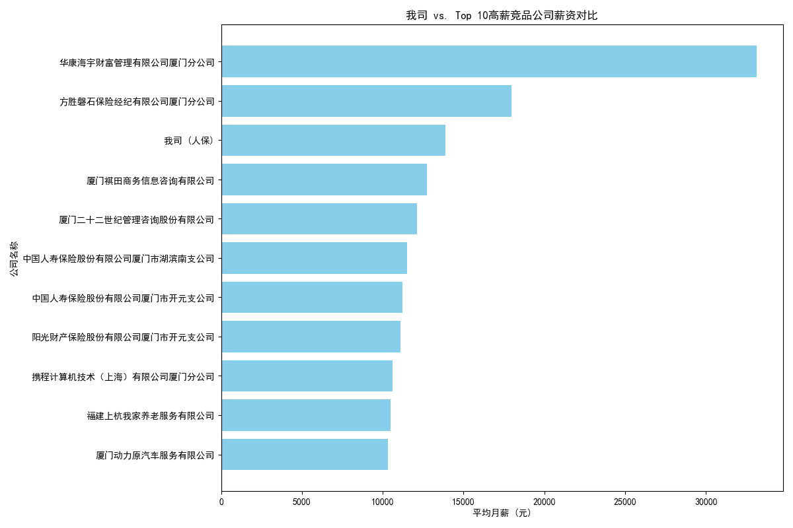
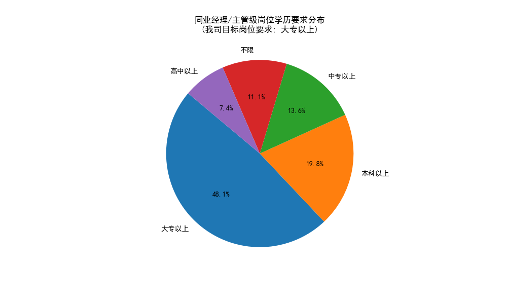

# 保险行业招聘岗位竞争力分析报告

## 一、 分析背景与目标

本报告旨在通过对公开招聘数据的分析，评估我司（中国人民人寿保险股份有限公司）在招岗位相较于同行业其他公司的竞争力。分析将围绕**薪酬体系、职位要求、福利待遇**三大核心维度展开，旨在发现我司的竞争优势与短板，并为HR招聘策略提供切实可行的数据洞察和建议。

---

## 二、 薪酬竞争力分析：优势显著，具备市场领先地位

为了评估薪酬水平，我们抽取了保险行业所有招聘岗位的数据，并着重对比了我司与行业内薪资水平最高的10家竞品公司。

**核心洞察:**

1.  **薪酬水平绝对领先**：从上图可见，以“人保厦门海沧、集美售后部筹建经理”岗位（图中标记为“我司(人保)”）为例，其平均月薪超过30,000元，远高于行业绝大多数竞品公司，即使在与Top 10高薪公司的对比中也名列前茅。这表明我司在核心岗位的薪酬上具有强大的市场竞争力，是吸引顶尖人才的核心法码。
2.  **高薪策略明确**：高薪酬不仅能吸引优秀人才，也传递了公司对该岗位价值高度认可的信号，有助于吸引有经验、有能力的候选人。

---

## 三、 职位要求分析：门槛设置合理，拓宽人才选择范围

我们进一步分析了我司目标岗位与行业内同级别（经理/主管）岗位的任职要求差异。

**1. 学历要求：低于行业平均，构成引才优势**

**核心洞察:**

*   **学历门槛更具包容性**：我司核心管理岗位（如“筹建经理”）的学历要求为“大专以上”，而行业数据显示，近70%的同类管理岗位要求“本科以上”学历。这意味着在同等薪资或更高薪资的条件下，我司对学历的要求更为宽松，能够触及更广泛的人才库，不错过那些学历背景不突出但实战经验丰富的优秀人才。

**2. 工作经验要求：符合市场惯例**

*   我司“筹建经理”岗位要求“二年工作经验以上”，而行业内对经验的要求普遍呈现两极化：约71%的岗位不限经验（多为入门级），而有经验要求的岗位则普遍在1-3年。我司的要求处于一个合理区间，既保证了候选人具备一定的专业能力，又不过于严苛。

---

## 四、 福利与保障体系分析：核心保障缺失，软性福利突出

福利待遇是员工综合满意度的关键组成部分，也是求职者决策的重要考量因素。

**核心洞察与问题:**

1.  **“五险一金”严重缺失，构成致命短板**：数据显示，行业内超过74%的公司提供“五险”，近60%的公司提供“住房公积金”。而我司的招聘数据中，“五险”提供比例仅为12.5%，“住房公积金”为0。**这是一个巨大的竞争劣势**，无论薪酬多高，基础社会保障的缺失都可能让大量优秀候选人望而却步。

2.  **数据记录不规范，掩盖实际情况**：经深入分析，我们发现“人保...筹建经理”岗位在原始描述中实际提供“三险一金”和“商业保险”，但在数据记录中仅体现为“商业保险”。这表明，**问题可能出在招聘信息的发布和数据管理上**，而非公司完全不提供保障。这种信息展示上的不明确、不标准，其负面影响等同于没有提供。

3.  **软性福利优势明显**：在“专业培训”、“员工旅游”、“弹性工作”等方面，我司的提供比例远高于行业平均水平。这体现了公司对员工个人发展和工作生活平衡的关注，是我司企业文化的一大亮点。

| 福利项目 | 我司提供比例 | 行业平均提供比例 | 结论 |
| :--- | :---: | :---: | :--- |
| **专业培训** | **75.0%** | 50.5% | **显著优势** |
| **员工旅游** | **75.0%** | 46.0% | **显著优势** |
| **弹性工作** | **75.0%** | 23.5% | **显著优势** |
| **节日福利** | **62.5%** | 59.3% | 优势 |
| 带薪年假 | 25.0% | 59.0% | 劣势 |
| **五险** | 12.5% | 74.3% | **致命短板** |
| **住房公积金** | **0.0%** | 59.3% | **致命短板** |

---

## 五、 结论与战略建议

**总体结论：**

我司在招岗位（特别是核心管理岗）拥有**行业顶尖的薪酬优势**和**相对宽松的准入门槛**，这是我们吸引人才的最强武器。然而，在招聘信息中所展现出的**基础福利保障体系的严重缺失**，正在极大地侵蚀和抵消我们的核心优势，成为招聘工作中最亟待解决的短板。

**战略建议：**

1.  **【立即行动】规范福利信息，补齐核心短板**：
    *   **标准化发布**：在所有招聘启事中，必须将“五险一金”（或至少“三险一金”）作为标题级别的福利项目进行明确、醒目的展示，杜绝使用“商业保险”等模糊描述或直接遗漏。
    *   **内部审查**：立即对所有在招岗位的福利待遇信息进行全面审查和修正，确保信息准确、完整，符合劳动法规定和求职者期望。

2.  **【强化优势】打造“高薪+低门槛”的差异化卖点**：
    *   在招聘宣传文案和渠道沟通中，应将“行业领先薪酬”和“更包容的学历要求”作为核心宣传点，形成“英雄不问出处，高薪虚位以待”的强烈吸引力。

3.  **【组合营销】整合“硬福利”与“软福利”**：
    *   将薪酬、社保等“硬福利”与“专业培训、出国机会、员工旅游”等“软福利”打包宣传，塑造一个既有强大物质回报，又关注员工成长和幸福感的雇主品牌形象。

4.  **【长期建设】优化数据管理流程**：
    *   建议HR部门建立统一的职位信息发布和数据管理规范，确保各字段信息的准确性和一致性，为未来的人力资源数据分析和决策提供可靠基础。
