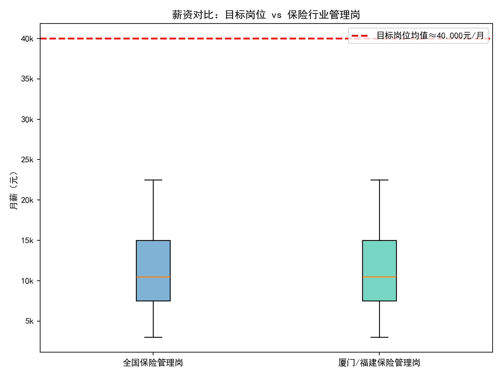
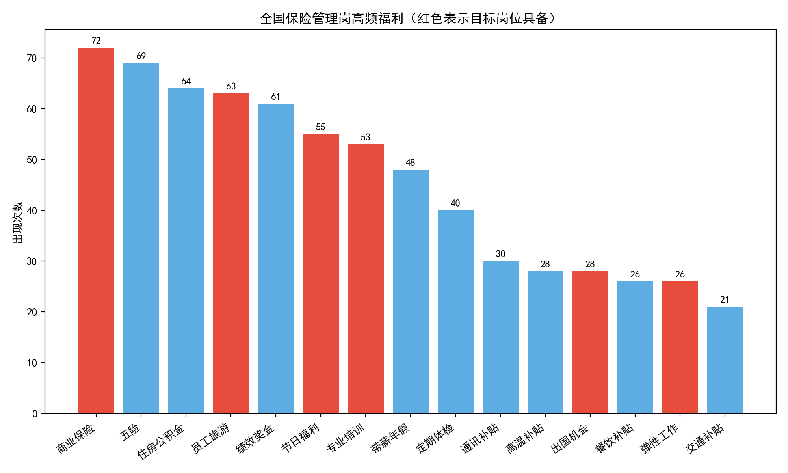
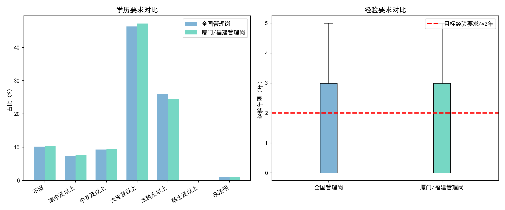

# 保险行业管理岗招聘竞争力评估报告（面向“人保厦门海沧、集美售后部筹建经理”岗位）

## 摘要
基于10万+招聘样本中的保险行业数据（459条），我们对保险行业“管理岗”同类职位进行横向对比，重点评估我司“人保厦门海沧、集美售后部筹建经理”在薪资福利、职位要求等核心维度的竞争力。主要发现：
- 该岗位薪资区间30000—50000元/月（均值约4万元/月），位于保险行业管理岗样本的约96分位（全国及厦门/福建样本均类似）。
- 同类管理岗样本薪资中位数约1.05万元/月，75分位约1.5万元/月，目标岗位薪资显著领先市场中位与高位水平。
- 学历要求“大专及以上”，与同行管理岗主流要求一致；经验要求“2年+”，而同行大量岗位为“不限”，我司要求更严，岗位门槛更高。
- 福利结构中，目标岗位在“福利待遇”字段覆盖高频TOP福利15项中的6项（商业保险、员工旅游、节日福利、专业培训、出国机会、弹性工作），但“福利待遇”字段未显式包含“五险/住房公积金/绩效奖金/带薪年假/定期体检/各类补贴”等市场高频要素（JD文本中提到“三险一金”，但未在福利字段结构化呈现），可能影响候选人在招聘平台上的检索与转化。

## 数据与方法
- 数据来源：SQLite库 dacomp-049.sqlite 表 sheet1（共100,077行），其中保险行业筛选出459行。
- 同行“管理岗”定义：职位名称包含“经理/主管/负责人/主任/总监/筹建/营业部”等关键词，排除“助理”。
- 地域划分：厦门/福建相关样本 vs. 全部保险管理岗样本。
- 薪资解析：仅解析“元/月”区间（如“30000 - 50000元/月”）用于月薪min/max与均值；福利拆分按“、/，/；”等分隔；经验“不限”按0年处理（用于分布对比，不作数据清洗）。
- 样本量：全国保险管理岗样本108条；厦门/福建保险管理岗样本106条（提示：本数据集中区域样本占比较高，“全国”样本受厦门/福建样本主导）。

## 可视化对比

1) 薪资对比：目标岗位 vs 保险行业管理岗



- 结果解读：
  - 同行管理岗薪资中位数约1.05万元/月、75分位约1.5万元/月。
  - 目标岗位均值约4万元/月，对比全国/厦门同行均处96分位附近，显著高于行业分布的高位段。

2) 福利高频要素对比（红色为目标岗位具备）



- 行业管理岗高频福利Top15：
  - 商业保险、五险、住房公积金、员工旅游、绩效奖金、节日福利、专业培训、带薪年假、定期体检、通讯补贴、高温补贴、出国机会、餐饮补贴、弹性工作、交通补贴。
- 目标岗位覆盖其中的6项：商业保险、员工旅游、节日福利、专业培训、出国机会、弹性工作；
- 缺失但市场高频的要素（未在“福利待遇”字段显式呈现）：五险、住房公积金、绩效奖金、带薪年假、定期体检、通讯补贴、高温补贴、餐饮补贴、交通补贴。
- 备注：职位描述文本中提到“三险一金”与“晋升机会”，但未在“福利待遇”字段结构化列出，可能在平台检索与候选人初步比对中被忽略。

3) 学历与经验要求对比



- 学历：同行管理岗以“大专及以上”为主流要求，我司与主流一致。
- 经验：同行管理岗样本中“大量为‘不限’”，导致经验年限分布中位数为0年；我司“2年以上”更为严格，有助于筛选具备同业/管理潜质的人选，但同时缩小候选池。

## 关键量化结论（来自SQL/Python分析）
- 样本规模：全国管理岗108，厦门/福建管理岗106。
- 目标岗位薪资：min=3万元、max=5万元、均值≈4万元，薪资分位：
  - 全国管理岗分位≈96.0%；厦门/福建管理岗分位≈96.5%。
- 同行薪资基准：
  - 全国管理岗中位数≈1.05万元；75分位≈1.5万元。
  - 厦门/福建管理岗中位数≈1.05万元；75分位≈1.5万元。
- 学历：同行Top为“大专及以上”，与目标一致。
- 经验：同行中位数≈0年（大量“不限”）；目标为2年+，门槛更高。
- 福利：目标在Top15高频中覆盖6项；“五险、住房公积金、绩效奖金、带薪年假、定期体检、各类补贴”等未在福利字段中显式呈现。

## 竞争优势与潜在短板
- 优势
  - 薪酬强竞争力：以月均约4万元远超市场中位和75分位，吸引力极强，尤其适用于具备同业/管理经历的候选人；
  - 弹性与晋升：职位描述强调工作时间灵活、“一年4次晋升机会”，匹配管理岗候选人对发展路径的期待；
  - 资源支持：描述中“享受公司全部资源支持”，可增强对有团队搭建/筹建经验人才的吸引力。
- 短板/风险
  - 福利字段不完整：平台“福利待遇”字段未显式包含“五险/住房公积金/绩效奖金/带薪年假/体检/补贴”等高频要素，可能在搜索/筛选时错失候选人；
  - 薪资结构透明度：高底薪+提成（底薪2.4万-3万）应进一步明确保障周期与绩效达成假设，避免候选人将其解读为“高提成型波动收入”；
  - 门槛与供给：要求2年+经验（且文本中提及同业≥3年/主管≥1年），在厦门本地市场可能缩小候选池，需要前置化渠道策略与面向外地/同业的引才动作。

## 诊断性洞察（为什么会出现这种差异）
- 数据显示保险“管理岗”在公开信息中大量标注为“不限经验”，推高了低门槛岗位占比，导致行业中位薪资不高；而“筹建经理”职责包含多区筹建、团队搭建与售后体系管理，责任与产出要求更高，对应给出显著更高的底薪+提成结构，形成薪资显著领先。
- 福利字段的“结构化呈现不足”是信息发布层面的瑕疵，而非实际福利缺失（JD文本有“三险一金”）。这是导致“看起来不如同业齐全”的主要原因之一。

## 预测性判断（会发生什么）
- 在薪资强势与灵活工时、晋升通道的加持下，若完善福利字段的结构化展示，预计投递量与面试转化率将明显提升（尤其是有管理经验/同业背景的候选人）。
- 若不补充“福利待遇”字段中的五险一金、绩效奖金、年假、体检与补贴等显性词条，可能在平台搜索排序与候选人初筛比较中处于劣势，实际转化低于岗位真实吸引力。

## 规范性建议（我们应该做什么）
1) 优化职位发布“福利待遇”字段（高优先级）
   - 明确加入：五险、住房公积金、绩效奖金、带薪年假、定期体检、通讯/餐饮/交通/高温补贴等；保留“商业保险、弹性工作、员工旅游、出国机会、专业培训、节日福利”等优势项。
   - 在平台可选标签中勾选对应福利，提升搜索匹配与曝光转化。
2) 强化薪资结构透明度（高优先级）
   - 在JD显著位置阐明：底薪区间（2.4万-3万）与提成规则、保障周期、兑现条件及典型绩效案例（如P50/P75/P90收入曲线）。
   - 标注“资源支持”的具体内容（客户资源、线索来源、预算与团队配置），降低候选人不确定性。
3) 精准化人群画像与渠道（中优先级）
   - 面向“3年以上同业/1年以上主管”的管理型候选人，在同业社群、猎头与高端招聘平台定向投放；
   - 在厦门以外的重点城市（保险人才供给较多）开放远程初筛与面谈通道，提高引才半径。
4) 人才转化工具（中优先级）
   - 提供“快问快答”FAQ（关于晋升、收入结构、工作日程与支持资源）；
   - 提供“入职3-6月成长路径与目标样例”，降低候选人感知风险。

## 方法与局限
- 未进行数据清洗；薪资仅解析“元/月”口径，可能低估带年薪或非标准表述的样本；
- 管理岗样本在本数据集中对厦门/福建的比重较高，导致“全国”分布受区域数据主导；
- 经验“不限”按0年处理仅用于分布参考。

## 附录：绘图关键代码设置
以下代码用于Matplotlib中文显示与负号显示：
```python
plt.rcParams['font.sans-serif'] = ['SimHei']
plt.rcParams['axes.unicode_minus'] = False
```

以上分析所用图片文件：
- 薪资对比图：salary_comparison.png
- 福利高频图：benefits_top.png
- 学历与经验要求对比图：requirements_comparison.png

如需我进一步细分“筹建/售后/区域管理”等更窄的同类样本、或生成岗位发布“优化后的福利字段模板”，请告知，我可以基于现有分析快速补充。
