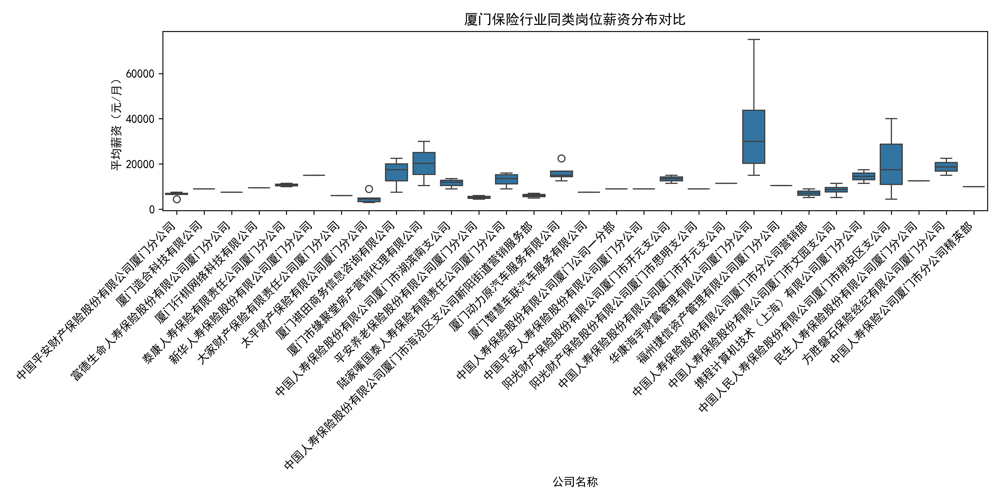
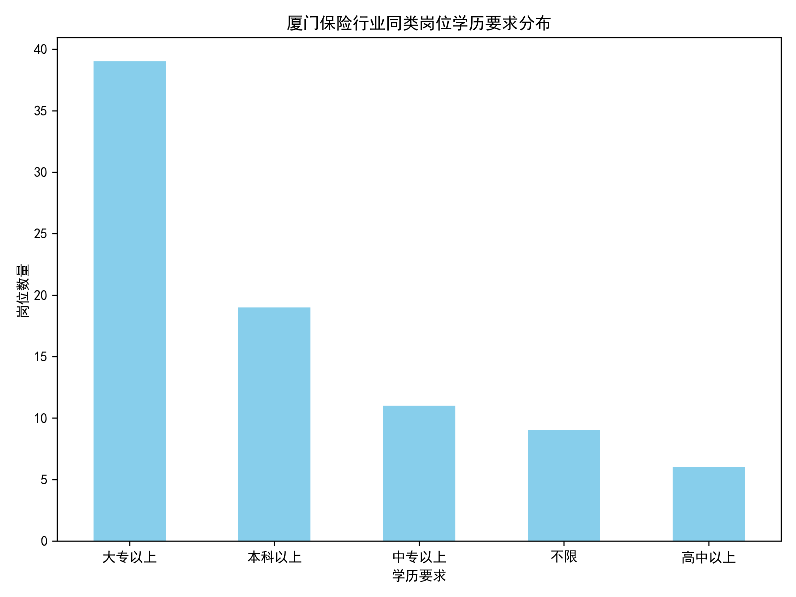

# 人保厦门海沧、集美售后部筹建经理岗位竞争力评估报告

## 一、背景介绍

作为保险行业HR，开展岗位竞争力评估是吸引和保留人才的关键举措。本报告以“人保厦门海沧、集美售后部筹建经理”岗位为核心，横向对比厦门保险行业同类岗位在薪酬福利、职位要求等维度的表现，剖析其竞争优势与劣势，并提出针对性建议。

## 二、目标岗位概况

| 项目 | 内容 |
|------|------|
| 职位名称 | 人保厦门海沧、集美售后部筹建经理 |
| 公司名称 | 中国人民人寿保险股份有限公司厦门市翔安区支公司 |
| 薪资范围 | 30000-50000元/月（底薪：24000-30000元/月+提成） |
| 福利待遇 | 商业保险、出差补贴、节日福利、专业培训、弹性工作、员工旅游、出国机会、不加班、无试用期 |
| 学历要求 | 大专以上 |
| 工作地点 | 厦门市海沧区、翔安区、集美区 |

## 三、市场竞争力分析

### 1. 薪资水平对比

从图中可以看出，厦门保险行业同类岗位的平均薪资分布集中在7500-15000元/月之间，而人保该岗位薪资范围为30000-50000元/月，显著高于市场平均水平，处于行业顶端位置，具备极强的薪酬竞争力。

### 2. 学历要求对比

在学历要求方面，厦门保险行业同类岗位以“大专以上”为主（占比46.4%），其次是“本科以上”（占比22.6%）。人保该岗位学历要求为“大专以上”，与市场主流要求一致，未设置过高门槛，有利于扩大人才筛选范围。

## 四、福利体系分析

人保该岗位提供的福利待遇包括：

- **保险保障**：商业保险
- **补贴类**：出差补贴
- **节日关怀**：节日福利
- **培训发展**：专业培训
- **工作制度**：弹性工作、不加班、无试用期
- **员工关怀**：员工旅游、出国机会

相较于市场常见的“五险”、“住房公积金”等基础福利，人保该岗位在**工作制度**和**员工关怀**方面更具吸引力，尤其是“不加班”、“无试用期”、“出国机会”等亮点，能够有效提升岗位吸引力。

## 五、综合竞争力评估

| 维度 | 市场表现 | 人保该岗位 | 竞争力评价 |
|------|----------|------------|------------|
| 薪资水平 | 7500-15000元/月 | 30000-50000元/月 | ⭐⭐⭐⭐⭐ 显著领先 |
| 学历要求 | 大专以上为主 | 大专以上 | ⭐⭐⭐⭐ 符合主流 |
| 福利待遇 | 基础福利为主 | 弹性工作、不加班、出国机会 | ⭐⭐⭐⭐⭐ 亮点突出 |

## 六、潜在劣势与风险

1. **薪资过高可能带来的内部公平性问题**：该岗位薪资远高于市场平均水平，可能引发公司内部其他岗位员工的不满，需做好内部沟通与薪酬体系平衡。
2. **高薪资高期望**：高薪资伴随高绩效期望，若目标设定不合理或资源支持不到位，可能导致员工流失。
3. **区域限制**：工作地点集中在海沧、翔安、集美，可能限制部分人才的求职意愿。

## 七、策略建议

1. **强化内部沟通**：明确该岗位高薪资的战略意义，如“筹建经理”肩负团队搭建与市场开拓重任，需具备较强能力与资源，避免内部不公平感。
2. **完善绩效考核机制**：设定科学合理的绩效指标，确保高薪资与高绩效相匹配，避免“高薪低效”。
3. **加大宣传力度**：在招聘渠道突出“不加班”、“无试用期”、“出国机会”等亮点，吸引更多优质人才。
4. **灵活工作地点**：考虑适度放宽工作地点限制，如允许部分远程办公，扩大人才池。
5. **建立人才储备库**：针对该岗位建立人才储备机制，提前锁定优质候选人，降低招聘风险。

## 八、结论

人保厦门海沧、集美售后部筹建经理岗位在**薪资水平**和**福利待遇**方面具备显著竞争优势，远超市场平均水平，能够有效吸引高素质人才。同时，学历要求设置合理，有利于扩大人才筛选范围。建议公司在保持薪酬竞争力的同时，加强内部沟通与绩效管理，最大化发挥该岗位的人才吸引与保留作用。
