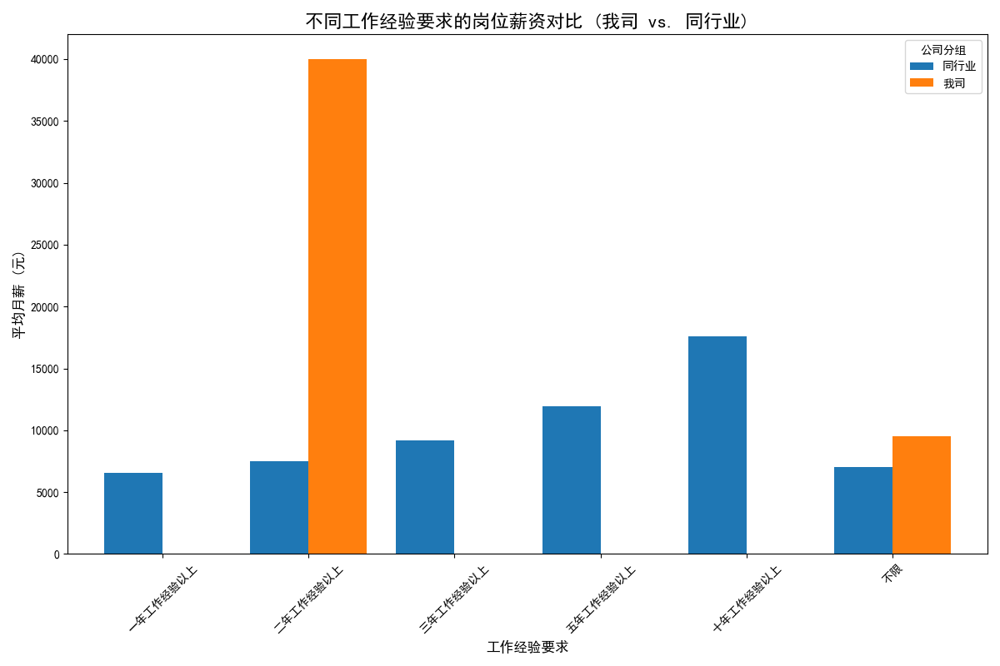
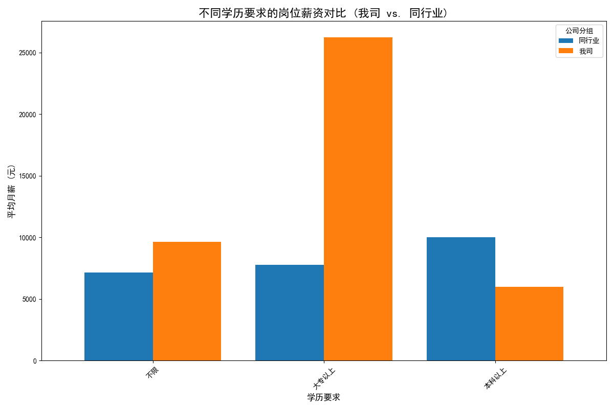
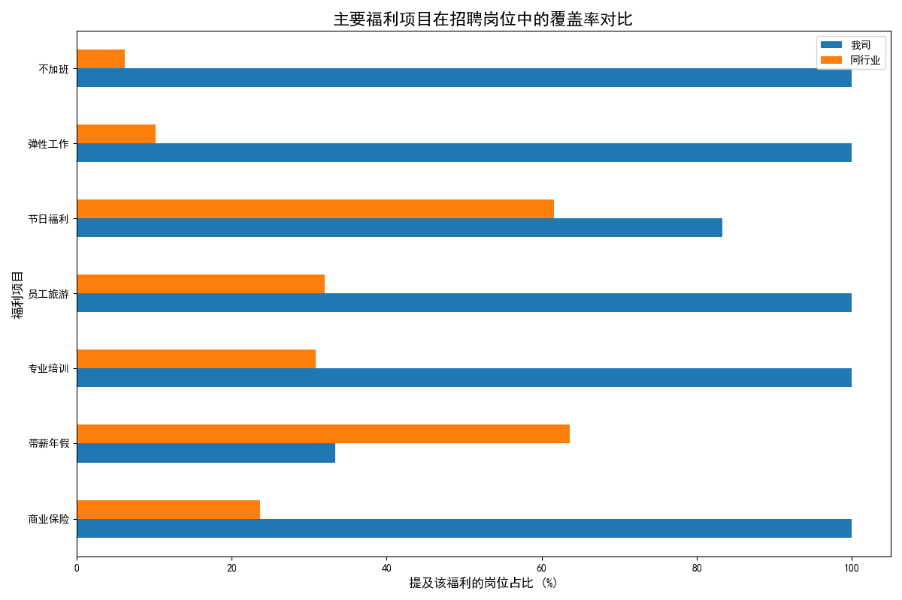

# 保险行业招聘岗位竞争力分析报告

## 一、引言

本报告旨在通过对公司在招岗位与同行业其他公司的横向对比，深入评估我司在人才招聘市场的竞争力。分析将围绕**薪酬体系、福利待遇、职位要求**三大核心维度展开，旨在发现我司的竞争优势与潜在短板，并为优化招聘策略提供数据驱动的建议。

---

## 二、核心洞察

### 1. 薪酬竞争力分析：高薪优势显著，但存在结构性差异

我司在关键岗位的薪酬设置上展现出强大的市场竞争力，尤其是在核心管理人才的吸引上。

- **经验要求维度**：对于“二年工作经验以上”的岗位，我司开出的平均月薪高达 **40,000元**，远超同行业约 **7,494元** 的平均水平。这表明我司愿意为有经验的核心人才提供极具吸引力的报酬，这主要是我司“筹建经理”岗位的高薪策略带来的结果。

- **学历要求维度**：在“大专以上”学历要求的岗位上，我司平均薪资为 **26,250元**，同样显著高于行业平均的 **7,749元**。然而，值得注意的是，在“本科以上”学历要求的岗位上，我司薪资（6,000元）反而低于行业平均（约10,017元），这可能与该层级岗位的定位（如偏向基础岗）有关，但也可能对高学历人才的吸引力造成负面影响。

### 2. 福利体系分析：软性福利突出，基础保障宣传待加强

我司在福利待遇上，尤其是在工作与生活平衡相关的“软福利”方面，优势非常明显。

- **压倒性优势福利**：在**“商业保险”、“专业培训”、“员工旅游”、“弹性工作”和“不加班”**等方面，我司的岗位提及率高达 **100%**，而同行业的平均提及率均低于35%。这构成了我司独特的雇主品牌魅力，对追求人性化管理和工作生活平衡的求职者具有极强的吸引力。

- **潜在短板**：分析发现，在**“带薪年假”**这一求职者普遍关心的福利上，我司岗位的提及率（33.3%）显著低于行业平均（63.6%）。此外，在招聘文案中，对于“五险一金”、“周末双休”等基础性保障福利的明确提及较少，这可能会让部分求职者产生疑虑。

### 3. 职位要求与人才定位

- **我司**：招聘目标非常聚焦，主要集中于“大专以上”、“有2年以上经验”的人才，旨在快速吸引能够独当一面、拓展市场的**成熟管理型或销售精英型人才**。
- **同行业**：人才需求则更为多样化，覆盖从入门级到资深专家的各个层级，展现了行业完整的人才梯队建设需求。

---

## 三、战略建议

基于以上分析，为进一步提升我司在招聘市场的竞争力，特提出以下建议：

1.  **强化优势宣传，精准吸引目标人才**：
    - **突出高薪标签**：在招聘渠道中，应将“二年经验、月薪四万”等极具冲击力的薪酬信息作为核心卖点，用于“筹建经理”等关键岗位的宣传，以“薪酬标杆”的形象精准吸引行业内的顶尖人才。
    - **打造“WLB”雇主品牌**：大力宣传“弹性工作”、“不加班”、“员工旅游”等软福利，将“工作生活平衡”塑造为我司的独特雇主品牌标识，吸引更广泛的优质求职者群体。

2.  **补齐福利短板，打消求职者疑虑**：
    - **明确基础保障**：建议在所有招聘文案的福利待遇部分，将“五险一金”、“周末双休”作为标准项明确列出，避免因信息缺失导致求职者误解和流失。
    - **审视年假政策**：评估我司现行的带薪年假政策是否具备市场竞争力。如果政策本身不弱于人，应在招聘信息中予以明确；如果存在差距，则建议对标行业主流水平进行适当优化。

3.  **优化岗位描述，避免人才误判**：
    - 针对“本科以上”学历岗位薪资低于市场平均的现象，建议仔细审查该岗位的职责、晋升通道和薪酬结构。在职位描述中更清晰地阐述其长期发展价值和职业路径，避免让高学历求职者仅因起薪而错失机会。

通过实施上述策略，我司有望在最大化发挥现有优势的同时，弥补潜在不足，从而在激烈的人才市场竞争中脱颖而出，高效地吸引并留住符合公司发展需求的优秀人才。
