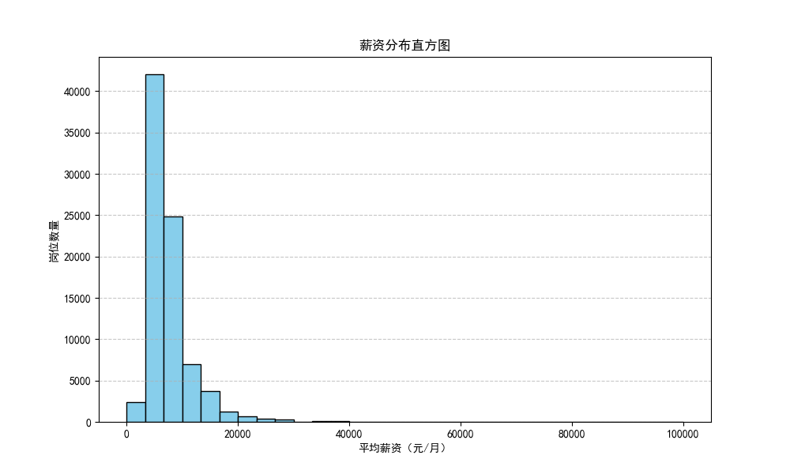
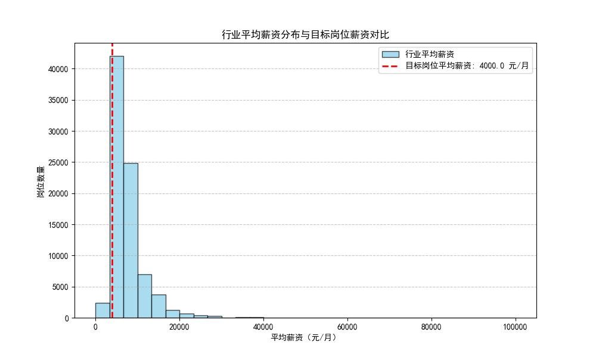
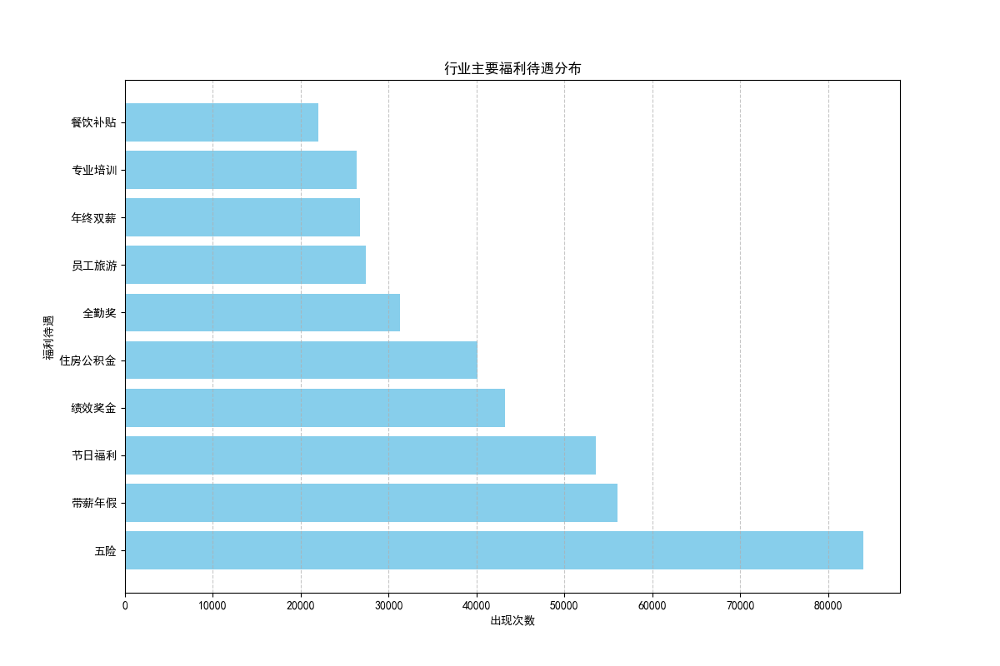
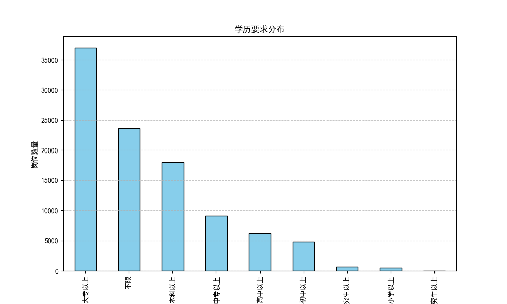
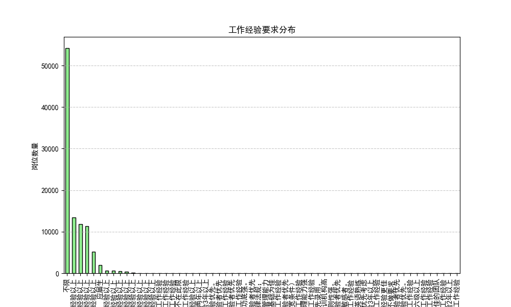

# 保险行业招聘岗位竞争力分析报告

## 一、概述
本报告旨在对中国人民人寿保险股份有限公司厦门市翔安区支公司招聘岗位进行行业内竞争力评估。我们将围绕薪酬福利体系、职位要求等核心维度，剖析该公司招聘岗位相较于行业内其他岗位的竞争优势与劣势。

## 二、薪资范围分析
根据分析数据显示，招聘岗位的薪资范围与行业整体情况相比具有以下特点：

从图中可以看出，行业中大多数岗位的平均薪资分布在3000-10000元之间，而目标公司（例如“人保厦门海沧、集美售后部筹建经理”）的薪资范围（24000 - 30000元/月+提成）明显高于行业平均水平，具有较强吸引力。

上图展示了目标岗位薪资与行业平均薪资的对比。可以看到，目标岗位的平均薪资（27000元/月）远高于行业中大多数岗位，具有显著的薪资竞争力。

## 三、福利待遇分析
从整体行业数据来看，常见的福利待遇包括五险一金、带薪年假、年终双薪、节日福利等。目标公司的岗位（例如“人保厦门海沧、集美售后部筹建经理”）提供较为丰富的福利，包括商业保险、专业培训、员工旅游、出国机会等。这显示其在福利方面具备一定的竞争力。

如上图所示，行业中最常见的福利待遇包括“五险”、“带薪年假”、“年终双薪”等。相比之下，目标公司提供的福利更具多样性，如“商业保险”、“专业培训”、“员工旅游”、“出国机会”等，这在一定程度上增强了其对候选人的吸引力。

## 四、职位要求分析
从学历要求来看，多数岗位要求为大专以上，而目标公司也保持相似标准，如“人保厦门海沧、集美售后部筹建经理”要求大专及以上学历，较为符合行业标准。

如上图所示，行业中大多数岗位的学历要求为“大专以上”或“不限”，目标公司也保持相似标准，确保了候选人的基本素质。

工作经验方面，目标公司要求二年工作经验以上，这也与行业整体要求（如部分岗位不限经验）形成一定差异。这可能会缩小招聘范围，但也确保候选人的经验水平较高。

如上图所示，行业中多数岗位对工作经验的要求较为宽松，而目标公司则设定了更高的门槛，这有助于选拔经验丰富的候选人，但也可能限制人才池的规模。

## 五、结论与建议
### 优势
1. **薪资竞争力较强**：目标公司薪资范围高于行业中部分岗位，有助于吸引高质量人才。
2. **福利体系较为完善**：提供丰富的福利待遇，如商业保险、专业培训和弹性工作，有利于提升员工满意度。
3. **标准化的职位要求**：学历和经验要求与行业标准接轨，确保候选人的能力匹配。

### 劣势
1. **招聘范围受限**：较高的年龄（25岁至50岁）和经验要求可能限制了候选人池的规模。
2. **部分岗位薪资吸引力较弱**：相较于部分行业岗位的高提成和高薪资，部分岗位薪资仍有提升空间。

### 建议
1. **调整招聘策略**：适当放宽部分岗位的年龄和经验要求，以吸引更多潜在候选人。
2. **加强品牌宣传**：通过强调公司资源支持、晋升机会等优势，吸引优秀人才。
3. **优化薪资结构**：针对高竞争性岗位，增加提成比例或引入绩效激励，以更具吸引力。
