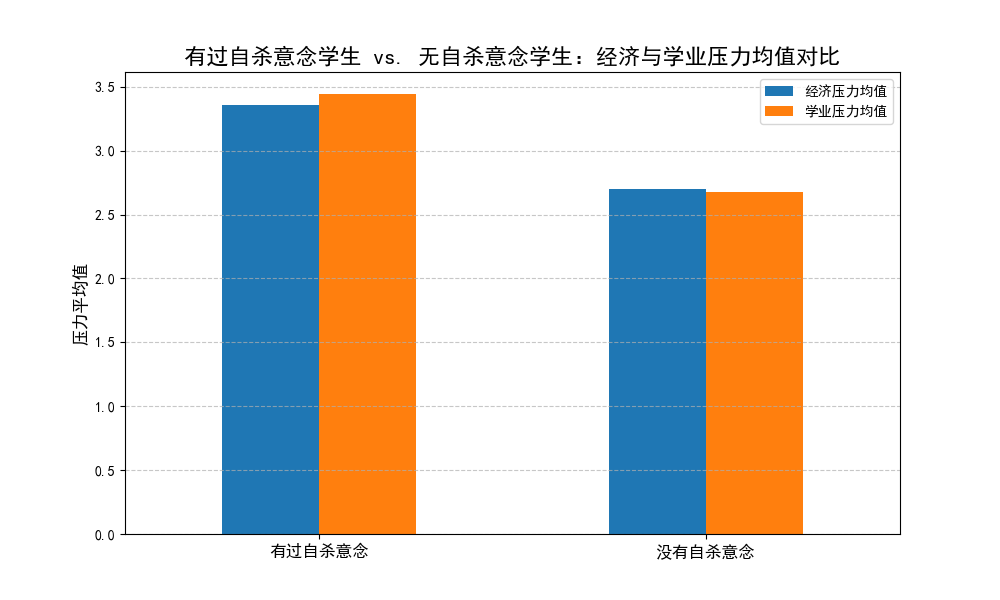
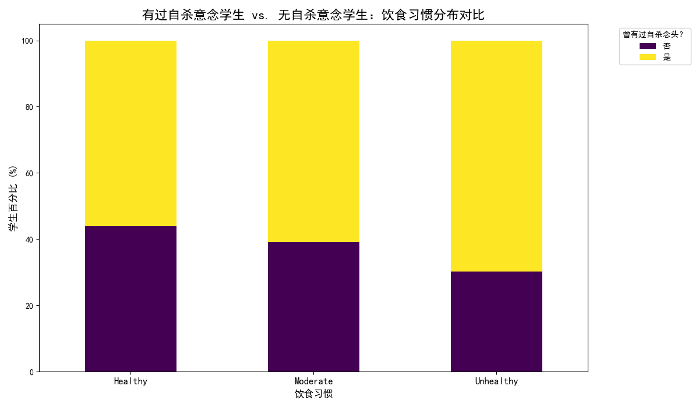
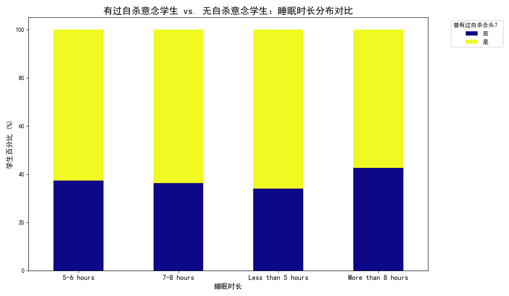

# 学生自杀意念群体特征分析及预防策略报告

本报告旨在深入分析在校学生中曾有过自杀意念群体的核心特征，我们主要从**经济压力**、**学业压力**以及**生活方式（饮食与睡眠）** 三个维度进行探究。通过对数据的挖掘与可视化分析，我们揭示了该群体的显著特征，并据此提出可行的预防复发策略。

## 核心发现

数据显示，曾有过自杀意念的学生群体与没有该念头的学生相比，在心理压力和生活习惯上表现出显著的差异。

### 1. 经济与学业压力是重要的风险因素

与普通学生相比，有过自杀意念的学生承受着更高水平的经济和学业压力。

从上图可见，有过自杀意念的学生在经济压力和学业压力上的平均分（分别为3.36和3.44）显著高于没有自杀意念的学生（分别为2.70和2.68）。这表明，持续的经济拮据和学业挫败感是导致或加剧学生心理危机的重要外部压力源。经济上的困窘可能导致学生无法专注于学业，而学业上的落后又会反过来增加其焦虑和无助感，形成恶性循环。

### 2. 不良生活习惯与自杀意念高度相关

不良的饮食和睡眠习惯在有过自杀意念的学生中更为普遍，这揭示了身心健康的紧密联系。

#### 饮食习惯分析

饮食越不健康，学生曾有过自杀意念的比例越高。在“不健康”（Unhealthy）饮食习惯的学生中，近70%的人曾有过自杀念头，远高于饮食“健康”（Healthy）的学生群体（56.1%）。

这表明，不规律或营养不良的饮食可能不仅影响身体健康，也是心理状态不佳的一种表现或催化剂。处于心理困扰中的学生可能无心关注健康饮食，而糟糕的饮食习惯又可能加剧其情绪波动和负面思维。

#### 睡眠质量分析

睡眠不足是另一个显著的危险信号。在睡眠时间“少于5小时”的学生中，有过自杀意念的比例高达66%，为所有组别中最高。

虽然在所有睡眠时长的组别中，有过自杀意念的比例都较高，但睡眠严重不足的群体显然面临更大的风险。长期的睡眠剥夺会严重损害认知功能和情绪调节能力，使个体更容易陷入抑郁和绝望的情绪中。

## 预防复发策略建议

基于以上分析，为了有效预防学生自杀意念的复发，我们必须采取多维度、系统性的干预措施，从缓解压力和改善生活方式两方面入手。

### 1. 建立精准的经济与学业支持体系

*   **主动式经济援助**：高校应建立更主动的经济困难学生识别机制，而非完全依赖学生申请。通过分析学生的消费数据、助学贷款申请情况等，主动识别并接触潜在的困难学生，提供经济补助、勤工助学岗位或心理疏导。
*   **分层学业辅导**：针对学业压力大的学生，建立“学业预警-专业辅导-同伴互助”三级支持体系。对绩点下降或挂科的学生进行预警，由专业老师提供针对性辅导，并鼓励建立学习小组，发挥同伴支持的力量。

### 2. 推广身心健康的生活方式干预项目

*   **睡眠改善计划**：与校医院或心理健康中心合作，开设“睡眠工作坊”，向学生普及睡眠知识，教授放松技巧（如正念冥想），并为有严重睡眠障碍的学生提供专业的认知行为疗法（CBT-I）。
*   **营养与情绪课程**：开设关于“营养与心理健康”的公共选修课或讲座，教育学生了解健康饮食对情绪调节的重要性。与食堂合作，推出“减压餐”或“好心情套餐”，通过便捷的方式引导学生改善饮食。

### 3. 构建一体化的心理健康监测与干预网络

*   **多渠道风险识别**：整合辅导员、任课教师、宿管、食堂工作人员等多方力量，对学生的异常行为（如长期缺课、社交孤立、食欲不振、精神萎靡）进行敏感度训练和识别。
*   **低门槛求助渠道**：除了传统的心理咨询中心，还应推广线上咨询、树洞热线、朋辈咨询等更易于接触的求助方式。重点在于创造一个让学生感到安全、无歧视且能随时获得支持的环境。

## 结论

曾有过自杀意念的学生群体普遍面临着更高的经济与学业压力，并伴随着不健康的饮食和睡眠习惯。这些因素相互交织，共同构成了心理危机的温床。因此，预防策略必须超越单一的心理疏导，转向一个**“压力缓解 + 健康生活 + 心理支持”** 的综合干预模式，通过改善学生的外部环境和内在状态，从根本上增强其心理韧性，有效预防危机的复发。
