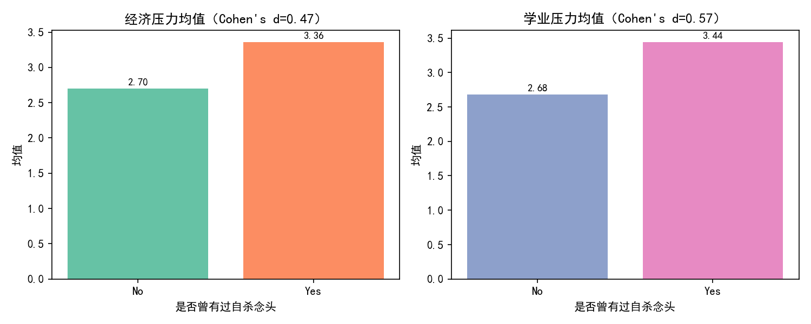
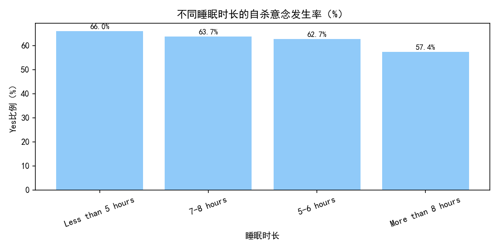
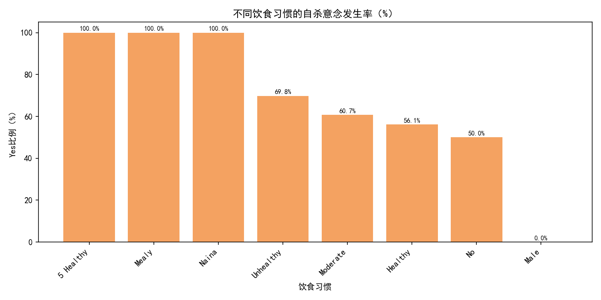

# 学生群体中曾有过自杀意念者的多维特征分析与预防复发策略

以下分析基于 SQLite 数据库 dacomp-050.sqlite 的“工作表1”。我们聚焦学生子集，在经济压力、学业压力、睡眠、饮食四个维度比较“曾有过自杀念头（Yes）”与“未有过自杀念头（No）”的特征差异，并据此提出预防复发的可行策略。

注：未进行数据清洗，直接对现有数据进行统计与建模分析。

## 1. 样本与总体概览
- 学生样本量：18,762（其中 Yes=11,778，No=6,984），学生群体中“曾有过自杀念头”的比例约为 62.8%。
- 压力量表范围：经济压力、学业压力均为 1–5 量表（SQL统计最小=1，最大=5）。

## 2. 压力维度：经济与学业压力差异
- 分组均值（学生子集）：
  - 经济压力：Yes=3.36，No=2.70（差异≈+0.66）
  - 学业压力：Yes=3.44，No=2.68（差异≈+0.76）
- 仅用经济压力与学业压力两项构建逻辑回归，对“是否曾有过自杀念头”进行预测：
  - AUC=0.700，准确率=0.677（具有一定区分度）
  - 标准化系数OR（每提升1个标准差的胜算比）：经济压力 OR=1.48；学业压力 OR=1.70
    - 解读：将学业压力降低1个标准差，模型预测的自杀意念胜算约下降至原来的 1/1.70 ≈ 0.59（约降低41%）；将经济压力降低1个标准差，胜算约下降至 1/1.48 ≈ 0.68（约降低32%）。尽管模型仅包含两个特征，但定量提示了两类压力对风险的方向与相对强度。
- 经济与学业压力的相关性较低到中等（皮尔逊相关）：
  - 总体相关≈0.151；Yes组≈0.095；No组≈0.103
  - 解读：两类压力并非强相关，说明它们可能从不同路径影响自杀意念，干预应该同时覆盖学业与经济两条路径。

配图：经济与学业压力的分组均值对比


要点：学业压力的效应（OR=1.70）相对更强，经济压力次之；两者叠加可能进一步推高风险。

## 3. 睡眠维度：不同睡眠时长下的自杀意念发生率
学生群体中不同睡眠时长的 Yes 比例（%）：
- 少于5小时：3689/5587 ≈ 66.1%
- 5–6小时：2620/4181 ≈ 62.7%
- 7–8小时：3105/4873 ≈ 63.7%
- 超过8小时：2364/4121 ≈ 57.4%

配图：不同睡眠时长的自杀意念发生率


解读：
- 睡眠严重不足（<5小时）关联的发生率最高（66.1%）。
- >8小时的组最低（57.4%），提示充足睡眠或更佳睡眠质量可能与较低风险相关。
- 5–6小时略低于7–8小时的现象可能受混杂因素影响（如个体差异、作息与压力的交互），但总体趋势仍显著：过短睡眠与更高风险有关。

## 4. 饮食维度：不同饮食习惯下的自杀意念发生率
主要类别的 Yes 比例（%）：
- Unhealthy：4818/6905 ≈ 69.8%
- Moderate：3996/6579 ≈ 60.7%
- Healthy：2958/5269 ≈ 56.1%
（其余极小样本类别也在图中呈现，数量极少，解释时以主类别为主。）

配图：不同饮食习惯的自杀意念发生率


解读：
- 不健康饮食的组风险最高，其次为中等饮食，健康饮食最低，呈现明确的梯度关系。
- 饮食行为可能通过能量水平、炎症、情绪稳定性等途径影响心理状态。

## 5. 诊断性解释（为什么会这样）
- 压力通道：学业压力与经济压力分别从“即时绩效/评估焦虑”和“长期安全感/资源匮乏焦虑”两条通道影响学生心理负荷。二者低相关意味着对风险的贡献是互补的。
- 生理与行为通道：睡眠不足会放大情绪反应、降低执行功能与情绪调节能力；不健康饮食可能影响神经递质合成与炎症水平，加剧情绪不稳。
- 交互作用：高压力+差睡眠/饮食的叠加，会在情绪易感性与压力应对能力上形成“负向循环”，提高复发风险。

## 6. 预测性洞察（将会发生什么）
- 仅凭经济与学业压力，模型AUC=0.700，已有中等区分度。结合睡眠与饮食等行为信号（分类变量）可望进一步提高识别准确率，尤其在早期预警场景（如学生事务中心、心理健康服务平台）中有潜在应用价值。

## 7. 规范性建议（我们应该做什么）
围绕“减压+改善生活方式+早筛预警”三层策略，同时兼顾可落地性与资源优先级。

1) 学业与经济减压干预（优先级高）
- 学业层面：
  - 面向高风险课程/学期（大作业、期末周）提供“工作量可视化+时间管理微课+辅导班/学习小组”；对GPA处于底部分位的学生提供早期学业辅导。
  - 与学院协同优化作业/考试密度，错峰安排评估，增设 formative assessment 减少“一考定输赢”的压力峰值。
- 经济层面：
  - 建立“经济压力筛查+绿色通道”，对经济压力≥4分的学生优先匹配助学金、勤工助学、财务咨询。
  - 设立匿名快速申请与周转金机制，缩短资源到达周期，缓解短期应急压力。

2) 睡眠与作息干预（中高优先级）
- 睡眠卫生计划：固定就寝/起床窗口、减少临睡前屏幕暴露、睡前放松训练（呼吸/冥想），借助打卡与小奖励维持参与度。
- 学校层面：尽量避免早八高强度课程在连续多日出现；在考试周延长图书馆开放但倡导“限时清场”避免熬夜文化。
- 风险分层规则（便于落地）：睡眠<5小时群体设为“红色预警”，优先推送一对一咨询与睡眠辅导；5–6小时“黄色预警”纳入群体宣教与微干预。

3) 饮食与身心健康促进（中优先级）
- 校园餐饮：保证性价比高的健康餐线（全谷物、优质蛋白、蔬果充足），在高峰考试周推出“护考餐”，降低获取门槛。
- 微干预：开展“健康餐挑战”“午后水果补给”等活动，提高可见性和可得性；心理咨询处与营养师协作，对不健康饮食群体提供简短动机性访谈与一页纸饮食指南。

4) 早期预警与转介流程（重点）
- 风险评分建议（简化可执行）：
  - 学业压力≥4 或 经济压力≥4 记1分；睡眠<5小时记1分；饮食=Unhealthy记1分。
  - 总分≥2者标记为“高风险”，优先纳入定期随访（如每2周一次在线问卷+热线），并提供快速转介至校内心理咨询或医疗机构。
- 人群分层运营：将“高风险+复发史”作为最优先队列，配置更密集的随访与多学科团队（心理咨询+辅导员+经济资助）。

5) 干预效果的量化目标
- 以学业压力为例：若通过课程与辅导将群体分布整体降低约0.5个标准差，则按OR=1.70估算，群体层面的复发胜算有望下降约1 - (1/1.70)^(0.5) ≈ 23%（仅为模型层面的近似，实际需前瞻评估）。
- 睡眠目标：将“<5小时”比例从当前水平下降30%，重点群体转移至“≥7小时”，结合饮食改善，预计Yes率有望进一步降低。

## 8. 实施路径与数据闭环
- 建立数据看板：学院/专业/年级维度监控学业与经济压力分布、睡眠与饮食特征，以及干预覆盖率与随访完成率。
- 小规模试点→A/B测试→滚动扩圈：优先在“学业压力高+睡眠<5小时”的二元高风险群体试点，跟踪3个月复发率变化。
- 数据合规与伦理：确保匿名化、最小必要原则、明示同意与危急事件快速处置流程。

## 9. 局限性
- 横断面数据，无法严格因果推断；自陈量表可能存在报告偏差。
- 未对异常类别做清洗（如饮食类别中少量异常文本），解释时以主类别为主。
- 模型仅使用两项压力指标，未纳入睡眠/饮食/家族史等更多特征，真实效应可能被低估或混杂。

## 10. 方法说明与可复现性
- 所有统计基于 SQLite 表“工作表1”的学生子集（在职人士或学生='Student'）。
- 绘图使用了Python并保存图片于当前目录。绘图时包含以下字体设置代码，确保中文正常显示：
```python
import matplotlib.pyplot as plt
plt.rcParams['font.sans-serif'] = ['SimHei']
plt.rcParams['axes.unicode_minus'] = False
```
- 本报告中引用的图片文件：
  - econ_academic_means.png
  - sleep_ideation_rate.png
  - diet_ideation_rate.png

——

结论（一句话总结）：在学生群体中，曾有过自杀意念者普遍承受更高的学业与经济压力，且与短睡眠和不健康饮食显著相关；应通过“压力减负+睡眠与饮食微干预+风险早筛与快速转介”的组合拳，优先覆盖高风险与复发史人群，以降低复发概率并提升整体心理健康水平。
