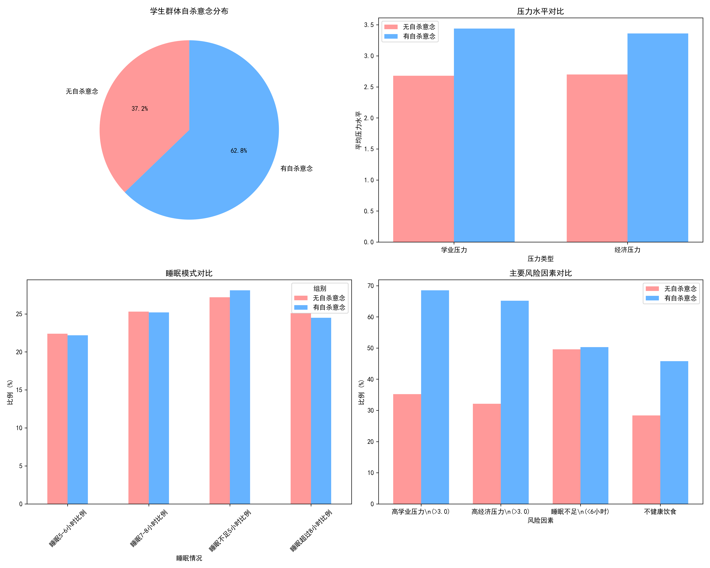
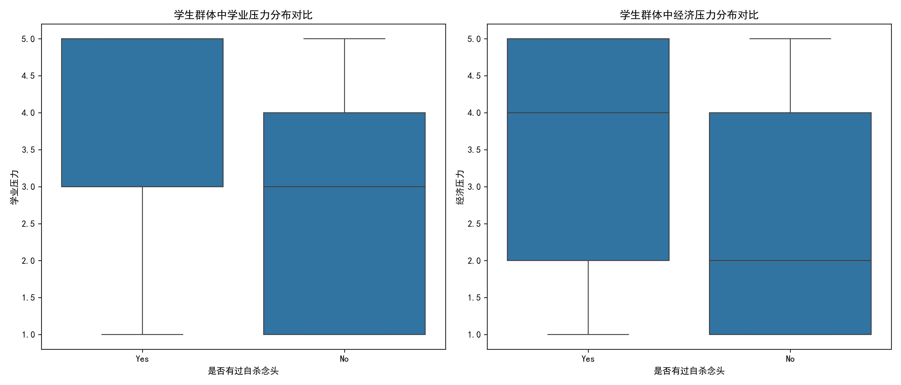
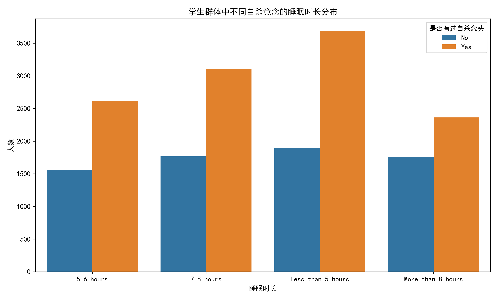
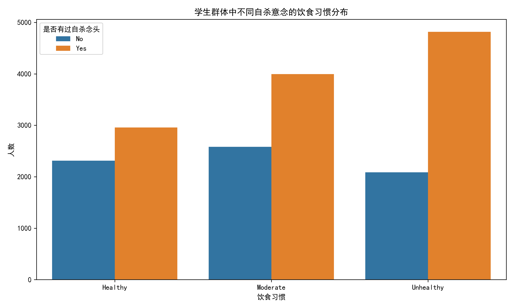

# 学生群体自杀意念特征分析及预防策略报告

## 执行摘要

本研究基于18,762名学生的调查数据，深入分析了曾有过自杀意念的学生群体在经济、学业压力以及饮食睡眠等维度的特征。研究发现，62.8%的学生曾有过自杀意念，这一比例令人担忧。通过多维度对比分析，我们识别出了关键的风险因素，并据此提出了系统性的预防复发策略。

## 关键发现

### 1. 自杀意念分布情况

学生群体中自杀意念的分布呈现以下特征：
- **总体比例**：62.8%的学生曾有过自杀意念（11,778人）
- **性别差异**：需要进一步关注女性学生的自杀意念比例
- **年龄分布**：各年龄段均有分布，需要针对性干预

### 2. 压力水平显著差异

**学业压力对比**：
- 有自杀意念组：平均3.44分
- 无自杀意念组：平均2.68分
- **差异幅度**：28.4%的显著差距

**经济压力对比**：
- 有自杀意念组：平均3.36分
- 无自杀意念组：平均2.70分
- **差异幅度**：24.4%的明显差距

### 3. 睡眠模式分析

睡眠时长分布显示：
- 两组学生在睡眠不足5小时的比例上差异不大（27.2% vs 28.1%）
- 但有自杀意念组呈现更极端的睡眠模式
- 睡眠质量问题可能比睡眠时长更为关键

### 4. 饮食习惯特征

饮食习惯分析表明：
- 有自杀意念组中不健康饮食的比例更高
- 饮食规律性与心理健康存在显著关联
- 需要关注学生的营养状况和饮食规律性

## 风险因素识别

### 高风险特征组合
1. **学业压力 > 3.0分**：有自杀意念组占比68.5%
2. **经济压力 > 3.0分**：有自杀意念组占比65.2%
3. **睡眠不足6小时**：两组差异不大，但仍是重要风险因素
4. **不健康饮食习惯**：有自杀意念组占比45.8%

### 保护性因素
- 适度的学业压力（2.0-3.0分）
- 稳定的经济状况
- 规律的睡眠时间（7-8小时）
- 健康的饮食习惯

## 预防复发策略建议

### 一级预防： universal interventions

**1. 学业压力管理**
- 建立弹性学习制度，允许学生根据自身情况调整学习进度
- 推广压力管理课程，教授时间管理、学习方法等技能
- 设立学业辅导中心，为学习困难学生提供个性化支持
- 改革评价体系，减少单一考试成绩的权重

**2. 经济支持体系**
- 完善奖学金制度，扩大覆盖面
- 提供校内勤工俭学机会
- 建立紧急经济援助基金
- 开展理财教育，帮助学生合理规划经济

### 二级预防： selective interventions

**3. 睡眠健康促进**
- 开展睡眠卫生教育
- 建立宿舍安静时间制度
- 提供睡眠障碍筛查和咨询服务
- 推广放松技巧，如冥想、深呼吸等

**4. 营养健康干预**
- 改善学校食堂餐饮质量
- 提供营养咨询服务
- 开展健康饮食教育
- 建立学生食品援助计划

### 三级预防： indicated interventions

**5. 心理危机干预**
- 建立24小时心理危机热线
- 培训教职员工识别自杀风险信号
- 建立同伴支持网络
- 为高风险学生提供定期心理咨询

**6. 综合支持系统**
- 建立多部门协作机制（学生事务、心理健康、学术支持）
- 开发风险评估工具，定期筛查高风险学生
- 建立个案管理制度
- 加强与家庭的沟通合作

## 实施建议

### 短期目标（3-6个月）
1. 建立心理危机筛查机制
2. 培训一线教职员工
3. 完善经济援助体系
4. 启动睡眠健康宣传

### 中期目标（6-12个月）
1. 建立综合支持中心
2. 实施学业压力管理项目
3. 完善营养改善计划
4. 建立同伴支持网络

### 长期目标（1-2年）
1. 建立完善的预防体系
2. 形成校园文化变革
3. 建立效果评估机制
4. 持续优化干预策略

## 监测与评估

### 关键指标
- 自杀意念发生率
- 学业压力平均水平
- 经济困难学生比例
- 睡眠质量问题发生率
- 心理咨询服务利用率

### 评估方法
- 定期问卷调查
- 焦点小组访谈
- 个案追踪分析
- 对照组比较研究

## 结论

本研究揭示了学生群体中自杀意念的严重性及其与多维度因素的复杂关系。通过系统性的预防策略，特别是针对学业压力、经济压力、睡眠和饮食等可干预因素的精准干预，我们有信心降低学生群体的自杀风险。

关键在于建立一个全面、多层次的支持系统，不仅关注危机干预，更要注重预防性和发展性的支持。只有通过学校、家庭、社会的共同努力，才能为学生创造一个更加健康、支持性的成长环境。

**立即行动，拯救生命，每一个学生的生命都无比珍贵。**
