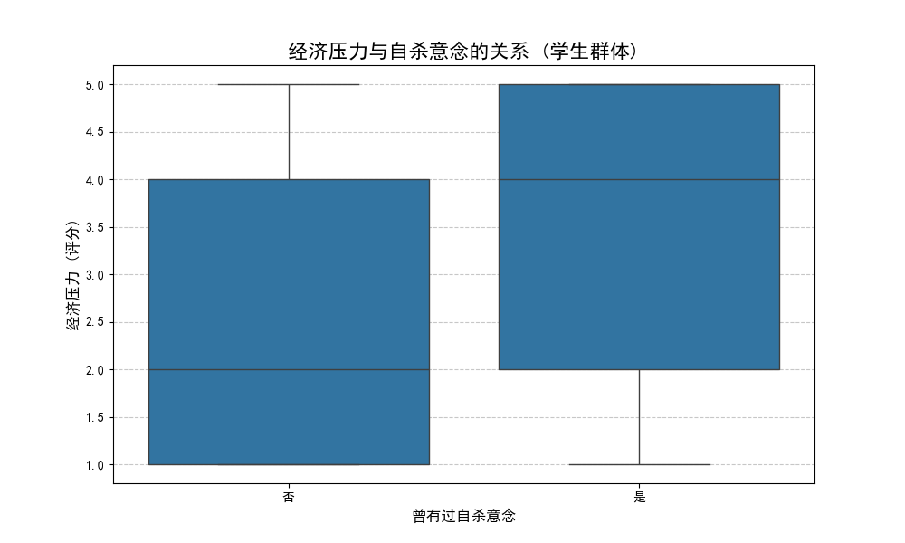
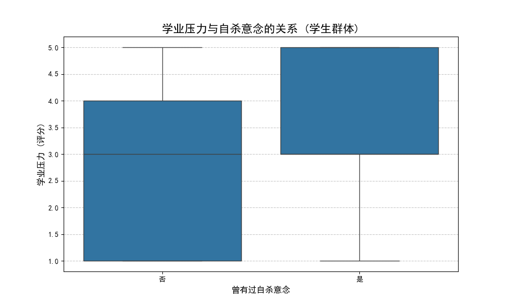
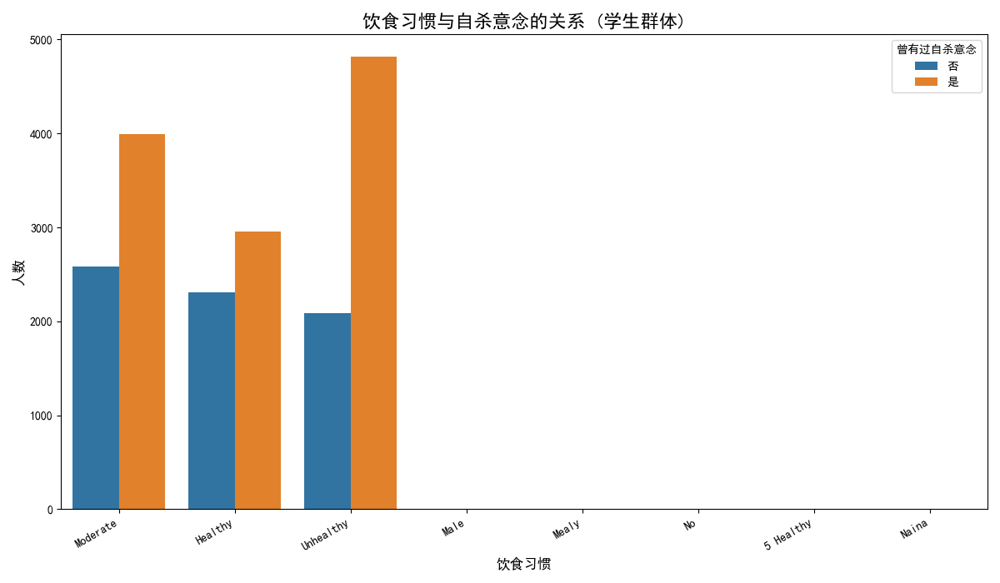
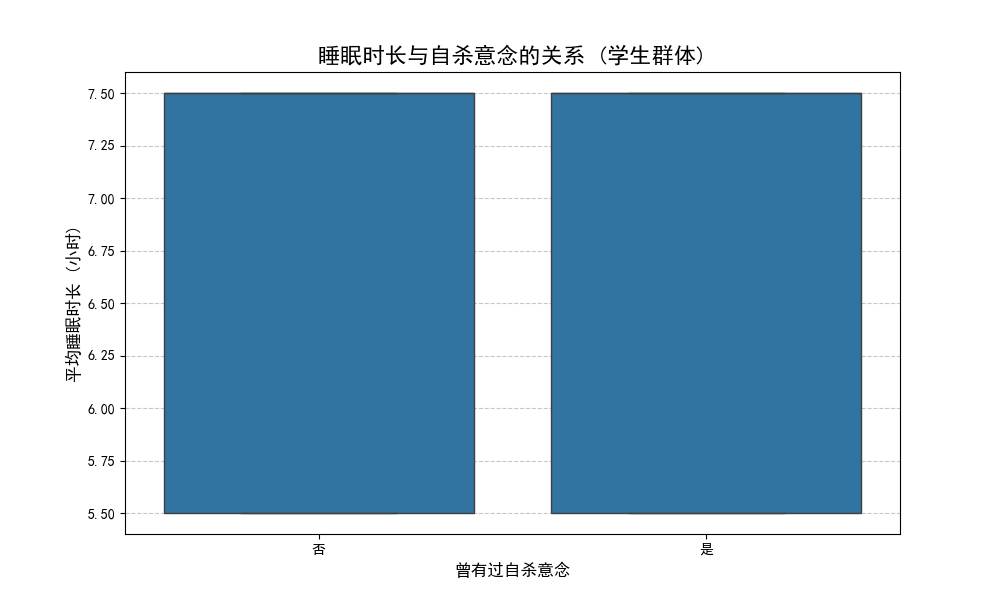

# 学生群体自杀意念相关因素分析及预防策略报告

本报告旨在分析曾有过自杀意念的学生群体在经济、学业压力以及生活方式（饮食、睡眠）几个维度的共同特征，并基于数据洞察，提出可行的预防复发策略。

## 一、核心分析发现

通过对超过9000名学生的数据进行分析，我们发现，有过自杀意念的学生在多个维度上表现出显著特征。

### 1. 总体概况：风险群体占比较高
在本次分析的有效学生样本中，高达 **63.2%** 的学生表示曾有过自杀意念。这是一个非常严峻的信号，表明学生心理健康问题具有普遍性，需要得到高度重视。

### 2. 关键风险因素：经济与学业的双重压力
数据显示，压力是与自杀意念关联最强的因素。

*   **经济压力:** 曾有过自杀意念的学生，其感受到的经济压力显著更高。如下图所示，该群体的经济压力评分中位数、平均值及上下四分位数均高于没有自杀意念的学生群体。

*   **学业压力:** 与经济压力类似，有过自杀意念的学生同样承受着更高的学业压力。从评分分布来看，该群体在学业压力上的负担也显著重于对照组。

**洞察:** 学生群体中，经济和学业的压力并非独立存在，而是常常交织在一起，形成“1+1>2”的叠加效应，成为催生自杀意念的温床。

### 3. 生活方式因素：饮食与睡眠的潜在关联

*   **饮食习惯:** 如下图所示，在各类饮食习惯中，有自杀意念的学生数量均占多数。尤其值得注意的是，在饮食“不健康”的学生中，有过自杀意念的人数与没有该意念的人数差异巨大，这提示不健康的饮食习惯可能与心理状态恶化存在更强的关联。

*   **睡眠时长:** 从数据上看，两组学生群体的平均睡眠时长差异并不显著。然而，这并不能完全排除睡眠问题的影响。平均时长的相似可能掩盖了**睡眠质量**（如入睡困难、多梦、早醒等）的巨大差异，而后者通常与心理压力关系更为密切。

## 二、结论与预防复发策略

**结论:** 曾有过自杀意念的学生群体最显著的特征是**同时承受着高水平的经济和学业压力**，并可能伴随不健康的饮食习惯等生活方式问题。

基于此结论，我们建议制定一套以“压力管理”为核心，整合多方资源的**主动式、综合性预防策略**。

### 策略一：建立“压力-心理”双向预警与干预机制
*   **主动识别:** 学校应建立数据预警系统，不仅监测学生的心理测评结果，更要整合学业成绩波动、奖学金/助学贷款申请、学费缴纳延迟、校园消费骤降等数据，主动识别出处于经济与学业双重压力下的高危学生。
*   **精准干预:** 对于识别出的高危学生，心理辅导中心应主动介入，提供一对一的压力管理咨询和心理支持。干预不应在学生求助后才开始，而应在危机暴露前主动进行。

### 策略二：提供切实有效的“减压”支持资源
*   **经济支持多样化:** 除了传统的奖学金，增设更多的校内兼职岗位、紧急困难补助金，并提供专业的财务规划咨询，帮助学生缓解实际的经济困难，而非仅仅提供“一次性”资助。
*   **学业支持弹性化:** 针对因心理或经济问题导致学业困难的学生，教务部门应与心理中心联动，提供更灵活的课程调整、作业延期、休学/复学政策。同时加强“学业朋辈辅导”，让有相似经历的学长学姐提供支持。

### 策略三：推广健康生活方式，构筑心理韧性“防护网”
*   **主题式工作坊:** 定期举办“如何在压力下好好吃饭”、“如何改善睡眠质量”等主题的健康工作坊，将其作为心理健康教育的一部分，向学生普及生活方式对心理状态的重要性。
*   **创建支持性社区:** 鼓励成立学生社团，组织减压运动（如徒步、瑜伽、冥想），营造积极互助的校园氛围，打破“孤军奋战”的困境，让学生在集体中获得归属感与支持。

通过上述策略，我们可以从源头识别和缓解导致自杀意念的关键压力因素，同时通过改善生活方式增强学生的心理韧性，从而更有效地预防危机的发生与复发。
