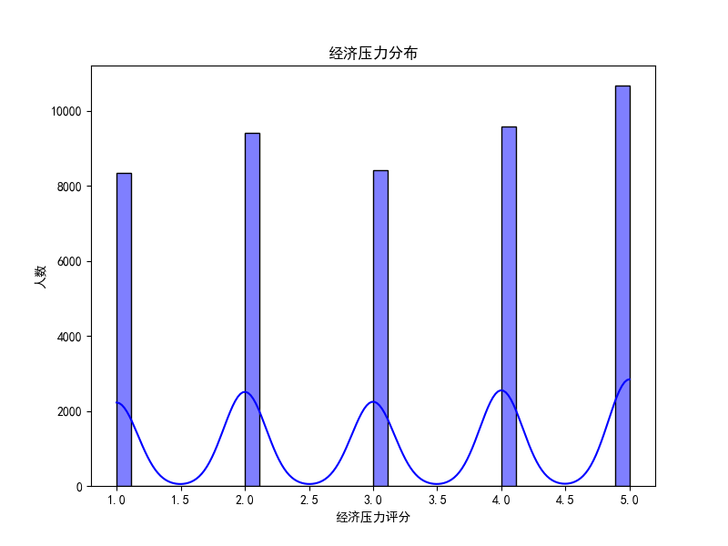
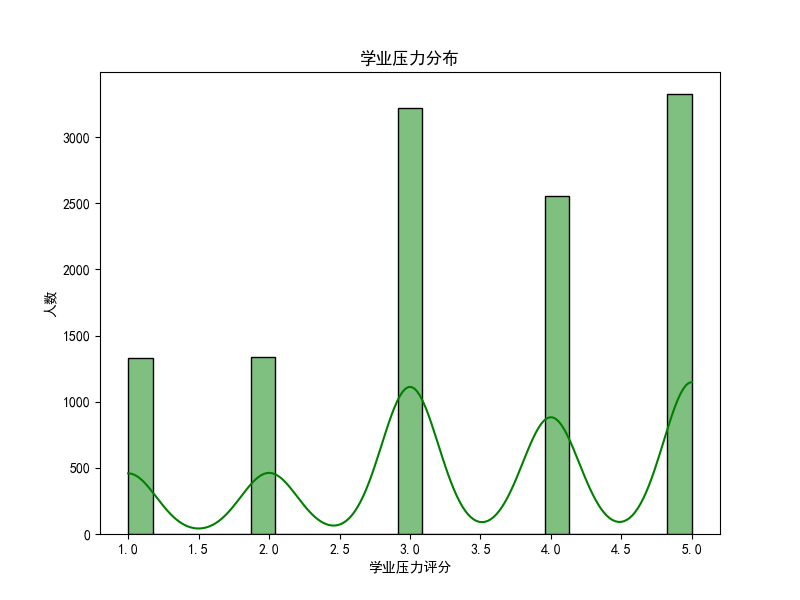
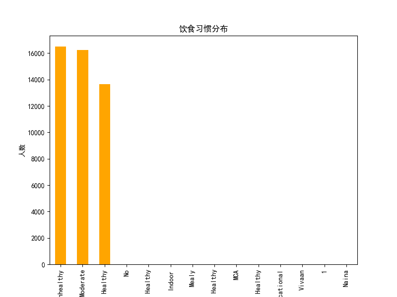
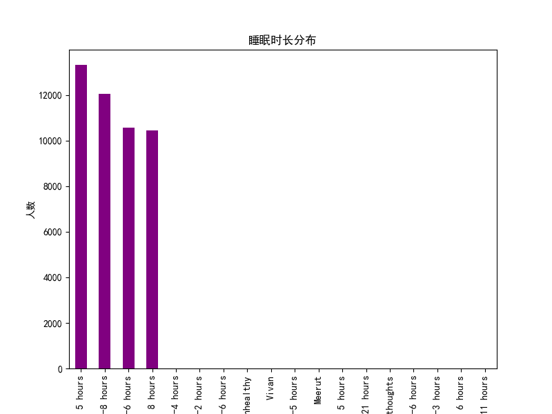

# 曾有过自杀意念学生群体特征分析报告

## 概述
本报告分析了曾有过自杀意念的学生群体在经济压力、学业压力、饮食习惯以及睡眠时长几个维度的特征。这些分析结果旨在帮助制定预防策略，减少此类问题的复发。

数据来自数据库文件 `dacomp-050.sqlite` 中的工作表 "工作表1"，从中筛选出回答 "您是否曾经有过自杀念头？" 为 "Yes" 的学生记录。

---

## 数据维度分析

### 1. 经济压力分布

**分析：**
- 经济压力评分均值为 **3.10**（5 分制）。
- 大部分学生的评分集中在中低经济压力区间。
- 部分学生感受到较高的经济压力，可能与学费、生活费用有关。

**建议：**
- 提供更多奖学金和经济资助，缓解学生的经济负担。
- 开设财务规划辅导，帮助学生管理经济压力。

### 2. 学业压力分布

**分析：**
- 学业压力评分均值为 **3.44**，表明学生普遍感受到一定的学业负担。
- 压力分布偏斜，部分学生面临较高的压力。

**建议：**
- 优化课程安排，避免学业任务过于繁重。
- 提供心理辅导、学习支持和减压工作坊，帮助学生应对学业压力。

### 3. 饮食习惯分布

**分析：**
- 多数学生饮食习惯良好，但也有一部分学生的饮食习惯不规律。
- 不规律的饮食可能会加剧心理压力，影响身心健康。

**建议：**
- 推广健康饮食知识，加强学生对营养和饮食规律的认知。
- 在校园内提供更多健康、便捷的餐饮选择。

### 4. 睡眠时长分布

**分析：**
- 学生的睡眠时长分布显示，大多数人每晚睡眠时间为 **6-7 小时**。
- 然而，仍有部分学生睡眠较短（少于 6 小时），可能影响情绪和心理状态。

**建议：**
- 鼓励学生养成良好的作息习惯。
- 提供心理咨询与睡眠指导服务，帮助改善睡眠质量。

---

## 综合建议与预防策略

综合以上分析，预防策略应从以下几方面入手：
1. **心理健康支持**：设立心理咨询服务，提供个性化的心理支持，特别是对于高压力学生。
2. **经济援助**：通过奖学金、补助等方式减轻经济压力，确保学生不会因经济问题而产生焦虑。
3. **学业辅导**：优化课业安排，同时提供补习与学术支持，减少学业压力。
4. **健康生活方式推广**：加强健康饮食和睡眠管理的宣传，引导学生养成良好的生活习惯。

通过这些措施，可以有效降低学生的自杀意念复发风险，并提升整体心理健康水平。
