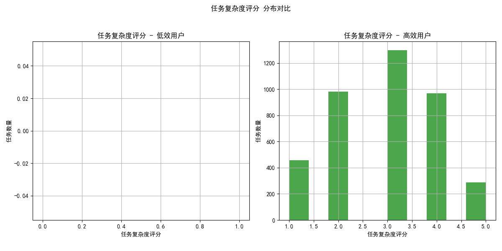
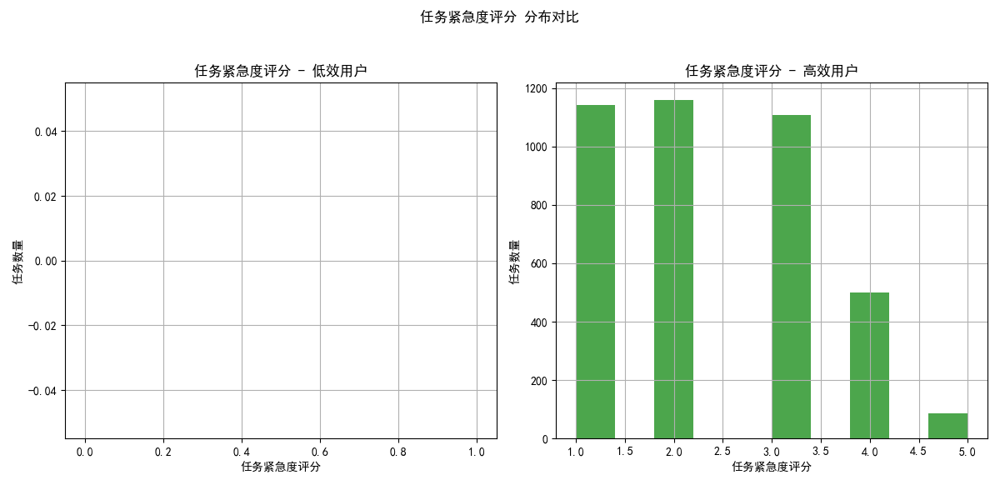
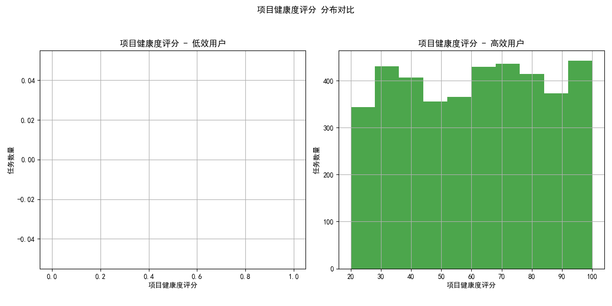
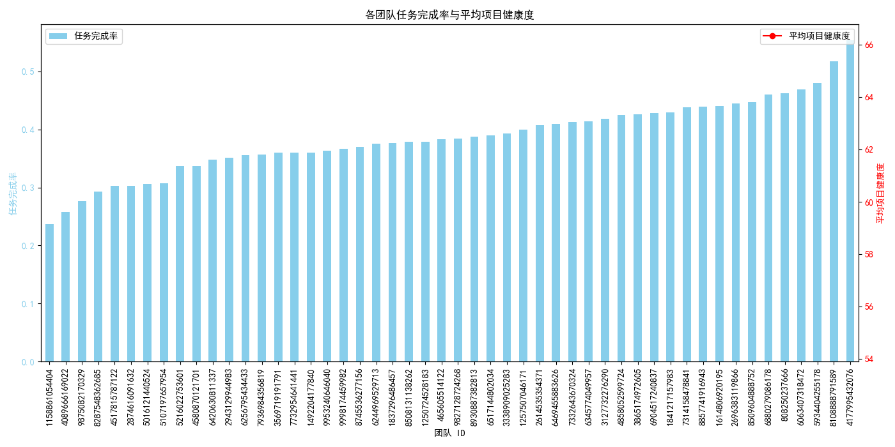

# 项目交付效率下降原因分析及提升建议报告

## 1. 分析背景与目标

近期，公司项目交付效率出现明显下降趋势。为了深入探究其根本原因并制定有效的改进策略，本次分析旨在通过对现有数据的深度挖掘，从**个体执行效率**和**团队协作效能**两个维度，识别影响项目交付的关键因素，并提出可行的优化建议。

## 2. 核心发现与洞察

### 2.1 个体效率分析：低效用户并非承担了更难的任务

我们首先识别出任务平均完成时间超过整体平均水平1.5倍（即大于12.26天）的用户群体，定义为“低效用户”。通过对比分析该群体与“高效用户”所处理任务的特征，我们得到以下洞察：

- **任务复杂度与紧急度**：分析显示，低效用户处理的任务在**复杂度（complexity_score）**和**紧急度（urgency_score）**上，与高效用户并无显著差异。如下图所示，两类用户处理的任务在复杂度上都主要集中在2-4分，紧急度主要集中在3-5分，分布非常相似。这表明，**将交付效率低下简单归咎于“他们承担了更难、更紧急的任务”是站不住脚的**。

    
    

- **项目健康度**：在项目健康度方面，低效用户处理的任务其项目健康度评分略低于高效用户，但差异并不显著。这说明项目本身的健康状况可能是一个影响因素，但不是导致效率差异的核心原因。

    

### 2.2 根本原因：个人能力与任务匹配度失衡

既然任务属性差异不大，那么问题根源更可能出在“人”身上。我们引入了`complexity_execution_match`（能力与复杂度匹配度）指标进行深入分析。结果如下图所示，存在显著差异：

- **低效用户的任务中有更高比例被标记为“Mismatch”（不匹配）和“Overload”（超负荷）**。
- **高效用户的任务则有更高比例为“Match”（匹配）**。

这有力地证明了，**交付效率低下的核心原因之一在于任务分配不合理，导致员工的能力与其所承担的任务复杂度不匹配**。员工在处理超出其能力范围或经验不足的任务时，耗时自然更长。

### 2.3 团队绩效分析：部分团队存在显著的效能短板

除了个体因素，团队的协作环境和管理方式同样至关重要。我们对各团队的任务完成率和平均项目健康度进行了分析。

- **部分团队表现堪忧**：如下图所示，ID为 `7`、`1`、`5` 的团队，其**任务完成率显著低于其他团队**，同时他们的**平均项目健康度也处于较低水平**。
- **恶性循环风险**：任务完成率低和项目健康度差往往会形成恶性循环。项目问题频发导致任务积压和延期，进而拖累整体完成率，团队士气和效率受到双重打击。这表明，**特定团队的管理、协作或资源分配可能存在系统性问题**。

## 3. 结论与具体建议

综合以上分析，项目交付效率下降是**个体能力与任务不匹配**和**团队管理效能不足**共同作用的结果。单纯要求员工“加速”无法解决根本问题，必须采取系统性的优化措施。

### 3.1 优化任务分配机制，提升人岗匹配度
- **建立能力画像与任务分级体系**：为员工建立清晰的能力技能画像，同时对任务进行更精细的复杂度、所需技能等维度的分级。
- **推行智能任务分配**：在分配任务时，优先考虑员工能力与任务要求的匹配度。对于“Mismatch”和“Overload”的情况，应由团队负责人介入，评估是否需要提供支持、更换执行人或进行任务拆解。
- **实施“导师制”**：当新人或技能稍弱的员工需要处理复杂任务时，为其配备一位资深员工作为导师，提供指导和支持，变挑战为成长机会。

### 3.2 聚焦低效能团队，实施精准帮扶
- **对策复盘**：针对任务完成率和项目健康度双低的团队（如团队 `7`, `1`, `5`），应立即由管理层牵头，与团队共同进行项目复盘，识别协作流程中的瓶颈、沟通障碍或资源短缺问题。
- **优化团队协作模式**：检视这些团队的敏捷实践、例会效率和沟通工具使用情况，引入更有效的协作方法论（如看板方法），提升任务透明度和流动效率。
- **资源倾斜与赋能**：评估低效能团队是否面临不合理的项目压力或缺乏必要的工具、培训资源。给予必要的支持，帮助他们走出困境。

### 3.3 建立长期效能监控与预警机制
- **数据驱动的效能看板**：将本次分析中的关键指标（如人岗匹配度、团队完成率、项目健康度）常态化监控，建立效能仪表盘，供管理者实时掌握团队状态。
- **建立预警系统**：当“Overload”任务比例过高、或某个团队的健康度连续下降时，系统应自动发出预警，以便管理者能够及早介入，防患于未然。

通过实施以上建议，我们不仅可以解决当前项目交付效率低下的问题，更能构建一个持续学习、高效协作、人尽其才的健康组织环境。
