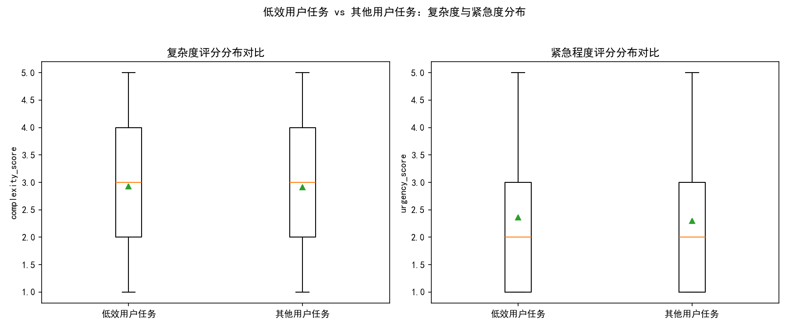
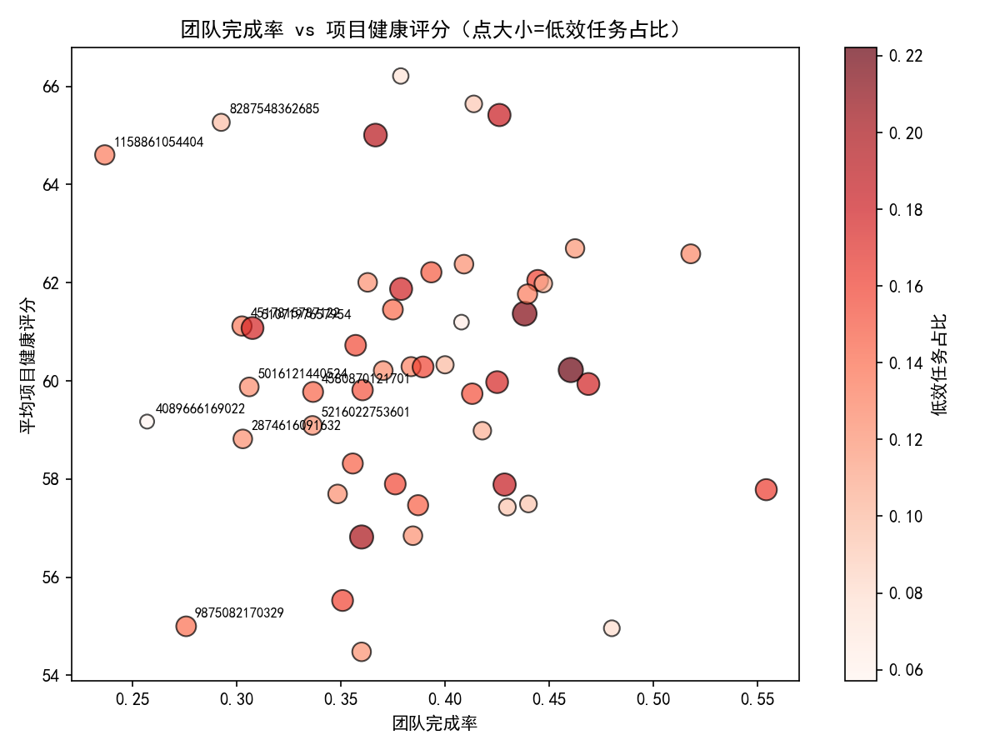
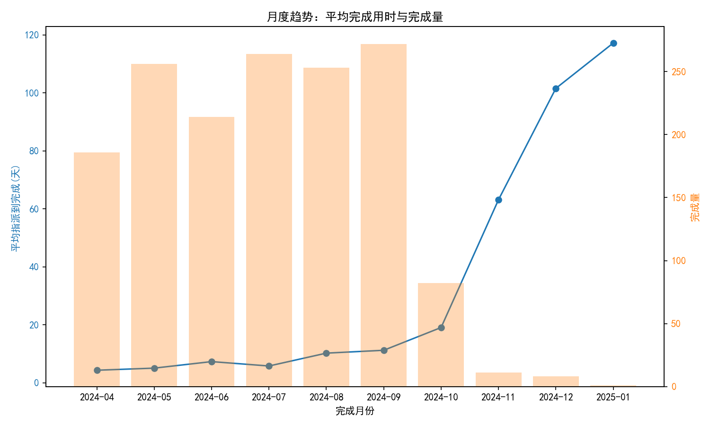

# 项目交付效率下降诊断与效能提升建议（基于 Asana 数据）

## 摘要
- 整体用户的任务平均“指派到完成时间”均值为 8.17 天，阈值（1.5×均值）为 12.25 天，低效用户数量为 191（约占全部用户的 19%）。
- 低效用户处理的任务在复杂度、紧急度与项目健康度上均值略高于其他用户，且其响应与延期天数更长，指派到完成的时长也更高，显示出“任务难度偏高 + 响应与流转较慢”的组合效应。
- 团队层面，完成率最低的团队集中在若干 Team ID 上；但“低效任务占比”与团队完成率/健康度的相关性均较弱，提示效率问题更偏向“个体能力-任务匹配”与“流程瓶颈”而非纯粹团队结构问题。
- 时间趋势显示：自 2024-08 起完成用时显著上升，同时完成量自 2024-10 起明显下滑，提示流程拥堵、资源紧缺或SLA调整等因素显著影响了交付节奏。

## 数据与方法
- 数据来源：SQLite 数据库 dacomp-051.sqlite
  - 任务表：asana__task_lifecycle_analysis（3995条，完成任务1552条，包含复杂度、紧急度、项目健康、指派与完成时间等字段）
  - 用户表：asana__user（1000条，包含 avg_close_time_assigned_days 指标）
- 低效用户判定：用户 avg_close_time_assigned_days > 1.5 × 全体均值（8.169 → 阈值12.254），得 191 人。
- 指标对比：将“低效用户”所处理任务与“其他用户”任务进行分布与均值比较，覆盖 complexity_score、urgency_score、project_health_score、response_time_days、delay_days、hours_assigned_to_completion/24（指派到完成天数）。
- 团队绩效：按 team_id 统计完成率（completed_tasks/total_tasks）与平均项目健康评分，并识别表现最差团队。
- 时间趋势：按完成月份统计平均完成用时与完成量变化。

## 关键发现

### 1. 用户效率与任务特征分布
- 低效用户群体（191人）的任务特征对比（均值）：
  - 复杂度：2.926 vs 2.910；紧急度：2.361 vs 2.298；项目健康：61.58 vs 60.16。
  - 响应时间：4.085天 vs 4.005天；延期天数：4.542天 vs 4.148天。
  - 指派到完成天数：10.29天 vs 8.86天（注：该字段在部分任务缺失，样本量分别为198与1354）。
  - 高复杂度占比（complexity_score≥4）：35.0% vs 30.9%；高紧急占比（urgency_score≥4）：16.1% vs 14.4%。
- 能力-任务匹配（complexity_execution_match）分布差异（低效/其他）：低效组更高占比的“slower_than_expected（16.8%）”与“faster_than_expected（17.9%）”并存，且在“under/overcomplicated”均有一定占比，提示：
  - 两端不匹配同时存在（过度复杂/过度简单均未匹配到合适能力与处理方式）；
  - 低效组在“期望速度偏慢”的标签上占比更高，结合较高的高复杂度/高紧急占比与更长的响应与延期，指示流程或资源瓶颈使得交付周期拉长。

可视化（复杂度与紧急度分布箱线图）：



### 2. 团队绩效与健康度
- 完成率最低的团队（示例Top10）：
  - Team 1158861054404：完成率 0.237，健康度 64.61
  - Team 4089666169022：完成率 0.257，健康度 59.17
  - Team 9875082170329：完成率 0.276，健康度 55.00
  - Team 8287548362685：完成率 0.293，健康度 65.27
  - Team 4517815787122：完成率 0.303，健康度 61.12
  - 其他：2874616091632，5016121440524，5107197657954，5216022753601，4580870121701 等
- 相关性（团队层面）：
  - 完成率 vs 低效任务占比：相关系数 +0.154（弱相关）
  - 项目健康 vs 低效任务占比：相关系数 -0.01（近乎无关）
- 解释：团队维度的“低效任务占比”与整体绩效并无显著线性关系，说明效率问题更偏向跨团队共性流程或个体的任务匹配，而非某些团队单独导致；但上述低完成率团队仍应被重点观察与优化资源配置。

可视化（团队完成率 vs 项目健康度，点大小/颜色代表低效任务占比）：



### 3. 时间趋势（关键影响因素）
- 月度平均“指派到完成天数”与完成量：
  - 2024-04 → 2024-08：完成用时由 4.28 天升至 10.20 天；
  - 2024-09：进一步升至 11.22 天；
  - 2024-10~12：升至 19.07、63.12、101.54 天，同时完成量显著下降（82→11→8）；2025-01 更高（117.17 天，完成量仅 1）。
- 解释与诊断：
  - 交付周期显著拉长与完成量下滑共同出现，提示流程拥堵、资源紧张（如人力流失/跨项目占用）、或SLA/质量门槛上调导致完结延后；
  - 可能存在季节性影响（年末集中处理复杂任务或切换到长期项目），以及任务拆分/里程碑定义变更导致“完成定义”更严格。

可视化（月度平均完成用时与完成量）：



## 根因分析（诊断性）
- 任务难度与紧急度：低效用户更高比例处理高复杂/高紧急任务，且响应与延期更长；结合“slower_than_expected”标签占比更高，说明短板集中在“应对更复杂任务的能力/协作效率”。
- 能力-任务匹配度：同时出现“under/overcomplicated”占比，提示任务路由未能稳定匹配最佳处理者（过于简单的任务给到高级人员或过于复杂的任务给到经验较少者），造成不必要的等待与返工。
- 流程与协作：团队层面相关性弱，但低完成率团队仍可能是局部瓶颈（资源紧张、跨团队依赖与交付协调不足、代码/需求评审耗时长）。
- 时间维度：近几月完成时长显著上升与完成量下降，说明系统性影响（流程变更、负载峰值、质量控制收紧）起主导作用。

## 预测性判断（如果不改进会怎样）
- 按当前趋势，平均完成用时将继续维持在高位，完成量维持低水平或缓慢恢复，整体交付效率与项目健康度存在下行风险。
- 低效用户群体的复杂任务占比偏高，如不优化任务路由与协作节奏，延迟与返工将持续增加。

## 规范性建议（我们应该做什么）
1. 任务路由与能力画像优化
   - 建立技能画像：以历史完成时长、复杂度成功率（“faster_than_expected/appropriate_xxx”占比）为特征，构建任务分配规则。
   - 复杂度分级路由：高复杂/高紧急任务优先路由至专家组；低复杂任务集中路由至高吞吐团队，减少“undercomplicated”浪费。
   - 设置任务“首响应SLA”与超时告警，降低 response_time_days 与 delay_days。
2. 协作流程与WIP控制
   - 推行看板拉动与WIP上限，避免同时处理过多任务导致延迟；
   - 对高复杂任务启用“早期拆分+里程碑+同步评审”，提高“slower_than_expected”的可控性；
   - 建立跨团队共享专家池，对低完成率团队（如 1158861054404、4089666169022、9875082170329 等）进行定向支援与资源倾斜。
3. 时间节奏与容量管理
   - 针对月度峰值前后（如8~12月）进行滚动容量预测与临时扩容；
   - 在年末阶段对SLA进行分层管理（关键任务维持高标准，一般任务采用简化流程），防止积压导致平均完成时长失控。
4. 训练与辅导
   - 对“slower_than_expected”比例较高的个人开展专项辅导，内容聚焦复杂度识别、任务拆解与依赖前置；
   - 鼓励结对编程/评审，提升新人应对高复杂任务的能力，缩短学习曲线。
5. 监控与度量（指标闭环）
   - 周期性跟踪：avg_close_time_assigned_days、response_time_days、delay_days、团队完成率、项目健康度（月度）。
   - 目标值（示例）：
     - 3个月内将低效用户指派到完成均值从 10.29 天降至 <9 天；
     - 高复杂任务的“slower_than_expected”占比下降 20%；
     - 低完成率团队完成率提升至 ≥0.35，且健康度 ≥60。

## 主要SQL与Python代码片段
- 阈值与低效用户识别（SQL摘要）：
```sql
WITH stats AS (
  SELECT AVG(avg_close_time_assigned_days) AS overall_avg
  FROM asana__user WHERE avg_close_time_assigned_days IS NOT NULL
)
SELECT COUNT(*) AS inefficient_user_cnt
FROM asana__user u, stats
WHERE u.avg_close_time_assigned_days > 1.5 * stats.overall_avg;
```
- 分组特征对比（SQL摘要）：
```sql
WITH stats AS (
  SELECT AVG(avg_close_time_assigned_days) AS overall_avg
  FROM asana__user WHERE avg_close_time_assigned_days IS NOT NULL
), inefficient_users AS (
  SELECT u.user_name FROM asana__user u, stats
  WHERE u.avg_close_time_assigned_days > 1.5*stats.overall_avg
)
SELECT 'inefficient' AS grp, AVG(complexity_score), AVG(urgency_score), AVG(project_health_score)
FROM asana__task_lifecycle_analysis t JOIN inefficient_users iu ON t.assignee_name=iu.user_name
WHERE t.is_valid_record=1
UNION ALL
SELECT 'others' AS grp, AVG(complexity_score), AVG(urgency_score), AVG(project_health_score)
FROM asana__task_lifecycle_analysis t
WHERE t.is_valid_record=1 AND (t.assignee_name IS NULL OR t.assignee_name NOT IN (SELECT user_name FROM inefficient_users));
```
- 团队完成率与健康度（SQL摘要）：
```sql
WITH team_stats AS (
  SELECT team_id,
         COUNT(*) AS total_tasks,
         SUM(CASE WHEN is_completed=1 THEN 1 ELSE 0 END) AS completed_tasks,
         AVG(project_health_score) AS avg_project_health
  FROM asana__task_lifecycle_analysis
  WHERE is_valid_record=1
  GROUP BY team_id
)
SELECT team_id,
       total_tasks,
       completed_tasks,
       1.0*completed_tasks/NULLIF(total_tasks,0) AS completion_rate,
       avg_project_health
FROM team_stats
ORDER BY completion_rate ASC, avg_project_health ASC;
```
- Python绘图（片段）：
```python
import matplotlib.pyplot as plt

# 字体设置，确保中文可显示
plt.rcParams['font.sans-serif'] = ['SimHei']
plt.rcParams['axes.unicode_minus'] = False

# 箱线图示例：复杂度与紧急度分布
axes[0].boxplot([comp_ineff, comp_others], labels=['低效用户任务', '其他用户任务'], showmeans=True)
axes[1].boxplot([urg_ineff, urg_others], labels=['低效用户任务', '其他用户任务'], showmeans=True)
plt.savefig('ineff_vs_others_box.png', dpi=150)
```

## 注意与局限
- 指派到完成时长（hours_assigned_to_completion）在部分任务缺失，分组均值的样本量不一致（低效组198 vs 其他组1354），结论应结合其他指标综合判断。
- 团队维度相关性为总体线性相关分析，可能掩盖非线性与交互效应；后续可采用分层模型或多变量回归进一步建模。

## 结论
- 交付效率下降的主要信号包括：高复杂/高紧急任务占比上升、响应与延期时间偏长、近几个月平均完成时长飙升与完成量减少。
- 低效用户群体的特征提示“能力-任务匹配”与“流程瓶颈”并存，优先策略应围绕任务路由优化、WIP控制、协作机制改进与季节性容量管理。
- 落地执行应设置明确的度量目标与监控闭环，并针对低完成率团队进行定向增援，预计可在 1-2 个迭代周期内观察到完成率与延迟指标的改善。
