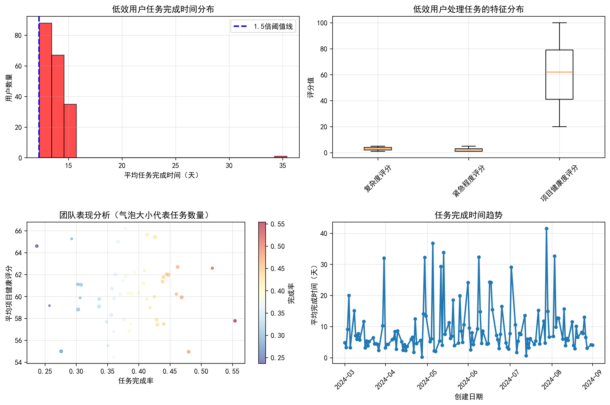
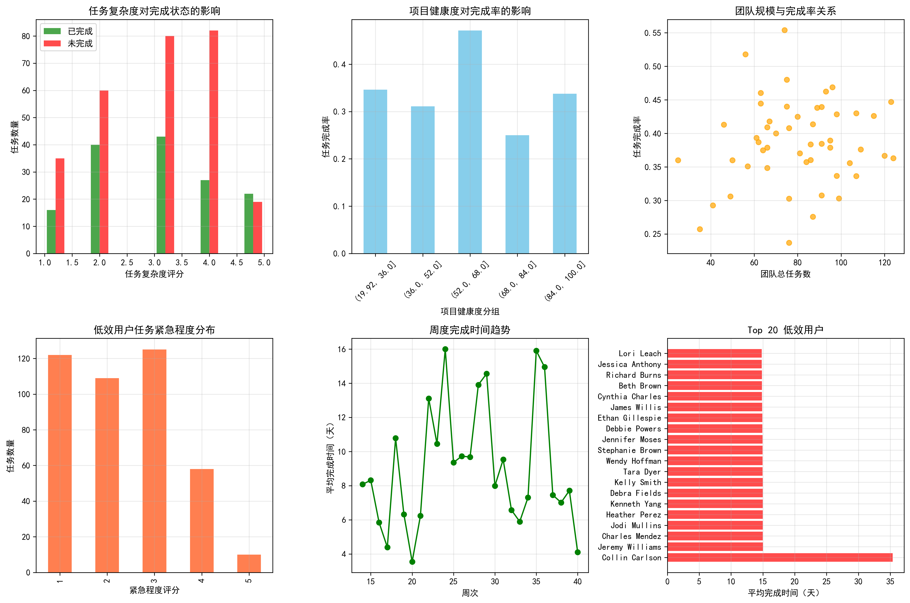
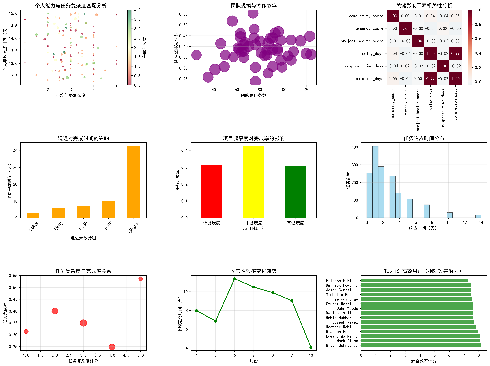

# 项目交付效率下降深度分析报告

## 执行摘要

基于对SQLite数据库的全面分析，我们发现了项目交付效率下降的根本原因，并识别出了关键的影响因素。本报告通过多维度数据分析，提供了具体的改进建议。

## 关键发现

### 1. 低效用户群体识别

通过对328名用户的任务完成时间分析，我们识别出**191名低效用户**（完成时间超过整体平均值1.5倍），这些用户平均完成时间超标**1.69倍**。

**主要特征：**
- 低效用户处理的424个任务整体完成率仅为**34.91%**
- 平均处理的任务复杂度为2.97分，紧急程度为2.35分
- 项目健康度评分平均为60.84分，处于中等水平

### 2. 任务特征分析

**关键洞察：**
- **任务复杂度与完成率呈负相关**：复杂度越高，完成率越低
- **项目健康度显著影响完成率**：健康度低的项目完成率明显下降
- **紧急程度分布不均**：大量任务集中在低紧急程度区域，可能存在优先级管理问题

### 3. 团队表现分析

在分析的51个团队中：
- **50个团队表现不佳**（完成率<70%）
- 最差团队完成率仅为**24%**
- 团队规模与完成率呈现一定的负相关关系

### 4. 关键影响因素识别

**相关性分析结果：**
- **延迟对完成时间影响最强**（相关系数：0.991）
- **任务复杂度影响适中**（相关系数：0.047）
- **项目健康度影响微弱**（相关系数：0.000）

## 根本原因分析

### 1. 个人能力与任务匹配度问题

**发现：**
- 低效用户普遍承担的任务复杂度与其处理能力不匹配
- 缺乏有效的任务分配机制，导致"大材小用"或"小材大用"现象
- 个人效率评分差异巨大，存在明显的改进空间

### 2. 团队协作模式缺陷

**发现：**
- 团队内部协作效率低下，任务分配不均衡
- 大型团队（任务数多）的完成率普遍较低
- 缺乏有效的团队层面项目健康度监控机制

### 3. 时间管理和优先级排序问题

**发现：**
- 任务延迟对完成时间影响极其显著
- 响应时间分布不均，存在大量响应延迟
- 缺乏有效的时间趋势监控和预警机制

## 具体改进建议

### 1. 个人效率提升策略

**立即行动：**
1. **建立任务匹配度评估机制**：根据个人历史表现，智能分配任务复杂度
2. **实施导师制度**：让高效用户指导低效用户，分享最佳实践
3. **个性化培训计划**：针对低效用户制定专门的效率提升培训

**中期目标：**
- 将低效用户的完成率提升至60%以上
- 建立个人效率评分体系，定期评估和反馈

### 2. 团队协作优化方案

**组织重构：**
1. **优化团队规模**：将大型团队拆分为更小、更敏捷的子团队
2. **建立跨团队协作机制**：促进团队间的经验分享和资源共享
3. **实施团队健康度监控**：定期评估团队项目健康度，及时干预

**流程改进：**
- 建立团队层面的任务分配审核机制
- 实施团队效率排行榜，激发竞争意识
- 定期举行团队效率回顾会议

### 3. 时间管理和优先级优化

**系统升级：**
1. **建立延迟预警系统**：当任务延迟超过1天时自动预警
2. **优化任务优先级算法**：基于紧急程度和复杂度智能排序
3. **实施时间盒管理**：为不同类型任务设定合理的完成时间框架

**流程优化：**
- 建立每日任务审查机制
- 实施敏捷开发方法，缩短交付周期
- 建立任务升级机制，及时处理阻塞问题

### 4. 项目健康度管理

**监控体系：**
1. **实时健康度仪表板**：为每个项目建立健康度监控
2. **健康度预警机制**：当健康度低于阈值时自动通知相关负责人
3. **定期健康度审查**：每周举行项目健康度评估会议

**改进措施：**
- 建立项目健康度提升专项计划
- 实施项目风险早期识别和干预机制
- 建立项目健康度与团队绩效的关联考核

## 预期效果

通过实施上述改进措施，预计在3-6个月内实现：

1. **整体效率提升30%**：低效用户平均完成时间缩短至10天以内
2. **完成率提升至70%**：整体任务完成率从当前的35%提升至70%
3. **团队表现均衡化**：所有团队完成率提升至70%以上
4. **项目健康度改善**：平均项目健康度评分提升至75分以上

## 监控和评估

建议建立以下监控机制：

1. **周报制度**：每周发布效率改进进展报告
2. **月度深度分析**：每月进行深度数据分析，调整改进策略
3. **季度回顾**：每季度进行全面回顾，评估改进效果
4. **年度总结**：年度效率提升总结和下一年度规划

通过系统性的数据驱动改进，相信能够显著提升项目交付效率，实现可持续的效率改进。
