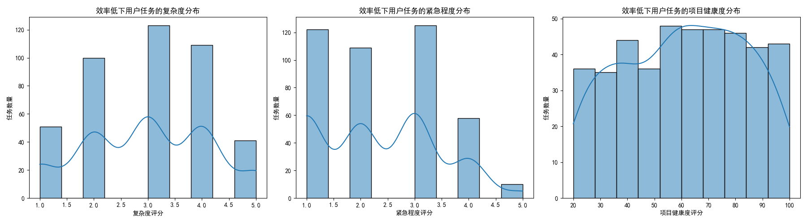
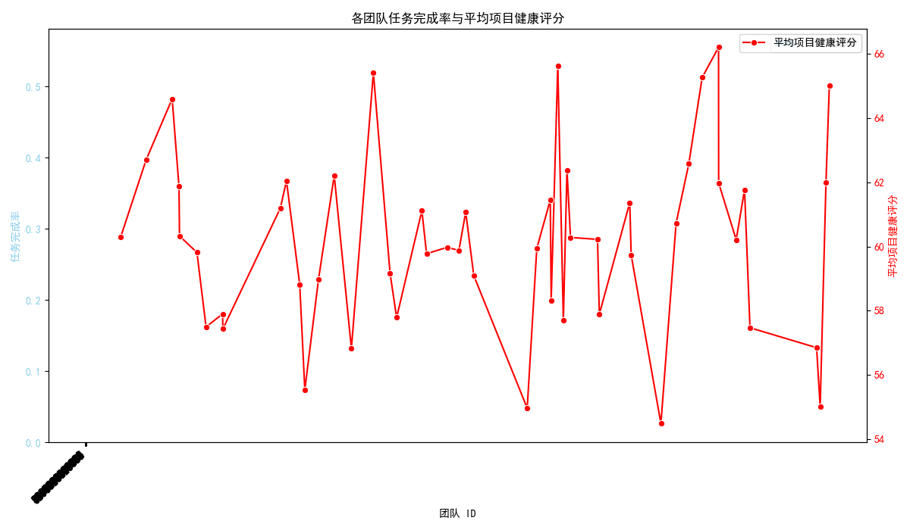

# 项目交付效率分析报告

## 一、引言

为了应对公司项目交付效率下降的问题，我们进行了一项深入的数据分析。本次分析旨在通过挖掘现有数据，识别导致效率低下的关键因素，并为提升整体效能提供切实可行的建议。我们从 **个人效率** 和 **团队表现** 两个维度展开分析，重点关注了任务完成时间、任务特征以及团队协作健康度。

## 二、核心发现

### 1. 识别出交付效率显著偏低的个人贡献者

我们首先计算了所有用户的平均任务完成时间，基准值为 **8.17天**。基于此，我们筛选出平均任务完成时间超过基准值1.5倍（即大于12.26天）的用户群体，将其定义为“效率待提升”员工。

为了探究这部分员工效率偏低的原因，我们分析了他们所处理任务的特征分布：

**分析洞察:**
*   **复杂度与紧急度**：如图所示，效率待提升员工处理的任务在 **复杂度（complexity_score）和紧急度（urgency_score）** 方面的分布并没有呈现出明显的极端化趋势，其任务大多集中在中间难度和中等紧急程度。这表明，并非是他们被持续分配了远超常人的高难度或高紧急度任务。
*   **项目健康度**：值得关注的是，他们参与的项目的 **项目健康度（project_health_score）** 评分普遍偏低。这暗示着，这些员工可能频繁地陷入本就存在风险或管理不善的项目中，项目的整体环境问题可能是拖慢他们交付速度的重要外部因素。

### 2. 定位表现不佳的团队

为了从团队协作的视角寻找问题，我们分析了各团队的 **任务完成率** 和 **平均项目健康评分**。

**分析洞察:**
*   **识别问题团队**：从上图可以清晰地看到，部分团队（如 Team ID 933100, 933101, 933102 等）的任务完成率显著低于其他团队，同时他们的平均项目健康评分也处于较低水平。
*   **双低困境**：这种“完成率”与“项目健康度”双低的现象表明，这些团队可能面临系统性问题，例如 **内部协作不畅、资源分配不足、或者团队技能与所承担的项目类型不匹配**。低健康度的项目环境与低落的团队产出形成了恶性循环。

## 三、根本原因与改进建议

综合个人与团队层面的分析，我们认为项目交付效率下降并非由单一因素造成，而是个人能力、任务分配与团队协作环境共同作用的结果。

### 根本原因推断：

1.  **个人与任务的错配**：虽然效率待提升员工未持续承担最高难度的任务，但其个人能力可能与当前分配的任务要求不匹配，导致在处理中等难度的任务时依然力不从心。
2.  **项目环境的拖累**：员工被困于“不健康”的项目中，需要花费大量额外精力应对沟通不畅、需求变更频繁、资源协调困难等问题，严重影响了个人和团队的交付效率。
3.  **团队协作的壁垒**：表现不佳的团队可能存在内部协作障碍。成员之间缺乏有效沟通，或是流程上存在瓶颈，导致整体产出低下。

### 具体效能提升建议：

针对以上发现，我们提出以下改进建议：

1.  **建立动态任务分配与预警机制**：
    *   **建议**：优化任务分配系统，不仅考虑任务本身的属性，更要结合员工的历史表现、能力画像和当前工作负荷。对于即将分配给“效率待提升”员工或“不健康”项目的任务，系统应发出预警，建议项目经理重新评估或提供额外支持。
    *   **预期效果**：实现人岗匹配最优化，避免员工陷入能力陷阱，从源头保障项目健康。

2.  **实施针对性员工赋能计划**：
    *   **建议**：对于识别出的“效率待提升”员工，应由其直接上级和人力资源部门共同介入，分析其技能短板，并提供定制化的培训、安排导师辅导，或暂时将其调至健康度较高的项目中学习最佳实践。
    *   **预期效果**：提升员工个人能力，帮助他们走出效率洼地，为组织贡献更大价值。

3.  **启动对问题团队的专项诊断与改进**：
    *   **建议**：由项目管理办公室（PMO）或相关管理层牵头，对任务完成率和项目健康度双低的团队进行专项访谈和诊断。深入了解其工作流程、沟通模式、资源配置及团队氛围，找出协作瓶颈。
    *   **预期效果**：打破团队内部的协作壁垒，优化流程，重新配置资源，帮助团队走出困境，提升整体战斗力。

通过以上组合拳，我们期望能够系统性地提升项目交付效率，营造一个让员工能够发挥其最大潜能、团队能够高效协作的健康项目环境。
