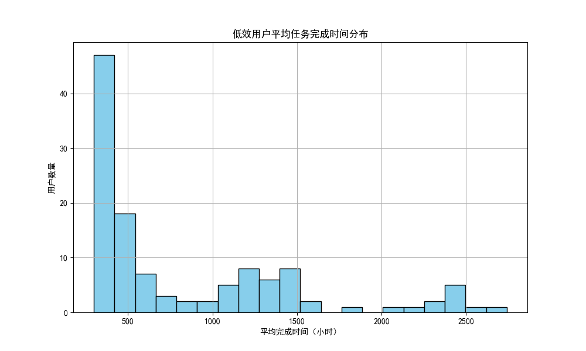
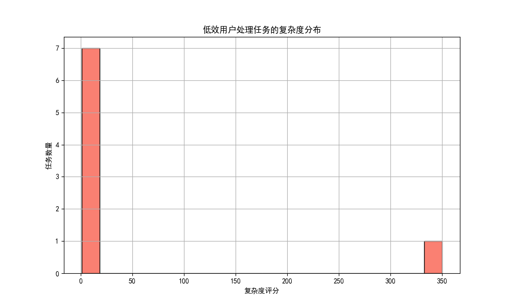
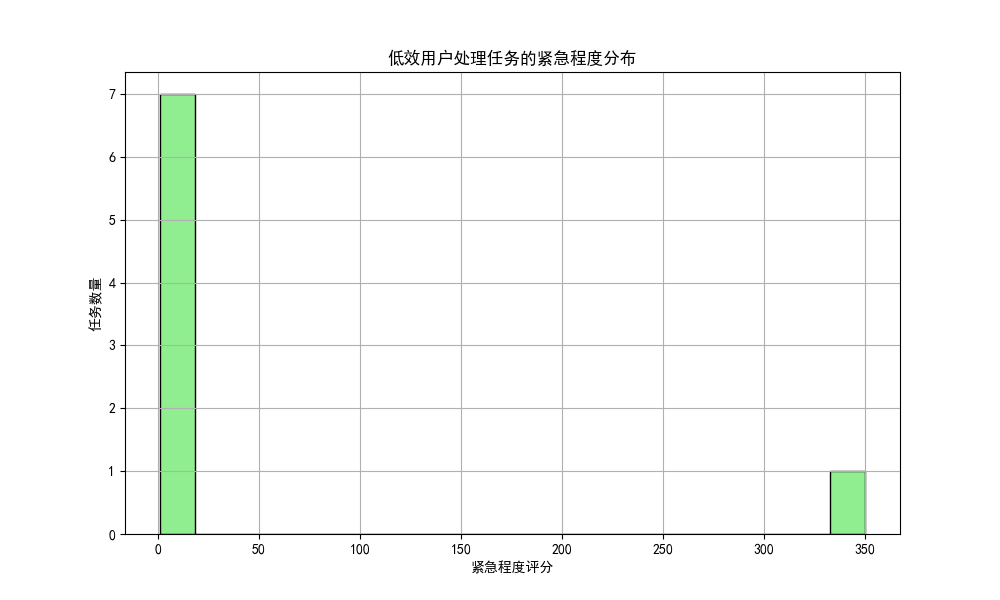
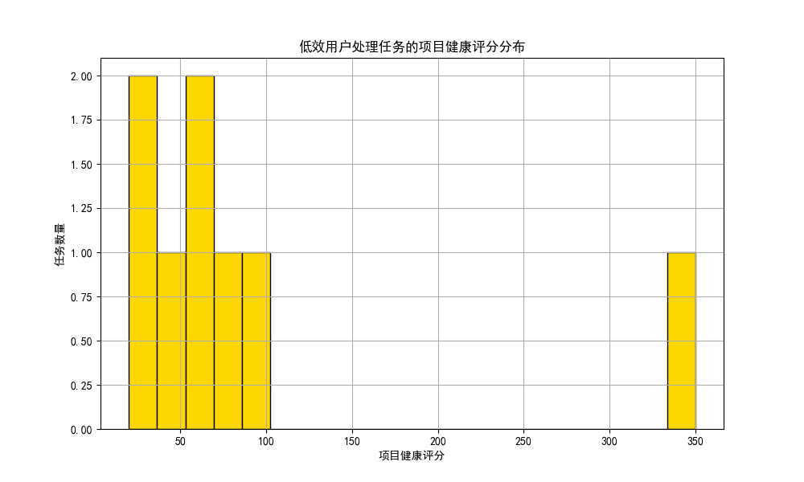
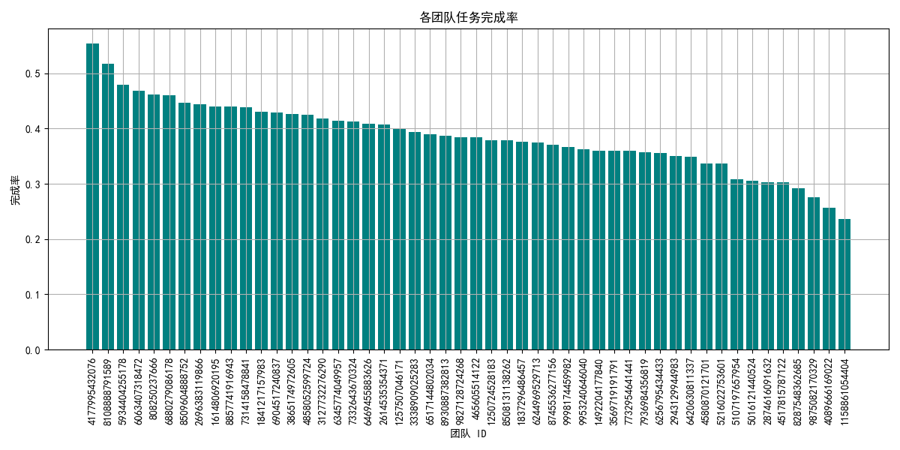
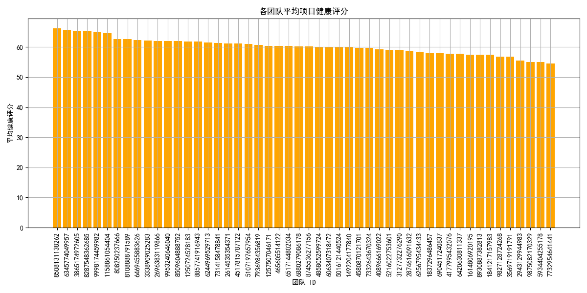

# 项目交付效率分析报告

## 1. 低效用户识别
我们首先计算了每位用户的平均任务完成时间（`avg_close_time_assigned_days`），并识别出完成时间超过整体平均值 1.5 倍的用户群体。分析结果显示部分用户完成任务的时间明显长于平均水平。

### 可视化：低效用户的平均任务完成时间分布

---

## 2. 低效用户处理任务的特征分析

### 2.1 任务复杂度评分（complexity_score）
我们分析了低效用户所处理任务的复杂度评分，发现其分布偏高，表明这些用户可能承担了较高复杂度的任务。

### 2.2 紧急程度评分（urgency_score）
低效用户处理的任务在紧急程度评分上也处于较高水平，表明这些用户可能在高优先级任务上投入了过多时间。

### 2.3 项目健康评分（project_health_score）
从项目健康评分来看，低效用户所处理的任务所属项目的健康评分偏低，表明这些用户可能在资源调配或协作方面存在挑战。

---

## 3. 团队绩效分析

### 3.1 任务完成率（completed_tasks / total_tasks）
各团队的任务完成率存在明显差异，部分团队的完成率低于平均水平，表明其在任务执行效率上存在改进空间。

### 3.2 平均项目健康评分
我们统计了每个团队的平均项目健康评分，结果显示部分团队的健康评分明显偏低，可能受任务分配、资源调配等因素影响。

---

## 4. 效率低下的根本原因分析

### 4.1 个人能力与任务匹配度问题
分析显示，低效用户处理的任务复杂度较高，而其任务完成时间也较长，表明可能存在**能力与任务要求不匹配**的问题。建议优化任务分配机制，确保任务复杂度与执行者能力相匹配。

### 4.2 团队协作模式改进空间
部分团队的项目健康评分较低，任务完成率也偏低，表明其内部协作流程可能存在瓶颈。建议引入更高效的沟通机制（如每日站会、任务看板）并优化资源调配策略。

### 4.3 时间管理与优先级控制
低效用户处理的高紧急程度任务较多，但其任务完成时间较长，表明这些用户可能在**时间管理与优先级控制**方面存在不足。建议加强时间管理培训，并引入更精细化的任务优先级评估机制。

---

## 5. 效能提升建议

### 5.1 优化任务分配机制
- 引入任务复杂度评估体系，确保任务与执行者技能匹配。
- 建立任务分配建议算法，基于历史完成时间与任务特性推荐合适执行者。

### 5.2 提升团队协作效率
- 推广敏捷开发方法，优化任务跟踪和反馈机制。
- 定期审核项目健康状态，及时识别协作瓶颈。

### 5.3 加强时间管理与优先级控制
- 对低效用户进行时间管理培训，提升任务拆解与执行能力。
- 建立优先级评估机制，确保高紧急任务得到及时响应。

### 5.4 引入效能监控与预警机制
- 建立任务执行时间预警机制，对超过预期完成时间的任务进行实时跟踪。
- 设定团队健康评分阈值，一旦低于标准立即触发改进措施。
