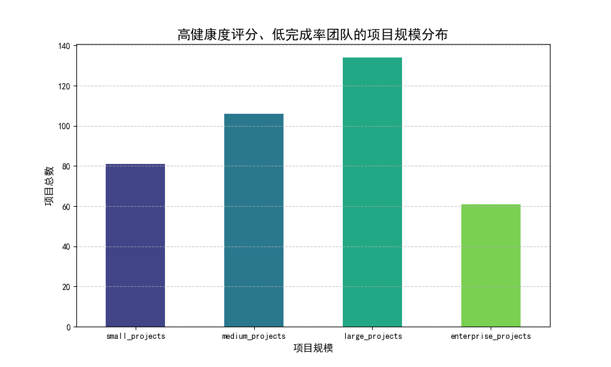
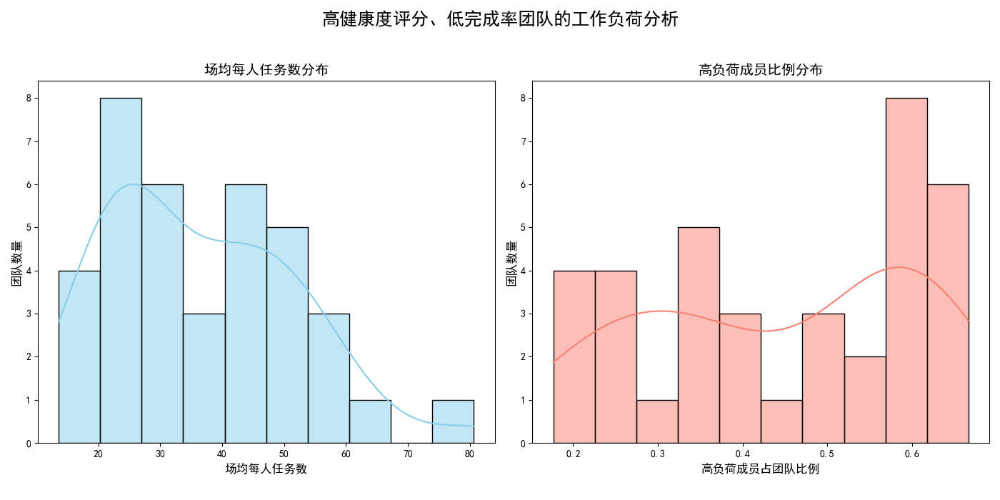
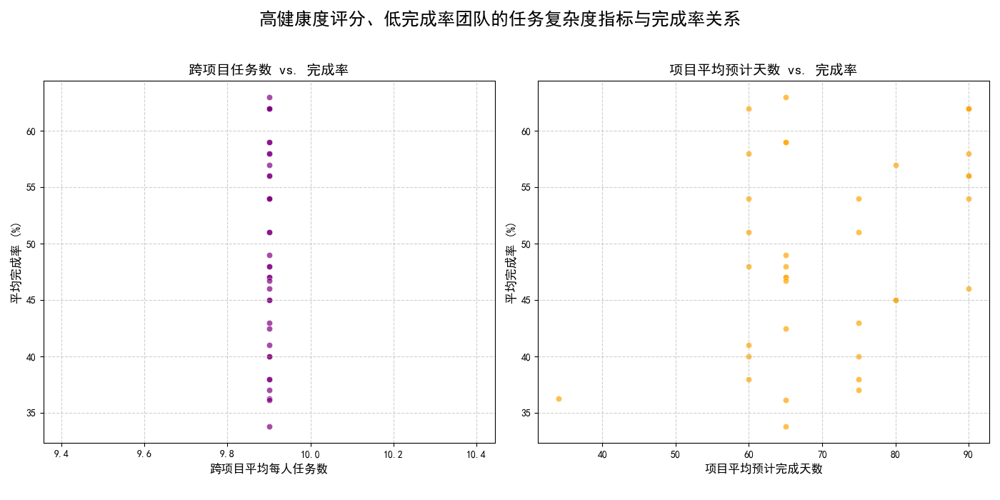

# 关于团队健康度评分与实际表现不匹配的分析报告

## 1. 摘要

本次分析旨在探究部分团队存在“项目健康度评分高但实际完成率偏低”的现象。通过对`asana__team_efficiency_metrics`数据的深入挖掘，我们定位了37个协作效率（collaboration_efficiency_score）和资源优化（resource_optimization_score）评分均在8分以上，但项目平均完成率低于70%的团队。

**核心发现：** 这些团队的“高分低能”现象，其根本原因在于**健康度评分模型未能充分反映大型项目的内在复杂性、实际工作负荷的分配不均以及多任务处理带来的效率损耗**。评分高的团队擅长沟通协作，但在巨大的项目体量和不均衡的资源压力下，执行力受到严重挑战。

**核心建议：**
- **优化健康度评分模型：** 引入能反映项目规模和复杂度的权重。
- **动态调整资源分配：** 重点关注并干预高负荷成员和跨项目任务过多的情况。
- **推广敏捷交付模式：** 将大型项目拆分为短期里程碑，提高交付的可预测性。

---

## 2. 问题背景

业务观察到，一些团队的项目健康度综合评分（尤其在协作与资源管理方面）表现优异，然而他们的项目完成率却未能达到预期水平。本报告旨在深入分析这些评分与表现不匹配的团队，从数据层面挖掘其在项目特征、工作负荷及任务复杂度等方面的共同点，以期找到深层原因并提出针对性的管理优化建议。

---

## 3. 分析与发现

我们筛选出`collaboration_efficiency_score >= 8`，`resource_optimization_score >= 8` 且 `avg_completion_rate < 70` 的团队样本（共37个），并从以下三个维度进行分析。

### 发现一：项目规模普遍偏大，健康度评分未能体现其挑战

上图显示，这些“高分低能”团队所承担的项目中，**大型项目（large_projects）和企业级项目（enterprise_projects）的数量远超中小型项目**。

**解读：** 大型和企业级项目通常周期长、不确定性高、协调难度大，其内在风险和执行复杂度远非普通项目可比。当前的健康度评分（如协作效率）可能只反映了团队成员间的沟通顺畅度，却没有充分量化和计入由项目巨大规模带来的执行阻力。团队可能“看起来”协作得很好，但实际上正被庞大的项目压得喘不过气，导致完成率低下。

### 发现二：工作负荷分配不均，团队资源优化存在“盲点”

上图左侧的“场均每人任务数分布”显示，大多数团队的成员平均任务量集中在特定区间，但右侧的“高负荷成员比例分布”揭示了一个关键问题：**在这些团队中，普遍存在一部分成员承担了远超平均水平的工作量**。

**解读：** “资源优化评分”高，可能意味着团队在计划层面或表面上对资源进行了划分，但实际执行中，工作压力向少数核心成员倾斜。这种资源分配的不均衡导致了瓶颈的产生。少数“英雄”成员的过载不仅增加了其个人任务的延期风险，也拖累了整个团队的进度，从而拉低了整体项目完成率。

### 发现三：任务复杂度与多线作战拉低实际产出

上图通过两个代理指标来探索任务复杂度与完成率的关系：
1.  **左图（跨项目任务数 vs. 完成率）：** 虽然没有呈现出严格的线性关系，但可以看出，当成员平均承担的跨项目任务数增多时，完成率很难达到一个较高的水平。多任务切换带来的认知负担和时间损耗不容忽视。
2.  **右图（项目平均预计天数 vs. 完成率）：** 同样，随着项目平均预计完成天数的增加（通常意味着项目更复杂），团队的完成率也呈现出下降的趋势。

**解读：** 高“协作效率”评分的团队可能善于在不同任务和项目间进行沟通，但这并不能抵消多线作战带来的效率损失。当成员需要频繁在多个复杂任务之间切换上下文时，其实际工作效率和交付质量会下降，最终体现在项目完成率上。

---

## 4. 深层原因诊断

综合以上发现，我们可以诊断出问题的根源：

**健康度评分模型与复杂项目执行现实脱节。**

当前的`collaboration_efficiency_score`和`resource_optimization_score`更偏向于衡量**过程和意愿**（如团队是否积极沟通、计划是否制定），而未能有效衡量**现实的执行压力和能力**。一个团队可以拥有完美的沟通流程和资源计划，但如果他们面对的是超出其承载能力的项目规模和复杂度，并且内部存在严重的“主力依赖”现象，那么低完成率将是必然结果。

换言之，**评分模型奖励了“看起来很努力”的团队，却忽视了他们是否“做得出成果”的客观制约。**

---

## 5. 管理优化建议

为解决“高分低能”现象，使健康度评分更真实地反映团队效能，并切实提升项目完成率，提出以下三点建议：

### 建议一：重新审视并优化健康度评分模型
- **引入复杂度权重：** 在计算团队综合健康分时，应为项目规模（如大型、企业级项目）和预计时长设置更高的难度系数和风险权重。
- **增加负荷均衡度指标：** 将`high_workload_members_ratio`（高负荷成员比例）或任务分配的基尼系数等指标纳入资源优化评分中，惩罚那些资源分配严重不均的团队。

### 建议二：从“监控”走向“干预”，主动进行资源平衡
- **识别并支持瓶颈成员：** 管理层应定期审视“高负荷成员”和“跨项目任务数过多”的成员列表，主动介入，通过任务重分配、增派人手或调整优先级来为其减负。
- **建立人才备份机制：** 针对过度依赖少数核心成员的团队，有计划地进行知识转移和技能培训，培养后备力量，增强团队的整体韧性。

### 建议三：推行敏捷交付，化整为零，降低失败风险
- **强制拆分大型项目：** 要求团队将周期超过一个季度的大型或企业级项目，分解为具有明确交付成果的、以2-4周为单位的短期里程碑。
- **以里程碑完成率作为关键指标：** 将考核重点从漫长的最终完成率，转移到短期里程碑的达成率上。这不仅能让团队更快地获得成就感，也能让管理者及早发现风险并进行调整，从而有效提升最终的项目成功率。
