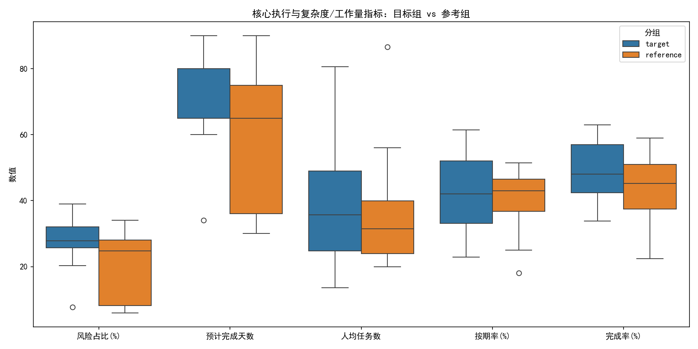
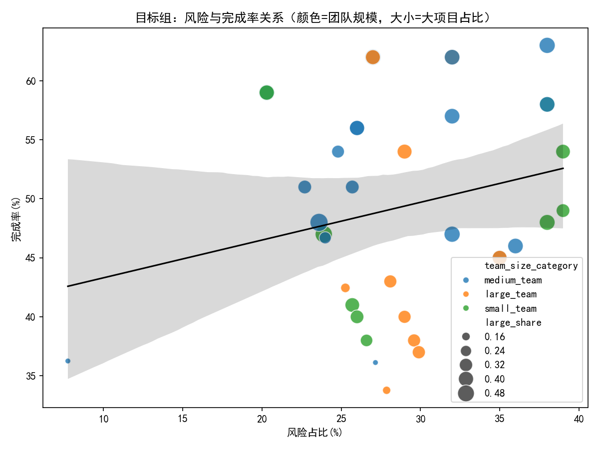
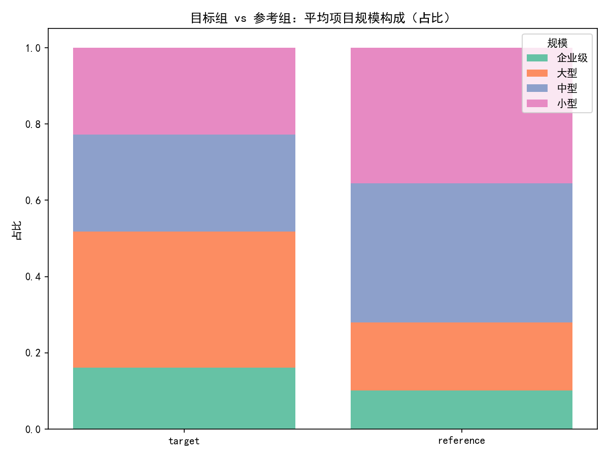
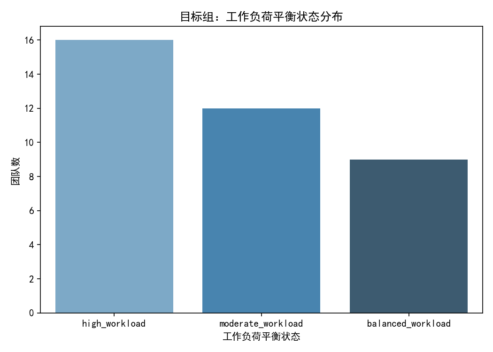

# Asana 团队“健康度高但完成率低”现象诊断与优化建议

本文聚焦协作与资源优化打分均≥8，但平均完成率低于70%的团队，基于 asana__team_efficiency_metrics 表进行多维诊断（项目规模分布、成员工作负荷、任务复杂度等），并提出改进建议。

一、分析对象与方法
- 数据范围：唯一表 asana__team_efficiency_metrics，共50个团队。
- 目标团队筛选条件：collaboration_efficiency_score ≥ 8 且 resource_optimization_score ≥ 8 且 avg_completion_rate < 70。满足条件的团队共 37 个（其余 13 个为参考组）。
- 输出与可视化：生成四张图片，并输出分组汇总与相关性度量（均保存在当前目录）。
  - fig1_box_compare.png：核心执行与复杂度/工作量指标（箱线图，对比目标组 vs 参考组）
  - fig2_scatter_risk_completion.png：目标组中风险与完成率关系（点大小=大型项目占比，颜色=团队规模）
  - fig3_stacked_project_mix.png：项目规模构成（占比）对比（堆叠柱）
  - fig4_workload_balance_dist.png：目标组工作负荷平衡状态分布
- 统计口径备注：avg_completion_rate 的取值范围为百分比0–100（整体 min≈22.37, max=63.0, 平均≈47.90）。

二、主要发现（定量结论）
1) 目标组并非“执行粗糙”，而是“结构性复杂导致闭环慢”
- 质量与健康得分更高：
  - 目标组 avg_quality_rate≈70.81，高于参考组≈54.51。
  - 目标组 avg_project_health≈54.38，高于参考组≈46.24。
  - 目标组 avg_project_performance≈57.72，高于参考组≈49.27。
- 但完成率仍低（均<70，目标组整体均值≈49.33）：关键差异在项目组合与周期上：
  - 目标组预计工期平均更长：avg_estimated_completion_days≈71.3（参考组≈58.3）。
  - 目标组项目规模更“重”：large_share≈0.358、enterprise_share≈0.160（参考组分别≈0.177、0.102）；相对地，medium/small 占比显著更低。
  - 进度可靠性偏低：on_schedule_rate_pct≈42.99（参考组≈40.40，虽略高但整体仍低）。
  - 速度略低：avg_project_velocity≈0.508（参考组≈0.531）。
  - 逾期率并不更糟：overdue_proj_rate≈0.222（与参考≈0.223 相当），overdue_task_rate≈0.159（优于参考≈0.196）。
- 解释：目标组的“质量与协作/资源优化做得不错”，但“组合中大型/企业级项目占比偏高 + 估算工期更长 + 进度可靠性不足”，共同造成阶段性完成率偏低。

2) 工作负荷结构与团队成熟度，对完成率构成掣肘
- 目标组工作负荷平衡状态：高负荷占比团队数≈43.2%，中等≈32.4%，平衡≈24.3%（见图4）。
- 团队成熟度分布：emerging≈75.7%，developing≈24.3%，成熟度整体偏低。
- 高负荷成员占比（高负荷成员/独立成员）在两组平均值上相当（≈44.6%），但目标组的“团队成熟度偏低 + 大型项目占比高”叠加，可能导致计划与执行节奏难以稳定，拉低“阶段性闭环”。

3) 相关性与回归线索：进度可靠性是完成率的关键杠杆
- 目标组相关性（Pearson，相对线性）：
  - on_schedule_rate_pct 与 avg_completion_rate：corr≈0.962（极强正相关）
  - avg_estimated_completion_days 与 avg_completion_rate：corr≈0.395
  - avg_tasks_per_member 与 avg_completion_rate：corr≈0.374
  - overdue_proj_rate 与 avg_completion_rate：corr≈-0.036（近乎无关）
  - avg_risk_percentage 与 avg_completion_rate：corr≈0.235（整体弱正，可能受规模/成熟度等混杂影响）
- 简单回归斜率（目标组）：
  - 完成率 对 按期率：斜率≈0.772（按期率每提升10个百分点，完成率预计提升≈7.7个百分点）
  - 完成率 对 预计天数：斜率≈0.270（每多1天预计工期，完成率增加≈0.27个百分点，提示“更真实/更长的估算”在目标组中并未伤害闭环，可能代表范围控制更稳健）
  - 完成率 对 风险占比：斜率≈0.320（与直觉相悖，推测存在分组混杂；需分层检验）
- 启示：与逾期率不同，“按期率”对完成率的解释力度远强。提升进度可靠性（计划可信度与执行节奏稳定性）是破解“高健康度但低完成率”的第一抓手。

三、图表解读
- 图1：核心执行与复杂度/工作量指标箱线图（目标组 vs 参考组）
  - 查看 fig1_box_compare.png
  - 目标组的风险、预计天数分布整体偏高；按期率中位数偏低；但人均任务量与参考组相近。
- 图2：风险 vs 完成率（点大小=大项目占比，颜色=团队规模，仅目标组）
  - 查看 fig2_scatter_risk_completion.png
  - 可见不同团队规模（颜色）下的关系形态存在差异，整体回归线斜率较小，关系易受规模与成熟度混杂影响。
- 图3：项目规模构成（占比）对比
  - 查看 fig3_stacked_project_mix.png
  - 目标组大型与企业级项目占比显著更高，这是阶段性完成率偏低的重要结构性原因。
- 图4：目标组工作负荷平衡状态分布
  - 查看 fig4_workload_balance_dist.png
  - 高负荷与中等负荷团队占比超过七成，叠加低成熟度，使进度可靠性与闭环能力承压。

四、综合诊断：为何“健康度高但完成率低”
- 组合层面：大型/企业级项目占比高，平均周期更长，导致同周期内“已完成”数量偏少，即使过程质量与协作效率优秀，阶段性完成率仍被拉低。
- 进度可靠性：按期率整体偏低，是直接拖累完成率的关键因素，且其与完成率高度相关。
- 团队能力结构：成熟度偏低，高负荷团队占比高，导致估算与节奏控制能力不稳定，进一步影响按期率。
- 非主要因素：逾期任务/项目占比并非主要差异项（目标组并不更差）；人均任务量与参考组接近，说明“完成率低”并非纯粹的个体产能不足，而是“项目结构+节奏”的问题。

五、规范性建议（含量化目标）
A. 优化项目组合与范围切分
- 将大型/企业级项目拆分为阶段性里程碑或子项目，提升“可完成单元”的规模合理性，直接改善周期内完成率。
- 优先对“企业级+emerging成熟度团队”的组合实施拆分试点，设置每季度可交付里程碑数 KPI。
- 量化目标：将 large_share 从≈0.36 逐步降至≈0.25（转移到 medium/small），并以每季度提升完成率≥5个百分点为里程碑。

B. 提升进度可靠性（按期率是第一杠杆）
- 建立计划基线与变更门禁：冻结关键路径任务的交付窗口，限制中途范围波动。
- 引入 WIP 限制与双周节奏检查，定位“阻塞项”和瓶颈角色，快速清障。
- 将 on_schedule_rate_pct 作为 OKR 的关键先行指标，结合上文回归斜率：
  - 按期率每+10pp，完成率预计+7.7pp。设定季度目标：按期率提升10–15pp，对应完成率提升约8–12pp。
- 将“低成熟度+高负荷”的团队作为重点辅导对象，配备项目经理/交付经理进行节奏管理。

C. 加强估算与风险管理的“可执行性”
- 针对 emerging 团队开展估算校准与任务分解训练（Story slicing、三点估计、参考类比法）。
- 建立风险燃尽与风险缓冲机制：每个大型项目至少设置1–2个缓冲点，避免全局延期。
- 度量与反馈：将“预计天数偏差率”纳入评审，约束“短估导致延期”的行为。

D. 负荷再均衡与跨团队支持
- 使用 high_workload_share 作为团队级预警阈值（>45%即触发干预），跨团队调配资源或暂缓接单。
- 引入“关键岗位替补池”，减少单点瓶颈，保证节奏稳定。

六、方法补充与局限
- 相关性与简单回归为线性近似，存在混杂（如团队规模、成熟度）。建议后续做分层或多元回归，以验证“按期率主导效应”的稳健性。
- 本次分析未做数据清洗；极端值可能影响图形分布，但不改变总体趋势判断。

七、关键输出文件与可视化
- 对比汇总（均值）：group_summary.csv
- 目标组分类分布：target_cat_dist.csv
- 目标组相关性矩阵：target_corr_matrix.csv
- 图表文件：
  - fig1_box_compare.png
  - fig2_scatter_risk_completion.png
  - fig3_stacked_project_mix.png
  - fig4_workload_balance_dist.png

图表预览（点击查看原图）：
- 核心指标对比箱线图：
- 风险与完成率关系：
- 项目规模构成对比：
- 工作负荷平衡状态分布：

附：生成图表的关键代码片段（含中文字体设置）
```python
import matplotlib.pyplot as plt
import seaborn as sns

# 中文字体与负号
plt.rcParams['font.sans-serif'] = ['SimHei']
plt.rcParams['axes.unicode_minus'] = False

# 示例：目标组 vs 参考组箱线图（节选）
# df_melt 为已整理的长表，包含列 ['group','metric_label','value']
plt.figure(figsize=(12,6))
sns.boxplot(data=df_melt, x='metric_label', y='value', hue='group')
plt.title('核心执行与复杂度/工作量指标：目标组 vs 参考组')
plt.xlabel('')
plt.ylabel('数值')
plt.legend(title='分组')
plt.tight_layout()
plt.savefig('fig1_box_compare.png', dpi=150)
```

结语
- 这批“协作与资源优化双高但完成率低”的团队，本质是“组合结构偏重 + 进度可靠性不足 + 成熟度偏低”导致阶段性闭环能力不足。建议以“按期率”为抓手，配合项目拆分与负荷再均衡，预计能较快拉升完成率；中长期通过成熟度建设，固化稳定节奏与可预测交付能力。
