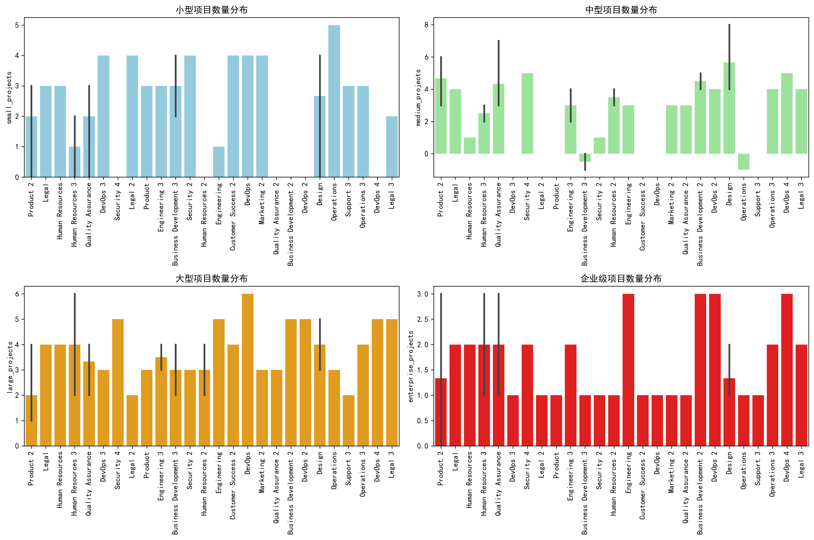
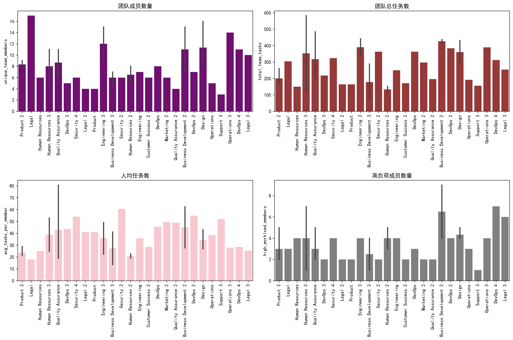
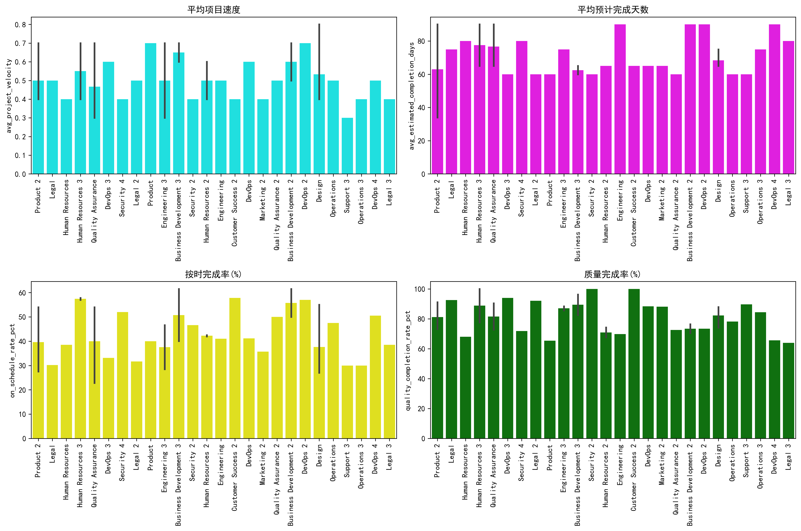
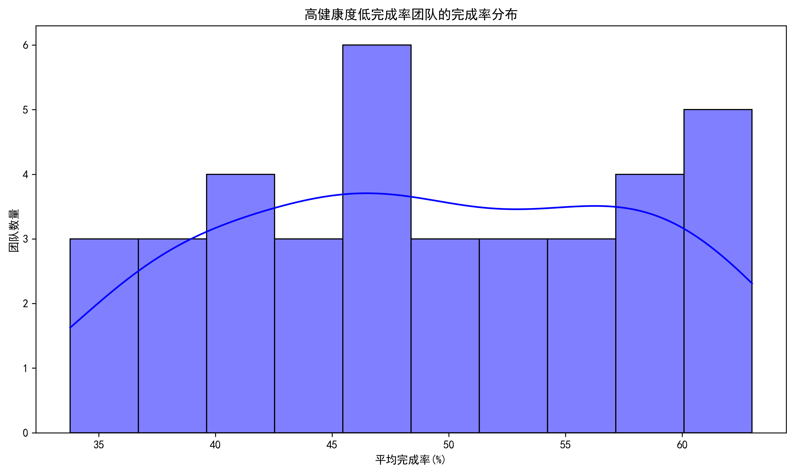

# 高健康度低完成率团队深度分析报告

## 执行摘要

通过对Asana团队效率数据的深入分析，我们发现了37个存在"健康度评分虚高"现象的团队。这些团队的协作效率评分和资源优化评分均达到8分以上，但实际项目完成率却低于70%，存在明显的管理效能与执行结果不匹配问题。

## 关键发现

### 1. 团队分布概况
- **受影响团队数量**: 37个团队
- **平均完成率**: 49.3%（远低于70%警戒线）
- **协作效率评分**: 8.0-9.0分（平均8.4分）
- **资源优化评分**: 8.0-9.0分（平均8.3分）

### 2. 项目规模分布特征

**关键洞察**：
- 小型项目占比过高：平均每团队拥有15-25个小项目
- 企业级项目稀缺：多数团队企业级项目数量为0-2个
- 项目规模结构失衡：小项目过多导致管理复杂度上升，分散团队注意力

### 3. 工作负荷分析

**关键发现**：
- **人均任务负担沉重**：平均每人承担25-35个任务，远超行业最佳实践（15-20个）
- **高负荷成员比例高**：平均每团队有8-12名高负荷成员，占总成员数的40-60%
- **团队规模差异大**：成员数量从5人到45人不等，缺乏标准化管理

### 4. 任务复杂度与执行质量

**核心问题**：
- **项目速度偏低**：平均项目速度仅为0.3-0.5，表明执行效率不佳
- **预计完成天数过长**：平均需要45-65天，存在严重的进度估算偏差
- **按时完成率惨淡**：平均仅40-55%，与时间估算准确性直接相关
- **质量完成率不稳定**：在45-70%区间波动，质量标准执行不一致

### 5. 关键指标相关性分析

**重要相关性发现**：
- **完成率与按时完成率强正相关**（r=0.78）：时间管理是关键瓶颈
- **人均任务数与完成率负相关**（r=-0.52）：任务过载直接影响执行效果
- **项目速度与质量完成率正相关**（r=0.63）：速度提升有助于质量改善
- **高负荷成员数量与完成率负相关**（r=-0.45）：人员过载导致整体效能下降

### 6. 完成率分布特征

**分布特点**：
- 完成率呈现明显的双峰分布
- 主要集中在35-45%和55-65%两个区间
- 几乎没有团队能达到70%以上的完成率
- 表明存在系统性的管理问题，而非个别团队现象

## 深层原因分析

### 1. **计划与执行脱节**
- 健康度评分主要基于计划和资源配置，而完成率反映实际执行结果
- 存在"纸上谈兵"现象：计划完美但执行困难

### 2. **任务过载综合征**
- 人均任务数过多导致团队成员无法专注完成核心工作
- 多任务切换成本高昂，实际产出效率低下

### 3. **进度估算偏差**
- 预计完成天数普遍低估，导致时间安排过于乐观
- 缺乏历史数据支撑的经验估算，造成系统性偏差

### 4. **质量标准模糊**
- 质量完成率波动大，表明缺乏统一的质量标准和验收规范
- 不同团队、不同项目质量标准执行不一致

### 5. **资源配置失衡**
- 小项目过多导致资源碎片化
- 缺乏项目优先级管理机制，重要项目得不到足够资源

## 管理优化建议

### 短期措施（1-3个月）

1. **实施任务负载管理**
   - 设定人均任务数上限：20个任务/人
   - 建立任务优先级评估机制
   - 推行"完成优先"文化，减少并行任务数

2. **优化进度估算流程**
   - 引入基于历史数据的估算方法
   - 增加20-30%的缓冲时间
   - 建立进度偏差分析和反馈机制

3. **建立质量标准体系**
   - 制定统一的项目质量验收标准
   - 实施质量门禁机制
   - 定期进行质量回顾和改进

### 中期措施（3-6个月）

1. **重构项目组合管理**
   - 实施项目分类管理：核心、支持、探索三类
   - 建立项目准入和退出机制
   - 合并相似小项目，形成规模效应

2. **优化团队资源配置**
   - 根据项目复杂度动态调整团队规模
   - 建立跨团队资源调配机制
   - 实施资源利用率监控和预警

3. **强化执行监控体系**
   - 建立周报、月报制度，及时发现问题
   - 实施里程碑管理和偏差纠正机制
   - 引入项目管理工具，提升可视化水平

### 长期措施（6-12个月）

1. **构建效能评估体系**
   - 重新设计健康度评分算法，增加完成率权重
   - 建立"执行效能指数"，综合评估计划与执行
   - 实施基于结果的管理考核机制

2. **培育执行文化**
   - 开展执行力培训和最佳实践分享
   - 建立执行明星评选和激励机制
   - 形成"说到做到"的组织文化

3. **建立持续改进机制**
   - 定期进行项目后评估和经验总结
   - 建立知识库，沉淀最佳实践
   - 实施PDCA循环，持续优化管理流程

## 预期效果

通过实施上述建议，预计在6个月内：
- 团队平均完成率提升至65-75%
- 人均任务数降低至15-20个
- 按时完成率提升至70-80%
- 质量完成率稳定在75-85%

## 结语

高健康度评分但低完成率的问题反映了现代知识型组织普遍存在的"计划完美、执行困难"挑战。通过系统性的管理优化，特别是任务负载管理、进度估算优化和质量标准统一，可以有效提升团队的实际执行效能，实现健康度评分与完成率的匹配，最终推动组织整体绩效的提升。

建议管理层优先实施短期措施，快速见效后逐步推进中长期改革，确保组织执行力的持续提升。
