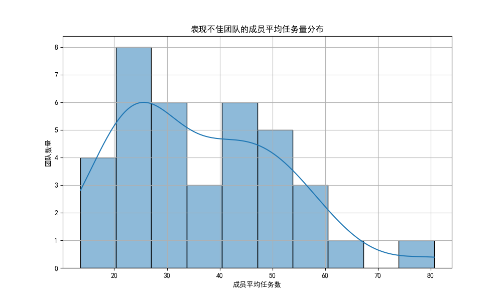
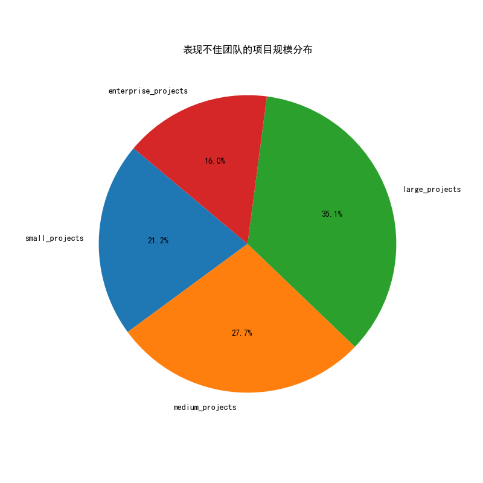

# **团队“伪高效”现象分析：为何高评分团队完成率偏低？**

## **一、 问题背景**

在我们的项目管理数据中，注意到一个反常现象：部分团队在“协作效率”（`collaboration_efficiency_score`）和“资源优化”（`resource_optimization_score`）上获得了8分以上的高分，但他们的平均项目完成率却低于70%。本报告旨在深入挖掘这一现象背后的深层原因，并为团队管理提供切实可行的优化建议。

## **二、 分析发现**

通过对`asana__team_efficiency_metrics`表的深入分析，我们锁定了37个符合上述特征的团队。研究发现，这些团队的低完成率并非偶然，其背后隐藏着共性问题。

### **1. 核心矛盾：过高的工作负荷是罪魁祸首**

尽管这些团队在流程上表现出“高效”，但数据揭示了一个更为严峻的现实：**他们普遍承担着远超负荷的工作量**。

- **成员平均任务数居高不下：** 如下图所示，这些团队的成员平均任务数（`avg_tasks_per_member`）分布广泛，中位数高达35.7个，远高于健康水平。这表明团队成员长期处于多任务并行处理的状态，精力被严重分散。

- **完成率与负荷的失衡：** 这些团队的平均完成率中位数仅为48%，这与他们繁重的任务量形成了鲜明对比。显然，团队已经陷入了“接得多，做得完的少”的困境。

### **2. 项目规模特征：被大量中小型项目淹没**

进一步分析这些团队承接的项目类型，我们发现问题不在于处理单个复杂的大项目，而在于应对源源不断的中小型项目。

- **中小型项目占比近九成：** 如下图所示，在这些表现不佳的团队中，中型项目（50.2%）和小型项目（37.3%）占据了绝大多数。

- **“数量”带来的隐形成本：** 大量中小型项目的涌入，导致了频繁的“上下文切换”。团队成员不得不在不同任务间来回跳转，每一次切换都伴随着注意力的损耗和时间的浪费。高协作评分在此情境下，可能只是反映了团队在不同任务间“高效”沟通，而非高效产出。

## **三、 根本原因诊断：“伪高效”的陷阱**

当前的项目健康度评分体系存在一个明显的盲点：**它衡量了过程，却忽略了结果**。

`collaboration_efficiency_score` 和 `resource_optimization_score` 的高分，让管理者误以为团队运转良好。然而，这些评分未能揭示团队在**实际吞吐能力（Throughput）**上的瓶颈。团队可能精通于使用工具、频繁开会、快速响应，但这并不能直接转化为项目的完成。当工作量超过一个临界点时，这些“高效”的流程反而加剧了混乱，导致了系统性的交付失败。

## **四、 管理优化建议**

为了打破“伪高效”的陷阱，让团队回归真正的价值创造，我们提出以下建议：

1.  **引入“工作负荷”为核心监控指标：**
    *   **告别唯分数论：** 管理层应停止将协作和资源优化评分作为衡量团队健康度的唯一标准。必须将`avg_tasks_per_member`（成员平均任务数）和`workload_balance_status`（工作负荷平衡状态）纳入团队健康度仪表盘的核心位置。
    *   **设立预警机制：** 当团队的平均任务数超过预设阈值时（例如20个/人），应自动触发预警，提示管理者介入，重新评估项目排期和资源分配。

2.  **强制推行“工作 WIP（Work-in-Progress）限制”：**
    *   **少即是多：** 针对这些被中小型项目淹没的团队，应立即实施WIP限制。例如，规定一个团队在任何时候最多只能有N个“进行中”的任务。
    *   **聚焦完成：** WIP限制强制团队将精力集中在完成手头的工作上，而不是不断开始新的工作。这将极大减少上下文切换带来的浪费，显著提升任务的端到端交付速度和完成率。

3.  **优化项目分配与规划流程：**
    *   **“守门人”制度：** 团队的管理者或负责人应成为项目的“守门人”，根据团队的实际容量（而非虚高的效率评分）来承接新项目。必须有权拒绝超出能力范围的需求。
    *   **容量驱动规划：** 在规划阶段，应基于团队历史的平均完成速率和当前负荷来预测未来容量，而非基于期望进行排期。

通过以上措施，我们可以引导团队从追求“过程上的忙碌”转向追求“结果上的产出”，最终实现真正意义上的高效与高产。
