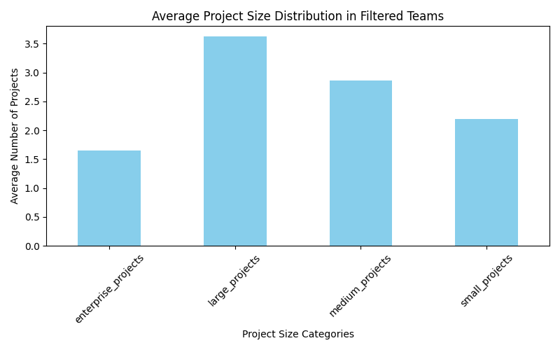
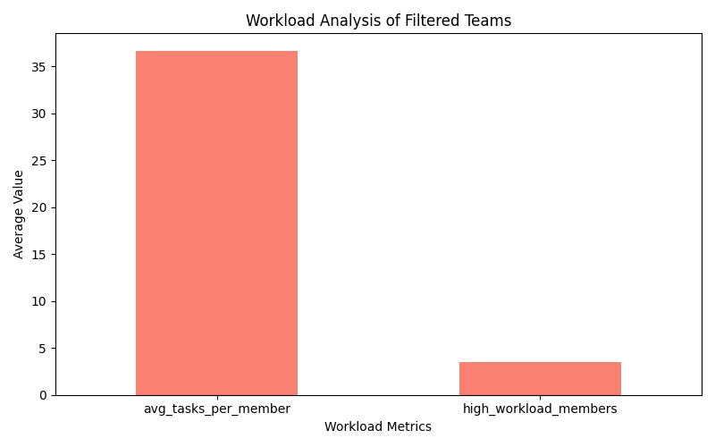
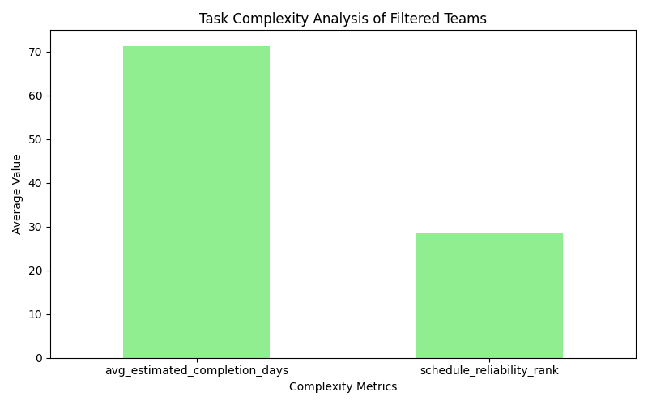

# 团队效率分析报告

根据数据分析结果，以下是关键发现和建议：

## 关键发现

1. **项目规模分布**：
   - 筛选后的团队平均拥有的企业级、大型、中型和小型项目的分布情况如图 `project_size_distribution.png` 所示。
   - 这些团队可能在管理较大项目方面存在挑战，导致完成率较低。

2. **成员工作负荷**：
   - 从图 `workload_analysis.png` 可以看出，每个成员平均任务数较高，且高工作负荷成员数量较多。
   - 这表明团队成员可能面临过度工作，从而影响项目完成率。

3. **任务复杂度**：
   - 从图 `task_complexity_analysis.png` 可以看出，平均预估完成天数较长，且项目进度可靠性排名偏低。
   - 任务较为复杂，可能导致项目完成难度增加，影响实际完成率。

## 建议

- **优化项目管理**：
  改进项目规模管理，合理分配资源，以提高项目完成率。

- **平衡工作负荷**：
  通过优化团队成员的工作任务分配，降低高工作负荷成员的压力，提高整体项目执行效率。

- **提升任务管理**：
  引入更高效的任务管理方法，缩短预估完成时间，提高项目进度的可靠性。

