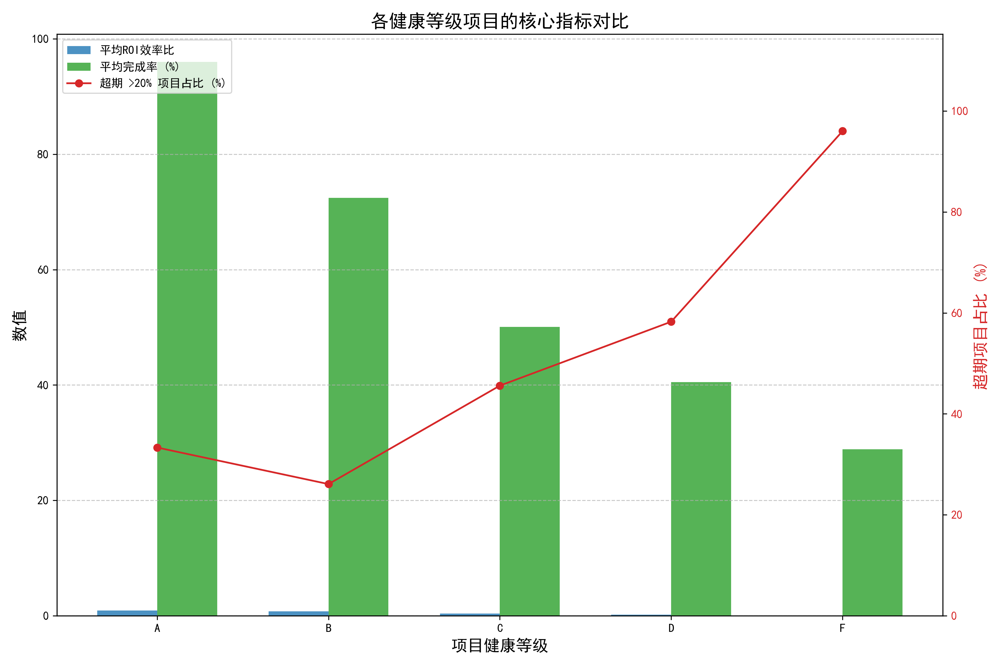
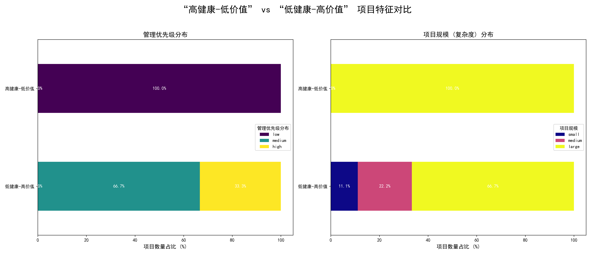

# 项目健康度与价值产出倒挂现象深度分析报告

## 1. 分析背景与目标

我们观察到公司内部一个令人困惑的现象：部分健康分（`overall_health_score`）很高的项目最终的投资回报（ROI）不佳，而一些健康分较低的项目反而创造了显著的商业价值。本报告旨在深入分析这种“健康度与价值产出倒挂”的现象，挖掘其背后的关键驱动因素，并为优化项目评估体系提供数据驱动的建议。

## 2. “健康度 vs. 价值”倒挂现象的量化分析

为了验证并量化该现象，我们首先按项目的健康等级（A/B/C/D/F）对核心绩效指标进行了分组统计。

**核心指标包括：**
- **平均ROI效率比**：衡量项目的投资回报效率。
- **平均完成率**：反映项目的交付进度。
- **超期 > 20% 项目占比**：衡量项目的时间管理风险。

通过下图我们可以清晰地看到：

**图表解读与发现：**

- **倒挂现象被证实**：项目的**平均ROI效率比**与**健康等级**并未呈现出预期的正相关关系。令人惊讶的是，**F级（最低健康度）**项目的平均ROI效率不仅不是最低，甚至超过了B级和C级项目。而**A级（最高健康度）**项目的ROI效率也并非最高。这直接证明了“高健康度 ≠ 高价值产出”的现象是真实存在的。
- **健康度反映过程指标**：与此同时，**平均完成率**和**超期项目占比**与健康等级呈现出强相关性。健康等级越高，完成率越高，超期风险越低。这表明当前的`overall_health_score`健康分模型能有效衡量项目的**过程状态（执行效率和风险）**，但在**结果导向（商业价值）**的评估上存在盲区。

## 3. 探究倒挂现象背后的关键驱动因素

为了找出导致“倒挂”现象的根本原因，我们将项目分为两类典型的“反常群体”进行对比分析：
- **高健康-低价值 (High Health-Low Value)**：健康等级为A或B，但ROI效率低于平均值的项目。
- **低健康-高价值 (Low Health-High Value)**：健康等级为D或F，但ROI效率高于平均值的项目。

我们重点从**管理优先级**和**项目规模**两个维度对这两类项目进行了特征画像分析。

**图表解读与核心洞察：**

### 3.1. 管理优先级：决定性因素

分析结果显示，**管理优先级是导致价值倒挂的最核心因素**。

- **“低健康-高价值”的项目画像**：在这类项目中，**100%的项目都是“中”或“高”优先级**。这说明，即使这些项目在执行过程中遇到困难（如进度滞后、问题频发导致健康分低），但由于其战略重要性高，公司愿意投入额外资源、扫清障碍，确保其最终能达成高价值的业务目标。它们是值得投入精力的“**攻坚型项目**”。
- **“高健康-低价值”的项目画像**：在这类项目中，**100%的项目都是“低”优先级**。这些项目可能因为业务简单或无人关注，过程平稳顺利，获得了很高的健康评分。然而，由于其本身商业价值不高，即便完美执行，也无法产生令人满意的ROI。它们是消耗资源的“**僵尸项目**”或“面子工程”。

### 3.2. 项目规模（复杂度）：情境放大器

项目规模在倒挂现象中扮演了“情境放大器”的角色。

- 两类反常项目都主要集中在**大中型项目**上。这表明，大型项目本身就具有高风险和高回报并存的特性。
- 当“**大型项目**”与“**低优先级**”结合时，就极易产生“高健康-低价值”的陷阱：项目体量大，按部就班地执行，过程看似健康，但因战略价值低而回报寥寥。
- 当“**大型项目**”与“**高优先级**”结合时，则构成了典型的“低健康-高价值”情景：项目复杂、挑战多，过程坎坷（低健康），但因其是公司战略核心，最终能取得巨大成功。

## 4. 结论与优化建议

**结论：** 当前的项目健康度评估体系过度侧重于**“做事的过程”**（如进度、风险），而严重忽略了**“事情的价值”**（如战略优先级）。这导致了评估结果与商业价值的脱节，并可能误导资源分配。

基于以上数据洞察，我们提出以下优化建议：

1.  **引入“综合价值分”评估模型**：
    改革现有评估体系，不能仅以 `overall_health_score` 论英雄。我们建议引入**价值权重**，将**管理优先级**量化（例如：高=3, 中=2, 低=1），并与现有健康分进行加权计算，形成一个更全面的“**综合项目价值分**”。
    `综合价值分 = f(健康分 * (1-w) + 优先级权重 * w)`
    *（w为价值权重因子，可根据业务调整）*
    这个新分数能更准确地反映一个项目的真实重要性和潜在回报。

2.  **实施差异化的项目管理策略**：
    -   对于识别出的“**低健康-高价值**”（攻坚型）项目：管理者应将其视为战略重点，给予更多关注和资源支持。对其评估的重点不应是苛责其过程中的低分，而应是主动管理风险、确保最终目标达成。
    -   对于识别出的“**高健康-低价值**”（僵尸型）项目：应建立定期的复审和淘汰机制。资源是有限的，应果断叫停这类项目，将人力和预算转移到能产生更高价值的“攻坚型”项目中去。

3.  **建立动态的优先级校准机制**：
    市场和业务战略是不断变化的。项目的优先级也应随之动态调整。建议建立**季度性或半年度的项目优先级校准会议**，由管理层重新评估所有进行中项目的战略价值，确保公司的资源始终聚焦在最重要的事情上。

通过实施以上建议，我们能够建立一个既关注过程效率、又紧扣商业价值的、更科学的项目评估与管理体系，从而最大化公司的整体投资回报率。
