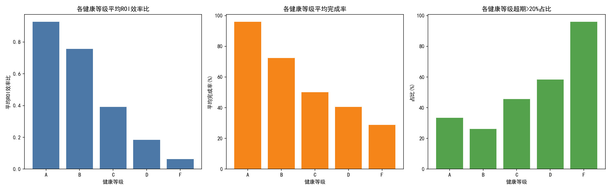
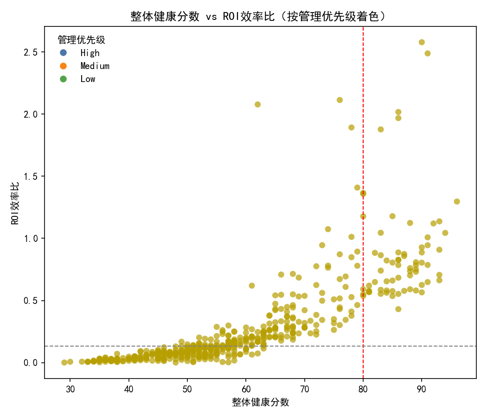
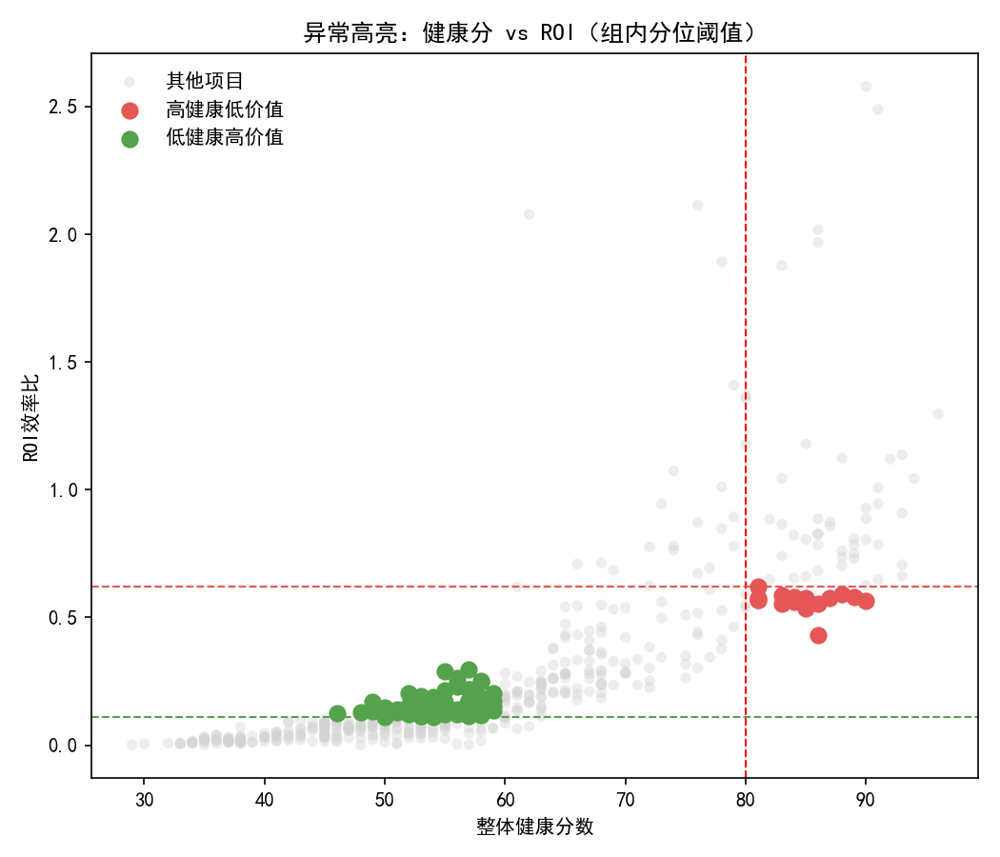
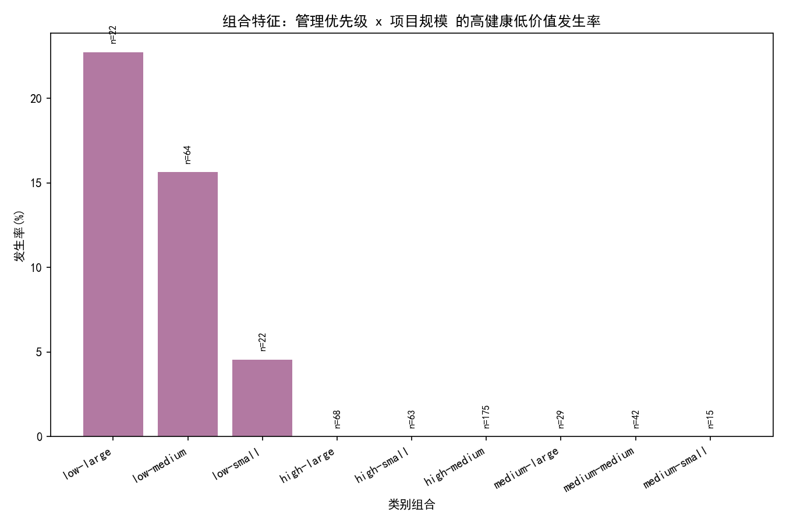
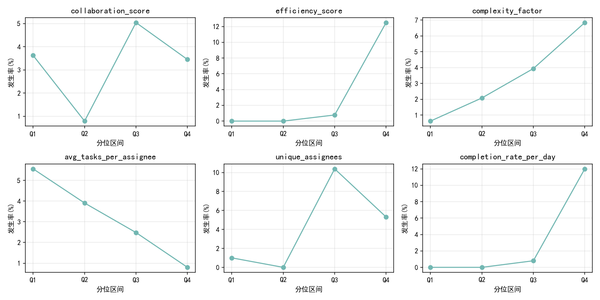

# 项目“健康度与价值产出倒挂”诊断分析报告

以下分析基于 SQLite 表 asana__project_analytics（仅使用 is_valid_record=1 的记录，n=500）。我们从三个层面展开：
- 健康等级的整体画像：平均ROI效率比、平均完成率、超期率（超出计划工期20%以上占比）。
- 倒挂样本识别：采用“组内分位阈值”更灵敏地识别“高健康低价值”与“低健康高价值”。
- 驱动因素分析：从团队规模、项目规模、管理优先级、风险等级、进度预测、成熟阶段、协作效率等维度识别倒挂背后的结构性原因，并提出优化建议。

可视化预览（图片保存在当前目录，报告中引用文件名）：
- 健康等级画像：health_grade_metrics.png
- 健康分 vs ROI（着色/异常高亮）：health_vs_roi.png, anomaly_highlight.png
- 倒挂驱动因素与特征组合：anomaly_drivers_high_low.png, combo_priority_size.png, combo_risk_team.png
- 数值特征曲线：numeric_driver_curves.png

提示：绘图采用中文字体渲染，关键代码配置如下（见下方代码片段）。

## 一、健康等级（A/B/C/D/F）画像与对比

图：

关键发现（均为样本均值）：
- 平均ROI效率比（A→F随等级下降而下降）：
  - A: 0.928
  - B: 0.756
  - C: 0.392
  - D: 0.184
  - F: 0.062
- 平均完成率（%）：
  - A: 96.00
  - B: 72.44
  - C: 50.05
  - D: 40.52
  - F: 28.84
- 超期率（>20%）：呈明显“健康越低越易超期”的梯度
  - A: 33.33%
  - B: 26.09%（B优于A可能与A类任务更复杂/目标更激进有关，见下文）
  - C: 45.59%
  - D: 58.26%
  - F: 96.02%

解读：
- 宏观层面，“健康等级”与“ROI/完成率/超期率”基本一致；但从微观项目看，仍可能出现“健康高但价值低”或“健康低但价值高”的个案，这就是本文要诊断的“倒挂”现象。

## 二、“倒挂”样本识别与分布

方法口径：
- 全局阈值（健康>80 且 ROI<全体中位数；健康<60 且 ROI>全体Q75）识别不到样本，说明总体一致性较强。
- 更贴近业务观察的“组内分位阈值”：
  - 在高健康组（overall_health_score>80）内，以 ROI 的Q25 作为“低价值”界；
  - 在低健康组（overall_health_score<60）内，以 ROI 的Q75 作为“高价值”界。

本数据阈值：
- 高健康组 ROI Q25 = 0.6194
- 低健康组 ROI Q75 = 0.11165

样本规模：
- 高健康低价值（组内Q25以下）：16 个
- 低健康高价值（组内Q75以上）：73 个

可视化：
- 健康-ROI分布（按管理优先级着色）：
- 异常高亮（含组内阈值线）：

直观观察：
- 一部分“高健康”的项目，ROI落在组内低位（红色点），可能是“稳态交付型”或“低优先级维护类”——流程健康，商业价值较弱。
- 相当一部分“低健康”的项目，ROI却处于组内高位（绿色点），多为“探索/攻坚型”或“小团队高优先级”——过程有挑战，但价值产出弹性高。

## 三、倒挂的关键驱动因素

A. 高健康低价值（组内阈值）驱动因素
- 发生率提升度Top（lift为相对全体该类异常的提升倍数）：
  - 管理优先级=low，发生率提升×4.63（最强信号）
  - 进度预测=on_schedule，提升×3.59
  - 风险等级=minimal_risk，提升×2.43
  - 团队规模=medium_team，提升×1.63；large_team，×1.38
  - 项目规模=large，×1.31
  - 成熟阶段=execution，×1.19
- 可视化（类别Top10）：
- 组合特征最显著（管理优先级 × 项目规模）：
  - low × large：发生率 22.7%（n=22）
  - low × medium：15.6%（n=64）
  - low × small：4.5%（n=22）
  - 高/中优先级 × 各规模：基本接近0
- 组合可视化：

诊断结论：
- “高健康低价值”的核心画像是：低管理优先级 + 稳态（on_schedule、minimal_risk）+ 中/大型团队与项目 + 执行阶段。
- 机制解释：低优先级往往对应维护/合规/技术债偿还等，流程规范、风险低、按计划推进，但商业收益有限；规模越大越可能形成“把事情做对”但“做对的事情是否有价值”的偏差。

B. 低健康高价值（组内阈值）驱动因素
- 发生率提升度Top：
  - 风险等级=medium_risk，提升×1.99（最强单因子）
  - 项目规模=small，×1.37；团队规模=small_team，×1.32
  - 管理优先级=high，×1.30；=medium，×1.19
  - 成熟阶段=execution，×1.14；进度预测=behind_schedule，×1.10
  - 风险等级=high_risk，×1.05；minimal_risk 反而显著低于平均（×0.72）
- 组合特征（风险等级 × 团队规模）：
  - medium_risk × small_team：46.2%（n=26，最强组合）
  - low_risk × large_team：21.4%（n=14）
  - high_risk × small_team：20.4%（n=93）
- 组合可视化：

诊断结论：
- “低健康高价值”的核心画像是：小团队 + 小规模 + 中等风险 + 高优先级 + 执行阶段 + 往往略滞后于计划。
- 机制解释：这类项目偏“探索/增长型”，目标激进、需求变化快，进度压力导致健康分偏低，但商业回报弹性大；中等风险更像可控探索，而极低风险/极高风险并非最佳（呈现U型）。

C. 数值特征与发生率曲线（高健康低价值）
- 我们对协作效率（collaboration_score）、效率分（efficiency_score）、时间管理（time_management_score）、复杂度、平均分配负载、独立执行人等做分位分箱，绘制发生率曲线：
- 总体趋势：在“高健康低价值”的样本里，协作/时间管理更高不一定带来更高价值，反而在“低优先级+低风险”的语境下，越顺越不“值钱”。这提示需要将“价值前置信号”纳入健康评分。

说明：为稳健起见，驱动分析对每个类别要求至少 n>=5 才纳入统计，以降低小样本噪声。

## 四、为什么会出现“倒挂”？
- 评价口径偏交付过程：健康分更多反映“过程是否稳态”（进度、质量、风险），而非“做的事情是否有商业价值”。当项目是低优先级/低风险/维护类时，健康高但价值低。
- 探索型项目的“价值-过程”张力：小团队、高优先级、探索性（中等风险）项目，为追求价值常牺牲短期流程稳态（如频繁迭代、目标调整），健康分短期偏低，但ROI更高。
- 计划达成≠价值达成：on_schedule 与低价值显著相关，提示“按计划完成的工作”不一定切中“最有价值”的问题；behind_schedule 在高价值样本中并不罕见，暗示“为价值让路”的进度弹性。

## 五、可操作的优化建议

1) 健康评估体系升级：从“过程合格”扩展为“价值就绪”
- 引入价值前置信号到健康分（与现有进度/质量/风险并行）：
  - 用户/客户牵引度：等待名单、早期转化、活跃用户/关键账户反馈强度
  - 商业杠杆：预期收入/节省成本潜力、战略匹配度、市场窗口期
  - 价值可验证性：可实验性（AB/灰度/可验证KPI）、外部依赖可控性
- 风险校准权重：对 minimal_risk 且 low priority 项目降低健康分上限权重；对 medium_risk + high priority 项目给予“探索红利”权重，避免创新项目被低健康分“误杀”。

2) 管理优先级纳入健康与资源决策主轴
- 针对“高健康低价值”的强信号组合（low priority × large/medium），建立“价值审查闸门”：
  - 若连续两个里程碑保持 on_schedule + minimal_risk，但ROI效率位于组内低位Q25以下，触发强制复盘：是否应缩减范围/并入更有价值的计划？
- 针对“低健康高价值”的强信号组合（small team × medium_risk × high priority）建立“护航机制”：
  - 提供专项 PMO/技术支援，允许合理的进度弹性；设置明确的价值里程碑与实验节奏，保障ROI兑现。

3) 迭代式资源配置与优先级再平衡
- 将“高健康低价值”项目纳入降权池，滚动回收人力至“低健康高价值”的增长型项目。
- 强化“价值-进度”的联动：对 behind_schedule 但具备高价值信号的项目，允许时间盒+范围护栏，而非一味追赶计划导致价值受损。

4) 预警与看板化运营
- 设定基于本次研究的预警规则（示例）：
  - 高健康低价值预警：管理优先级=low（lift×4.63）且 on_schedule（×3.59）且 minimal_risk（×2.43）→ 加入“价值复盘池”
  - 低健康高价值潜力：medium_risk（×1.99）且 small_team（×1.32）且 high priority（×1.30）→ 列入“护航清单”，每周评审价值里程碑
- 看板中同时展示“过程健康”和“价值信号”，避免单一健康分误导。

5) 类别化路径：交付型 vs 探索型
- 在项目立项时打上类型标（Delivery vs Discovery）。两类项目的健康评分权重、节奏与目标形态不同，评估口径应差异化，减少“倒挂”。

## 六、局限与后续工作
- 本分析未进行数据清洗，基于现有聚合指标，未纳入更细粒度任务维度（如需求类型、故事点、财务实际等）；建议后续引入价值前置KPI与财务结果做联合建模。
- 统计以发生率与提升度为主，建议下一步做逻辑回归/树模型，对“倒挂概率”做可解释预测，形成策略化阈值与评分卡。
- 针对“B级超期率低于A级”的异常，可进一步分解 A/B 的复杂度分布与目标激进程度，以验证“激进度”影响。

## 附：生成图表的关键绘图配置代码
```python
import matplotlib.pyplot as plt
plt.rcParams['font.sans-serif'] = ['SimHei']
plt.rcParams['axes.unicode_minus'] = False
```

## 图片索引
- 健康等级画像：health_grade_metrics.png
- 健康分 vs ROI（按管理优先级着色）：health_vs_roi.png
- 异常高亮（组内阈值）：anomaly_highlight.png
- 高健康低价值驱动（类别Top）：anomaly_drivers_high_low.png
- 数值特征曲线（高健康低价值）：numeric_driver_curves.png
- 组合：管理优先级 × 项目规模（高健康低价值）：combo_priority_size.png
- 组合：风险等级 × 团队规模（低健康高价值）：combo_risk_team.png

以上。
