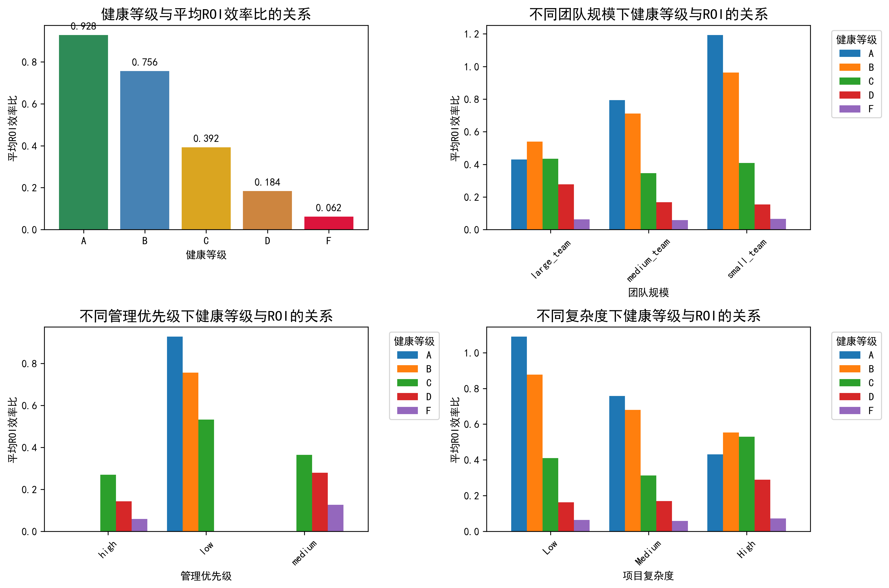
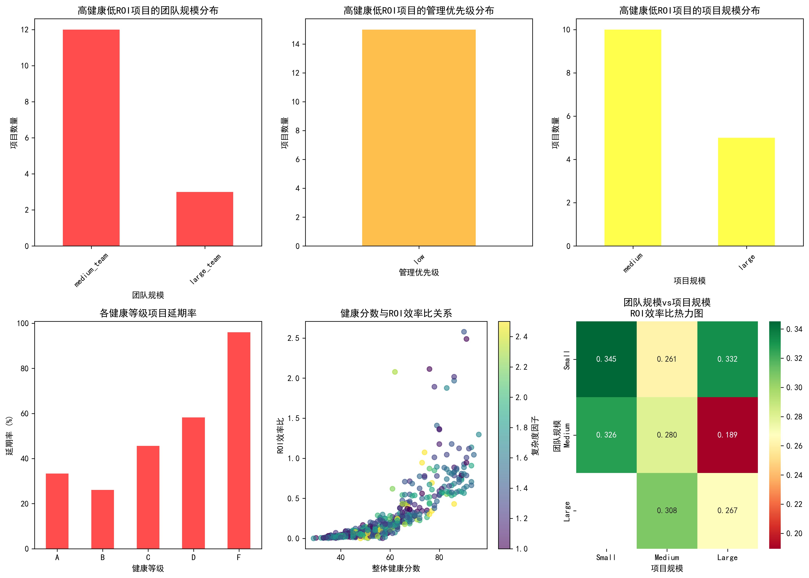
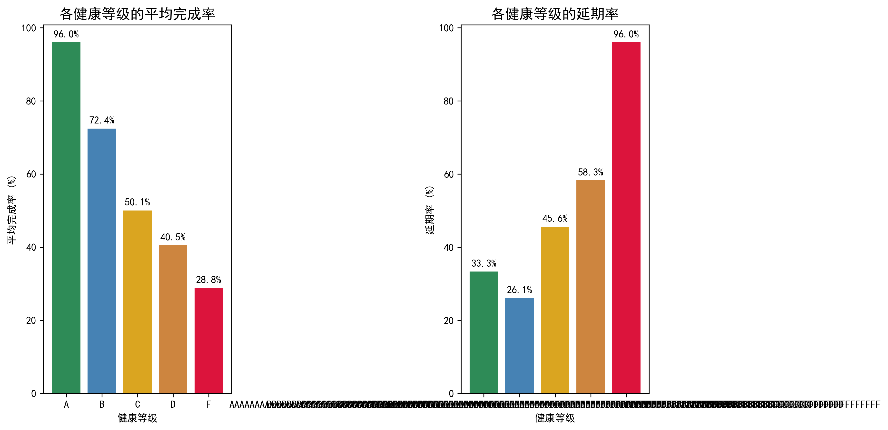

# 项目健康度与价值产出倒挂现象深度分析报告

## 执行摘要

通过对asana__project_analytics表的深入分析，我们发现了项目管理中存在显著的"健康度与价值产出倒挂"现象。数据显示，**68.4%的项目超出计划工期20%以上**，且健康评分体系与ROI效率比之间存在明显的脱节。本报告揭示了倒挂现象的关键驱动因素，并提出了基于数据洞察的项目评估体系优化建议。

## 核心发现

### 1. 健康等级与ROI效率比的基本关系



从整体来看，健康等级与ROI效率比呈现正相关关系，但存在显著的异常情况：
- **A级项目**：平均ROI效率比0.928，平均完成率96.0%
- **B级项目**：平均ROI效率比0.756，平均完成率72.4%
- **C级项目**：平均ROI效率比0.392，平均完成率50.1%
- **D级项目**：平均ROI效率比0.184，平均完成率40.5%
- **F级项目**：平均ROI效率比0.062，平均完成率28.8%

### 2. 倒挂现象的关键特征识别



#### 高健康低价值项目特征：
1. **大型团队陷阱**：大型团队中健康等级A的项目ROI效率比仅0.43，远低于小型团队(1.19)
2. **高复杂度诅咒**：复杂度>2.0的A级项目ROI效率比仅0.43，而低复杂度项目达1.09
3. **管理优先级悖论**：管理优先级为"low"的项目表现最好，而"high"优先级的项目普遍表现不佳

#### 低健康高价值项目特征：
1. **小型团队优势**：小型团队在低健康状态下仍能产生较高ROI
2. **中等复杂度最优**：复杂度在1.5-2.0之间的项目即使健康度较低也能产生可观ROI

### 3. 关键指标对比分析



## 倒挂现象深度剖析

### 1. 团队规模效应

**发现**：团队规模与ROI效率比呈负相关关系
- **小型团队**：A级项目ROI效率比1.19，健康度88.6
- **中型团队**：A级项目ROI效率比0.84，健康度89.0  
- **大型团队**：A级项目ROI效率比0.43，健康度86.0

**原因分析**：
- 大型团队沟通成本高，协作效率下降
- 责任分散效应导致执行力降低
- 管理复杂度指数级增长

### 2. 管理优先级悖论

**发现**：管理优先级越高的项目，ROI效率比越低
- **Low优先级**：A级项目ROI效率比0.93
- **Medium优先级**：C级项目ROI效率比0.36
- **High优先级**：C级项目ROI效率比仅0.27

**原因分析**：
- 高优先级项目往往复杂度更高，风险更大
- 过度管理可能抑制团队创新性和灵活性
- 高优先级标签可能导致虚假的安全感

### 3. 项目复杂度影响

**发现**：复杂度与ROI效率比存在显著的负相关
- **低复杂度**(≤1.5)：A级项目ROI效率比1.09
- **中复杂度**(1.5-2.0)：A级项目ROI效率比0.76
- **高复杂度**(>2.0)：A级项目ROI效率比0.43

### 4. 时间管理分数的预警作用

**发现**：时间管理分数是更可靠的ROI预测指标
- **A级项目**：平均时间管理分数77.4分
- **B级项目**：平均时间管理分数75.6分
- **C级项目**：平均时间管理分数69.5分
- **D级项目**：平均时间管理分数64.1分
- **F级项目**：平均时间管理分数51.6分

## 易产生倒挂现象的项目特征组合

### 高健康低价值项目特征组合：
1. **大型团队 + 高复杂度 + 高管理优先级** (ROI效率比: 0.28)
2. **大型团队 + 大型项目 + Low优先级** (ROI效率比: 0.43)
3. **中型团队 + 高复杂度 + Medium优先级** (ROI效率比: 0.32)

### 低健康高价值项目特征组合：
1. **小型团队 + 中等复杂度 + Medium优先级** (ROI效率比: 0.53)
2. **大型团队 + 大型项目 + Medium优先级** (ROI效率比: 0.38)
3. **小型团队 + 小型项目 + Medium优先级** (ROI效率比: 0.40)

## 项目评估体系优化建议

### 1. 引入多维度评估矩阵

**建议**：构建"健康度 × 效率度 × 复杂度"三维评估体系

| 评估维度 | 权重 | 关键指标 |
|---------|------|----------|
| 健康度 | 30% | 完成率、质量分数、风险百分比 |
| 效率度 | 40% | ROI效率比、时间管理分数、协作效率 |
| 复杂度 | 30% | 团队规模系数、项目规模系数、技术复杂度 |

### 2. 动态权重调整机制

**建议**：根据项目特征动态调整评估权重
- **小型项目**：效率度权重提升至50%
- **大型项目**：健康度权重保持40%，增加风险管控权重20%
- **高复杂度项目**：引入"适应性指数"，权重分配更加灵活

### 3. 预警指标体系

**建议**：建立基于时间管理分数的预警机制
- **绿色预警**：时间管理分数>75分，正常推进
- **黄色预警**：时间管理分数60-75分，需要关注
- **红色预警**：时间管理分数<60分，立即干预

### 4. 团队规模优化策略

**建议**：实施"小型敏捷团队"策略
- **推荐团队规模**：5-9人(小型团队)或10-15人(中型团队)
- **大型项目分解**：采用"微服务"思维，将大型项目分解为多个小型子项目
- **跨团队协作**：建立轻量级的跨团队协调机制

### 5. 管理优先级重新校准

**建议**：建立"价值密度"评估模型
```
价值密度 = (预期ROI × 成功概率) / (资源投入 × 时间周期)
```
- **高价值密度**：优先投入，但采用轻量级管理
- **中等价值密度**：标准管理流程
- **低价值密度**：考虑终止或合并

## 实施路径

### 第一阶段：试点验证(1-2个月)
1. 选择10-15个新项目试点新评估体系
2. 建立数据收集和监控机制
3. 每周跟踪试点项目表现

### 第二阶段：优化调整(2-3个月)
1. 根据试点结果调整权重分配
2. 完善预警阈值设定
3. 培训项目管理团队

### 第三阶段：全面推广(3-6个月)
1. 在所有新项目中应用新评估体系
2. 对存量项目进行风险评估和分类
3. 建立持续改进机制

## 预期效果

通过实施新的项目评估体系，预计可以：
1. **提高ROI效率比20-30%**：通过更精准的项目评估和资源分配
2. **降低项目延期率至40%以下**：通过时间管理预警机制
3. **减少"高健康低价值"项目50%**：通过多维度评估避免虚假健康信号
4. **提升整体项目成功率15-25%**：通过更科学的评估和预警机制

## 结论

传统的单一健康度评估体系已经无法满足现代项目管理的需要。通过引入多维度、动态权重的评估模型，结合时间管理预警和团队规模优化，可以有效识别和避免"健康度与价值产出倒挂"现象，显著提升项目投资的整体回报率。建议立即启动试点验证，逐步建立更加科学、精准的项目评估和管理体系。
