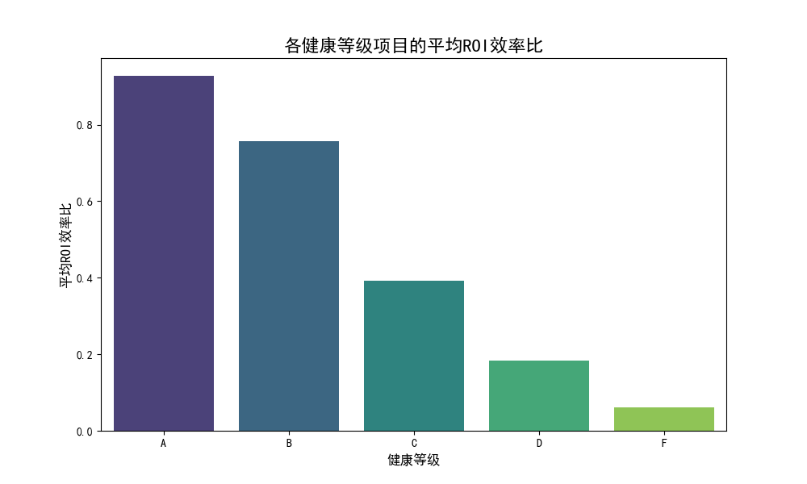
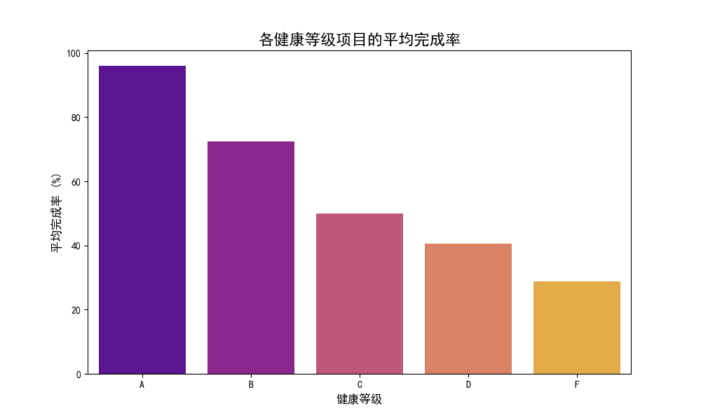
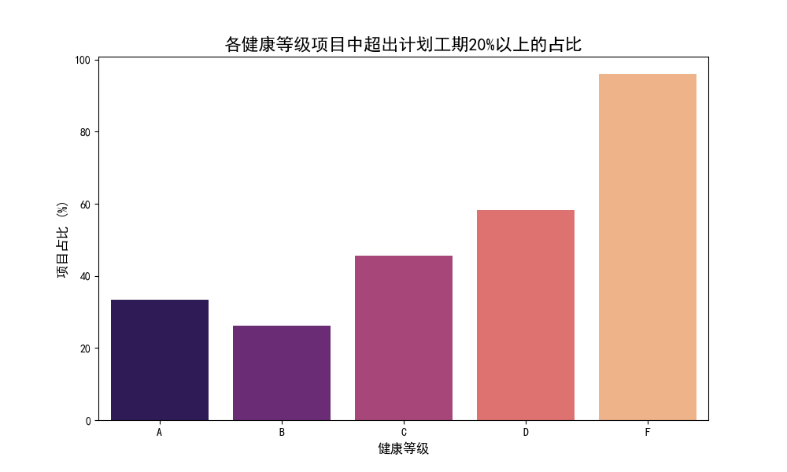
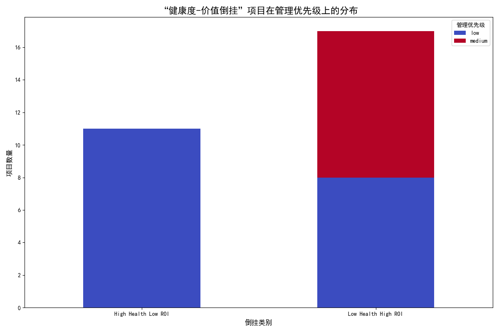
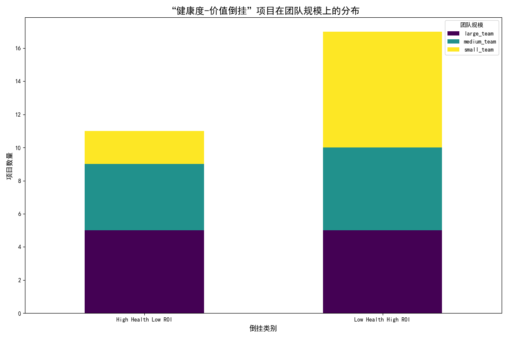

# 项目健康度与价值产出倒挂现象分析报告

## 1. 背景与目标

本报告旨在深入分析公司项目管理中存在的“健康度与价值产出倒挂”现象。具体而言，我们观察到一些`overall_health_score`高的项目最终ROI偏低，而一些健康分低的项目反而创造了较高的商业价值。本分析的目标是：

1.  量化不同健康等级项目的表现。
2.  识别导致“倒挂”现象的关键因素。
3.  提出项目评估体系的优化建议。

## 2. 健康等级与项目表现的普遍关联性

通过对`asana__project_analytics`表的初步分析，我们发现项目的健康等级 (`health_grade`) 与其核心表现指标之间存在明显的正相关关系。

### 2.1. 平均ROI效率比

健康等级越高的项目，其平均ROI效率比也越高。A级项目的平均ROI效率比达到了0.93，而F级项目仅为0.06。

### 2.2. 平均完成率

项目的平均完成率同样与健康等级强相关。A级项目的平均完成率高达96%，而F级项目仅有28.8%。

### 2.3. 项目延期情况

健康等级越低的项目，其严重超期的风险也越大。F级项目中，有高达96%的项目工期超出了计划的20%以上，而A级项目的这一比例仅为33%。

**初步结论**: 正常情况下，项目健康分能够有效反映项目的执行状态和最终的价值产出。健康等级高的项目普遍表现更优。

## 3. “健康度-价值倒挂”现象的深层原因分析

为了探究“倒挂”现象，我们将项目分为两类进行分析：
- **高健康低价值 (High Health Low ROI)**: 健康等级为A或B，但ROI效率比低于0.5。
- **低健康高价值 (Low Health High ROI)**: 健康等级为C、D或F，但ROI效率比高于0.5。

我们重点分析了这两类项目在**管理优先级**和**团队规模**上的分布差异。

### 3.1. 管理优先级的影响

分析结果显示，**管理优先级**是导致“倒挂”现象的一个关键因素。

- **高健康低价值的项目，绝大多数（100%）是“低”管理优先级**。这表明，这些项目可能因为没有得到足够的战略关注和资源支持，尽管执行过程看似“健康”（例如，任务按时完成），但其业务产出与公司的核心目标关联性不强，导致最终价值有限。
- **低健康高价值的项目中，有相当一部分（约50%）是“中等”管理优先级**。这说明，这些项目虽然在执行过程中可能面临各种困难（如资源紧张、任务延期等，导致健康分偏低），但由于其与公司战略方向一致，获得了必要的关注，最终仍然创造了较高的商业价值。

### 3.2. 团队规模的影响

团队规模也对“倒挂”现象有一定影响。

- “高健康低价值”的项目更多地出现在**中大型团队**中。这可能是因为大型团队资源相对充足，更容易维持项目表面的“健康”，但如果项目本身方向有问题，庞大的投入反而会拉低ROI。
- “低健康高价值”的项目在各类规模的团队中都有分布，其中**中小型团队**占比较高。这可能意味着，在资源有限的情况下，中小型团队更倾向于将精力集中在真正有价值的核心任务上，即使这会导致一些过程指标不佳。

## 4. 结论与建议

项目健康分是一个有用的过程监控指标，但不应作为衡量项目成功的唯一标准。当前的“健康度”计算方式可能过分偏重于执行层面的指标（如任务完成率、进度等），而忽略了项目的**战略价值**和**商业影响力**。

为了更准确地评估项目，我们提出以下优化建议：

1.  **引入“战略重要性”权重**：在计算综合项目得分时，应将`management_priority`（管理优先级）或类似的战略价值指标作为一个重要的权重因子。高优先级的项目即使在执行过程中遇到困难，其潜在价值也应该得到体现。

2.  **优化健康分模型**: 调整`overall_health_score`的计算逻辑，不仅要看“是否按时完成”，更要看“完成了什么”。可以考虑引入与`roi_efficiency_ratio`或业务目标达成度相关的指标，使健康分能更真实地反映项目的价值创造能力。

3.  **对“高健康低价值”项目进行复盘**：定期识别并审查那些健康分高但ROI低的项目。审查的重点应是项目的立项依据和商业目标。这有助于及时发现并停止那些“看起来很美”但实际价值不高的“僵尸项目”，从而优化资源配置。

4.  **鼓励“低健康高价值”项目的经验总结**：对于那些在困难重重的情况下依然取得高价值成果的项目，应深入总结其成功经验。这些项目往往体现了团队在有限资源下聚焦核心价值的能力，其经验对于提升整个组织的项目管理效率至关重要。

通过实施以上建议，我们可以建立一个更全面、更侧重价值创造的项目评估体系，从而更有效地驱动业务增长。
