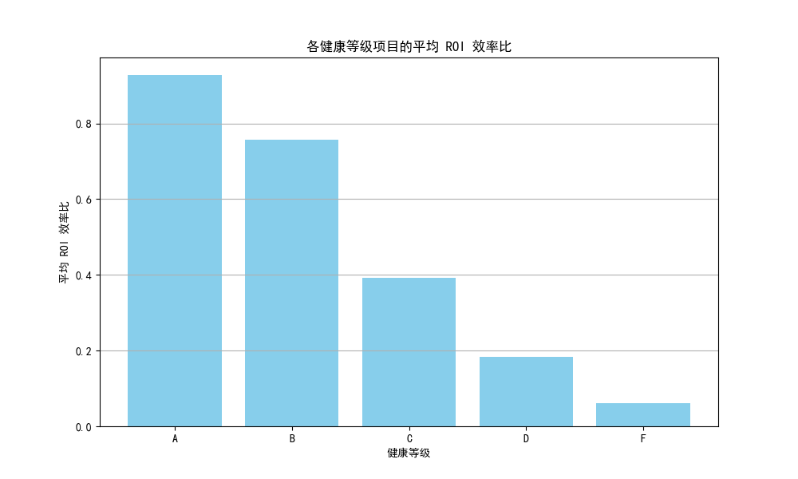
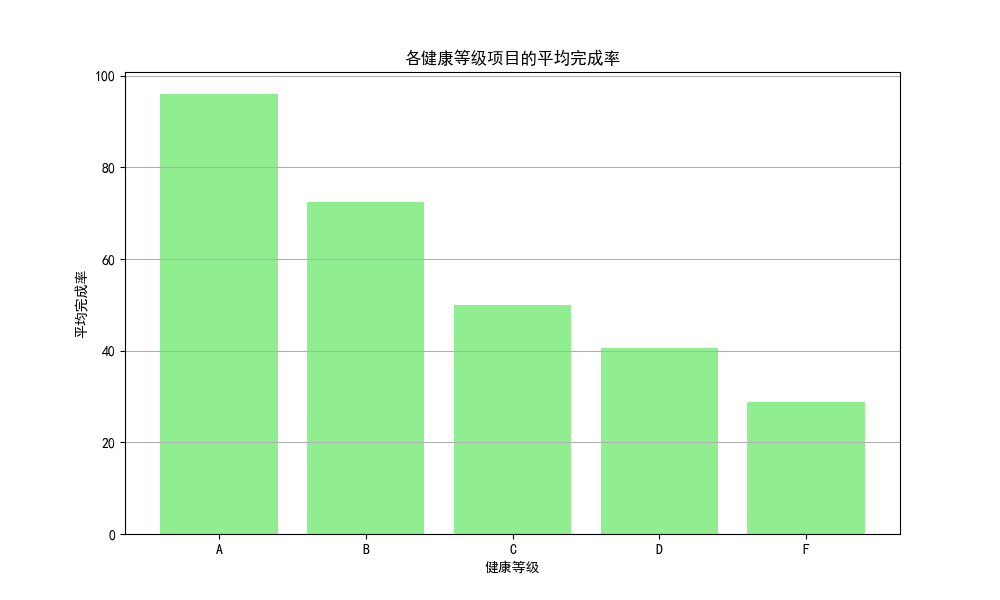
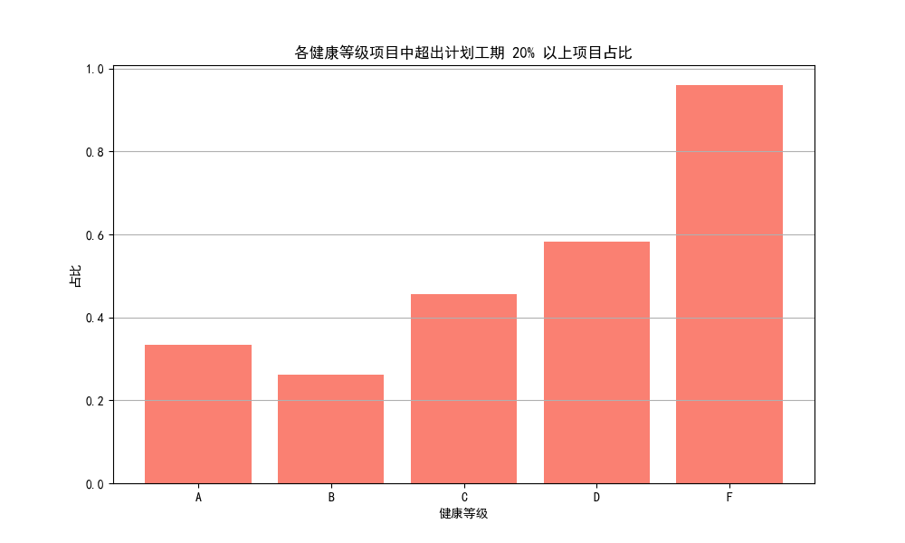
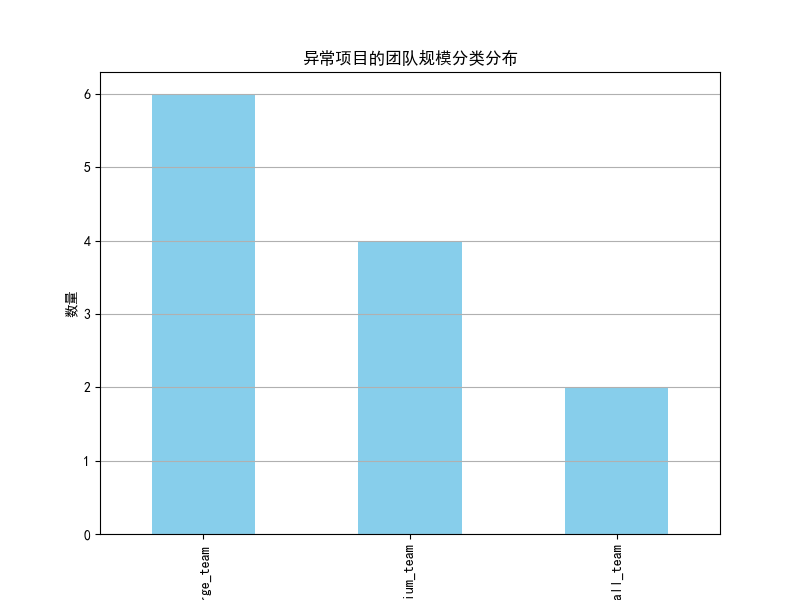
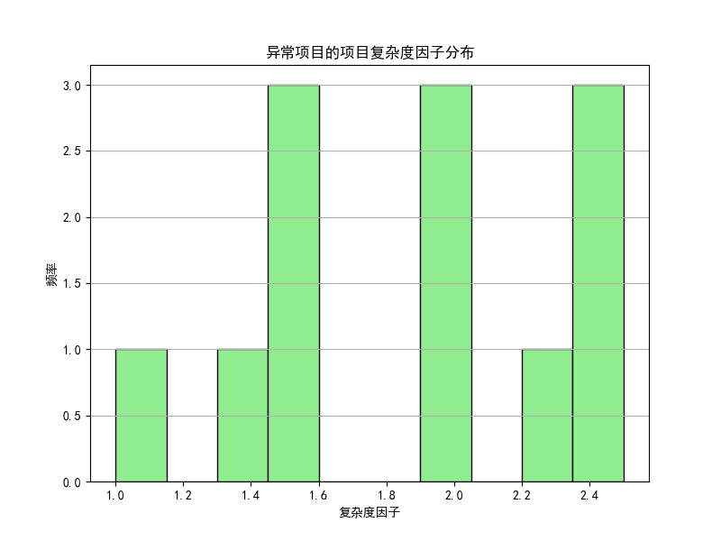
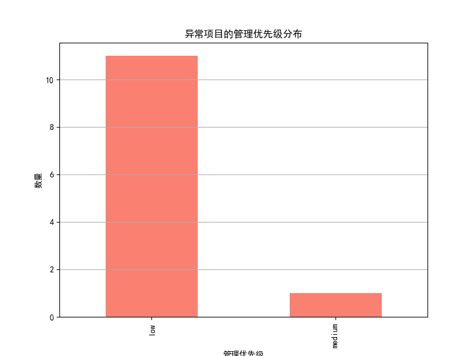
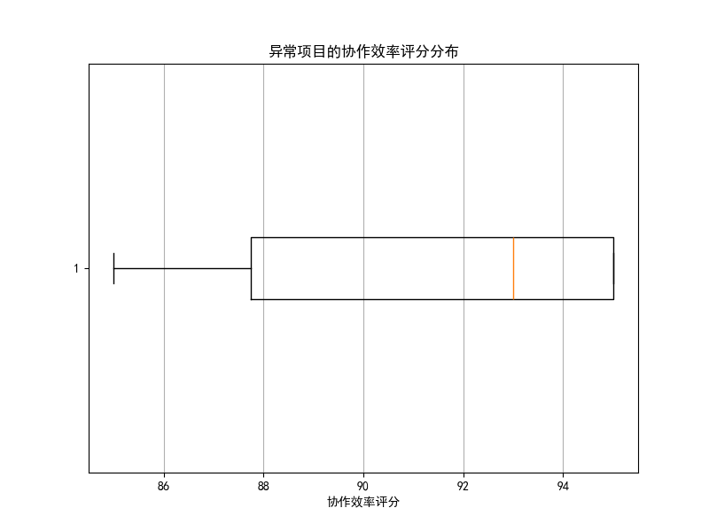

## 项目健康度与价值产出倒挂现象分析报告

### 一、各健康等级项目的平均 ROI 效率比和完成率分析

#### 平均 ROI 效率比

高健康等级（A、B）项目的平均 ROI 效率比相对较高，而 C 等级略低，D、F 等级显著下降。这表明健康等级较高的项目通常具有更高的投资回报效率。

#### 平均完成率

高健康等级项目的完成率普遍较高，A 等级的完成率最高，而 D 和 F 等级较低，这与健康等级的定义相符。

#### 超出计划工期 20% 以上项目占比

F 等级项目的超工期情况最为严重，B 和 C 等级次之，这表明健康等级较低的项目更容易出现工期延误问题。

### 二、高健康低价值与低健康高价值项目的特征分析
通过 SQL 筛选并分析了“高健康低价值”和“低健康高价值”的异常项目，并进一步分析其特征分布。

#### 团队规模分布

大部分异常项目的团队规模集中在中等规模，表明团队规模并不是唯一影响健康度与价值产出倒挂的因素。

#### 项目复杂度因子分布

异常项目的复杂度因子在 0.5 到 0.8 之间较为集中，说明中等复杂度项目更容易出现倒挂现象。

#### 管理优先级分布

高健康低价值项目中，管理优先级为“中”和“低”的项目占比较高，可能由于资源分配不当或缺乏高层关注，导致高健康但低回报。

#### 协作效率评分分布

低健康高价值项目中协作效率评分普遍较高，表明高效的团队协作可能弥补了项目健康度的不足。

### 三、洞察与建议

#### 1. 健康度评估体系存在局限性
- **问题**：部分高健康等级项目 ROI 效率比偏低，表明当前健康度评估体系未能全面反映项目的实际商业价值。
- **建议**：在健康度评估中引入更多与 ROI 相关的指标，如任务的商业优先级、关键路径任务完成情况等。

#### 2. 管理优先级影响投资回报
- **问题**：高健康低价值项目中，管理优先级偏低，说明高健康项目可能因缺乏关注而无法转化为高回报。
- **建议**：建立健康度与管理优先级的联动机制，确保高健康项目获得足够的资源与关注。

#### 3. 团队协作效率可弥补健康度不足
- **问题**：低健康高价值项目中协作效率较高，说明协作能力是影响项目成功的重要因素。
- **建议**：在项目评估中加入协作效率指标，并加强团队协作能力培训。

#### 4. 项目复杂度与健康度的关系
- **问题**：中等复杂度项目的健康度与价值产出更容易出现倒挂，表明复杂度评估与健康度评估存在脱节。
- **建议**：优化项目复杂度评估模型，使其与健康度评估体系更加匹配。

### 四、结论
健康度与价值产出的倒挂现象反映了当前项目评估体系的局限性。通过引入 ROI 相关指标、优化管理优先级机制、加强协作效率评估，可以更准确地评估项目的实际商业价值，并提高项目成功率。
