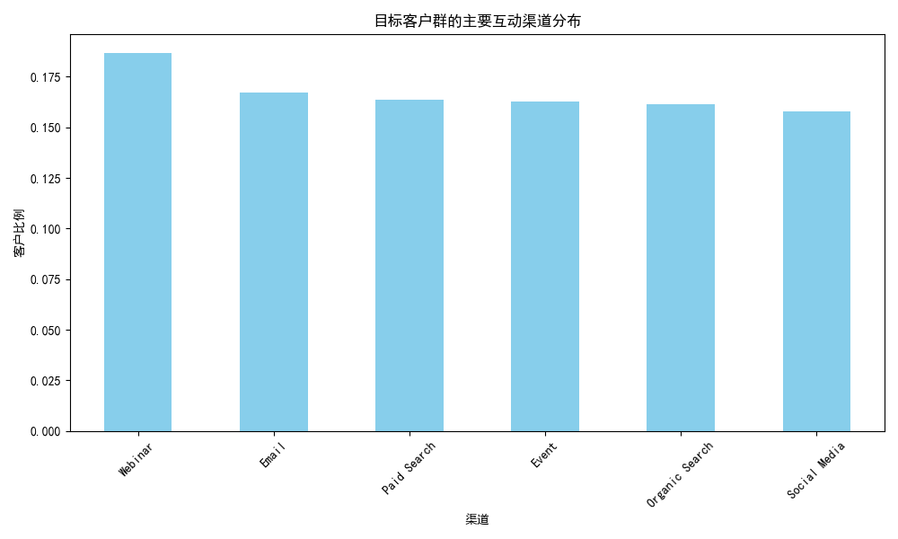
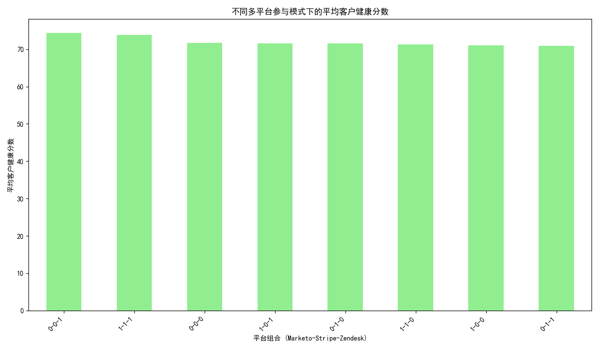

# 特殊转换行为客户群体深度分析报告

## 摘要

本报告旨在对一个具有特殊转换行为的客户群体进行深入分析。该群体定义为：从市场营销到销售的转化周期（`marketing_to_sales_days`）在10-20天之间，从销售到客户支持的周期（`sales_to_support_days`）超过30天，且综合参与度评分（`composite_engagement_score`）高于全体客户平均水平。

分析发现，这是一个由 **867名客户** 组成的高价值群体。他们的 **平均客户生命周期价值（LTV）比同级别客户高出 \$713.38**，表明他们是公司的核心资产。尽管他们的RFM分数处于中等水平，但其高LTV揭示了巨大的长期潜力。该群体的互动渠道分布均衡，对客户支持的依赖度不高（仅26.5%在Zendesk活跃）。有趣的是，客户在多平台上的参与模式显著影响其健康分数，其中 **仅在Zendesk上活跃的客户群体表现出最高的健康度**。

基于以上发现，本报告最后提出了一套结合 **客户价值** 与 **客户风险** 的二维评估框架，旨在帮助业务团队系统性地识别和管理不同类型的客户，并为高价值客户（如本报告分析的群体）设计精细化的运营策略，以最大化其商业价值并降低流失风险。

---

## 1. 目标客户群体定义与识别

我们首先根据业务需求，通过SQL查询从数据库中精确筛选出符合以下所有条件的客户群体：
- **市场到销售周期**: 10 至 20 天
- **销售到支持周期**: 大于 30 天
- **综合参与度**: 高于全体客户平均值 (8.99)

经过筛选，我们识别出 **867** 名符合条件的客户，构成了本次深度分析的基础。

---

## 2. 核心业务指标分析

### a. RFM价值评估

我们对该群体的RFM（Recency, Frequency, Monetary）分数进行了分析，结果如下：

- **平均Recency Score (近度)**: 2.96 / 5
- **平均Frequency Score (频度)**: 2.97 / 5
- **平均Monetary Score (额度)**: 2.97 / 5

**洞察**:
该群体的RFM平均分均在3分左右（满分5分），处于中等水平。这表明他们不是近期消费最频繁或金额最高的客户。然而，单一的RFM模型并未完全揭示其真实价值，需要结合LTV进行更全面的评估。

### b. 客户生命周期价值 (LTV) 分析

我们将该群体的预估客户生命周期价值（`estimated_customer_ltv`）与其所在客户层级（`customer_tier`）的其他客户进行了对比。

- **平均LTV差异**: **高出 \$713.38**

**洞察**:
这是一个极其重要的发现。尽管RFM分数中等，但该群体的长期价值远超同级别客户。这说明他们是具有高度忠诚度和持续付费潜力的 **“沉默的金牛”**。他们的转化路径（较长的销售到支持周期）可能意味着他们是经过深思熟虑后做出购买决策的成熟客户，一旦转化，其留存和价值贡献将非常可观。

### c. 互动渠道与客户支持分析

#### 主要互动渠道分布

**洞察**:
如图所示，该客户群体的来源渠道分布非常均衡，并未显示出对某一特定渠道的明显偏好。Webinar, Email, Paid Search, Event等渠道的贡献率均在16%-19%之间。这表明 **全渠道营销策略对吸引这类高价值客户是有效的**。我们应继续维持在各个渠道的均衡投入，而不是孤注一掷于单一渠道。

#### Zendesk活跃状态

- **Zendesk活跃客户比例**: 26.53%

**洞察**:
只有约四分之一的客户在Zendesk上是活跃的。结合他们“销售到支持周期长”的特点，这表明 **该群体是相对“省心”的客户**。他们要么在使用产品中遇到的问题较少，要么具备独立解决问题的能力，对客户支持资源的消耗较低。这进一步提升了他们作为客户的“利润率”和整体价值。

---

## 3. 多平台参与模式与客户健康度

我们进一步探索了客户在不同平台（Marketo - 营销自动化, Stripe - 支付, Zendesk - 客户支持）的组合参与模式如何影响其客户健康分数。

*图例说明: 平台组合 (Marketo-Stripe-Zendesk)，1代表活跃，0代表不活跃。例如，“0-0-1”代表只在Zendesk上活跃。*

**洞察**:
- **意外的发现**: 客户健康分数最高的群体（平均74.43）是那些 **只在Zendesk上活跃的客户（0-0-1）**。这似乎与直觉相悖，但可能解释为：这些客户遇到的问题虽少，但一旦遇到就会主动寻求高质量的解决方案，而高效的客户支持体验极大地提升了他们的满意度和健康度。
- **全平台参与者**: 同时在三个平台活跃的客户（1-1-1）也表现出很高的健康分数（73.82）， подтверждая了“高参与度等于高健康度”的普遍认知。

**建议**: 这提示我们，**客户支持（Zendesk）不仅仅是成本中心，更是价值创造中心**。对于高价值客户，提供高质量、响应及时的支持服务，是维持其高健康度和满意度的关键。

---

## 4. 客户价值评估与风险识别框架

基于以上分析，为了更系统地管理和服务于包括本目标群体在内的所有客户，我们设计了一个二维评估框架，旨在实现客户分层和差异化运营。

### a. 框架定义

该框架基于两个核心维度：**客户价值 (Value)** 和 **客户风险 (Risk)**。

- **客户价值 (Value) 维度**:
  - **构成**: `estimated_customer_ltv`, `monetary_score`
  - **分级**:
    - **高价值**: LTV > 同级平均LTV 且 Monetary Score >= 4
    - **中价值**: 其他
    - **低价值**: LTV < 同级平均LTV 且 Monetary Score <= 2

- **客户风险 (Risk) 维度**:
  - **构成**: `activity_risk_level`, `engagement_velocity`, `customer_health_score`
  - **分级**:
    - **高风险**: `activity_risk_level`为'High' 或 `engagement_velocity`为'Declining'/'Stagnant'
    - **中风险**: `activity_risk_level`为'Medium'
    - **低风险**: `activity_risk_level`为'Low' 且 `engagement_velocity`为'Increasing'

### b. 客户矩阵与实施策略

通过将客户映射到以下矩阵中，我们可以采取针对性的策略：

|           | 高风险          | 中风险          | 低风险          |
| :-------- | :-------------- | :-------------- | :-------------- |
| **高价值** | **紧急挽留** | **主动参与** | **VIP培养** |
| **中价值** | 密切监控   | 标准关怀   | 增销机会 |
| **低价值** | 低接触自动化 | 低优先级    | 自助服务    |

**策略解读**:

- **紧急挽留 (Urgently Retain)**: 对于本报告分析的这种高价值客户，一旦出现高风险信号（如活跃度下降），应立即触发最高优先级的挽留机制，如客户成功经理一对一沟通、提供专属续约优惠等。
- **主动参与 (Proactively Engage)**: 当高价值客户出现中度风险信号时，应主动通过客户健康检查、新功能培训、最佳实践分享等方式介入，防止风险升级。
- **VIP培养 (VIP Nurturing)**: 对于健康的该类高价值客户，应通过忠诚度计划、新品优先体验、邀请其成为品牌大使等方式，加深合作关系，最大化其口碑价值。

## 结论与建议

本次分析的特殊客户群体是公司的 **高价值核心资产**。他们贡献了远超同级别客户的长期价值，且维护成本相对较低。

**核心建议**:
1.  **资源倾斜**: 营销和客户成功团队应将更多资源投入到识别和维护这类具有相似行为特征的客户上。
2.  **优化支持体验**: 提升Zendesk等支持渠道的服务质量，将其作为提升高价值客户健康度和满意度的关键杠杆。
3.  **应用管理框架**: 全面推广“价值-风险”客户管理矩阵，实现对客户的精细化、差异化运营，主动管理高价值客户的生命周期，防患于未然。

***
*数据分析说明：由于数据表之间的关联键不明确，本次分析未能包含客户的地理位置分布特征。*
