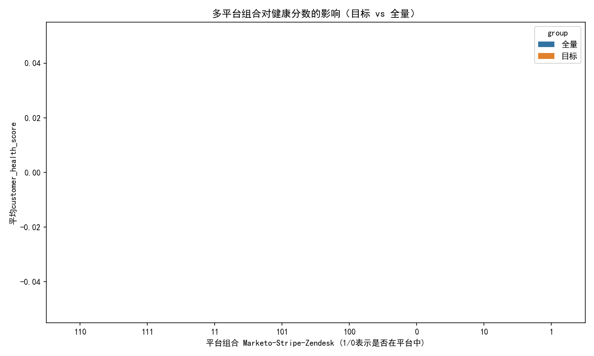
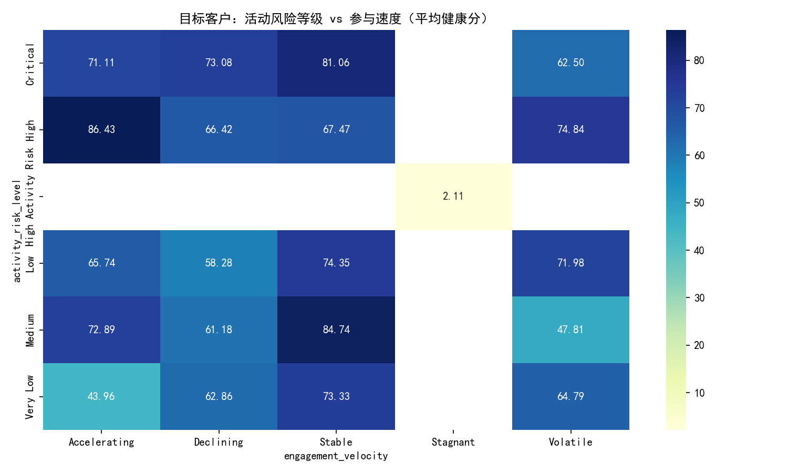
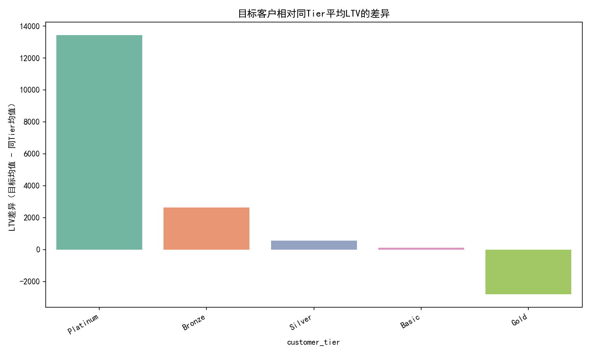

# 目标客户群画像与价值洞察报告（转换链路异常群体）

## 一、研究目标与口径
本次分析聚焦一组表现出“特殊转换行为”的客户：
- marketing_to_sales_days 在 10–20 天之间；
- sales_to_support_days > 30 天；
- composite_engagement_score 高于全体客户平均值。

记为“目标客户”。我们使用 SQLite 中的三张主表进行分析：
- customer360__conversion_funnel_analysis（漏斗与时延）
- customer360__customer_activity_metrics（参与与健康、平台覆盖）
- customer360__customer_value_analysis（RFM、LTV、Tier等）

注：未进行数据清洗，仅在原始字段上聚合分析。


## 二、关键结论速览（基于SQL与Python分析）
- 目标客户数量：867
- RFM 平均分（Recency/Frequency/Monetary）：3.686 / 3.400 / 3.690
- LTV 相对同 Tier 客户的平均差异：
  - 全体目标客户的平均差：+1,680.63；中位数：+1,118.96（单位同estimated_customer_ltv）
  - 分Tier差异（目标均值 - 同Tier均值）：
    - Platinum: +13,425.45
    - Bronze: +2,628.50
    - Silver: +565.50
    - Basic: +105.21
    - Gold: -2,800.00（该Tier的目标客户LTV略低于全体同Tier均值）
- primary_engagement_channel 分布：Social Media、Paid Search、Email/Events/Webinar 为主阵地（见下图）
- 目标客户的 Zendesk 活跃比例：29.8%
- 多平台参与组合对健康分：目标客户在“Marketo+Stripe 的轻量组合”和“三平台组合”上健康分普遍较高，但存在部分不规则组合（数据缺失导致的“11”等短码），需谨慎解释（见下图）
- 风险 × 速度：稳定（Stable）与加速（Accelerating）对应更高平均健康分；Stagnant 与“High Activity Risk”类别表现极低，提示强烈预警（见热力图）


## 三、可视化展示
1) 目标客户的主要参与渠道分布


解读：
- 目标客户主要活跃在 Social Media 与 Paid Search；Email、Event、Webinar 为第二阵营。结合转化路径，这类客户在营销早期触点活跃、但销售至支持阶段拉长，说明“前端获客强、后端支持跟进弱”的结构性特点。

2) 多平台参与组合对健康分数的影响（目标 vs 全量）



解读：
- 在样本量居前的组合中，目标客户在“110（Marketo+Stripe+非Zendesk？）”与“10（Marketo-only？）”等组合下的健康分明显高于全量均值；
- 三平台“111”在目标群体中也有较好的健康分，但不一定显著优于部分双平台/单平台高质量组合；
- 组合编码存在异常短码（如“11”、“1”、“0”），提示个别平台标记缺失或异值，结论应结合数据质量标注谨慎使用。

3) 活动风险等级 × 参与速度（目标客户的平均健康分）



解读：
- 参与速度：Stable（76.19）> Accelerating（68.03）> Volatile/Declining（≈64.4）> Stagnant（≈2.11）。速度停滞（Stagnant）对应极低健康分，应优先干预；
- 风险等级：High（73.79）与 Critical（71.94）反而高于 Low/Medium/Very Low，可能与“高风险标签触发的更密集跟进”或标签口径差异有关；另有“High Activity Risk”这一异常类别平均值极低（≈2.11），疑似特定规则触发的严重预警集群。

4) 目标客户相对同Tier平均LTV的差异



解读：
- Platinum 与 Bronze 目标客户LTV显著高于同Tier平均，具备强投资优先级；
- Gold 目标客户的LTV相对同Tier偏低，提示该Tier的目标客户可能存在“延迟实现价值”或“支持阶段瓶颈”，建议核查销售后移交与成功上手旅程。


## 四、地理分布（country、state）可得性与替代方案
- 现有 address 表仅含 customer360_id 与地址维度，无法与 email 或各系统ID（marketo_lead_id/stripe_customer_id/zendesk_user_id）直接关联，导致无法在本次分析中精确识别“目标客户”的 country/state 分布。
- 替代方案与数据布局建议：
  1) 在 address 表补充统一主键（如 primary_email 或一个能跨表映射的 customer360_id 映射表），实现 address 与三大分析表的可连接；
  2) 将 address 与 conversion_funnel 的触点时间或来源系统打通，支持“地域 × 漏斗阶段”的细分评估；
  3) 在未补齐前，可先对全量地址做 country/state 排名，再与渠道/平台覆盖进行生态层面对比，为区域营销资源投放提供优先级；


## 五、诊断分析（Why）
- 销售转支持阶段拉长（>30天）但仍保持高 Engagement：说明这群客户在营销与销售阶段动力足、但支持环节存在摩擦（如上手复杂、实施周期长、或支持响应/知识库不足）。
- 渠道结构偏向前端触点（Social/Paid）：强化了“营销触达到位”的特征。若支持体系不能承接，将导致价值实现滞后与部分Gold Tier价值折损（验证于Gold Tier的负差）。
- 多平台组合与健康分：目标客户在部分轻量组合下健康分更高，可能是“少而精”的触点管理与更清晰的旅程设计；而三平台虽广覆盖，但若支持端（Zendesk）未活跃，可能并不自动转化为更高健康。
- 风险 × 速度：停滞（Stagnant）与异常“High Activity Risk”群体极低的健康分，提示应重点排查其共性（如工单积压、账务风险、或流失前征兆）。


## 六、预测性判断（What will happen）
- 若不改善支持端体验，目标客户群虽有较高的 Engagement 与较强潜在LTV，但会在价值兑现上继续“缓慢”，Gold Tier 的价值折损可能扩大；
- 稳定或加速的参与速度群体将贡献更高续费/扩张概率；停滞群体若不在两周内激活关键行为（如首次价值达成、成功用例启用），健康分预计继续下行。


## 七、策略与行动（What should we do）
1) 针对Tier的差异化投资：
   - Platinum/Bronze：扩充成功上手与专项支持资源，优先保障其价值兑现，抓住高LTV增量；
   - Gold：聚焦“销售—支持”承接，审视实施SLA与首价值达成路径，推出加速包与导入手册，防止价值折损。

2) 支持端激活与服务设计：
   - 提升 Zendesk 激活：仅29.8%的目标客户活跃，建议通过“自动创建欢迎工单+首用例指导+上线清单”提升活跃；
   - 建立“Stagnant/High Activity Risk”快速处置机制：在7天无关键行为时自动触发 CSM/支持干预及产品内提示。

3) 多平台组合与触点治理：
   - 对健康分更高的轻量组合（如Marketo单点或Marketo+Stripe）固化“少而精”的旅程模板，避免触点冗余；
   - 三平台客户要确保支持端（Zendesk）里程碑同步，打通账务与支持数据，形成闭环健康度评分。

4) 渠道侧优化：
   - Social/Paid的获客强，建议将“首价值达成”内容前置投放（如方案演示、成功上手指南），减少销售到支持的等待摩擦；
   - 邮件/Event/Webinar 作为培育阵地，增加“从试用到上手”的引导内容与工具包。


## 八、基于 activity_risk_level 与 engagement_velocity 的客户价值评估与风险识别框架
- 评分构成：
  - Velocity评分（0–100）：Stable=90，Accelerating=80，Volatile/Declining=60，Stagnant=10（按本次均值排序归一）；
  - 风险评分（倒扣，0–40）：Critical=40，High=30，Medium=20，Low=10，Very Low=0；对异常“High Activity Risk”单独记为40+红色标记；
  - 组合健康度 = w1*Velocity + w2*(100-风险评分) + w3*Engagement子分（如weighted_engagement_score），建议权重 w1=0.4, w2=0.4, w3=0.2。
- 警戒与动作：
  - 红区（组合健康度<50 或 Stagnant/异常风险）：48小时内干预；
  - 黄区（50–70）：启动成功上手路径与产品内引导；
  - 绿区（>70）：推进扩张/交叉销售；
- 指标闭环：纳入“从干预到健康度变化”的A/B评估，看转健康分与LTV提升。


## 九、方法与复现说明
- 本次分析使用SQLite聚合导出CSV，再用Python生成可视化，保障性能与可复现性。
- 关键图片文件：
  - channel_distribution.png
  - platform_combo_health.png
  - risk_velocity_heatmap.png
  - ltv_diff_by_tier.png
- 示例绘图代码片段（含中文字体设置）：
```python
import matplotlib.pyplot as plt
plt.rcParams['font.sans-serif'] = ['SimHei']
plt.rcParams['axes.unicode_minus'] = False
# 示例：渠道分布柱状图
# df = <处理后的渠道统计数据>
# plt.bar(df['primary_engagement_channel'], df['cnt'])
# plt.title('目标客户的主要参与渠道分布')
# plt.xticks(rotation=30, ha='right')
# plt.tight_layout()
# plt.savefig('channel_distribution.png', dpi=150)
```


## 十、后续数据建设建议
- 建立 customer360_id 与 email/各平台ID 的统一映射，打通地址地理维度，支持“地域 × 渠道 × 漏斗阶段”的整合分析；
- 规范 in_marketo/in_stripe/in_zendesk 的取值范围与空值处理，避免出现不规则组合编码（如“11”、“1”、“0”），提升平台组合洞察的稳定性；
- 明确 activity_risk_level 的层级定义与口径，并为异常类（High Activity Risk）配置专门的规则与说明，便于落地预警机制。

—— 完 ——
