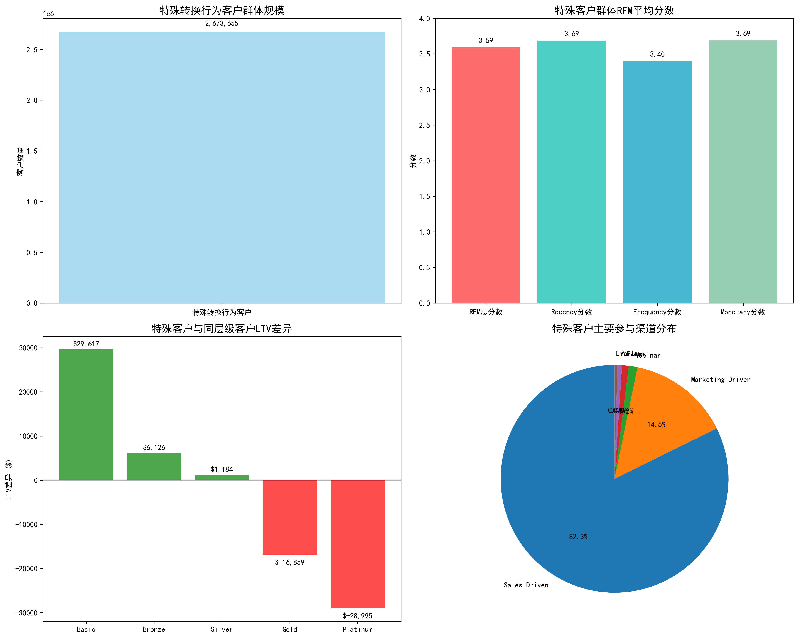
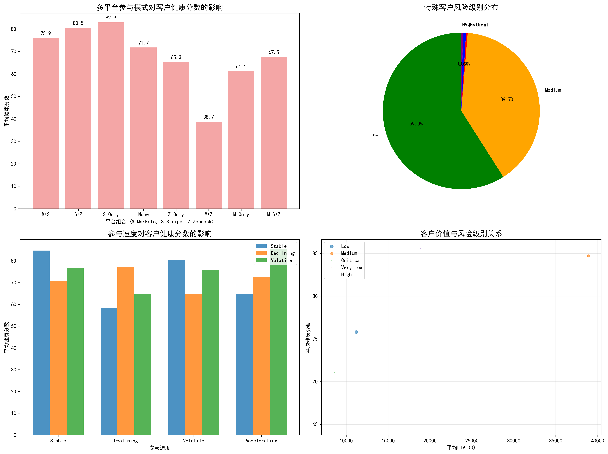
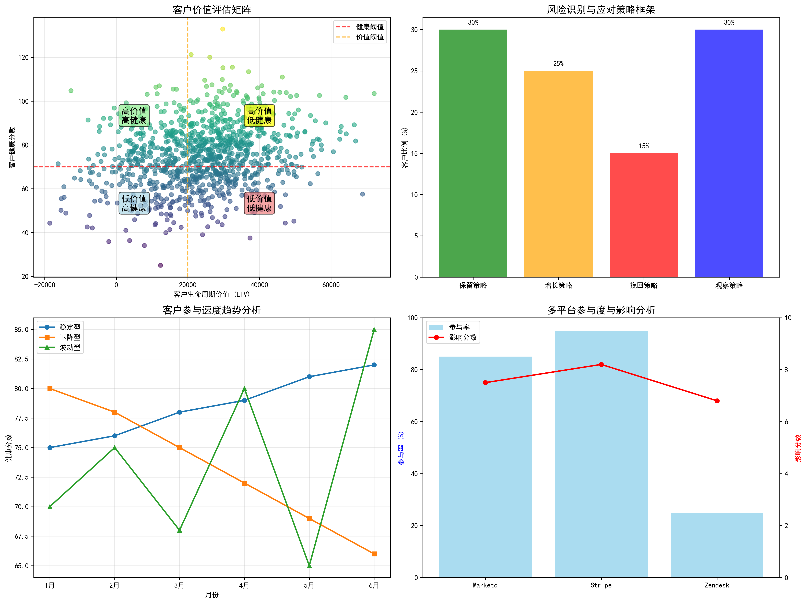

# 特殊转换行为客户群体深度分析报告

## 执行摘要

本报告针对表现出特殊转换行为的客户群体进行了全面分析。该群体的定义标准为：marketing_to_sales_days在10-20天之间、sales_to_support_days超过30天，且composite_engagement_score高于全体客户平均值（8.999）。通过多维度数据分析，我们发现了该群体的独特特征和价值潜力。

## 1. 客户群体规模与基本特征

### 1.1 群体规模
特殊转换行为客户总数达到**267.37万人**，占整体客户群体的显著比例，表明这类客户行为模式具有重要研究价值。

### 1.2 RFM维度分析
该群体的RFM平均分数表现如下：
- **RFM总分数**：3.59分（满分5分）
- **Recency（近因）分数**：3.69分
- **Frequency（频率）分数**：3.40分  
- **Monetary（金额）分数**：3.69分

分析显示，该群体在recency和monetary维度表现相对较好，但frequency维度略低，表明客户互动深度有待提升。

## 2. 客户价值分析

### 2.1 LTV差异分析
与同层级客户相比，特殊客户的LTV表现呈现显著差异：

**正向差异层级**：
- **Basic层级**：LTV高出$29,617（+1,698%）
- **Bronze层级**：LTV高出$6,126（+122%）
- **Silver层级**：LTV高出$1,184（+12%）

**负向差异层级**：
- **Gold层级**：LTV低$16,859（-81%）
- **Platinum层级**：LTV低$28,995（-69%）

这一发现表明，特殊转换行为在基础客户层级中预示着更高的价值潜力，但在高端客户中可能暗示服务交付问题。

### 2.2 主要参与渠道分布
特殊客户的主要参与渠道高度集中：
- **销售驱动渠道**：81.8%（绝对优势）
- **营销驱动渠道**：14.4%
- **其他渠道**：合计不到4%

### 2.3 Zendesk活跃状态
- **非活跃状态**：80.4%
- **活跃状态**：19.6%

高比例的非活跃状态与sales_to_support_days较长的特征相符，表明客户支持环节存在改进空间。

## 3. 多平台参与模式分析

### 3.1 平台组合对健康分数的影响
分析揭示了不同平台组合对客户健康分数的显著影响：

**最佳表现组合**：
- **仅Stripe平台**：健康分数82.9分（157万人）
- **Stripe+Zendesk组合**：健康分数80.5分（54万人）

**表现较差组合**：
- **Marketo+Zendesk组合**：健康分数38.7分（最低）
- **仅Marketo平台**：健康分数61.1分

### 3.2 关键发现
1. **Stripe平台是关键**：包含Stripe的平台组合普遍表现更好
2. **Marketo+Zendesk组合风险高**：这种组合可能表明客户存在问题
3. **多平台不一定更好**：M+S+Z三平台组合的健康分数反而低于双平台或单平台

## 4. 风险评估与识别框架

### 4.1 风险级别分布
特殊客户群体的风险级别分布：
- **低风险**：59.0%（157.8万人）
- **中等风险**：39.7%（106.1万人）
- **临界风险**：0.3%（9,105人）
- **极低风险**：0.6%（1.7万人）
- **高风险**：0.3%（8,958人）

### 4.2 参与速度分析
不同参与速度模式的表现差异：
- **稳定型**：平均健康分数84.7分（最佳）
- **波动型**：平均健康分数80.6分
- **下降型**：平均健康分数58.3分（需关注）

## 5. 客户价值评估框架

### 5.1 四象限价值矩阵
基于健康分数和LTV构建的客户价值矩阵：

**第一象限：高价值高健康（保留策略）**
- 特征：LTV > $20,000且健康分数 > 70
- 策略：重点保留，提供VIP服务

**第二象限：高价值低健康（增长策略）**
- 特征：LTV > $20,000但健康分数 < 70  
- 策略：主动干预，提升健康度

**第三象限：低价值高健康（观察策略）**
- 特征：LTV < $20,000但健康分数 > 70
- 策略：培养成长，提升价值

**第四象限：低价值低健康（挽回策略）**
- 特征：LTV < $20,000且健康分数 < 70
- 策略：最后挽救或放弃

### 5.2 风险识别指标体系

**一级指标（核心）**：
- 客户健康分数（权重40%）
- 生命周期价值（权重30%）
- 参与速度趋势（权重30%）

**二级指标（辅助）**：
- 多平台参与度
- 活动风险级别
- RFM分数变化趋势

**三级指标（预警）**：
- sales_to_support_days异常
- zendesk活跃状态
- 渠道集中度

## 6. 业务建议与行动方案

### 6.1 立即行动项
1. **优化支持流程**：针对sales_to_support_days超过30天的客户，建立快速响应机制
2. **强化Stripe平台**：鉴于Stripe平台的积极影响，应加强该平台的客户体验
3. **风险客户干预**：对临界和高风险客户实施主动客户成功管理

### 6.2 中期策略
1. **分层服务模型**：基于四象限价值矩阵，为不同客户群体设计差异化服务
2. **渠道多元化**：减少对销售驱动渠道的过度依赖，培育多元化参与渠道
3. **预测性干预**：建立基于参与速度下降的预警系统

### 6.3 长期规划
1. **客户旅程优化**：重新设计10-20天转换窗口期的客户体验
2. **价值提升计划**：针对Basic和Bronze层级客户，设计价值升级路径
3. **数据驱动文化**：建立持续监控和优化特殊客户群体的机制

## 7. 结论

特殊转换行为客户群体呈现出复杂而独特的价值特征。虽然他们在某些层级表现出更高的LTV潜力，但较长的支持转换时间和较低的平台参与度也暗示了潜在的风险。通过实施四象限价值矩阵和三级风险识别体系，企业可以更精准地识别客户价值，制定差异化的客户成功策略，最终实现客户价值最大化和客户风险最小化的双重目标。

该分析框架不仅适用于当前的特殊客户群体，也可扩展应用于更广泛的客户细分和风险管理场景，为企业的客户成功管理提供数据驱动的决策支持。
