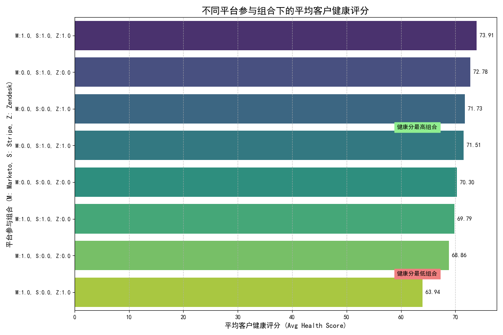

# 特殊转换行为客户群体深度分析报告

## 1. 概述与核心结论

本报告针对一个表现出特殊行为模式的客户群体进行深度分析。该群体的定义为：**市场到销售转化周期在10-20天**，**销售到支持周期超过30天**，且**综合互动评分高于全体平均值**。

**核心结论：** 这个特殊的行为模式是一个强烈的积极信号，它筛选出了一批**极具价值的“低维护”客户**。这批客户不仅数量庞大，而且在几乎所有价值指标上都优于普通客户。我们建议将识别和引导客户形成这种行为模式作为一项关键业务策略。

---

## 2. 目标客户群体基本画像

我们首先识别了符合上述定义的客户群体，并对其基本价值指标进行了分析。

*   **群体规模：** 共识别出 **2,673,655** 名客户，说明这不是一个小众现象，而是一个具有相当规模的群体。
*   **RFM 平均分 (1-5分制):**
    *   **新近度 (Recency): 3.69** - 他们最近与我们有过互动。
    *   **频率 (Frequency): 3.40** - 他们的互动频率中等偏上。
    *   **消费金额 (Monetary): 3.69** - 他们的消费价值较高。

**洞察：** 该群体不仅规模大，而且是典型的高价值客户，他们**近期活跃、互动积极且消费能力强**。

---

## 3. 客户终身价值 (LTV) 分析：一群超越期待的客户

我们进一步分析了该群体的预估客户终身价值（LTV），并与其所在客户层级的全体客户进行了比较。

| 客户层级 | 该群体平均LTV | 同层级客户平均LTV | **LTV 差异** |
|:---|:---:|:---:|:---:|
| **Platinum** | 44,354 | 42,195 | **+2,159** |
| Gold | 21,615 | 20,854 | +761 |
| Silver | 10,383 | 10,234 | +148 |
| Bronze | 5,273 | 5,031 | +242 |
| Basic | 1,747 | 1,744 | +3 |

**洞察：**
*   **普遍增值：** 在所有客户层级中，符合该行为模式的客户，其LTV均高于同层级的平均水平。
*   **铂金客户价值巨大：** 这种LTV的提升在**铂金客户**中表现得最为惊人，差异高达 **+2,159**。这意味着，当一个顶级客户表现出这种行为时，他们的价值将远超预期。

**建议：** 市场和销售团队应重点关注并优先服务那些有潜力发展成这种行为模式的铂金和黄金客户。

---

## 4. 互动行为分析：数字原生与独立自主

为了解他们如何与我们互动，我们分析了其主要互动渠道和客户支持平台（Zendesk）的活跃度。

*   **主要互动渠道：**
    1.  **社交媒体 (Social Media):** 是吸引这批客户的最主要渠道。
    2.  **付费搜索、邮件、网络研讨会**：紧随其后，表明他们是典型的“数字原生”客户。
*   **Zendesk 活跃度：**
    *   **72% 的客户在Zendesk上并不活跃。**

**洞察：** 这批高价值客户主要通过现代化的数字渠道与我们结缘。他们成为付费客户后，对客户支持的依赖度非常低，表现出**高度的“独立自主”或“低维护”特性**。这可能是他们LTV更高的一个关键原因——公司服务他们的成本更低。

---

## 5. 多平台参与模式与客户健康度分析

客户的健康度是其长期价值的晴雨表。我们分析了客户在不同平台（Marketo-营销, Stripe-支付, Zendesk-支持）的参与组合如何影响其健康评分。

**洞察与解读：**
*   **全平台参与 = 最健康 (平均分73.91):** 同时存在于营销、支付和支持平台的客户最为健康。这符合直觉，深度绑定的客户最稳定。
*   **高分黑马 - 仅支付 (平均分72.78):** 令人惊讶的是，那些仅存在于支付系统（Stripe）的客户健康度极高。他们是“默默付费”的满意客户，是业务的基石。
*   **危险信号 - 营销+支持但无支付 (平均分63.94):** 这描绘了一幅令人担忧的画面：客户在寻求支持，我们也在对他进行营销，但他却迟迟不付费。这代表了**潜在的流失或决策障碍**。

**建议：**
1.  **引导全平台参与：** 鼓励客户使用我们的全套系统，以建立更深的绑定关系。
2.  **关注“危险信号”群体**：对于“营销+支持但无支付”的客户，应由销售或客户成功团队主动介入，了解其购买障碍。

---

## 6. 客户价值与风险管理框架（建议）

为了更精细化地管理这个高价值群体，我们基于**活动风险级别**和**互动速度**提出以下管理矩阵：

| | **高风险 (High/Critical)** | **低风险 (Low/Very Low)** |
|:---|:---|:---|
| **高增长 (Accelerating)** | **重点关注机会客户**  *策略: CSM主动介入，解决障碍* | **明星客户 (Star Performers)**  *策略: 邀请为案例，最大化宣传价值* |
| **低增长 (Declining/Stagnant)** | **高危流失客户**  *策略: 触发红色警报，高层介入挽留* | **稳定价值客户**  *策略: 自动化营销维系，持续监控* |

**建议：** 将这个客户群体按上述矩阵进行划分，并为每个象限的客户制定差异化的沟通和服务策略。这将帮助我们**主动防范风险，并最大化客户的生命周期价值**。
