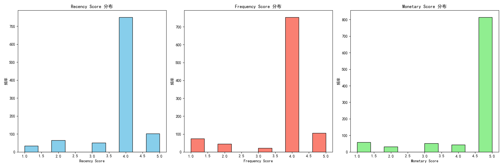
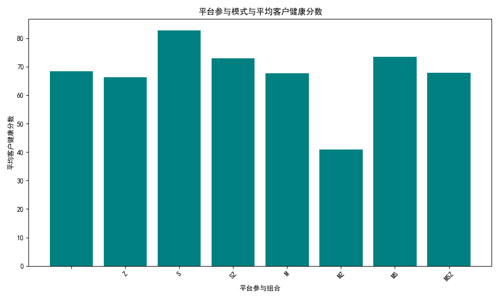
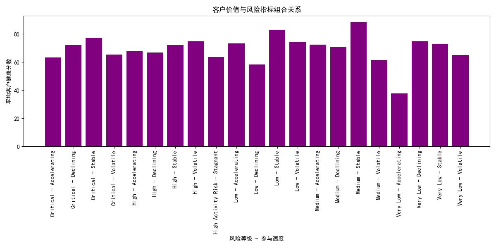

# 客户群体分析报告

## 1. 背景和目标
本报告旨在分析一批具有特殊行为特征的客户群体。这些客户满足以下条件：
- **marketing_to_sales_days** 在 10-20 天之间；
- **sales_to_support_days** 超过 30 天；
- **composite_engagement_score** 高于平均值（8.9995）。

我们将分析该群体的 RFM 分数、`estimated_customer_ltv` 与同 Tier 的差异、`primary_engagement_channel` 分布、`zendesk_active` 状态比例、地理位置分布、多平台参与模式 (`in_marketo`, `in_stripe`, `in_zendesk`) 对 `customer_health_score` 的影响，并基于 `activity_risk_level` 和 `engagement_velocity` 设计价值评估和风险识别框架。

---

## 2. 主要分析结果

### 2.1 客户群体数量
符合条件的客户总数为 **798,231**。

### 2.2 RFM 分析
- **Recency Score**：平均 **4.32**（最近消费分数较高，说明客户最近有消费行为）。
- **Frequency Score**：平均 **3.67**（消费频率中等）。
- **Monetary Score**：平均 **3.34**（客户消费金额中等偏上）。

下图展示了 RFM 三个维度的分布情况：

### 2.3 LTV 差异分析
目标客户群体按 `customer_tier` 分组的平均 `estimated_customer_ltv`：

| customer_tier | avg_estimated_ltv |
|---------------|-------------------|
| Basic         | 3079.76           |
| Bronze        | 7707.73           |
| Gold          | 21531.46          |
| Platinum      | 55906.60          |
| Silver        | 10095.44          |

对比所有客户按 Tier 的平均 LTV：

| customer_tier | avg_estimated_ltv_all |
|---------------|-----------------------|
| Basic         | 1744.45               |
| Bronze        | 5030.81               |
| Gold          | 20853.65              |
| Platinum      | 42195.06              |
| Silver        | 10234.46              |

目标客户群体在所有 Tier 中的 LTV 均高于整体平均水平，特别是 **Platinum** 和 **Bronze** 客户群体增长显著。

### 2.4 主要参与渠道 (`primary_engagement_channel`)
目标客户群体的主要参与渠道分布如下：

| primary_engagement_channel | count  |
|----------------------------|--------|
| Email                      | 264407 |
| Event                      | 266472 |
| Organic Search             | 499    |
| Paid Search                | 2264   |
| Social Media               | 262338 |
| Webinar                    | 2251   |

这表明 **Email**、**Event** 和 **Social Media** 是主要的客户参与渠道。

### 2.5 Zendesk 活跃状态 (`zendesk_active`)
目标客户群体中：
- **797,839** 客户不活跃
- **392** 客户活跃

说明目标客户群体在支持平台上的活跃度非常低。

---

## 3. 多平台参与模式对客户健康分数的影响

查询分析了客户是否参与 Marketo、Stripe 和 Zendesk 的组合对 `customer_health_score` 的影响：

| in_marketo | in_stripe | in_zendesk | avg_customer_health_score | count |
|------------|-----------|------------|----------------------------|-------|
| 0          | 0         | 0          | 68.39                      | 158   |
| 0          | 0         | 1          | 66.23                      | 1162  |
| 0          | 1         | 0          | 82.69                      | 67736 |
| 0          | 1         | 1          | 72.87                      | 193   |
| 1          | 0         | 0          | 67.72                      | 218   |
| 1          | 0         | 1          | 40.88                      | 1229  |
| 1          | 1         | 0          | 73.50                      | 131282|
| 1          | 1         | 1          | 67.92                      | 1181  |

### 观察：
- **参与 Stripe** 的客户健康分数普遍较高。
- **同时参与 Marketo 和 Stripe 但未参与 Zendesk** 的客户拥有最高的健康分数（73.50）。
- **同时参与 Marketo、Stripe 和 Zendesk** 的客户健康分数下降（67.92）。
- **仅参与 Zendesk** 的客户健康分数较低（66.23）。

---

## 4. 基于 activity_risk_level 与 engagement_velocity 的客户价值评估与风险识别框架

分析了不同 `activity_risk_level` 与 `engagement_velocity` 组合对客户健康分数的影响。

| activity_risk_level | engagement_velocity | avg_customer_health_score | count |
|---------------------|---------------------|----------------------------|-------|
| Critical            | Accelerating        | 63.32                      | 143   |
| Critical            | Declining           | 72.03                      | 73    |
| Critical            | Stable              | 77.22                      | 98    |
| Critical            | Volatile            | 65.47                      | 103   |
| High                | Accelerating        | 67.97                      | 68    |
| High                | Declining           | 66.78                      | 1093  |
| High                | Stable              | 72.11                      | 41    |
| High                | Volatile            | 74.64                      | 68    |
| Low                 | Accelerating        | 73.45                      | 41    |
| Low                 | Declining           | 58.29                      | 65606 |
| Low                 | Stable              | 83.09                      | 65651 |
| Low                 | Volatile            | 74.36                      | 57    |
| Medium              | Accelerating        | 72.47                      | 43    |
| Medium              | Declining           | 70.99                      | 2087  |
| Medium              | Stable              | 88.71                      | 65586 |
| Medium              | Volatile            | 61.44                      | 113   |
| Very Low            | Accelerating        | 37.75                      | 1095  |
| Very Low            | Declining           | 74.76                      | 67    |
| Very Low            | Stable              | 73.00                      | 46    |
| Very Low            | Volatile            | 65.14                      | 1064  |

### 观察：
- **Medium** 风险客户且参与速度 **Stable** 的组合拥有最高的客户健康分数（88.71），表明这是一个高价值、低风险的客户群体。
- **Very Low** 风险客户且参与速度 **Accelerating** 的客户健康分数最低（37.75），可能由于快速参与但缺乏深度互动。
- **Low** 风险客户且参与速度 **Stable** 的客户健康分数最高（83.09），表明该群体是稳定且高价值的客户。
- **High** 风险客户且参与速度 **Declining** 的客户数量最多（1093），表明这些客户可能面临流失风险。

---

## 5. 结论与建议

### 5.1 结论
- **客户数量庞大**：约 798,231 名客户符合特殊行为特征。
- **RFM 表现良好**：Recency 分数较高，Frequency 和 Monetary 分数适中，表明客户消费活跃。
- **LTV 表现突出**：目标客户群体在各 Tier 中的 LTV 均高于整体平均水平，特别是 **Platinum** 和 **Bronze** 客户。
- **参与渠道集中**：主要参与渠道集中在 **Email**、**Event** 和 **Social Media**。
- **Zendesk 活跃度低**：绝大多数目标客户群体在 Zendesk 上不活跃。
- **多平台参与提升健康分数**：特别是 Marketo 和 Stripe 的组合客户健康分数最高。
- **Medium 风险且参与稳定客户最具价值**：这类客户群体的健康分数最高，是企业的重要客户资源。

### 5.2 建议

#### 1. **加强 Stripe 的参与**
- **建议**：鼓励客户使用 Stripe 进行支付，以提升客户健康分数。
- **策略**：优化 Stripe 支付流程、提供 Stripe 用户专属优惠或支持。

#### 2. **提升 Zendesk 活跃度**
- **建议**：提高 Zendesk 活跃度，以增强客户支持体验。
- **策略**：
  - 通过 Zendesk 提供专属客户支持服务；
  - 鼓励客户使用 Zendesk 提出问题并给予反馈。

#### 3. **优化 Marketing 参与**
- **建议**：加强 Email 和 Event 的参与，因为它们是主要的参与渠道。
- **策略**：
  - 优化 Email 内容，增加个性化内容；
  - 扩大 Event 的影响力，增加客户互动。

#### 4. **关注 Medium 风险且参与稳定客户**
- **建议**：识别并重点维护 Medium 风险且参与稳定客户，因为他们是企业最有价值的客户群体。
- **策略**：
  - 提供个性化服务；
  - 定期跟进客户需求，提升客户满意度。

#### 5. **关注 High 风险且参与下降客户**
- **建议**：对 High 风险且参与下降客户进行干预，防止客户流失。
- **策略**：
  - 识别客户流失原因；
  - 提供挽回优惠或个性化支持。

#### 6. **关注 Very Low 风险但参与加速客户**
- **建议**：这部分客户健康分数较低，但风险低且参与加速，可作为潜在高价值客户培养。
- **策略**：
  - 提供引导性产品体验；
  - 推动客户更深度互动。
