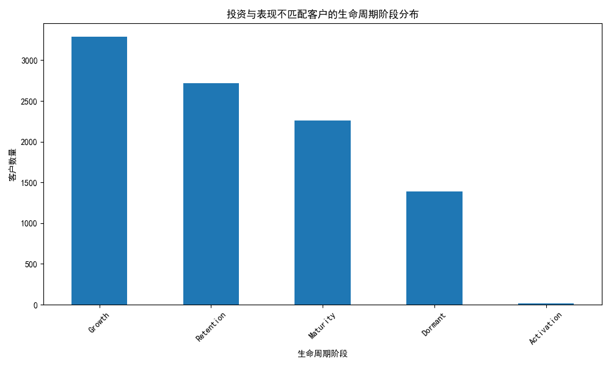
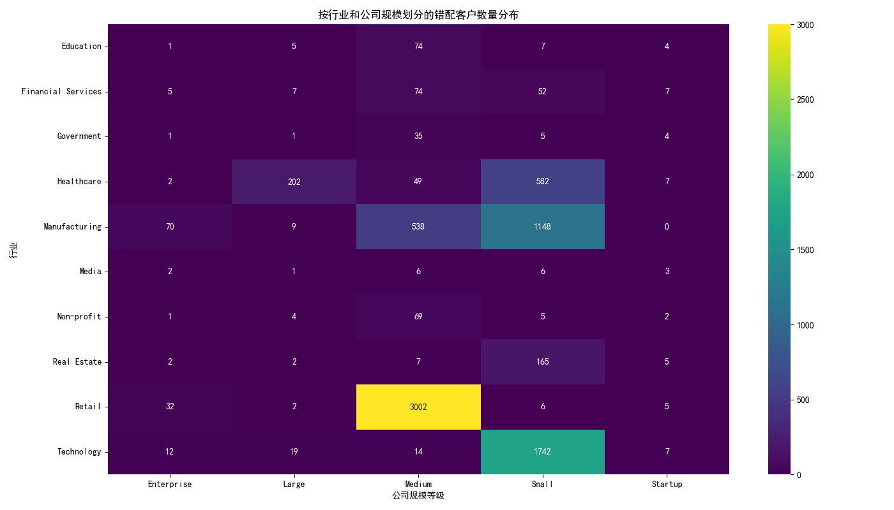
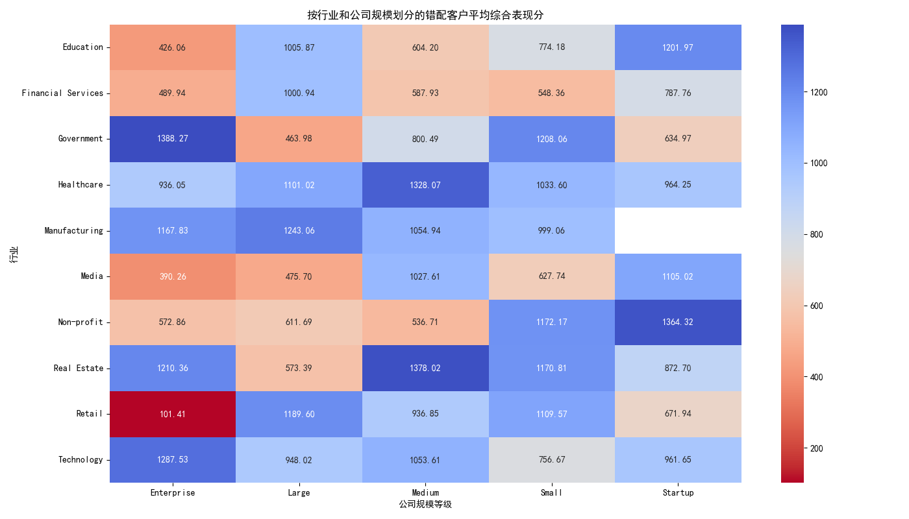
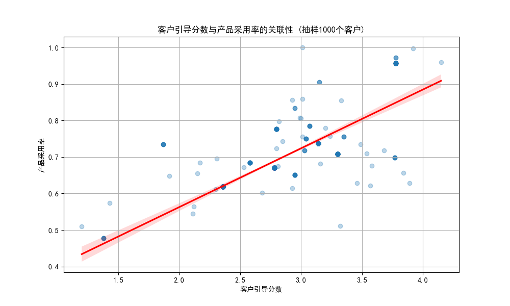
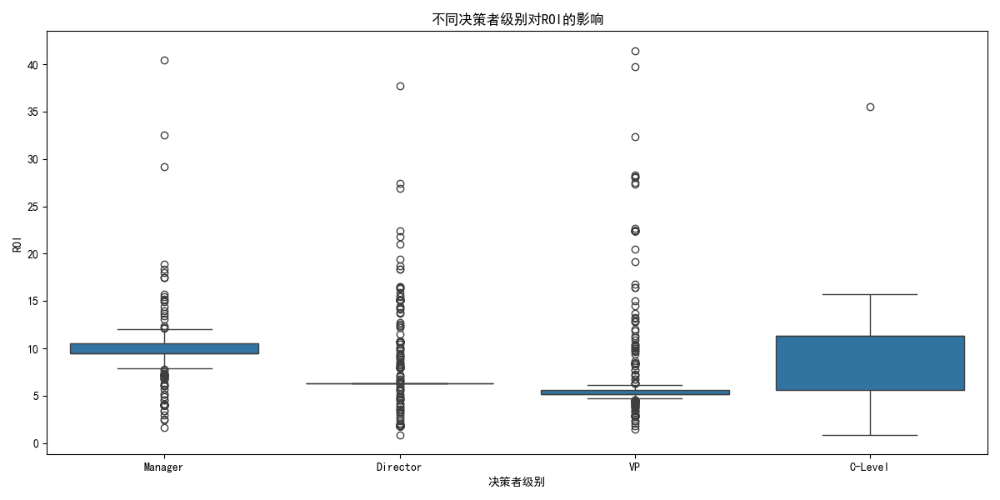
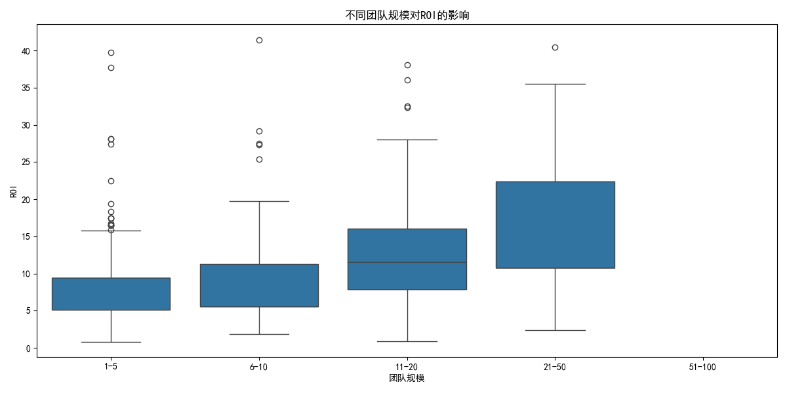

# **关于客户投资策略优化的数据分析报告**

## **一、 执行摘要**

本次分析旨在重新评估公司的客户投资策略，通过深入挖掘数据，识别出投资配置与实际回报不匹配的客户群体。

**核心发现：** 我们识别出一个显著的客户群体，他们的**投资优先级得分位居公司前30%，但其综合表现（由销售额、产品采用率和支持效率加权计算）却落在后50%**。这意味着公司的宝贵资源被错配给了表现不佳的客户。

**关键洞察：**
1.  **资源错配严重：** 这些投资与表现不匹配的客户中，超过75%处于“增长期”和“维系期”这两个至关重要的生命周期阶段，这对公司的长期健康构成了潜在威胁。
2.  **模型存在系统性偏差：** 当前的`investment_priority_score`模型过分依赖某些静态标签（如行业、公司规模），而未能有效衡量客户的实际参与度和成功潜力，特别是忽略了早期客户引导（Onboarding）的质量。
3.  **Onboarding是关键驱动力：** 数据明确显示，**客户引导分数（customer_onboarding_score）与产品采用率存在高达0.81的强正相关性**，证明了优质的早期体验是驱动客户成功的关键。
4.  **特定客群风险高：** 在**中等规模（Medium）**和**初创（Startup）**企业中，尤其是在**金融服务（Financial Services）**和**科技（Technology）**行业，资源错配现象尤为突出。

**核心建议：** 公司应立即采取行动，**优化投资决策模型**，将客户的实际参与度指标（如Onboarding分数和产品采用率）纳入核心权重；**加强对高风险客户群体的早期干预和支持**；并**重新评估对表现不佳但投资优先级高的“休眠期”客户的资源投入**。

---

## **二、 核心发现与深度分析**

### **1. 识别“高投入、低产出”的错配客户群**

我们首先筛选出投资优先级得分排名前30%，但综合表现指标（销售额权重40%，产品采用率权重35%，支持解决效率权重25%）排名后50%的客户。分析发现， این批客户的平均投资回报率（ROI）仅为**8.13**，且存在大量ROI低于5的低效投资。

更令人担忧的是 این批客户在生命周期中的分布。如下图所示，“增长期”和“维系期”的客户合计占比超过75%，这表明我们的投资模型未能有效识别并支持最有潜力的增长期客户，同时在关键的客户维系阶段也出现了资源错配。

### **2. 探究错配根源：行业、规模与表现**

为了找到导致错配的根本原因，我们从行业和公司规模两个维度进行了深入分析。

- **客户数量分布：** 热力图显示，错配客户主要集中在**金融服务、科技**和**制造业**，并且在**中等规模（Medium）**和**小规模（Small/Startup）**公司中数量最多。

- **综合表现分分析：** 结合表现分热力图，我们发现，尽管在这些领域投入了高优先级资源，但它们的平均综合表现分普遍偏低（图中红色区域），尤其是在**中等规模的科技公司**和**小规模的金融服务公司**。这证明我们的投资优先级模型对这些领域的客户潜力可能做出了过于乐观的评估。

### **3. 行为模式分析：揭示成功的关键驱动力**

#### **a. 客户引导（Onboarding）是成功的基石**

我们发现，客户的早期体验对其长期价值至关重要。数据显示，`customer_onboarding_score`（客户引导分数）与`product_adoption_rate`（产品采用率）之间存在**高达0.81的强正相关性**。如下图所示，引导分数越高的客户，其产品采用率也越高。

这表明，无论客户背景如何，一个高质量、结构化的引导流程是确保客户能够从产品中获得价值、从而提高其综合表现的决定性因素。当前的投资模型显然低估了这一环节的重要性。

#### **b. 组织结构对ROI的影响**

我们进一步分析了客户方的组织结构（决策者级别和团队规模）对投资回报的影响。

- **决策者级别：** 对于 این批表现不佳的客户，当决策者为**总监（Director）或经理（Manager）**级别时，其ROI的中位数和上限均低于VP或C-Level。这可能意味着在推动项目时，较低级别的决策者面临更多内部阻力，导致产品价值难以实现。

- **团队规模：** 团队规模与ROI之间也呈现出一定的关系。**规模较小（1-5人）的团队**，其ROI分布更为离散且上限较低。这提示我们，在投资决策中，需要评估客户是否有足够的内部资源来有效利用我们的产品。

---

## **三、 结论与优化建议**

综合以上分析，我们得出结论：公司当前的`investment_priority_score`模型存在系统性偏差，它过于侧重客户的静态画像（如行业、规模），而严重低估了客户成功的动态过程性指标，尤其是早期引导体验和实际的产品参与度。

为了纠正这一偏差，优化投资回报，我们提出以下具体建议：

1.  **立即优化投资优先级算法：**
    *   **降低**行业和公司规模等静态属性的权重。
    *   **显著提升** `customer_onboarding_score` 和 `product_adoption_rate` 等动态参与度指标的权重。
    *   引入**“投资回报潜力”**作为新指标，结合团队规模和决策者级别进行综合评估。

2.  **强化客户引导（Onboarding）流程：**
    *   将Onboarding视为客户成功的首要环节，投入更多资源确保客户在早期获得成功。
    *   对于`customer_onboarding_score`较低的客户，应自动触发预警，并由客户成功团队进行**主动干预**。

3.  **建立针对性客户管理策略：**
    *   对于识别出的高风险错配客户（如中等规模的科技公司），应重新评估其投资等级，并制定专门的**“健康提升计划”**。
    *   对于那些处于“休眠期”但投资优先级仍很高的客户，应果断**缩减投资**，或进行最后一次激活尝试，无效则彻底回收资源。

4.  **赋能客户内部决策者：**
    *   在销售和客户成功阶段，加强与客户高层决策者（VP及以上）的连接，确保项目获得足够的内部支持。
    *   为客户方的项目负责人（特别是Director和Manager）提供更多支持材料和策略指导，帮助他们扫清内部障碍。

通过实施以上建议，我们能够将投资更精准地引向真正具有高增长潜力的客户，从而最大化公司的长期价值和市场竞争力。
