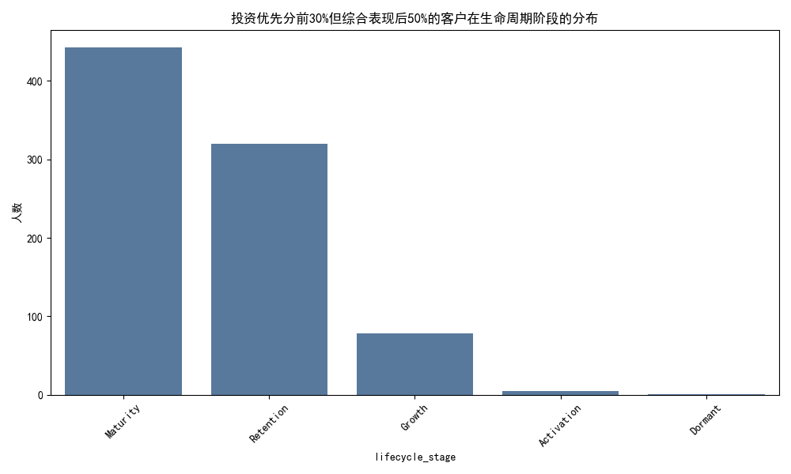
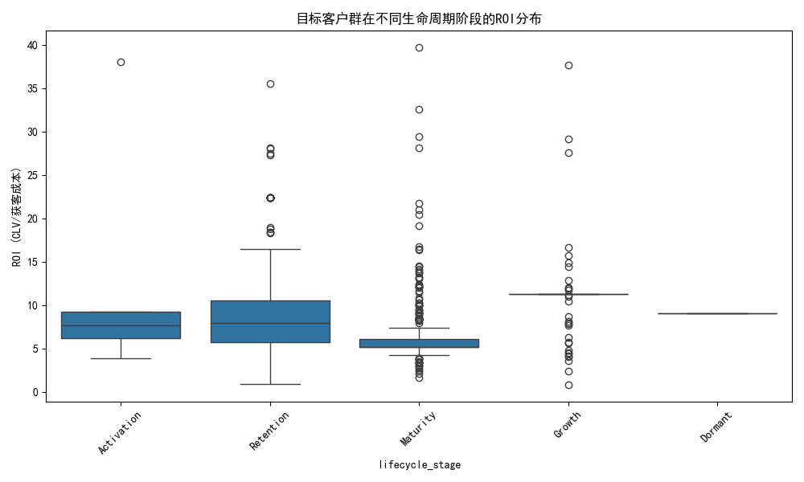
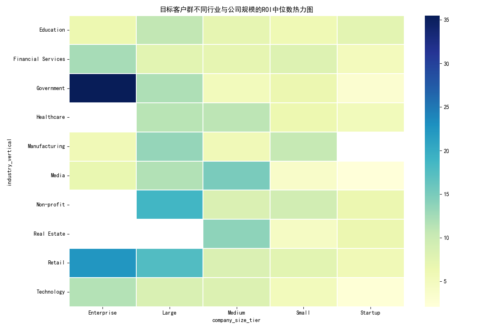
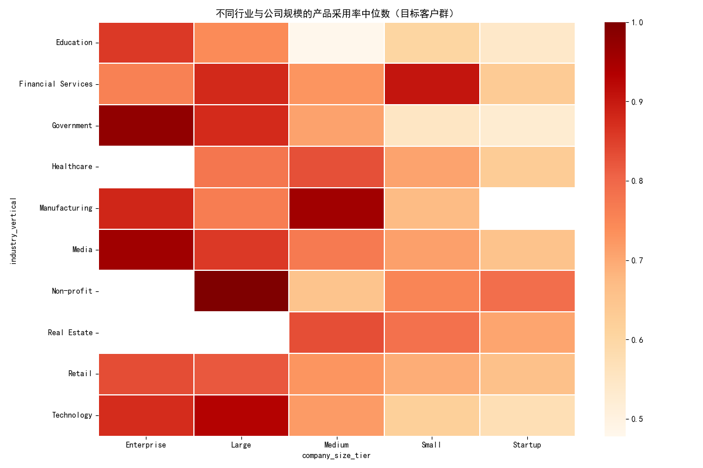
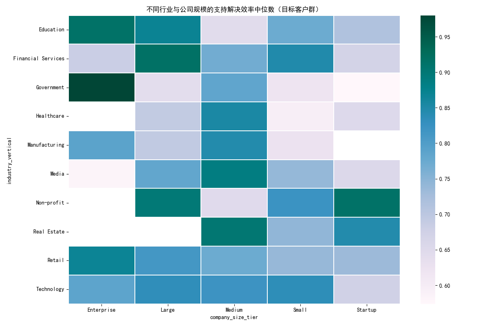
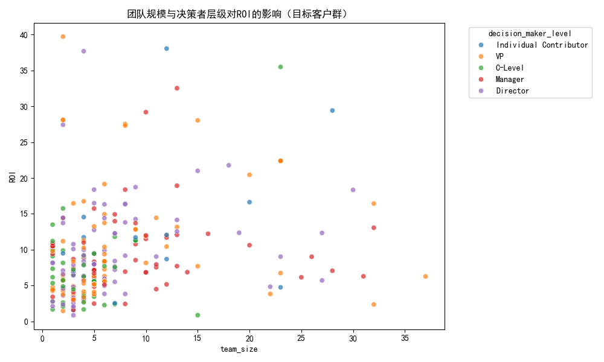
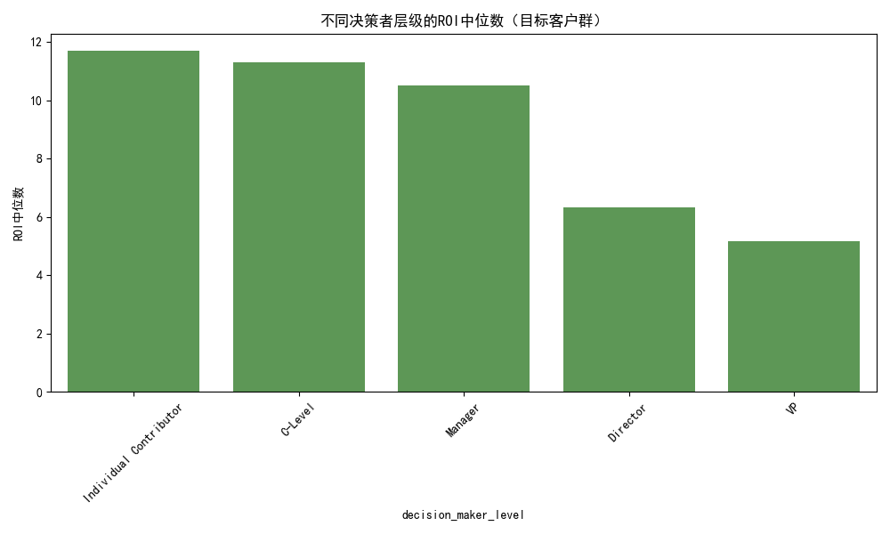
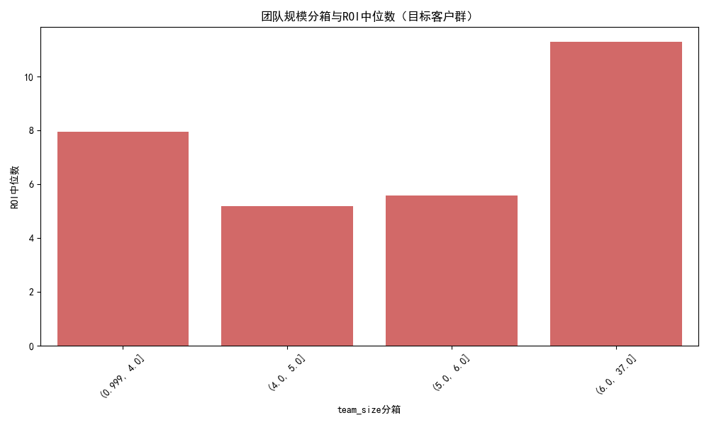
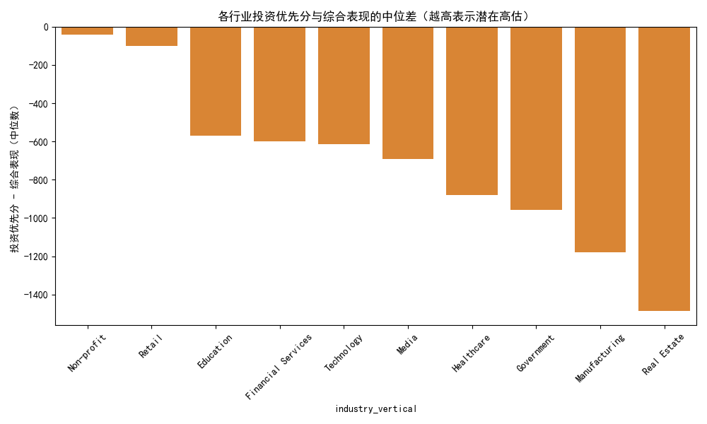

# 客户投资策略再评估：高投资优先但低综合表现客户群体分析报告

## 摘要
- 依据规则筛选出“investment_priority_score前30%且综合表现（40%销售额、35%产品采用率、25%支持效率）后50%”的客户，共计 847 位。
- 该群体的整体ROI（customer_lifetime_value / acquisition_cost）中位数约为 5.91，说明虽然当下综合表现较弱，但不少客户的生命周期回报相对于获客成本仍具有吸引力。
- 生命周期分布显示该群体以“Maturity”和“Retention”为主；ROI在“Growth”阶段的中位数最高（约11.29），在“Maturity”阶段明显较低（约5.17）。
- 入职评分与后续产品采用率相关性显著（皮尔逊相关约0.712），强化了“入职质量驱动采用”的机制解释。
- 行业与公司规模热力图呈现ROI分化，部分行业-规模组合的产品采用率与支持效率中位水平偏低，可能是造成综合表现落后的根因。
- 投资优先分与综合表现的“差值”在各行业呈显著负值（例如Technology、Financial Services、Education等），显示当前度量存在跨指标量纲不一致的问题，易引发系统性偏差（IPS与综合表现未统一量纲，导致直接差值含义混淆）。

阈值与关键指标：
- 投资优先分前30%阈值（IPS ≥）：2.0
- 综合表现后50%阈值（CPS ≤）：约 2175.38
- 目标群体数量：847
- 入职评分与产品采用率相关系数：约 0.712
- 目标群体ROI中位数：约 5.91

## 方法与数据
- 数据来源：SQLite数据库 dacomp-055.sqlite，表 customer360__customer、customer360__customer_value_analysis、customer360__mapping。
- 关联策略：使用mapping中外部ID映射到customer360_id，将value_analysis中的行为与价值指标与customer表中的销售金额字段进行合并。
- 综合表现（Composite Performance Score，CPS）公式：
  CPS = 0.40×total_sales_amount + 0.35×product_adoption_rate + 0.25×support_resolution_efficiency
- 选取规则：IPS位于前30%（数值≥第70分位），CPS位于后50%（数值≤第50分位）。
- ROI=customer_lifetime_value/acquisition_cost。

为保证中文可视化正常显示，绘图代码中设置了字体：
```python
plt.rcParams['font.sans-serif'] = ['SimHei']
plt.rcParams['axes.unicode_minus'] = False
```

## 结果展示（图文并茂）

### 1. 生命周期分布与ROI特征
- 人数分布：以Maturity（443）和Retention（320）为主，其次为Growth（78），Activation（5），Dormant（1）。
- ROI分布（中位数）：
  - Growth ≈ 11.29（最高）
  - Retention ≈ 7.97
  - Activation ≈ 7.67
  - Maturity ≈ 5.17（明显较低）

图片：
- 客户生命周期分布图：
  
- 不同生命周期阶段的ROI分布（箱线图）：
  

业务解读：
- Maturity阶段的客户大量聚集在“高投资优先但低综合表现”的群体中，同时ROI中位数偏低，提示在成熟客户上可能存在过度投资却回报有限的情况。
- Growth阶段的客户尽管综合表现目前偏低，但ROI中位数最高，说明成长型客户的潜在回报相对获客成本更具优势，属于“应持续投入但要优化使用时机与路径”的对象。

### 2. 行业（industry_vertical）与公司规模（company_size_tier）的表现分化
- ROI中位数组合热力图：
  
- 产品采用率与支持效率的中位数热力图（诊断根因）：
  
  

业务解读：
- 某些行业-规模组合显示ROI中位数较低，并同步呈现较低的产品采用率或支持效率中位水平，提示根因可能在于：
  - 入职/启用环节不足导致后续使用深度不够（adoption不足）。
  - 支持服务响应与解决效率不佳，影响满意度和续费扩展（support效率不足）。
- 针对这些行业-规模组合，应优先投入“产品教育与启用、关键功能引导、专项支持提效”，以提升采用深度与支持效率，从而拉升综合表现。

### 3. 入职评分（customer_onboarding_score）与产品采用率（product_adoption_rate）的关联
- 散点+回归：
  
- 相关性估计：皮尔逊相关系数约 0.712。

业务解读：
- 入职质量对后续产品采用率有强正向影响，即使在当前选择的“高投资优先但低综合表现”群体中亦成立。
- 投入结构应更偏向“提升入职质量”（标准化启用、运营赋能、功能里程碑管理），以在中短期内改善采用指标，进而推升综合表现与长周期ROI。

### 4. 团队规模（team_size）与决策者层级（decision_maker_level）对ROI的影响机制
- 团队规模与决策者层级对ROI的散点图：
  
- 不同决策者层级的ROI中位数：
  
- 团队规模分箱（四分位）与ROI中位数：
  

业务解读：
- 具有更高决策层级的客户群体通常更易获得更优的ROI中位数（从图中可观察决策层级越高，ROI中位水平有提升趋势），可能原因是决策权更集中、采纳速度更快、扩展空间更大。
- 团队规模的影响呈非线性：过小团队可能资源受限、采用深度不足；过大团队则需要更系统的变更管理与培训投入。中等规模团队在投入-回报比上可能更优，应重点优化其入职与赋能路径。

### 5. 投资优先分与综合表现的差异与系统性偏差
- 行业维度的“投资优先分 - 综合表现（中位数）”差异：
  
- 观测到各行业该差值普遍为较大负值（例如Technology、Financial Services、Education等），这与两类指标的量纲不一致有关：
  - 投资优先分通常为较小区间的评分（例如0-5级），
  - 综合表现包含销售额的绝对值，数值级别显著更高。
- 因此直接做差会产生“负值主导”的表象，并不代表IPS系统性低估，而是显示当前投资优先评分与综合表现缺乏统一量纲，难以直接比较。这种量纲不一致会在筛选、解释与决策上引入系统性偏差。

## 诊断总结（为什么会出现不匹配）
- 度量设计偏差：综合表现将销售额以40%权重纳入，但销售额的绝对值远大于评分类指标；未做归一化的线性加权使得“销售额低”显著拖低综合表现，造成大量处于早期或育成中的客户被判定为“表现后50%”。
- 投资优先判定逻辑可能过度依赖“潜力”“战略分类”等评分信号（来自value_analysis），而与短期销售额的量纲不一致，从而形成“高投资优先但低综合表现”的广泛群体。
- 行业与规模差异：不同垂直与公司规模对采用与支持效率的中位水平差异较大，导致在某些组合中即便投入较高，短期综合表现仍弱。
- 运营环节：入职质量显著影响采用率（r≈0.712），入职薄弱会普遍拖累综合表现与续费扩展。

## 预测性洞察（将会发生什么）
- 若维持现有模型与运营策略，Growth阶段客户的ROI将继续显现优势，但仍可能因绝对销售额较低被判定为“低综合表现”，从而被误判为“投资不匹配”，造成投入不足。
- Maturity阶段客户若不提升采用深度与交叉销售，ROI将继续偏低，投资边际回报可能进一步下降。

## 规范性建议（我们应该做什么）
1) 指标校准与量纲统一：
   - 在用于筛选与决策的综合表现中，对total_sales_amount、product_adoption_rate、support_resolution_efficiency进行归一化或标准化（例如按分布Z-score或分位变换），避免销售额绝对值主导评分。
   - 将ROI（CLV/获客成本）纳入投资优先评分的校准项，对不同生命周期阶段设定分段阈值（例如在Growth阶段提高ROI权重）。
2) 生命周期分层策略：
   - Growth：保持/加大投资，但强调“入职与功能里程碑”驱动采用，增强短期综合表现，避免被低表现规则误筛。
   - Maturity：针对性提升采用广度与深度（高级功能引导、扩展套餐设计），并优化支持效率（SLA缩短、自助服务能力），提高边际ROI。
   - Retention：聚焦续约风险与扩展机会，通过产品内价值呈现与成功案例加持，提升复购与扩展。
3) 行业×规模定制化：
   - 基于热力图识别ROI低且adoption/support中位偏低的组合，设计行业化启用包与规模化赋能路径，设定专项KPI（如30/60/90天采用里程碑）。
4) 入职改进（机制杠杆显著）：
   - 建立分层入职评分和流程治理，设定与产品采用率挂钩的目标；强化前90天的“活跃度与功能达成率”。
5) 决策者参与与团队规模运营：
   - 在大型组织中推进高层共同签署的价值计划，确保变更管理资源到位；在中等团队规模集中部署培训与运营资源，争取最佳ROI中位表现。

## 附录：图片清单
- lifecycle_distribution.png
- roi_by_lifecycle.png
- roi_heatmap_industry_size.png
- onboarding_vs_adoption.png
- roi_team_decision.png
- roi_by_decision_level.png
- roi_by_team_size_bins.png
- priority_perf_gap_by_industry.png
- adoption_heatmap_industry_size.png
- support_efficiency_heatmap_industry_size.png

## 备注
- 本次分析未进行数据清洗，严格依据提供的字段及权重进行计算与筛选。
- 由于IPS与CPS量纲不一致，建议后续在模型评估与可视化中采用归一化后再比较，以避免解释偏误。
