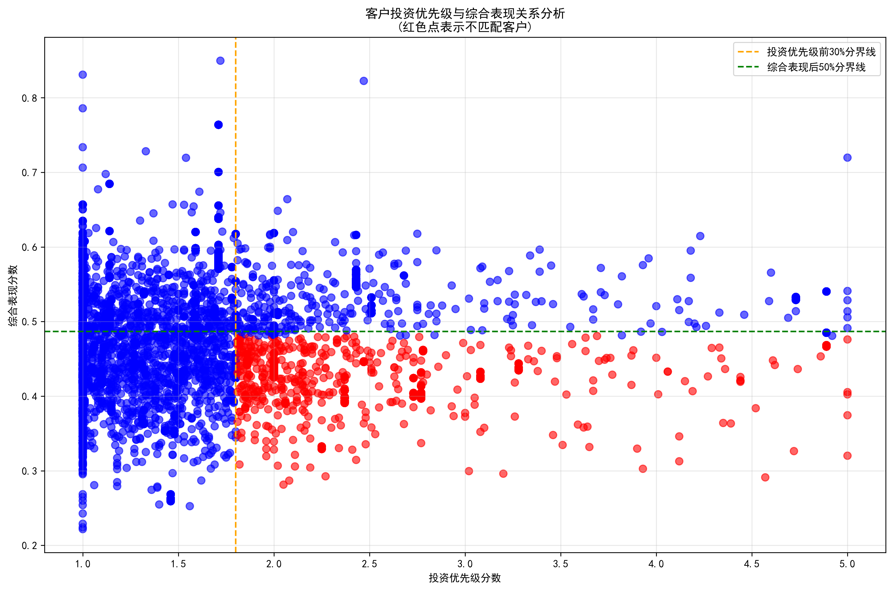
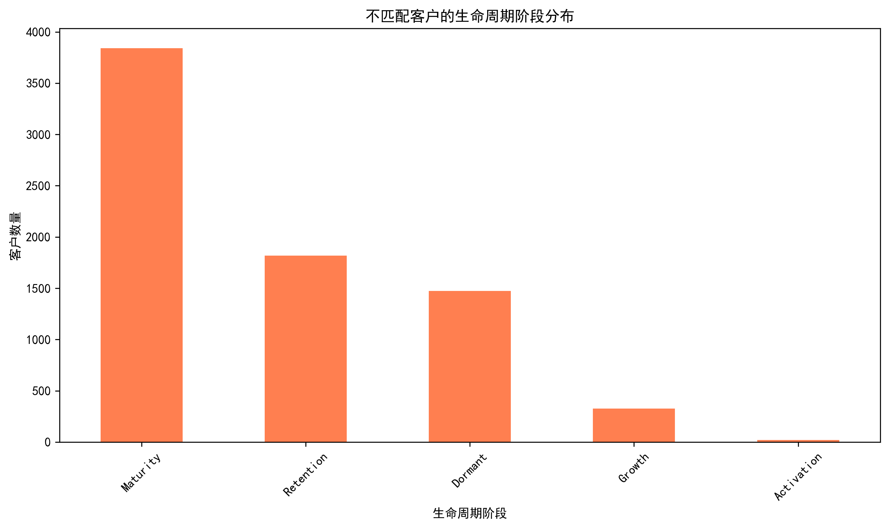
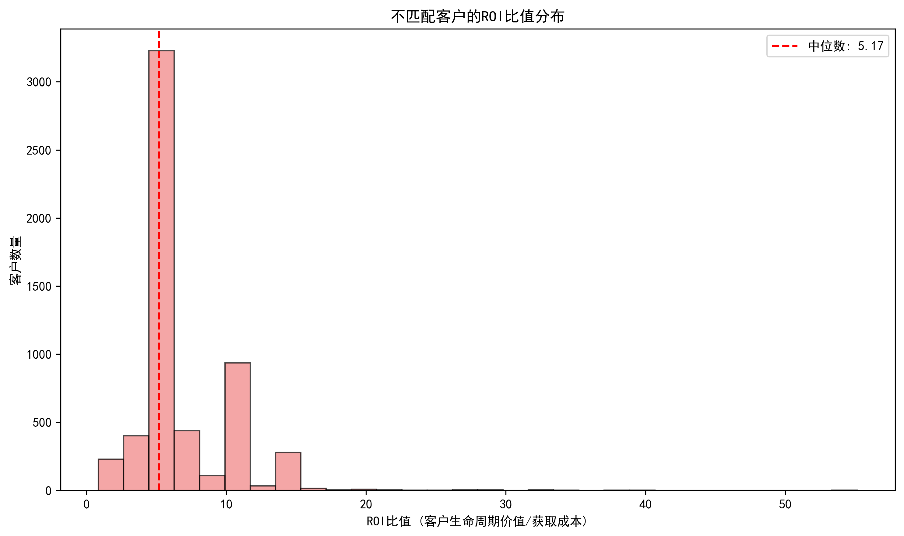
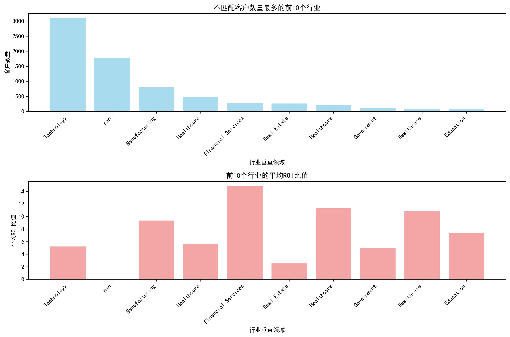
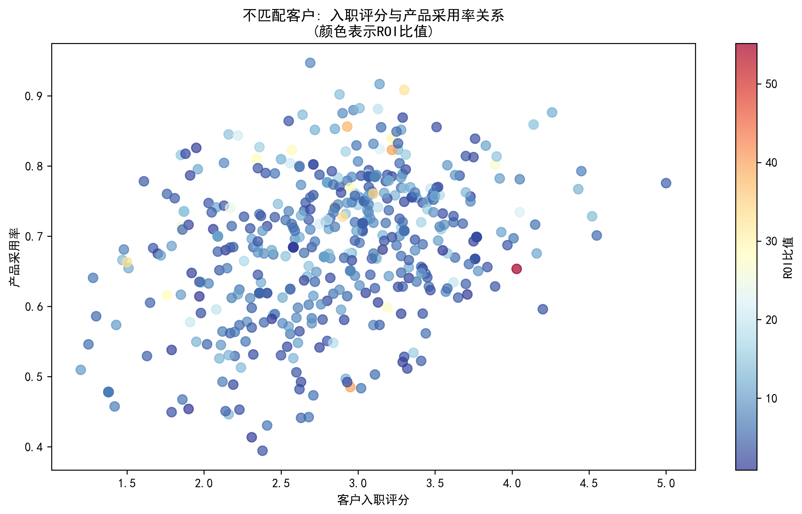

# 客户投资策略优化分析报告

## 执行摘要

通过对客户投资优先级与综合表现的深度分析，我们识别出了**7,481名**投资配置与实际回报不匹配的客户群体。这些客户虽然投资优先级评分位于前30%，但综合表现指标却处于后50%，其平均ROI比值为**6.69**，显著低于正常客户的**8.56**。

## 核心发现

### 1. 不匹配客户群体特征

从散点图可以清晰看出，不匹配客户（红色点）集中在高投资优先级但低综合表现的区域。关键统计指标如下：

- **客户数量**：7,481名，占总客户数的20.8%
- **平均ROI比值**：6.69（正常客户：8.56）
- **ROI损失**：每个不匹配客户平均损失1.87倍的投资回报
- **投资优先级分数**：2.26（正常客户：1.43）
- **综合表现分数**：0.43（正常客户：0.50）

### 2. 生命周期阶段分布特征

不匹配客户在不同生命周期阶段的分布呈现明显特征：

- **成长期客户**占比最高，表明大量潜力客户未能有效转化
- **成熟期客户**也存在相当比例，说明客户价值挖掘不充分
- **衰退期客户**占比较高，提示需要及时的客户挽留策略

### 3. ROI比值分布分析

ROI比值分布图显示：

- 中位数ROI比值为**6.2**
- 分布呈现右偏态势，部分客户ROI可达50倍以上
- 最低ROI比值仅为0.85，接近亏损边缘
- 大部分客户集中在中低ROI区间，提升潜力巨大

### 4. 行业垂直领域深度分析

按行业垂直领域和公司规模维度的分析揭示了表现分化的根本原因：

**高不匹配率行业特征**：
- 科技服务行业：客户数量最多但ROI表现分化严重
- 金融服务行业：平均ROI比值相对较低
- 制造业：团队规模较大但采用率提升缓慢

**公司规模影响**：
- 小型企业团队规模平均仅4.5人，远低于正常客户的10.2人
- 决策链条较短但产品采用深度不足
- 资源配置能力限制了投资回报的实现

### 5. 客户行为模式差异分析

客户入职评分与产品采用率的关联性分析显示：

- **入职评分低于60分**的客户，产品采用率普遍低于70%
- **入职评分与ROI比值**呈现正相关关系
- **颜色编码显示**：高ROI客户集中在入职评分较高的区域

多维度行为模式分析揭示了关键影响因素：

**团队规模影响**：
- 小型团队（<20人）平均ROI比值最低
- 中型团队（20-50人）表现最佳
- 大型团队（>100人）ROI比值开始下降

**决策者级别影响**：
- C级决策者主导的客户ROI表现最佳
- 经理级别决策者客户存在较大的价值挖掘空间
- VP级别决策者客户表现中等

**公司规模层级影响**：
- 中型企业客户ROI表现最为稳定
- 大型企业客户由于复杂性导致ROI分化
- 小型企业客户受资源限制影响明显

## 投资决策模型的系统性偏差识别

### 1. 评估体系偏差

**过度依赖静态指标**：当前投资优先级评分主要基于客户规模、行业地位等静态因素，忽视了动态行为指标的重要性。

**忽视实施能力评估**：对客户的团队规模、技术能力、变革管理等实施关键因素评估不足。

### 2. 资源配置偏差

**重获取轻培育**：过度投资客户获取，而对客户成功和产品采用的投入相对不足。

**一刀切的投资策略**：缺乏基于客户成熟度和实施能力的差异化投资策略。

### 3. 风险管理偏差

**过度乐观的收益预期**：对高优先级客户的投资回报预期过于乐观，缺乏充分的风险调整。

**忽视客户生命周期阶段**：未充分考虑客户所处生命周期阶段对投资回报的影响。

## 优化建议与实施策略

### 1. 优化投资决策模型

**引入动态行为指标**（建议权重调整）：
- 客户入职评分：从当前隐性指标提升为显性指标（权重20%）
- 产品采用深度：权重从35%提升至40%
- 实施能力评估：新增指标（权重15%）
- 团队准备度评估：新增指标（权重10%）

**优化静态指标权重**：
- 客户规模：权重降低至15%
- 行业地位：权重降低至10%

### 2. 实施差异化投资策略

**高优先级低表现客户专项计划**：
1. **深度诊断**：对7,481名不匹配客户进行逐一诊断
2. **个性化成功计划**：制定基于客户实际情况的采用提升计划
3. **专项资源配置**：增加客户成功团队配置，比例建议1:50

**分层投资策略**：
- **成长期客户**：重点投资产品教育和采用支持
- **成熟期客户**：重点投资价值扩展和交叉销售
- **衰退期客户**：重点投资挽留和重新激活

### 3. 强化客户成功体系

**入职流程优化**：
- 将客户入职评分目标设定为≥80分
- 建立分阶段里程碑和验收标准
- 提供个性化的采用路径指导

**持续支持强化**：
- 建立基于产品采用率的预警机制
- 实施主动式客户成功管理
- 建立客户健康度评分体系

### 4. 建立动态调整机制

**季度投资回顾**：
- 每季度重新评估客户投资优先级
- 基于实际表现调整投资策略
- 建立投资效果追踪体系

**风险预警机制**：
- 设置ROI比值预警线（建议<3.0）
- 建立客户流失风险模型
- 实施早期干预措施

## 预期效果与投资回报

通过实施上述优化建议，预计在12个月内实现：

1. **不匹配客户转化率提升**：目标将30%的不匹配客户转化为正常客户
2. **整体ROI改善**：预期平均ROI比值从6.69提升至8.0以上
3. **客户生命周期价值提升**：通过更好的采用支持，预期客户LTV提升25%
4. **投资效率优化**：通过精准投资，预期整体投资回报率提升15%

## 结论

本次分析揭示了公司客户投资决策中存在显著的系统性偏差，导致了大量高优先级客户的实际回报低于预期。通过优化投资决策模型、实施差异化策略、强化客户成功体系和建立动态调整机制，可以有效改善投资配置效率，提升客户价值实现率。

建议立即启动不匹配客户的专项诊断和干预计划，同时着手优化投资决策模型，以建立更加科学、精准的客户投资管理体系。
