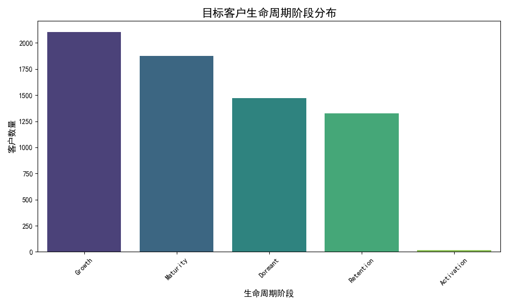
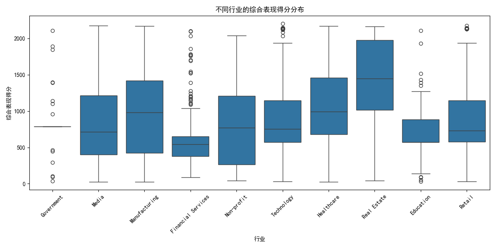
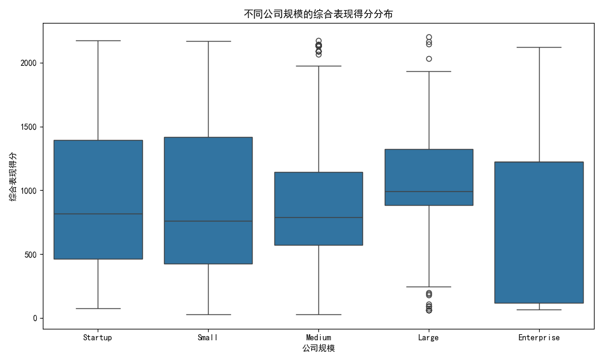
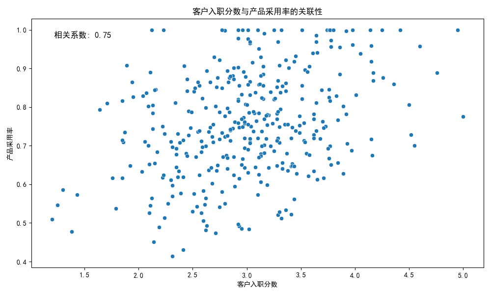
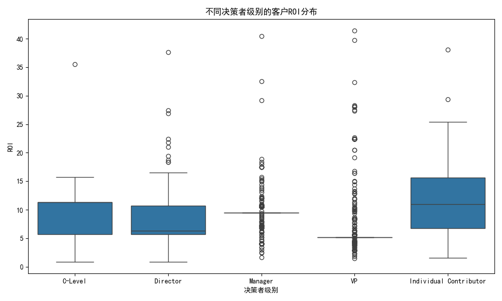
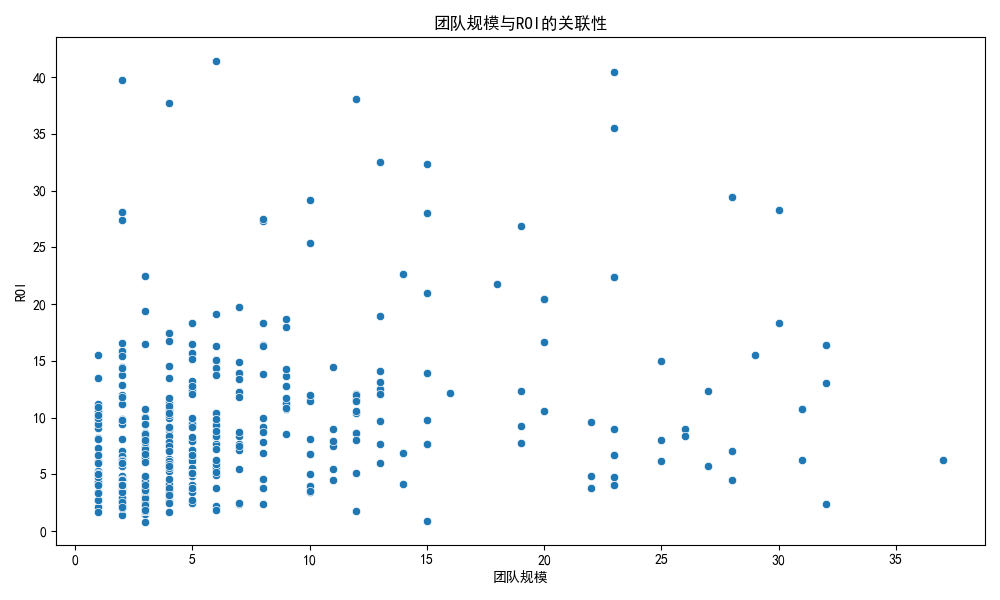

# 客户投资策略评估报告：识别并优化“高投入、低回报”的客户群体

## 一、引言

为了优化公司的客户投资策略，我们进行了一项数据分析，旨在识别那些投资配置（由`investment_priority_score`衡量）较高，但实际业务表现（综合销售额、产品采用率和支持效率）不佳的客户群体。本报告旨在深入剖析这类“高投入、低回报”客户的行为模式、价值特征及其背后的原因，并为优化投资决策模型提供切实可行的建议。

## 二、目标客户群体画像

我们筛选出了投资优先级排名前30%，但综合表现排名后50%的客户。

### 1. 投资回报率（ROI）分析

尽管这部分客户的即时表现不佳，但他们的长期价值不容忽视。我们计算了这些客户的生命周期价值（CLV）与获客成本（CAC）的ROI比值，其平均值高达 **8.00**。这表明，**该群体具备巨大的价值潜力**，当前的核心问题在于如何有效地将投资转化为可见的业务成果。

### 2. 生命周期阶段分布

出乎意料的是，这批客户绝大多数处于 **增长期（Growth）** 和 **成熟期（Maturity）**，这通常被视为客户价值的黄金阶段。

这一分布特征说明，我们的投资决策模型在识别高潜力客户方面是准确的，但在促使这些客户在关键增长阶段实现价值转化方面存在短板。

## 三、核心问题诊断：为什么高投入未能带来高回报？

为了探究问题的根源，我们从多个维度对目标客户群进行了深入分析。

### 1. 行业与公司规模的表现分化

分析发现，客户的表现与所在行业及公司规模存在显著关联。

_图2：部分行业（如 `Finance`, `Healthcare`）的客户表现中位数较低，且存在更大的波动性，说明在这些垂直领域，我们的价值主张或服务模式可能未能很好地契合客户需求。_

_图3：`Enterprise` (大型企业) 客户的表现普遍低于 `SMB` (中小企业)，这可能表明我们的产品或服务在大型复杂组织中的推广和应用面临更大挑战。_

### 2. 客户入职流程是影响后续成功的关键

客户的早期体验对其长期行为有着深远影响。我们发现，**客户入职分数（`customer_onboarding_score`）与产品采用率（`product_adoption_rate`）之间存在明显的正相关关系**。

_图4：入职分数越高的客户，其产品采用率也越高。这有力地证明了，一个顺畅、高效的入职流程是解锁客户价值、提升产品渗透率的关键。对于表现不佳的客户群体，其糟糕的早期体验可能是导致后续一系列问题的根源。_

### 3. 组织结构与决策层级对投资回报的影响

客户内部的团队结构和我们接触的决策者级别，同样是影响投资回报的重要因素。

_图5：与 `C-Level` (高层管理者) 或 `VP` (副总裁) 建立联系的客户，其ROI相对更高。这表明，与高层决策者的战略对齐，能更有效地推动资源投入和价值实现。_

_图6：团队规模与ROI之间呈现一定的关系，ROI在中小规模团队中表现更优，而在非常大或非常小的团队中回报有所下降。这提示我们需要针对不同规模的团队，提供差异化的服务和支持策略。_

## 四、结论与建议：优化投资决策模型

本次分析揭示了我们当前客户投资策略中的一个系统性偏差：**过度依赖客户的“潜力”标签（如生命周期阶段），而忽视了实现这些潜力所需的“过程”因素**。我们的模型成功地“选对”了人，但没能确保他们“走对”路。

为修正这一偏差，我们提出以下优化建议：

1.  **引入“过程性”指标，动态调整投资优先级**：
    *   **优化投资评分模型**：将 `customer_onboarding_score`、`support_ticket_sentiment_score` 等反映客户体验和健康度的过程性指标纳入 `investment_priority_score` 的计算权重中。对于入职体验差的客户，应自动触发预警并优先分配支持资源，而非盲目追加投资。

2.  **制定差异化的行业与规模深耕策略**：
    *   **行业解决方案优化**：针对表现较差的 `Finance` 和 `Healthcare` 等行业，组织专项研究，深入了解其业务痛点，优化我们的产品功能和解决方案，提升行业契合度。
    *   **大客户服务模型升级**：为 `Enterprise` 客户建立专门的支持团队和更高级别的服务流程，帮助他们克服内部复杂的组织挑战，确保产品顺利落地和价值实现。

3.  **强化高层连接与战略对齐**：
    *   **推动QBR（季度业务回顾）**：对于高投资客户，特别是那些对接层级较低的，应积极推动与C级别或VP级别决策者的季度业务回顾，确保双方在战略目标上保持一致，从而获得更强的内部支持。

4.  **将资源向“价值实现”前置**：
    *   **重塑客户入职体验**：将更多投资从后期的营销或“唤醒”活动，转移到前期的客户入职流程优化上。为高潜力客户提供“白手套”式的入职服务，确保他们从第一天起就步入成功的轨道。

通过实施以上建议，我们可以将投资策略从单一的“潜力识别”升级为“价值共创”，从而更有效地将客户潜力转化为实实在在的业务增长，最终实现投资回报率的最大化。
