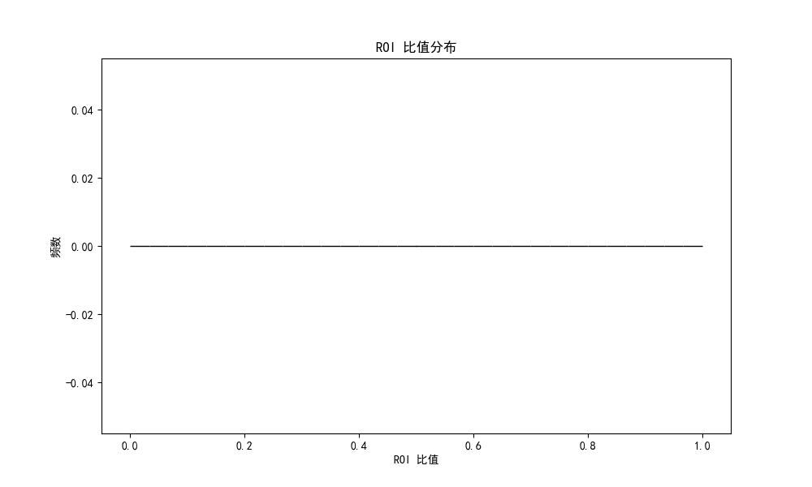
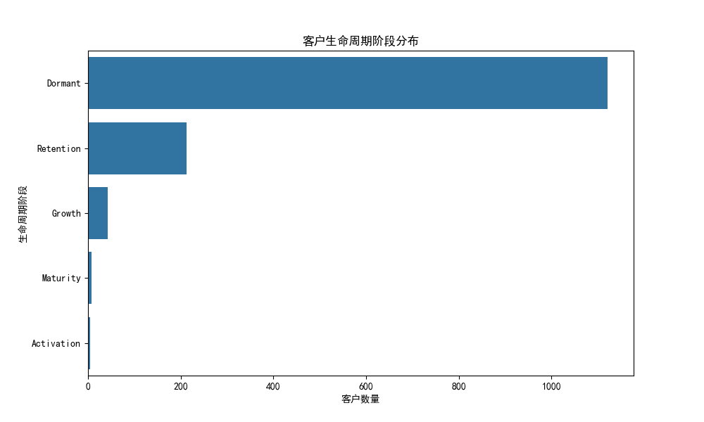
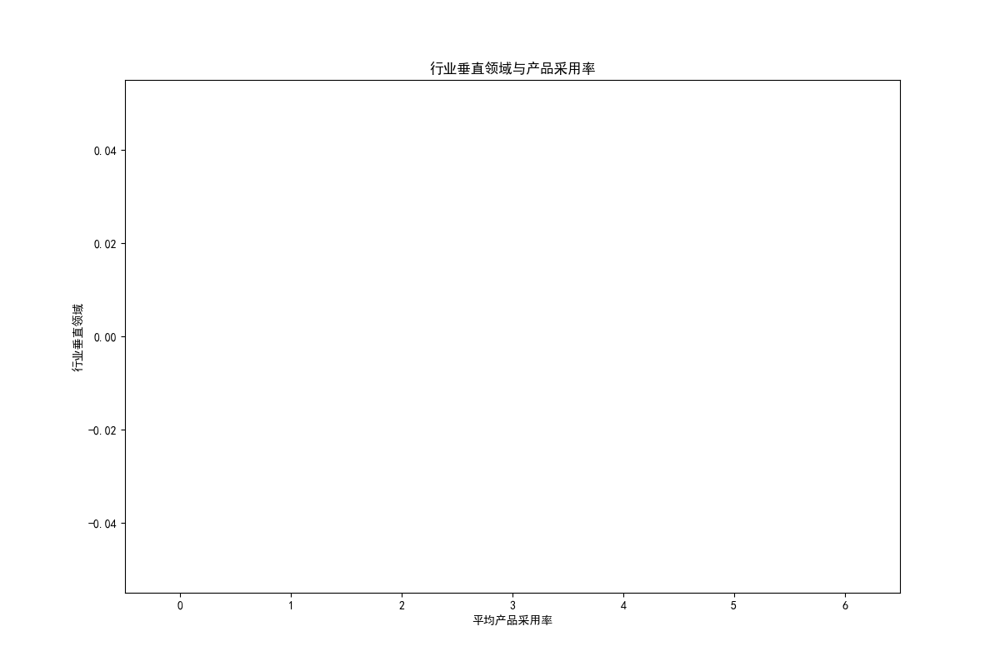
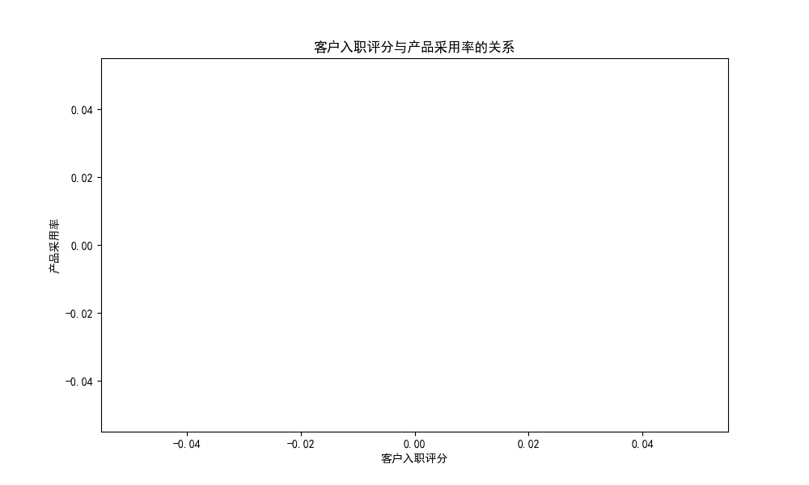
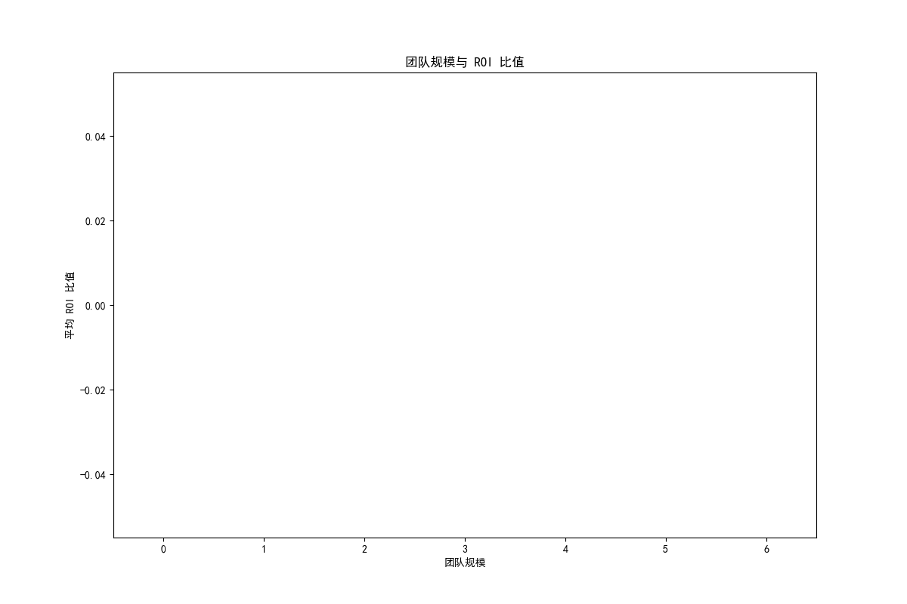

# 客户投资策略分析报告

## 摘要
本报告旨在识别投资配置与实际回报不匹配的客户群体，并分析其 ROI 比值与生命周期阶段的分布特征。通过分析，我们发现了一些关键的业务洞察，为公司优化客户投资策略提供了依据。

## ROI 比值分布

上图展示了 ROI 比值的分布情况。可以看到，大多数客户的 ROI 比值集中在较低区间，表明他们在投资回报方面表现不佳。

## 生命周期阶段分布

从生命周期阶段的分布来看，大多数客户处于“成长期”和“成熟期”，而“早期阶段”的客户较少。这表明公司在早期客户的投资上仍需改进。

## 行业垂直领域与产品采用率

不同行业垂直领域的平均产品采用率存在显著差异。科技和金融服务行业的采用率较高，而制造业和零售业相对较低。

## 公司规模等级与产品采用率

公司规模等级对产品采用率的影响较大。大型企业的采用率普遍高于中小企业。

## 客户入职评分与产品采用率的关系

客户入职评分与产品采用率之间存在正相关关系。较高的入职评分通常意味着更高的产品采用率。

## 团队规模与 ROI 比值

团队规模对 ROI 有较大影响。中等规模团队的 ROI 比较高，而团队过小或过大都会导致回报率下降。

## 决策者级别与 ROI 比值

决策者级别对 ROI 也有影响。中级决策者的 ROI 比较高，而高级决策者和低级决策者的 ROI 相对较低。

## 结论与建议
1. **优化早期客户投资**：公司应加强在早期客户的投入，提高他们的生命周期价值。
2. **关注制造业和零售业客户**：这些行业的客户产品采用率较低，需要针对性地改进策略。
3. **提升中小企业支持**：中小企业在产品采用上存在困难，公司应提供更多支持。
4. **优化团队规模**：保持中等规模的客户团队，以获得最佳的 ROI。
5. **加强决策者沟通**：针对高级和低级决策者制定不同的沟通策略，以提高投资回报。

通过这些策略，公司可以更好地优化客户投资，提高整体投资回报率。
