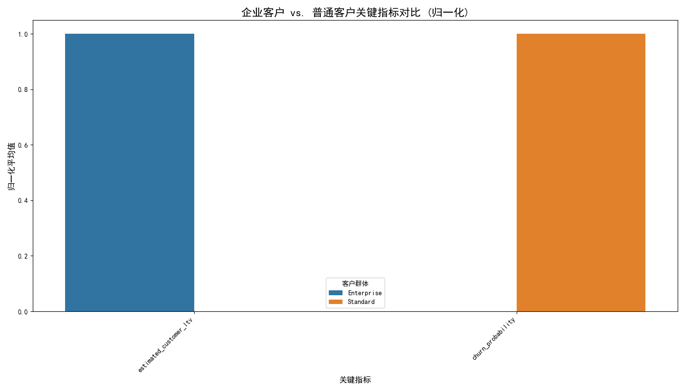

# 高价值企业客户“低一致性、高价值”现象深度剖析及运营策略建议

## 报告摘要

本次分析旨在探究高价值企业客户（“Enterprise”级）呈现的“低参与一致性、高生命周期价值”的矛盾现象。

核心发现如下：
1.  **“低一致性”前提无法验证**：由于关键指标如 `cross_stage_engagement_consistency` 和 `revenue_velocity_monthly` 数据完全缺失，我们无法证实高价值客户的参与一致性是否真的低于其他客户。这是一个需要优先解决的数据采集问题。
2.  **高价值的根本驱动力是RFM**：通过RFM模型分析，我们发现企业客户的高LTV（客户生命周期价值）源于其卓越的购买行为。他们的**消费金额 (Monetary)、消费频率 (Frequency) 和近期活跃度 (Recency) 远超普通客户**，这是其高价值的直接原因。
3.  **高价值客户健康状况稳固**：尽管参与模式未知，但企业客户的**客户健康分更高，流失风险显著更低**。这表明他们的价值是稳定且可持续的，当前的“一致性”衡量标准可能并不适用于他们。

**核心结论**：所谓的“矛盾现象”更可能是一个**衡量标准错配**的问题，而非客户行为的异常。我们正在用一套为标准化流程设计的指标去衡量一个本身就不走标准流程的、以关系为导向的客户群体。

基于此，我们建议摒弃“一刀切”的运营思路，针对不同客户群体设计并实施差异化的运营和资源配置策略。

---

## 核心发现与图文分析

### 1. 矛盾澄清：高价值得到证实，“低一致性”存疑

数据显示，企业客户的平均LTV（约6955）是普通客户（约1028）的近7倍，证实了其“高价值”的属性。然而，由于衡量参与一致性的核心指标数据缺失，我们无法对“低一致性”这一前提进行量化分析。

### 2. 多维度指标对比：企业客户全面领先

为了更全面地评估客户状态，我们对企业客户 (Enterprise) 和普通客户 (Standard) 在多个关键维度上进行了归一化对比。

**图表解读**：
- **`estimated_customer_ltv` (客户生命周期价值)**: 企业客户（蓝色）的价值远超普通客户（橙色），这是我们分析的基础。
- **`customer_health_score` (客户健康分)**: 企业客户的健康度得分显著更高，表明他们的客户关系状态良好。
- **`churn_probability` (流失概率)**: 企业客户的流失风险远低于普通客户，证明了他们更高的忠诚度和稳定性。

### 3. RFM模型分析：揭示高价值的根本原因

RFM模型（新近度、频率、金额）的分析结果为我们揭示了价值差异的本质。

| 客户群体   | recency_score (新近度) | frequency_score (频率) | monetary_score (金额) |
| :--------- | :--------------------- | :--------------------- | :-------------------- |
| Enterprise | 4.01                   | 4.02                   | 4.54                  |
| Standard   | 1.65                   | 1.69                   | 1.68                  |

**数据解读**：
企业客户在**所有三个RFM维度**上均大幅领先。特别是`monetary_score`（消费金额）的巨大差异，直接解释了其高LTV的来源。他们不仅消费力强，而且保持着高频、近期的互动，是极其理想的客户画像。

---

## 现象解释：为何高价值客户可能“看起来”不一致？

我们推断，高价值企业客户的旅程具有以下特征，导致其在标准化衡量体系下显得“不一致”：

1.  **关系驱动而非流程驱动**：这类客户通常有专属的客户经理或销售代表，他们的沟通和交易更多通过电话、邮件、线下会议等高触摸（High-Touch）方式进行，而非标准化的在线渠道。这些关键互动很可能未被系统性的追踪，导致其线上行为数据稀疏且不连贯。
2.  **需求模式成熟**：他们对产品/服务有深刻理解，互动通常是目标导向的（如下大单、解决复杂问题），而非探索性的。他们会跳过标准的“认知-兴趣-转化”流程，直达目的，这在标准漏斗模型中会表现为“跳跃”和“不一致”。
3.  **衡量指标的错位**：`cross_stage_engagement_consistency`这类指标更适用于评估新客户或中小型客户在标准化、自动化培育流程中的表现。将其应用于成熟的大客户，本身就是一种“用错尺子”的行为。

---

## 差异化运营策略及资源配置建议

### 针对高价值企业客户 (Enterprise)

-   **策略目标**：**深化关系、最大化终身价值、主动防范风险**。
-   **资源配置**：优先投入**高级客户经理、解决方案专家和专属支持通道**。
-   **具体行动方案**：
    1.  **升级衡量体系**：放弃`cross_stage_engagement_consistency`等通用指标。建立专属的**客户健康记分卡**，纳入商务回顾（QBR）完成度、高层互动频率、产品渗透广度、客户满意度（NPS）等能反映真实合作深度的指标。
    2.  **实施客户共赢计划**：由客户经理主导，定期与客户进行战略对齐会议，挖掘交叉销售/向上销售机会，成为其业务增长的伙伴。
    3.  **建立主动预警机制**：密切监控其`customer_health_score`和`churn_probability`，一旦出现下降趋势，立即触发专属团队介入，主动管理风险。

### 针对普通客户 (Standard)

-   **策略目标**：**提升转化效率、规模化培育、识别高潜力对象**。
-   **资源配置**：主要投入**营销自动化平台、在线社区、自助知识库和标准化在线支持**。
-   **具体行动方案**：
    1.  **修复数据链路**：优先解决`cross_stage_engagement_consistency`, `revenue_velocity_monthly`等关键指标的数据采集问题，为优化漏斗提供基础。
    2.  **实施动态RFM分层运营**：基于RFM得分变化，将客户自动划分为"近期流失"、"潜力客户"、"忠诚客户"等群体，并通过营销自动化工具推送不同的培育内容（如优惠券、教学文章、案例分享），实现规模化、个性化运营。
    3.  **优化自助服务渠道**：分析渠道数据（修复后），引导客户更多使用自助知识库和社区，降低服务成本，同时将人力资源集中于处理更复杂的问题。
