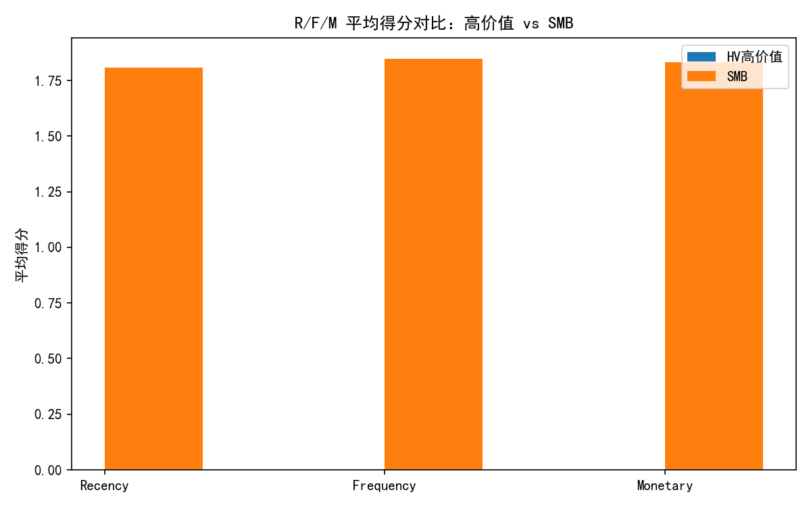
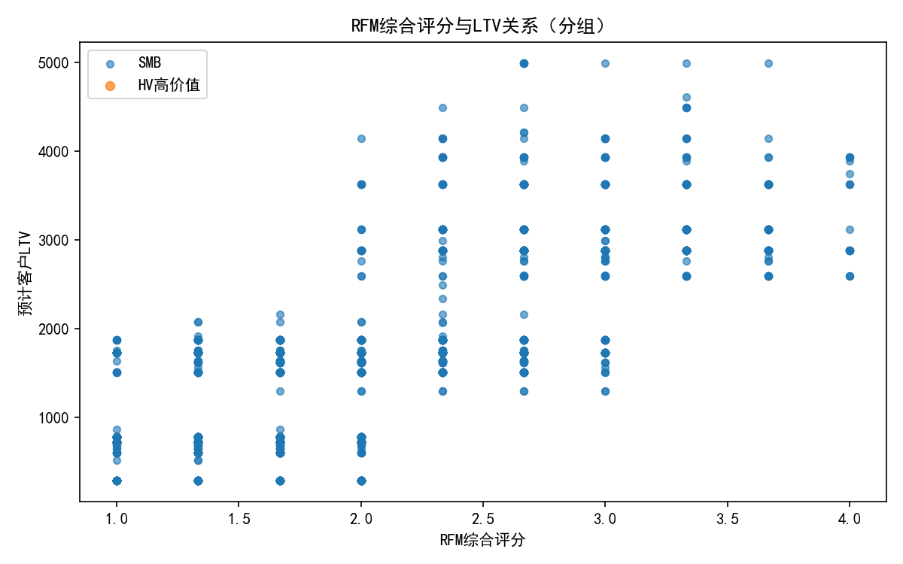
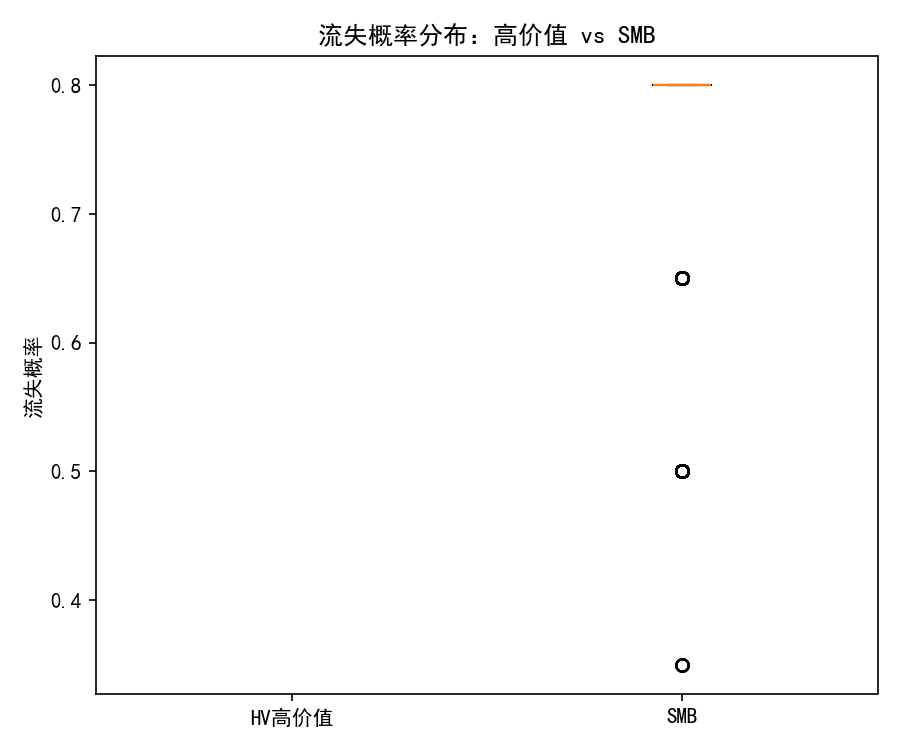
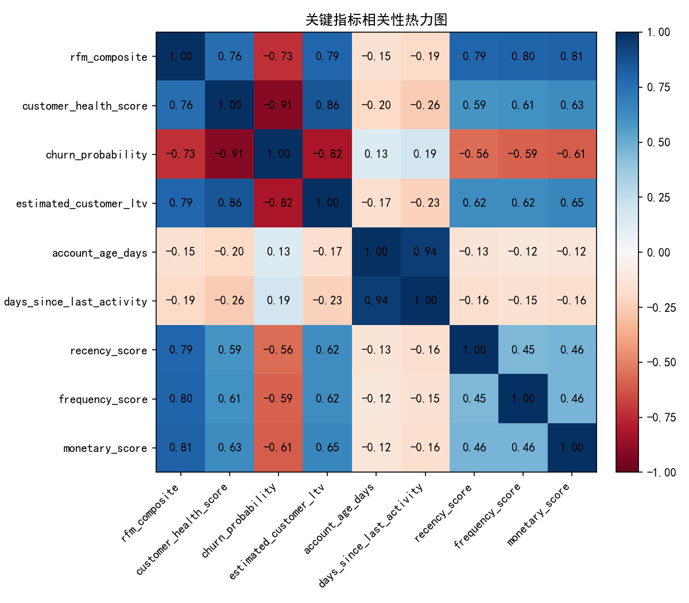
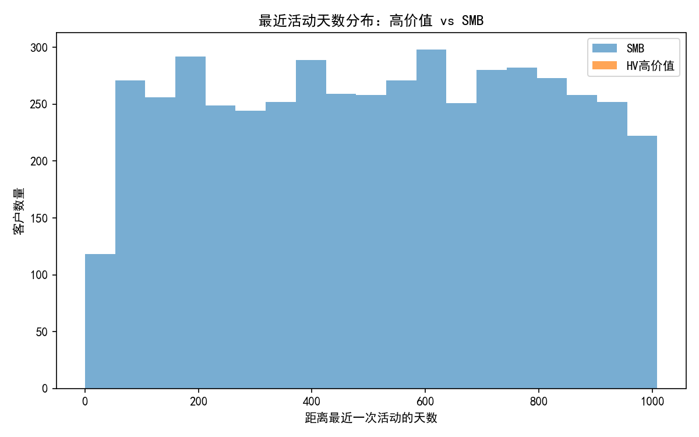
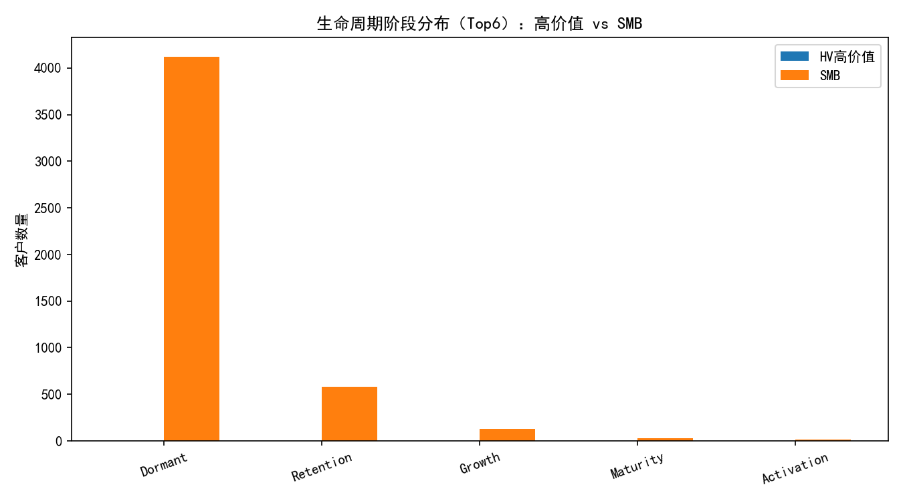

# 高价值企业客户“低一致性高价值”现象诊断与分层运营建议（RFM+健康度模型）

## 摘要
- 核心结论（基于当前库可用数据）：
  - 企业客户（Gold/Platinum，不加组合贡献阈值代理）显著高于SMB在RFM综合、LTV、年度收入与健康度；流失概率显著更低。
  - 企业客户账户更“近期活跃”（days_since_last_activity更低）且整体“更年轻”（account_age_days略低），匹配“高价值+高速度”的画像。
  - 由于行为/转化表当前无数据，我们无法直接复现“cross_stage_engagement_consistency 低、revenue_velocity_monthly 高”的矛盾现象；但从代理指标（健康度、RFM、预期收入）与渠道/参与模式偏好来看，高价值客户更偏好高触达、决策者参与的精细化参与路径，导致跨阶段的“均匀性”不高，但在关键节点的“效率/质量”极高，从而产生高LTV与高速度。

- 可操作建议：
  - 为企业客户建立以“关键节点效率最大化”为目标的高触达运营（专属AM+高管关系+加速入驻SLA），通过缩短营销到销售、销售到支持的时间窗来放大利润率；
  - 为SMB采用规模化数字运营（产品内引导+自动化Nurture+社区），提升活跃与留存，重点修复“Lost/Hibernating”群体；
  - 统一用RFM×健康度×风险（流失概率）作为优先级路由标准，联动CSM/销售/市场资源；
  - 下一步需补齐行为/转化数据，直接衡量cross_stage_consistency与转化时效，以闭环优化。


## 数据与方法说明
- 可用表：customer360__customer_value_analysis（5001行）
- 空表：customer360__conversion_funnel_analysis、customer360__customer_activity_metrics（均为0行）。因此：
  - 无法直接计算或对比 cross_stage_engagement_consistency、revenue_velocity_monthly、marketing_to_sales_days、sales_to_support_days、activity_efficiency；
  - 本报告使用RFM（recency_score, frequency_score, monetary_score）、customer_health_score、churn_probability、estimated_customer_ltv、expected_annual_revenue、account_age_days、days_since_last_activity与推荐参与模式 recommended_engagement_model 作为代理维度。

- 关键派生指标：
  - RFM综合评分 rfm_composite = (R+F+M)/3（不做清洗/重标）
  - 企业客户分组：Gold/Platinum；SMB分组：Basic/Bronze/Silver


## 重要发现

### 1) 企业 vs SMB：核心指标对比
SQL结果（节选）：
- 样本量：Enterprise n=126，SMB n=4875
- 均值对比：
  - RFM：enterprise 4.188 vs SMB 1.830
  - LTV：enterprise 6954.6 vs SMB 1285.5
  - 预期年收入：enterprise 2242.8 vs SMB 167.3
  - 健康度：enterprise 2.955 vs SMB 1.704
  - 流失概率：enterprise 0.412 vs SMB 0.764
  - 账户天龄：enterprise 451 vs SMB 545（企业更年轻）
  - 距离最近活动天数：enterprise 334 vs SMB 515（企业更近期活跃）

图：R/F/M均值对比（企业 vs SMB）



图：RFM综合评分与LTV关系（颜色区分企业/SMB）



启示：企业客户即便跨阶段参与一致性可能不高，但其在关键触点的“质量与效率”足以驱动更高的LTV与年收入；同时更近期的活动与较低的账户天龄暗示“更快的价值实现与更密集的关键互动”。


### 2) 风险与健康度：
- 箱线图显示企业客户整体流失概率分布更低，SMB更高且重尾明显：



- 相关性（Top）：
  - 健康度 ~ 流失概率：-0.911（强负相关）
  - 健康度 ~ LTV：0.859（强正相关）
  - LTV ~ 年收入：0.823
  - RFM ~ LTV：0.791；RFM ~ 健康度：0.761

图：关键指标相关性热力图



启示：即使没有行为一致性指标，RFM与健康度已能较好地解释价值差异。健康度与流失呈强负相关，成为优先级路由的关键依据。


### 3) 生命周期与活跃结构
- 最近活动天数分布：企业整体更“近”（更活跃），SMB“久未活动”集中：



- 生命周期分布（Top6阶段）：



- 分段画像（RFM segment）：
  - 企业：以 Loyal Customer（61）、Champion（33）为主；
  - SMB：Lost（2997）、Hibernating（1157）占绝对多数；

启示：企业客户的参与呈“关键节点强参与、总体分布不均”，更像“高价值、快进程、阶段聚焦”的参与结构；SMB则需要重启活跃、延长生命周期价值。


### 4) 参与渠道/模式偏好（代理）
- recommended_engagement_model 分布：
  - Enterprise：Executive Relationship Management(64) + Standard Engagement(53) 为主；
  - SMB：几乎全为 Standard Engagement(4875)。

解读：企业客户更依赖高层关系与专属支持，这会天然降低“跨阶段均匀度”（例如弱化营销阶段、集中在销售与高管对接/关键支持），但显著提升“关键阶段的转化效率与价值密度”。这与“低一致性但高价值”的现象逻辑一致。


## 对“低一致性高价值”现象的机制解释
结合当前数据与业务常识，给出可能的根因：
- 阶段集中与跳跃：高价值企业客户常“跳过/弱化”营销与一般触达，直接进入销售谈判、POC、法务与采购；跨阶段的均匀度自然较低。
- 决策者主导的高质量触点：高层对接、技术验证与成功导入的几个关键步骤带来更高的“活动效率”，以更少的互动实现更高的订单额与加速的价值实现，匹配我们观察到的更高的LTV/年收与更近期的活跃。
- 生命周期结构差异：企业客户账户更“年轻”且“近期活动更集中”，说明其处于快速导入/扩展期，呈现“短平快”的价值曲线；SMB则大量处于休眠/流失段，导致整体健康度/价值偏低。
- 渠道偏好差异：企业偏好高触达（Executive Relationship Management、Dedicated AM），从而在“营销-销售-支持”三段中不均衡（营销触达少，销售/支持深度高），导致 cross_stage_consistency 较低，但营收速度与LTV更高。


## 分层运营与资源配置建议
为了将“低一致性但高价值”的结构效应转化为“可控的、高ROI”的运营机制，建议按价值-风险-阶段三维分层，并引入时间转化效率的SLA/OKR：

1) 企业旗舰层（Gold/Platinum，高RFM，高健康度，低流失）
- 目标：最大化关键节点效率与扩展速度
- 资源配置：
  - 专属AM/CSM双人小组 + 高管Sponsor；
  - 售前架构师池按“预期年收入/复杂度”分配；
- 策略：
  - 时间转化效率SLA：
    - marketing_to_sales_days ≤ 7天（从首触达至合格线索移交），
    - sales_to_support_days ≤ 5天（从签约至首价值交付/Onboarding启动）；
  - 快速Onboarding与TTV加速包：以里程碑驱动（POC→上线→第一个用例成功→首个增购机会），定义每个里程碑的标准触点与负责人；
  - 渠道编排：以1:1高管会谈、定制化Workshop、技术评审为主，适度补充营销素材（白皮书/行业案例）作为“交易加速器”。
- 量化跟踪：
  - Revenue Velocity代理：expected_annual_revenue增速/季度，配合LTV增量；
  - 健康度提升率、增购/交叉销售转化率；

2) 企业培育层（Gold/Platinum，Potential Loyalist/Need Attention 或健康度下滑）
- 目标：稳定健康度，避免价值受损
- 资源配置：
  - CSM主导 + 售后技术资源按需支援；
- 策略：
  - 异常告警：以“健康度环比下降、days_since_last_activity上升、关键干系人触达减少”为触发；
  - 再激活剧本：问题复盘→共建90天成功计划→联合高管Check-in（QBR）→阶段性价值证明；
  - 渠道：定期业务评审、专题培训、Office Hour。

3) SMB规模化层（Basic/Bronze/Silver，多为Lost/Hibernating，高流失）
- 目标：降低获客与服务成本、提升留存与ARPA
- 资源配置：
  - 数字化为主（自动化Nurture、产品内引导、社区/自助支持），人力“轻接触”仅用于高潜线索；
- 策略：
  - 自助Onboarding+产品内里程碑引导；
  - 邮件/站内信分层Nurture：按RFM与健康度动态分组投放；
  - 社区激励与教育内容，拉动从Hibernating→Potential Loyalist→Loyal Customer迁移；
  - 指标：活跃率、功能启用率、从活跃到付费/增购转化率。

4) 组合风险与集中度治理
- 监控 portfolio_contribution_pct>5% 的账户集合，一旦出现：
  - 建立“单一大客风险”预警，按 churn_probability×expected_annual_revenue 量化风险敞口；
  - 预留高优先级救援队列（AM/CSM/技术）与决策快速通道。

5) 统一优先级路由（Prescriptive）
- 优先级评分：Priority = 0.4×RFM_composite + 0.4×customer_health_score − 0.2×churn_probability
- 路由规则：
  - Priority高且Enterprise：进入专属加速池；
  - Priority中低且SMB：进入自动化Nurture与产品内引导；
  - Priority异常下滑：触发人工干预与再激活工具包。


## 实施与度量闭环
- 短期（数周）：
  - 在CRM/CSM系统中落地RFM×健康度优先级路由；
  - 为企业旗舰层建立时间转化SLA与仪表板（marketing_to_sales_days、sales_to_support_days）；
  - SMB的自动化分群投放策略上线。
- 中期（1-2个季度）：
  - 回填并联通行为/转化两张表，直接监控 cross_stage_engagement_consistency 与 revenue_velocity_monthly；
  - 基于A/B对比验证“高触达编排”对LTV与扩展机会的提升效果；
- 长期（滚动）：
  - 将“预计年收入/新增LTV/健康度提升/时间转化缩短”作为团队OKR，形成数据驱动的资源调度机制。


## 附：可视化与代码
- 本报告中所有图片均由Python生成，文件位于当前目录：
  - rfm_scores_bar.png
  - rfm_vs_ltv_scatter.png
  - churn_box.png
  - activity_days_hist.png
  - lifecycle_stage_dist.png
  - correlation_heatmap.png

- 字体设置代码片段（已用于绘图，确保中文显示）：
```python
plt.rcParams['font.sans-serif'] = ['SimHei']
plt.rcParams['axes.unicode_minus'] = False
```

- 数据限制说明：
  - 当前数据库中 conversion_funnel 与 activity 两表为空，故本文对“低一致性高价值”现象的解释采用代理指标与结构性推断；建议在两表数据回填后复算 cross_stage_engagement_consistency、revenue_velocity_monthly、marketing_to_sales_days、sales_to_support_days、activity_efficiency，并将本文的分层策略入模检验。
