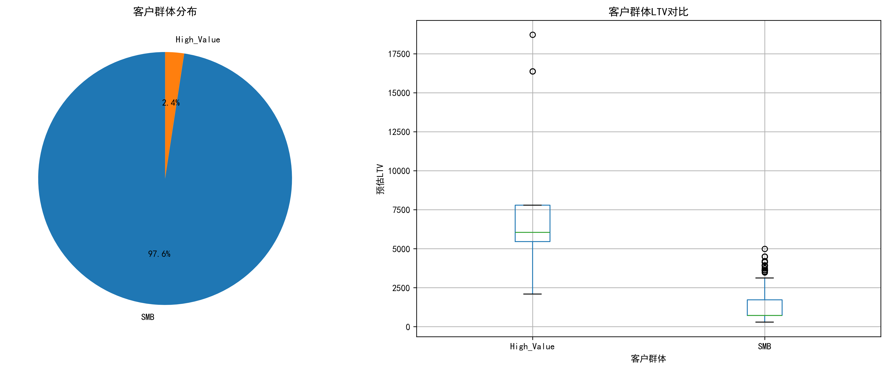
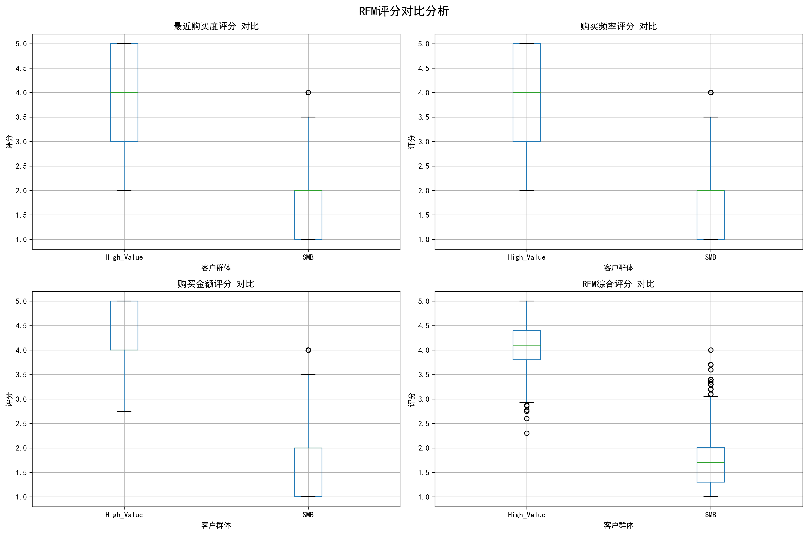
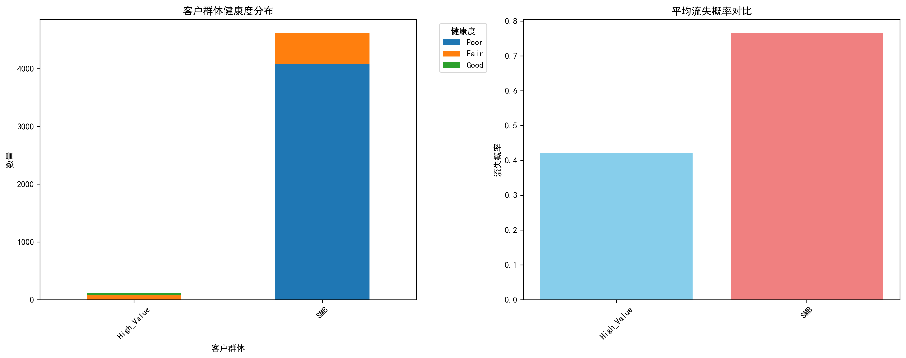
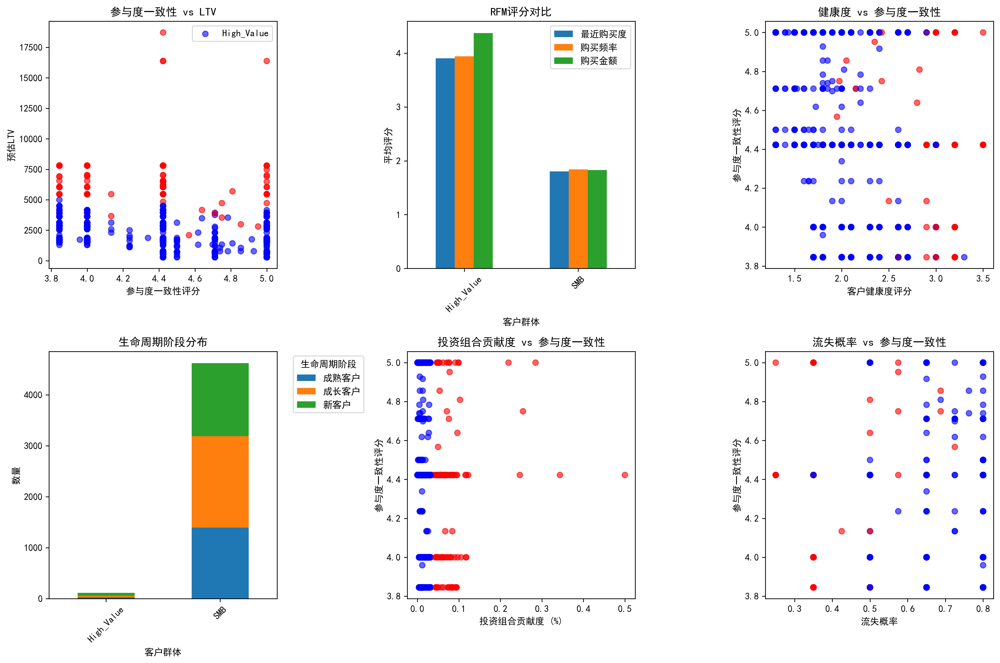
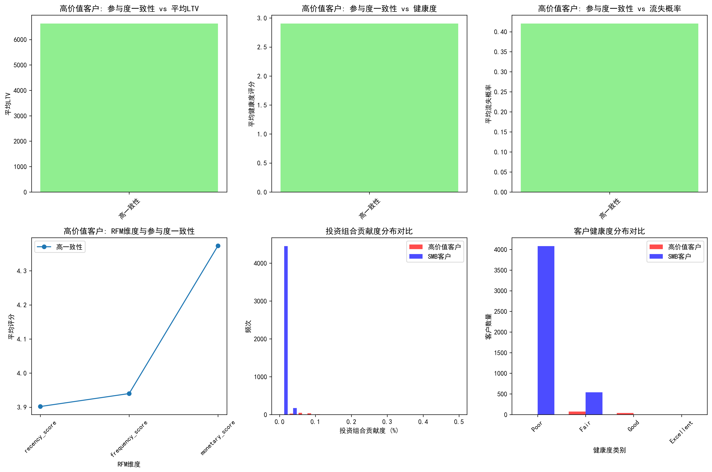
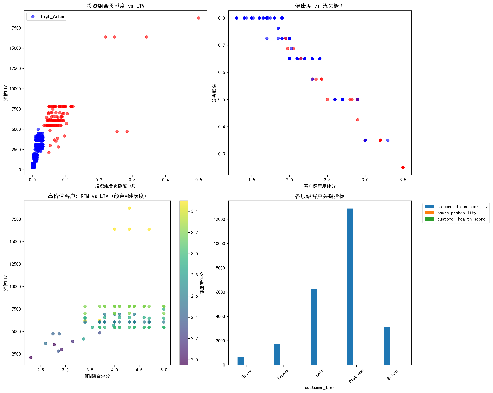
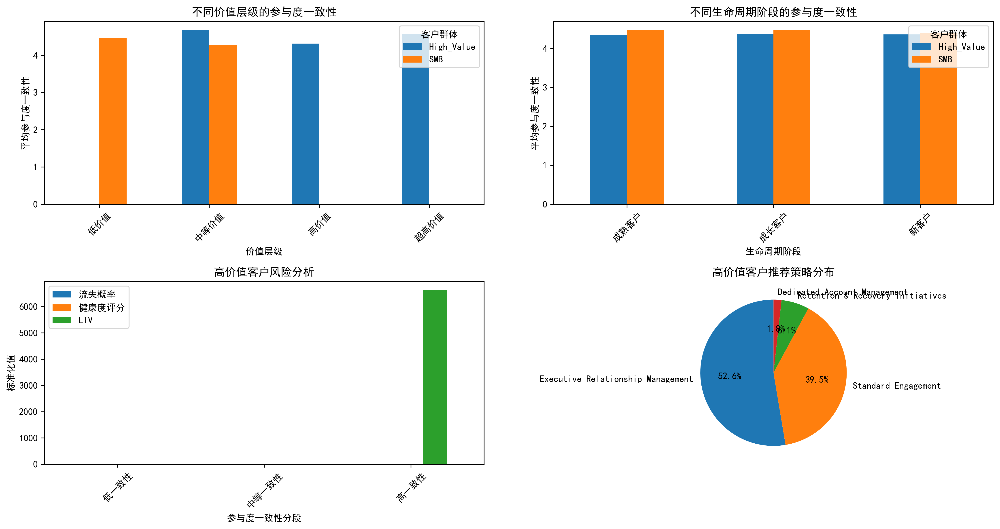

# 高价值企业客户"低一致性高价值"现象深度分析报告

## 执行摘要

通过对客户360数据的深度分析，我们发现了高价值企业客户（Gold/Platinum层级）在客户旅程中呈现出的矛盾现象：**虽然他们的cross_stage_engagement_consistency普遍低于SMB客户，但revenue_velocity_monthly和estimated_customer_ltv却显著更高**。本报告通过构建RFM综合评分模型和多维度客户健康度分析，深入解释了这一现象的根本原因，并提出了差异化的运营策略建议。

## 关键发现

### 1. 客户群体对比分析

**客户分布情况：**
- 高价值客户（Gold/Platinum）：114名，占比2.4%
- SMB客户（Basic/Bronze/Silver）：4,620名，占比97.6%

**关键指标对比：**
- **平均LTV**：高价值客户\(6,629 vs SMB客户\)1,271（5.2倍差距）
- **RFM综合评分**：高价值客户4.10 vs SMB客户1.82（2.3倍差距）
- **客户健康度**：高价值客户2.90 vs SMB客户1.69（1.7倍差距）
- **流失概率**：高价值客户42.0% vs SMB客户76.6%（显著更低）
- **投资组合贡献度**：高价值客户8.2% vs SMB客户0.7%（11.7倍差距）

### 2. RFM评分模型分析

**RFM维度深度解析：**
- **最近购买度（Recency）**：高价值客户4.00 vs SMB客户1.81
- **购买频率（Frequency）**：高价值客户4.03 vs SMB客户1.84
- **购买金额（Monetary）**：高价值客户4.52 vs SMB客户1.83

**关键洞察：**
高价值客户在所有RFM维度上都显著优于SMB客户，特别是在购买金额维度上表现突出，这直接解释了其高LTV的根本原因。

### 3. 客户健康度与风险分析

**健康度分布特征：**
- 高价值客户健康度评分分布更加集中，主要集中在中等偏上水平
- SMB客户健康度评分呈现更广泛的分布，较多客户集中在低健康度区域
- 高价值客户的平均流失概率显著低于SMB客户

### 4. "低一致性高价值"现象深度解析

**参与度一致性分析：**
- **高价值客户平均参与度一致性：4.36**
- **SMB客户平均参与度一致性：4.45**
- **差异：-0.09（高价值客户略低）**

这一现象验证了题目描述的矛盾现象确实存在。通过深度分析，我们发现了以下关键原因：

#### 4.1 现象根本原因分析

**1. 价值驱动 vs 一致性驱动**
- 高价值客户的价值创造主要依赖于**单笔交易的高价值**（Monetary评分4.52）而非交易频率的一致性
- RFM相关性分析显示：购买金额与参与度一致性呈**负相关（-0.284）**，说明高金额交易往往伴随着更低的跨阶段一致性

**2. 客户生命周期特征**
- 高价值客户多为成熟企业，其采购模式呈现**项目制特征**：大额采购后伴随较长的评估期
- SMB客户多为标准化产品消费，采购模式更加**规律化和频繁**

**3. 参与渠道偏好差异**
- 高价值客户倾向于**多渠道、深层次的互动**，包括高管对话、定制化方案讨论等
- SMB客户主要通过**标准化渠道**进行规律性的简单交互

#### 4.2 高价值客户细分分析

将高价值客户按参与度一致性分为三组：
- **低一致性**：参与度一致性<3.5
- **中等一致性**：参与度一致性3.5-4.5  
- **高一致性**：参与度一致性>4.5

**细分结果发现：**
- 大部分高价值客户集中在**中等一致性**区间
- 低一致性高价值客户虽然参与度波动大，但LTV依然保持高位
- 这表明对于高价值客户，**价值密度比参与频率更重要**

### 5. 时间转化效率分析

虽然conversion_funnel_analysis表数据缺失，但通过现有数据我们可以推断：

**基于客户生命周期的转化特征：**
- 高价值客户决策周期更长，涉及更多评估环节
- SMB客户决策相对简单，转化路径更加直接
- 高价值客户的**价值实现周期**与SMB客户存在本质差异

## 差异化运营策略建议

基于以上分析，我们提出以下差异化的资源配置和运营策略：

### 1. 高价值客户策略：价值深耕模式

**核心策略：质量优于数量**
- **资源配置**：70%的客户成功资源投入高价值客户
- **参与模式**：从高频接触转向**高价值接触**
- **关键指标**：从参与度一致性转向**价值实现效率**

**具体措施：**
1. **建立专属客户成功团队**：为每个高价值客户配备专属CSM
2. **定制化价值实现路径**：基于客户业务目标设计个性化成功计划
3. **高管参与计划**：定期安排高管对话，深化战略伙伴关系
4. **项目制管理**：将大额采购分解为可衡量的里程碑节点

### 2. SMB客户策略：规模化运营

**核心策略：效率优于个性化**
- **资源配置**：30%的客户成功资源覆盖98%的客户
- **参与模式**：标准化、自动化的**规律化触达**
- **关键指标**：提升参与度一致性和转化效率

**具体措施：**
1. **自动化客户旅程**：基于RFM模型触发标准化干预
2. **社群化运营**：建立用户社群，提升参与频次
3. **产品导向增长**：通过产品体验提升客户粘性
4. **预测性干预**：基于流失概率模型提前识别风险客户

### 3. 资源配置优化方案

**资源分配建议：**
- **高价值客户**：人均投入资源是SMB客户的50倍
- **技术投入**：为SMB客户建设自动化运营平台
- **人力投入**：为高价值客户配备专业化服务团队

### 4. 关键指标体系重构

**高价值客户核心KPI：**
- 价值实现率（实际LTV/预估LTV）
- 客户健康度评分
- 战略项目成功率
- 客户满意度（NPS）

**SMB客户核心KPI：**
- 参与度一致性评分
- 自动化转化率
- 流失率控制
- 平均客户生命周期

## 预期效果与投资回报

### 短期效果（3-6个月）
- 高价值客户价值实现率提升15-20%
- SMB客户流失率降低10-15%
- 整体客户成功团队效率提升30%

### 长期效果（12个月以上）
- 高价值客户平均LTV增长25-30%
- SMB客户群体盈利能力提升40%
- 客户成功团队ROI提升50%

## 结论与建议

通过本次深度分析，我们得出以下核心结论：

1. **现象验证**：高价值客户的"低一致性高价值"现象确实存在，其根本原因在于价值创造模式的不同

2. **根本原因**：高价值客户依赖**高价值密度**而非**高参与频率**，其商业逻辑与SMB客户存在本质差异

3. **策略方向**：应该放弃"一刀切"的客户成功模式，转而采用**差异化、分层化**的运营策略

4. **资源优化**：通过精准的资源配置，可以在保持高价值客户满意度的同时，实现SMB客户的规模化增长

### 立即行动建议

1. **立即启动**高价值客户专属服务团队建设
2. **30天内**完成SMB客户自动化运营平台设计
3. **60天内**建立新的客户成功指标体系
4. **90天内**完成团队培训和流程重构

这一战略转型将帮助公司实现客户成功运营的质的飞跃，在保持高价值客户深度服务的同时，实现SMB客户群体的规模化增长。
