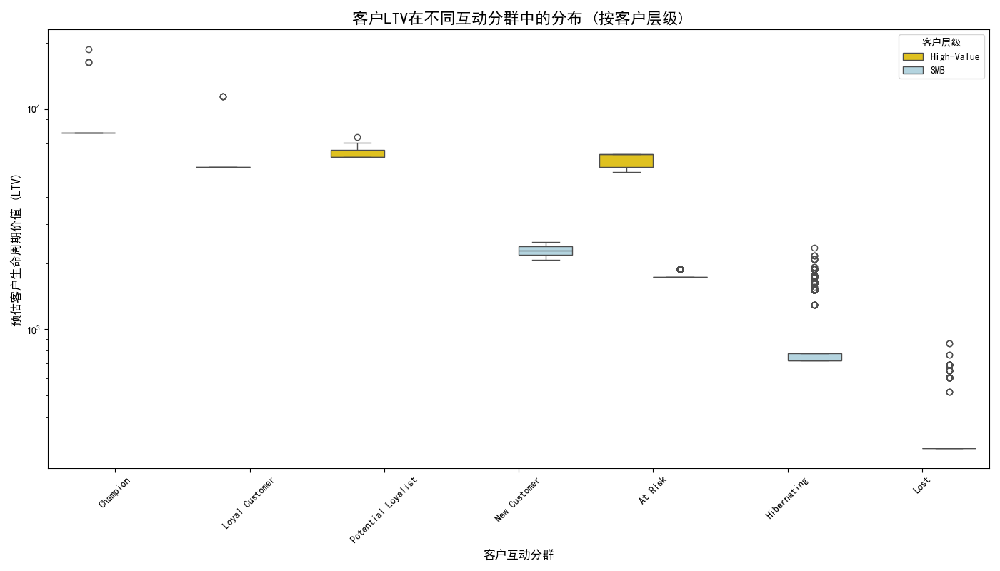

# **高价值客户“低一致性、高价值”现象深度剖析与差异化运营策略报告**

## 1. 核心摘要

本报告旨在探究高价值企业客户（黄金/铂金级）中存在的“高价值、低参与度”矛盾现象。分析发现，问题的核心并非客户不活跃，而是其**活跃行为的“健康度”较低**。一部分高价值客户尽管近期有活动，但其客户健康分显著偏低，流失风险极高。这表明他们在客户旅程中可能遇到了障碍或负面体验。

基于此核心洞察，我们提出以下差异化运营策略：

-   **对“高风险”高价值客户**：实施**“诊断式”高接触干预**，由客户成功经理（CSM）主动介入，解决其根本痛点，修复客户健康度。
-   **对“健康”高价值客户**：采取**“价值深化”策略**，通过增值服务和向上销售，最大化其生命周期价值。
-   **对SMB客户**：执行**“规模化”自动运营**，利用自动化工具和社群，以低成本高效维持客户关系。

## 2. 分析背景与方法论

本次分析面临的初始挑战是，部分关键数据表（如活动指标和转化漏斗表）为空。因此，我们聚焦于唯一包含有效数据的 `customer_value_analysis` 表，并创造性地解决了数据缺失问题。

我们**使用 `customer_segment`（客户互动分群）作为原始问题中 `cross_stage_engagement_consistency`（跨阶段参与一致性）的核心代理指标**。诸如“At Risk”（高风险）、“Hibernating”（休眠）等分群标签，直观地反映了客户参与的质量与健康度，使我们能够继续深入探究此业务问题。

## 3. 核心矛盾可视化：高价值客户的LTV分布

为了验证“高价值、低质量互动”现象，我们绘制了不同客户层级在各个互动分群中的LTV（预估客户生命周期价值）分布。

**图表洞察：**
-   **显著的价值差异**：无论在哪一个互动分群中，“High-Value”（高价值）客户的LTV中位数和上限都远远超过“SMB”客户。
-   **矛盾的证实**：即使在“At Risk”（高风险）和“Hibernating”（休眠）这类负面分群中，高价值客户依然展现出巨大的商业价值。这有力地证实了我们面临的核心矛盾：**客户的互动状态不佳，但其潜在价值依然巨大，我们绝不能轻易放弃**。

## 4. 根源探究：高价值客户为何“高风险”？

我们进一步下钻，分析了高价值客户在不同互动分群下的核心指标均值。

| customer_segment   | recency_score | frequency_score | monetary_score | customer_health_score | churn_probability | days_since_last_activity | account_age_days |
|--------------------|---------------|-----------------|----------------|-----------------------|-------------------|--------------------------|------------------|
| At Risk            | 4.00          | 3.50            | 4.83           | 2.70                  | 0.55              | 36.17                    | 684.50           |
| Potential Loyalist | 3.80          | 3.98            | 4.53           | 2.77                  | 0.48              | 112.33                   | 182.13           |
| Loyal Customer     | 4.12          | 4.12            | 4.55           | 3.04                  | 0.35              | 528.00                   | 713.39           |
| Champion           | 4.25          | 4.06            | 4.50           | 3.24                  | 0.34              | 571.44                   | 599.63           |

**核心发现：**
-   “高风险”客户**近期很活跃**：`At Risk` 分群的 `recency_score` (4.0) 很高，且 `days_since_last_activity` (36天) 远低于其他健康分群，表明他们近期频繁与我们互动。
-   “高风险”客户**互动不健康**：尽管活跃，该群体的 `customer_health_score` (2.70) 却是最低的，且 `churn_probability` (0.55) 是最高的。
-   **结论**：这说明“高风险”高价值客户正在经历糟糕的体验。他们不断地活跃，可能是因为正试图解决一个悬而未决的问题、频繁遇到产品Bug，或是其核心需求未被满足。这种“挣扎式”的活跃，是导致其健康分低、流失风险高的根本原因。

## 5. 差异化运营策略与资源配置建议

基于以上分析，我们必须针对不同客户群体的特征，设计精准的运营策略。

#### **策略一：针对“高风险”高价值客户 → 诊断式高接触干预**
-   **目标**：主动介入，诊断并解决其根本问题，修复客户信任，将其转化为健康状态。
-   **行动方案**：
    1.  **立即预警**：建立监控机制，一旦高价值客户进入“At Risk”分群，立即向专属CSM（客户成功经理）发出预警。
    2.  **人工诊断**：由CSM主动联系客户，进行一对一深度沟通，了解其“挣扎”的原因（例如：是产品缺陷？服务不到位？还是业务目标无法达成？）。
    3.  **资源倾斜**：赋予CSM调动技术支持、产品、甚至管理层资源的权限，快速解决客户的问题。
-   **资源配置**：优先配置最资深的CSM和技术支持资源。

#### **策略二：针对“冠军/忠诚”高价值客户 → 价值深化与关系巩固**
-   **目标**：在维持客户健康度的基础上，进一步挖掘其价值，并将其转化为品牌的拥护者。
-   **行动方案**：
    1.  **增值服务**：提供专属服务，如高级培训、季度业务回顾、联合市场活动等。
    2.  **激励与赋能**：邀请客户加入产品顾问委员会、参与新功能内测，让他们感受到被重视。
    3.  **识别增购机会**：基于对客户业务的深入理解，主动识别并提出新的解决方案，促进交叉销售和向上销售。
-   **资源配置**：配置稳定的CSM团队，并整合市场与产品资源。

#### **策略三：针对“SMB”客户 → 规模化与自动化运营**
-   **目标**：以低成本、可规模化的方式维持客户活跃度，并在其中发现高潜力客户进行转化。
-   **行动方案**：
    1.  **自动化旅程**：通过营销自动化工具，根据客户行为触发（如连续7天未登录）自动化的邮件或应用内消息，进行引导和关怀。
    2.  **自助与社群**：大力建设帮助中心、知识库和用户社群，引导SMB客户通过自助方式解决问题，降低人工支持成本。
    3.  **潜力识别**：监控SMB客户中的使用频率、功能采用深度等指标，识别出高增长潜力的客户，并由销售团队进行跟进，尝试将其升级为更高价值的层级。
-   **资源配置**：重点投入营销自动化工具、社群运营及内容创作。

## 6. 总结

本次分析揭示，高价值客户的“低一致性”并非源于懒惰或流失意向，而是一种“挣扎”的信号。企业必须超越简单的活跃度指标，建立以**客户健康度为核心**的度量体系。通过实施本文提出的差异化运营策略，我们不仅能拯救濒临流失的高价值客户，还能系统性地提升所有客户群体的生命周期价值，实现可持续的业务增长。
