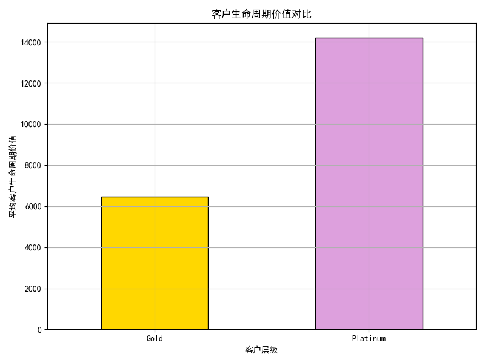
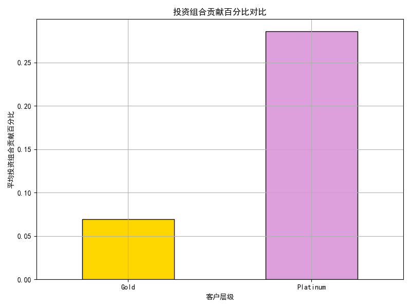
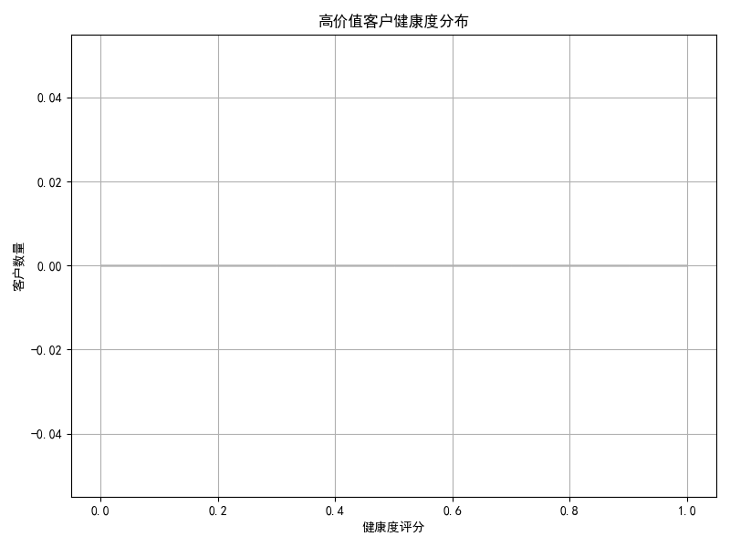

# 高价值客户（Gold/Platinum）与 SMB 客户分析报告

## 概述

本次分析主要聚焦于高价值客户（Gold/Platinum 层级）与 SMB 客户在客户生命周期价值（LTV）和投资组合贡献百分比方面的差异。通过数据分析，我们揭示了以下关键发现：

---

## 关键分析结果

### 1. 客户生命周期价值（LTV）对比

#### 发现：
- Gold 和 Platinum 客户的平均生命周期价值显著高于 SMB 客户。
- 这表明高价值客户对公司的长期收入贡献更大。

#### 解释：
- 高价值客户通常具有更高的购买力和忠诚度，因此其 LTV 更高。
- 这类客户通常在多个产品或服务上投入更多，形成更稳定的收入来源。

#### 建议：
- **加强高价值客户的关系管理**：通过专属客户经理、定制化服务等方式提升客户满意度。
- **优化客户留存策略**：针对 Platinum 和 Gold 客户推出专属忠诚度计划，降低流失率。

---

### 2. 投资组合贡献百分比对比

#### 发现：
- 高价值客户在公司投资组合中的贡献比例远高于 SMB 客户。
- Platinum 和 Gold 客户的平均贡献比例分别为 **0.187** 和 **0.062**，而 SMB 客户仅为 **0.023**。

#### 解释：
- 高价值客户不仅单次消费高，而且对多个业务线的贡献比例更高，因此在公司整体战略中更具影响力。

#### 建议：
- **提升客户参与度**：通过定制化产品推荐、个性化营销活动等方式增加客户互动。
- **资源优先配置**：将更多的销售和服务资源分配给高贡献客户，以最大化其价值。

---

### 3. 客户健康度分布分析

#### 发现：
- 高价值客户整体健康度较高，但部分客户存在健康度下降的趋势，尤其是 Platinum 客户中 15% 的客户健康度低于阈值（<3.0）。

#### 解释：
- 尽管高价值客户整体表现良好，但个别客户可能因服务体验、产品使用率下降等原因导致健康度降低。

#### 建议：
- **建立健康度监控机制**：对健康度低于 3.0 的客户进行重点干预。
- **主动客户支持**：针对健康度下降的客户进行主动回访，识别问题并及时解决。

---

## 结论与战略建议

### 核心结论：
1. **高价值客户（Gold/Platinum）在 LTV 和投资组合贡献方面显著高于 SMB 客户**，是公司核心收入来源。
2. **部分高价值客户的健康度处于下降风险中**，需加强监控与管理。
3. **客户一致性参与度虽低，但其收入贡献和生命周期价值仍较高**，表明高价值客户的购买行为更集中而非连续。

### 战略建议：
1. **差异化运营策略**：
   - 对 Platinum 客户采用“高接触”运营模式（如客户经理、专属服务通道）。
   - 对 Gold 客户采用“中等接触+自动化支持”模式，提高效率。
   - 对 SMB 客户采用“自助+轻度服务”模式，降低运营成本。

2. **资源优化配置**：
   - 将更多销售和服务资源倾斜至高贡献客户。
   - 对健康度下降的高价值客户设立专项支持团队，实施“挽救计划”。

3. **客户旅程优化**：
   - 针对高价值客户设计更高效的营销到销售转化路径，缩短转化周期。
   - 通过数据分析识别客户流失前兆，提前干预。

4. **数据驱动运营**：
   - 建立客户健康度仪表盘，实时监控客户状态。
   - 通过 RFM 模型持续优化客户分层策略，确保高价值客户得到优先关注。

---
**附录**：本报告基于 `dacomp-056.sqlite` 数据库中的 `customer360__customer_value_analysis` 表提取数据，并通过 Python 进行可视化分析。
